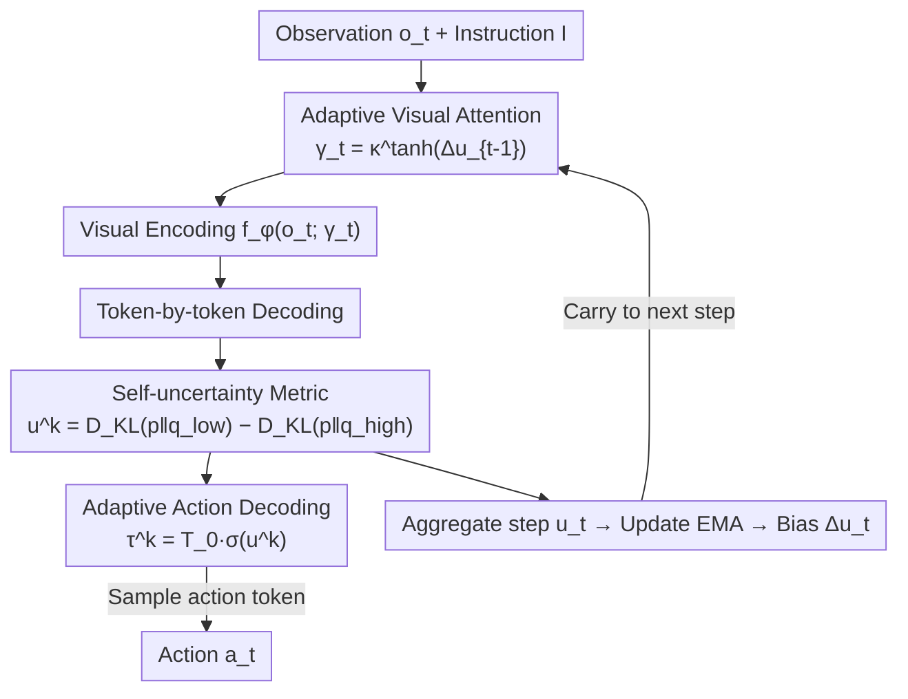

# SCALE: Self-uncertainty Conditioned Adaptive Looking and Execution for Vision-Language-Action Models

**Conference**: ICML 2026  
**arXiv**: [2602.04208](https://arxiv.org/abs/2602.04208)  
**Code**: https://github.com/snumprlab/scale  
**Area**: Robotics / Embodied AI (VLA)  
**Keywords**: Test-Time Scaling, Self-uncertainty, Adaptive Inference, Visual Attention Modulation, Active Inference

## TL;DR
SCALE enables autoregressive VLAs to utilize a "self-uncertainty" score, calculated solely from output logits during inference, to simultaneously modulate **action sampling temperature** and **visual attention temperature**. By exploring broadly when uncertain and focusing greedily when certain, SCALE significantly improves the success rates of multiple SOTA VLAs with zero additional training, no external verifiers, and a single forward pass.

## Background & Motivation

**Background**: Autoregressive VLAs (e.g., OpenVLA, π0-FAST, SpatialVLA) encode visual observations and language instructions to decode action tokens sequentially for closed-loop robotic control. To enhance robustness beyond the training distribution, **Test-Time Scaling (TTS)** has emerged, trading increased computation at inference for better performance.

**Limitations of Prior Work**: Existing TTS schemes for VLAs primarily follow the Best-of-N approach—either training an external verifier (RoboMonkey, TACO) or relying on model self-verification (MG-Select). These methods suffer from three major drawbacks: ① They require additional verifier training; ② Verifiers may fail under distribution drift; ③ Multiple forward passes conflict with the latency constraints of real-time control. Crucially, these methods **only intervene at the action decoding stage, while visual representations remain frozen**.

**Key Challenge**: In scenarios with **perceptual ambiguity** (e.g., visually similar distractors on a table), simply selecting the best candidate from a set of actions is insufficient—the model must **reconsider "how to look."** Greedy decoding focuses only on the top-1 action, often leading to irreversible failures, while frozen visual encoders may fail to attend to the target object entirely. "What to look at" and "what to do" should be adjusted concurrently based on the current level of certainty.

**Key Insight**: The authors draw from **Active Inference** theory, where agents reduce uncertainty by simultaneously adjusting perception and action. The problem then becomes: how to quantify a "self-uncertainty" signal capable of driving this modulation? Existing LLM self-certainty metrics only measure how far the predicted distribution is from a uniform distribution (overall ambiguity), failing to characterize how "decisive" the model is regarding its top-1 choice. Since greedy decoding executes the top-1 action directly, this decisiveness is critical.

**Core Idea**: The authors define a **dual-reference** self-uncertainty metric that **positions** the predicted distribution between the extremes of "completely certain (one-hot)" and "completely ambiguous (uniform)." This single scalar captures both distribution dispersion and top-1 decisiveness, serving as a unified knob to adjust both action sampling and visual attention temperatures.

## Method

### Overall Architecture

SCALE is a **single-pass adaptive inference strategy** that can be wrapped around any autoregressive VLA without modifying weights. In each control step, the model first adjusts the visual encoder's attention temperature (deciding "how to look") using the uncertainty bias from the previous step. After encoding visual features, it decodes action tokens, where each token's sampling temperature is adjusted based on its own uncertainty (deciding "what to do"). Finally, the step-level uncertainty is aggregated to update an EMA and calculate a new bias for the next step. This forms a **feedback loop** where perception and action are coupled: current uncertainty influences both immediate action sampling and next-frame visual attention.

### Key Designs

**1. Self-uncertainty Metric: Positioning Distributions Between "Certainty ↔ Ambiguity"**

To address the gap where existing LLM metrics overlook top-1 decisiveness, SCALE draws inspiration from likelihood ratio tests. Two reference distributions are constructed: a low-uncertainty reference $q_{\text{low}}$ (an approximate one-hot distribution on the top-1 token) and a high-uncertainty reference $q_{\text{high}}$ (a uniform distribution). Self-uncertainty for the $k$-th action token is defined as the difference between two KL divergences:

$$u^k_t = D_{\text{KL}}\!\left(p^k_t \,\|\, q_{\text{low}}\right) - D_{\text{KL}}\!\left(p^k_t \,\|\, q_{\text{high}}\right).$$

This expansion proves equivalent to the expected log-likelihood ratio $\mathbb{E}_{x\sim p^k_t}\!\left[\log \frac{q_{\text{high}}(x)}{q_{\text{low}}(x)}\right]$ under the model's prediction. Intuitively, $u^k_t > 0$ indicates proximity to "complete ambiguity." This zero-training metric captures top-1 decisiveness better than single-reference self-certainty, outperforming proxies like $p_{\max}$, entropy, and Gini in experiments (63.3% vs. 53.8-57.8%).

**2. Adaptive Action Decoding: Sigmoid Gating for Sampling Temperature**

To prevent greedy decoding from ignoring viable alternatives during multi-modal action scenarios, SCALE adjusts the sampling temperature for each token based on its uncertainty:

$$\tau^k_t = T_0 \cdot \sigma(u^k_t),$$

where $T_0$ is the maximum temperature for exploration and the sigmoid acts as a **soft gate**. Since $u^k_t$ represents a log-likelihood ratio, $\sigma(u^k_t)$ recovers the posterior probability of the "uncertain hypothesis." When uncertainty is high, the gate opens ($\tau \approx T_0$) for exploratory sampling; when low, the gate closes ($\tau \approx 0$) for near-greedy execution.

**3. Adaptive Visual Attention: Modulating via Uncertainty "History Deviation"**

To prevent the visual encoder from losing the target or focusing on distractors, SCALE modulates temperature at the perception end. Perception requires temporal context to judge if a scene is becoming harder or easier. The method aggregates token-level uncertainty into a step-level $u_t = \frac{1}{K}\sum_k u^k_t$, maintains an EMA $\bar{u}_t = \alpha\bar{u}_{t-1} + (1-\alpha)u_t$, and uses the **deviation** $\Delta u_t = u_t - \bar{u}_{t-1}$ to detect spikes in scene complexity. To ensure a single forward pass, the **previous step's deviation** $\Delta u_{t-1}$ is used:

$$\gamma_t = \kappa^{\tanh(\Delta u_{t-1})},$$

where $\kappa > 1$ bounds $\gamma_t$ within $(1/\kappa, \kappa)$. This $\gamma_t$ scales the self-attention in the visual encoder: $\text{softmax}\!\left(\frac{QK^\top}{\sqrt{d}\cdot\gamma_t}\right)V$. High uncertainty ($\gamma_t > 1$) flattens attention for broad information gathering, while low uncertainty ($\gamma_t < 1$) sharpens attention for focused execution. Modulating the **unimodal attention of the visual encoder** was found to be more upstream and effective than modulating the VLA backbone's cross-modal attention.

### Loss & Training
SCALE is a pure inference-time strategy that **requires no training** and does not update VLA weights. Each control step involves only one forward pass. With no extra rollouts, verifiers, or auxiliary networks, its latency remains nearly identical to greedy decoding.

## Key Experimental Results

### Main Results
Evaluated across LIBERO, SIMPLER-WidowX, LIBERO-PRO-Long benchmarks, and UR10e real-world robots using multiple VLA backbones. SCALE consistently outperforms greedy decoding and various training-free decoding methods (sampling/top-k/top-p), often exceeding TTS methods that require extra training and multiple forward passes.

| Benchmark / Backbone | Metric | greedy Baseline | Best Training-free | SCALE | Gain (vs greedy) |
|--------|------|------|----------|------|------|
| LIBERO / OpenVLA | Avg. SR(%) | 75.7 | 77.2 | **81.5** | +5.8 |
| LIBERO / π0-FAST | Avg. SR(%) | 91.2 | 88.1 | **93.0** | +1.8 |
| SIMPLER-WidowX / π0-FAST | Avg. SR(%) | 34.4 | 41.7 | **49.0** | +14.6 |
| SIMPLER / SpatialVLA(zero-shot) | Avg. SR(%) | 31.3 | 32.3 | **41.7** | +10.4 |
| LIBERO-PRO-Long / π0 (zero-shot) | Avg. SR(%) | 35.7 | 34.4 | **38.8** | +3.1 |
| Real-word OOD / π0-FAST | Avg. SR(%) | 43.8 | — | **56.3** | +12.5 |

Notably, SCALE on OpenVLA (81.5%) surpasses the training-required MG-Select (70.8%). Significant gains in OOD real-world tests (e.g., unseen toy bears or cubes) suggest the benefits stem from adaptive handling of ambiguity rather than memorization.

### Ablation Study
All results reported as SR(%) on OpenVLA / LIBERO-Long.

| Configuration | SR(%) | Description |
|------|------|------|
| Baseline OpenVLA (greedy) | 52.7 | Fixed inference |
| Adaptive Decoding Only | 58.0 | Only action temperature |
| Adaptive Visual Attention Only | 56.0 | Only perception temperature |
| **SCALE (Combined)** | **63.3** | Complementary effects |
| Metric: Self-certainty | 53.8 | Single-ref, lacks top-1 decisiveness |
| Metric: Entropy / Gini | 55.4 / 57.8 | Inferior to dual-reference |
| Perception: Instant $u_{t-1}$ | 55.4 | Inferior to history deviation $\Delta u_{t-1}$ |
| Perception: Cross-modal Attn | 57.4 | Inferior to visual encoder modulation |

### Key Findings
- **Complementary Components**: Using action decoding (+5.3) or visual attention (+3.3) alone is effective, but combining them (+10.6) is the strongest, proving "what to do" and "how to look" should be co-modulated.
- **Metric Design is Crucial**: Dual-reference uncertainty (63.3%) significantly outperforms Self-certainty (53.8%) and Entropy (55.4%), validating the importance of top-1 decisiveness.
- **History Deviation for Perception**: Perception relies on context; $\Delta u_{t-1}$ (63.3%) is superior to instant $u_{t-1}$ (55.4%). Modulating upstream visual blocks is more effective than downstream cross-modal layers.
- **Robustness in Difficulty**: The largest gains occur in OOD, unseen benchmarks, and difficult objects, indicating its specialty in resolving ambiguity.

## Highlights & Insights
- **One Scalar, Two Modulations**: Driving both action sampling and visual attention with a single self-uncertainty signal elegantly implements the philosophy of "active perception" via a simple formula.
- **Dual-Reference Metric**: The concept of positioning distributions between one-hot and uniform references is highly transferable to any scenario requiring the characterization of both dispersion and decisiveness (e.g., LLM routing, MoE).
- **Single Forward Pass**: Unlike Best-of-N methods, SCALE maintains real-time control capability with latency comparable to greedy decoding.
- **EMA Deviation as a Difficulty Detector**: Using relative deviation rather than absolute values to trigger exploration avoids the need for task-specific threshold tuning.

## Limitations & Future Work
- **Restricted to Autoregressive (Discrete) VLAs**: The method relies on categorical distributions of action tokens and cannot be directly applied to continuous action spaces like Diffusion or Flow Matching VLAs (e.g., π0, GR00T).
- **Hyperparameter Scaling**: While parameters $T_0, \kappa, \alpha$ generalize once selected, their initial calibration still depends on a validation set.
- **Uncertainty vs. Correctness**: Models may exhibit "overconfidence" in incorrect answers, where the gate might erroneously close exploration. The metric is a proxy for distribution shape, not a guarantee of truth alignment.

## Related Work & Insights
- **vs. RoboMonkey / TACO / MG-Select**: These require training and multiple passes; SCALE is training-free, single-pass, and outperforms MG-Select on OpenVLA.
- **vs. Self-certainty**: Standard metrics only measure distance from uniform; SCALE adds the $q_{\text{low}}$ reference to capture top-1 decisiveness, which is vital for greedy-execution VLAs.
- **vs. Traditional Visual Attention**: Instead of using contrastive masks or trained modules, SCALE dynamically adjusts attention temperature based on uncertainty specifically for closed-loop control.

## Rating
- Novelty: ⭐⭐⭐⭐⭐ Dual-reference uncertainty + joint perception/action modulation is a clean, original expansion of TTS for VLA.
- Experimental Thoroughness: ⭐⭐⭐⭐⭐ Comprehensive coverage across simulation, real-world, and various backbones.
- Writing Quality: ⭐⭐⭐⭐ Clear motivation and self-consistent formulations.
- Value: ⭐⭐⭐⭐⭐ High engineering value due to zero training requirements and single-forward-pass efficiency.

<!-- RELATED:START -->

## Related Papers

- [\[ICML 2026\] SpecPrune-VLA: Accelerating Vision-Language-Action Models via Action-Aware Self-Speculative Pruning](specprune-vla_accelerating_vision-language-action_models_via_action-aware_self-s.md)
- [\[CVPR 2026\] Adaptive Action Chunking at Inference-time for Vision-Language-Action Models](../../CVPR2026/robotics/adaptive_action_chunking_at_inference-time_for_vision-language-action_models.md)
- [\[CVPR 2026\] SRPO: Self-Referential Policy Optimization for Vision-Language-Action Models](../../CVPR2026/robotics/srpo_self-referential_policy_optimization_for_vision-language-action_models.md)
- [\[CVPR 2026\] QuantVLA: Scale-Calibrated Post-Training Quantization for Vision-Language-Action Models](../../CVPR2026/robotics/quantvla_scale-calibrated_post-training_quantization_for_vision-language-action_.md)
- [\[CVPR 2026\] AT-VLA: Adaptive Tactile Injection for Enhanced Feedback Reaction in Vision-Language-Action Models](../../CVPR2026/robotics/at-vla_adaptive_tactile_injection_for_enhanced_feedback_reaction_in_vision-langu.md)

<!-- RELATED:END -->
