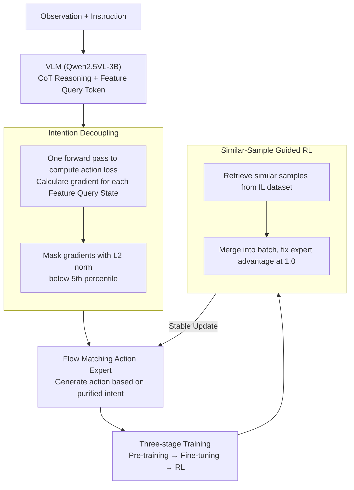

# Scaling by Diversified Experience for Vision-Language-Action Models

**Conference**: ICML 2026  
**arXiv**: [2606.09009](https://arxiv.org/abs/2606.09009)  
**Code**: Open source (dataset + full-process code released on project page)  
**Area**: Robotics / Embodied AI (VLA)  
**Keywords**: Vision-Language-Action Models, Intention Decoupling, Real-world RL, Catastrophic Forgetting, Flow Matching

## TL;DR
SyVLA utilizes a dual-system architecture comprising a "VLM + Flow Matching Action Expert + Feature Query Token" for "think-before-act" robotic control. It incorporates two core designs: an **intention decoupling** algorithm based on gradient norm masking (stripping high-level reasoning from control intent) and **similar-sample guided RL** (fixing expert sample advantage at 1.0 to stabilize real-world online RL). Using less than 5% of the $\pi_0$ pre-training data, it achieves higher real-world success rates and stronger OOD generalization while preserving the original VLM's vision-language capabilities.

## Background & Motivation

**Background**: VLA models have progressed rapidly by combining large-scale high-quality teleoperation data with VLMs; models like $\pi_0$, Wall-Oss, and GR00T have achieved dexterous manipulation using tens of thousands of hours of expert data for pre-training.

**Limitations of Prior Work**: Two bottlenecks hinder general-purpose embodied AI. ① **Capability Trade-offs**: VLA models often overemphasize action learning, which degrades the underlying VLM's vision-language understanding and logical reasoning, leading to catastrophic forgetting. Current methods of mixing multi-modal data struggle to balance action proficiency and linguistic ability. ② **Objective Mismatch in Imitation Learning**: IL fits expert actions at every step, but task success relies on closed-loop execution over hundreds of steps; accumulated errors push the robot toward OOD observations, leading to failure. While RL is a recognized solution, the billions of parameters and high-dimensional continuous action spaces of VLAs make real-world RL extremely unstable, prone to policy drift or collapse.

**Key Challenge**: The authors discovered that even with a **lightweight** Feature Query Token connecting the VLM and the action expert, the model still exhibits imprecise or hesitant actions. The root cause is that high-level reasoning information **leaks into the implicit control representation**, confusing the action expert and causing it to vacillate between different decisions.

**Goal**: (a) Ensure precise actions while preserving VLM language capabilities; (b) Develop a stable, usable real-world RL framework for VLA.

**Key Insight**: ① Since the problem is "reasoning information leaking into control intent," **locate and cut off the leakage**. The authors theoretically demonstrate that the smaller the gradient norm of the action loss relative to a Feature Query State, the less it contributes to control intent and the more likely it is to be redundant. ② Since pure expert samples can cause RL to diverge, **assign a fixed advantage to expert samples** to bypass high-variance value estimation.

**Core Idea**: Use gradient norm as a "redundancy detector" for **intention decoupling**; use **similar-sample guided RL** with a fixed advantage of 1.0 for samples retrieved from IL datasets.

## Method

### Overall Architecture

SyVLA is a **dual-system** model: a VLM (Qwen2.5VL-3B) serves as the high-level perception/reasoning core and control intent generator, while a Transformer-based **flow matching action expert** acts as the low-level executor. Both are bridged by a set of learnable **Feature Query Tokens**. These tokens are appended after the VLM's autoregressive CoT output. Their final hidden states (Feature Query States) pass through an MLP adapter to serve as conditions for flow matching, guiding the action expert to generate actions consistent with the VLM's plan. Compared to the KV Cache approach in $\pi_0$, this method is more lightweight, has lower latency, and supports asynchronous inference between the VLM and action expert.

The training follows a **three-stage** process: ① Pre-training (large-scale robotic data mixed with ~30% multi-modal data, <1% with task CoT annotations); ② Task fine-tuning (hundreds of trajectories per target task); ③ RL. **Intention decoupling** is applied throughout all stages, while similar-sample guidance is used only in the third stage.

### Key Designs

**1. Dual-system Architecture + Feature Query Token: Bridging "Thinking" and "Doing"**

To achieve both VLM linguistic reasoning and action expert precision, SyVLA does not let the VLM output actions directly. Instead, it performs finite reasoning (handling abstract/complex instructions) and appends $n$ (experimentally $n=20$) learnable Feature Query Tokens. Their final hidden states serve as conditions for the action expert. This "Think-Before-Act" approach is trained with mixed multi-modal data to preserve the VLM's original capabilities, enabling the model to execute tasks while retaining commonsense and reasoning. Unlike $\pi_0$'s KV Cache scheme, Feature Query Tokens are explicit, fixed-length, and lightweight, supporting **asynchronous inference** for maximum efficiency.

**2. Intention Decoupling: Masking Reasoned Information via Gradient Norms**

To address the leakage of high-level reasoning into control representations, SyVLA proposes **annotation-free** intention decoupling. It uses a two-step forward pass: in the first step, raw Feature Query States $\mathbf{H}_{\text{raw}}=\{\mathbf{h}^0,\dots,\mathbf{h}^{n-1}\}$ are fed into the action expert to compute an action loss $L_{\text{action}}$. The gradient w.r.t. each hidden state is calculated as $\mathbf{g}^i=\partial L_{\text{action}}/\partial \mathbf{h}^i_{\text{raw}}$. Hidden states with an $\ell_2$ norm below a threshold $\tau$ (the **5th percentile** of the gradient norm distribution) are **masked to zero**:

$$\mathbf{h}^i_{\text{masked}} = \mathbf{h}^i_{\text{raw}}\cdot \mathbb{I}\!\left(\lVert \mathbf{g}^i\rVert_2 \ge \tau\right),\quad i=0,\dots,n-1,$$

The second step recomputes the loss using $\mathbf{H}_{\text{masked}}$ for the update. Theoretically (simplifying the expert to single-layer attention), the authors prove that $\partial \ell/\partial h_i$ is determined by the attention score and the distance between the value vector $v_i$ and the attention output $z$. A small gradient norm implies the token is either irrelevant to the decision or its information is redundant. Retaining redundant tokens allows the model to learn "shortcut paths," leading to non-causal decisions and performance drops in OOD scenarios. Since the additional forward-backward pass **only involves the action expert** (typically <20% of parameters), training time increases by only ~10%.

**3. Similar-Sample Guided RL: Stabilizing Real-world RL with Fixed Advantages**

To prevent policy drift/collapse in real-world VLA RL, SyVLA retrieves **semantically similar samples** from the IL expert dataset and merges them into each RL update batch. Similarity is calculated using a weighted cosine similarity of multi-view image features:

$$\text{sim}(x,y)=\sum_{v\in\mathcal{V}} w_v\cdot \text{sim}_{\cos}\!\left(E(O^{(v)}_x),\,E(O^{(v)}_y)\right),$$

where $O^{(v)}$ is the observation from view $v$, $E(\cdot)$ is the image encoder, and $w_v\ge 0$ is the view weight. The authors found that applying standard policy gradients (GAE) to expert samples causes loss and gradient norms to explode within 1k steps due to severe mismatch between the value model and expert distribution. The solution is simple: **set the advantage of expert samples to a constant 1.0**. This makes the training objective equivalent to maximizing expert action likelihood, pulling updates toward expert behavior and suppressing drift. On long-horizon sparse-reward tasks (e.g., folding shirts), RL improves success rates by up to **15% absolute** over the imitation baseline.

### Loss & Training
Three stages: Pre-training (robotics + ~30% multi-modal mix) → Task fine-tuning (hundreds of trajectories per task) → RL (Similar-sample guidance adapted for PPO, with expert advantage fixed at 1.0). The two-step intention decoupling mask is applied throughout all stages. The action expert is trained using the flow matching objective.

## Key Experimental Results

### Main Results
Evaluated on the Cobot Magic platform across three tasks (folding shirts, math + packaging, snack loading), each with OOD settings (unseen positions/instructions). VLM capabilities were verified on DocVQA, AI2D, MMMU, MME, and HallBench.

| Method | Avg ID Success | Avg OOD Success | Notes |
|------|------|------|------|
| OpenVLA-oft | 0.45 | 0.24 | No VQA capability |
| GR00T | 0.38 | 0.24 | No VQA capability |
| Wall-Oss | 0.27 | 0.06 | — |
| $\pi_0$ (pretrained) | 0.63 | 0.48 | Pre-trained on 10k+ hours private data |
| $\pi_0$ (from scratch) | 0.38 | 0.26 | Same data, trained from scratch |
| ChatVLA | 0.21 | 0.09 | MoE; correct objects, poor manipulation |
| **Ours (SyVLA)** | **0.73** | **0.64** | Using <5% of $\pi_0$ pre-training data |

SyVLA's ID success (0.73) significantly outperforms all fair baselines; its OOD performance (0.64) shows even greater leads with minimal decay. While slightly trailing $\pi_0$ (pretrained) in Task 1, it far exceeds $\pi_0$ (from scratch) (0.86 vs $\pi_0$-scratch), suggesting $\pi_0$'s advantage stems from massive data rather than architecture.

| Multi-modal Benchmarks | Wall-Oss | ChatVLA | Ours (SyVLA) |
|------|------|------|------|
| DocVQA | 63.62 | 83.30 | 80.01 |
| AI2D | 58.60 | 67.36 | **67.70** |
| MMMU | 37.11 | 37.40 | 35.78 |
| MME | 1146.56 | 1435 | **1795** |
| HallBench | 36.57 | 39.90 | **42.53** |

SyVLA performs best on AI2D, MME, and HallBench, and only slightly trails ChatVLA on DocVQA and MMMU. However, ChatVLA struggles with dexterous real-world tasks, and $\pi_0$ loses VLM understanding entirely. SyVLA achieves the best balance between "action capability" and "language preservation."

### Ablation Study
Reported as average success rate on Task 1 (shirt folding, the most challenging long-horizon task).

| Configuration | Avg Success | Description |
|------|------|------|
| **SyVLA (all)** | **0.86** | Full model |
| w/o CoT | 0.79 | Disable Think-Before-Act & Intention Decoupling |
| w/o Intention Decoupling | 0.43 | Maintain 3-stage training, remove decoupling only |
| w/o RL | 0.71 | Replace RL stage with equivalent amount of IL data |
| w/o Expert Dataset | 0.21 | RL using only rollout data |
| w/o Similar Sample | 0.79 | RL using random expert samples instead of retrieval |
| w/ Standard Advantage | 0.00 | Expert samples used standard GAE → Grad explosion |

### Key Findings
- **Intention decoupling is the largest contributor**: Removing it drops performance from 0.86 to 0.43, confirming that "reasoning leakage" is the root of action hesitation.
- **Expert samples are the lifeblood of RL stability**: Using only rollouts (w/o Expert) correlates with a collapse to 0.21; using standard GAE on expert samples leads to total failure (0.00). Fixing the advantage at 1.0 is essential.
- **Similar retrieval defines the upper bound**: Random expert samples (0.79) provide stability, but semantic retrieval (0.86) pushes performance higher.
- **Hyperparameter Robustness**: A masking threshold at the 5th percentile and $n=20$ tokens are robust across tasks.

## Highlights & Insights
- **Gradient Norm as a "Redundancy Detector"**: Using the gradient of the action loss to hidden states to prune leaked information is annotation-free and theoretically grounded. This concept could potentially be extended to any scenario requiring the isolation of relevant sub-representations.
- **The "Brute-force" 1.0 Advantage is highly effective**: Rather than refining the value model to handle distribution mismatch, pinning the expert advantage to 1.0 simplifies the RL objective into maximum likelihood for expert behaviors—crude but effective in practice.
- **Lightweight Connection via Feature Query Tokens**: A more efficient alternative to KV Caches, allowing for asynchronous inference and practical engineering in dual-system VLAs.
- **Surprising Data Efficiency**: Achieving parity or superiority with less than 5% of $\pi_0$'s data highlights the value of the architecture and training algorithm design.

## Limitations & Future Work
- **Trade-off in Language Capabilities**: Performance on DocVQA/MMMU is still lower than the language-focused ChatVLA, an inevitable trade-off with limited data.
- **Computational Overhead of Decoupling**: Although it only involves the action expert, the extra forward-backward pass increases training time by ~10%.
- **Dependency on IL Expert Data for RL**: The stability of similar-sample guided RL depends on the quality and coverage of the teleoperation data used for retrieval.
- **Simplified Theoretical Analysis**: The theory assumes a single-layer attention expert; applicability to deep multi-layer networks requires further validation (refer to original Appendix B).

## Related Work & Insights
- **vs. $\pi_0$**: $\pi_0$ relies on 10k+ hours of private data and loses VLM language capabilities; SyVLA uses <5% data, preserves language, and shows stronger OOD.
- **vs. ChatVLA**: ChatVLA utilizes MoE to mitigate gradient conflict between action and multi-modal training to save language ability but fails at dexterous manipulation; SyVLA balances both.
- **vs. RL-100 / $\pi_{0.6}$ / World Model RL**: These are either validated on small diffusion models, depend on massive base models, or struggle with deformable object manipulation. SyVLA's RL recipe successfully handles long-horizon tasks like shirt folding on real robotic arms.

## Rating
- Novelty: ⭐⭐⭐⭐ Gradient norm masking for decoupling and fixed-advantage RL are grounded, novel combinations.
- Experimental Thoroughness: ⭐⭐⭐⭐ Real-world tasks with OOD, multi-modal benchmarks, and detailed ablations, though task count and trial numbers (14–28) are moderate.
- Writing Quality: ⭐⭐⭐⭐ Clear chain from motivation to theory to methodology.
- Value: ⭐⭐⭐⭐⭐ One of the first "full-featured open-source VLAs with linguistic reasoning," providing a practical recipe for real-world RL.

<!-- RELATED:START -->

## Related Papers

- [\[ICML 2026\] Contrastive Representation Regularization for Vision-Language-Action Models](contrastive_representation_regularization_for_vision-language-action_models.md)
- [\[ICML 2026\] LangForce: Bayesian Decomposition of Vision-Language-Action Models via Latent Action Queries](langforce_bayesian_decomposition_of_vision_language_action_models_via_latent_act.md)
- [\[ICML 2026\] StableVLA: Towards Robust Vision-Language-Action Models without Extra Data](stablevla_towards_robust_vision-language-action_models_without_extra_data.md)
- [\[ICML 2026\] Test-Time Training for Visual Foresight Vision-Language-Action Models](test-time_training_for_visual_foresight_vision-language-action_models.md)
- [\[CVPR 2026\] MoEActok: A MoE-based Action Tokenizer for Vision-Language-Action Models](../../CVPR2026/robotics/moeactok_a_moe-based_action_tokenizer_for_vision-language-action_models.md)

<!-- RELATED:END -->
