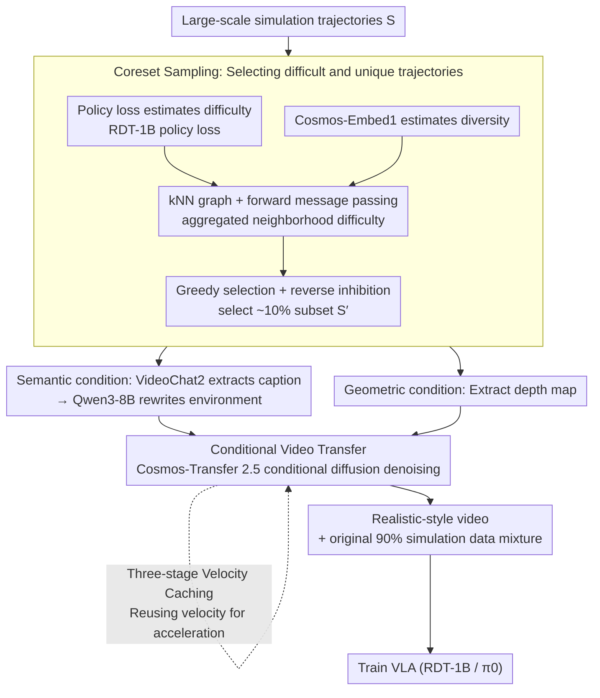

# Seeing Realism from Simulation: Efficient Video Transfer for Vision-Language-Action Data Augmentation

**Conference**: ICML 2026  
**arXiv**: [2605.02757](https://arxiv.org/abs/2605.02757)  
**Code**: Public (Link provided at end of paper)  
**Area**: Robotics / Embodied AI / VLA / Video Generation and Data Augmentation  
**Keywords**: Sim-to-Real, VLA, Video Diffusion, Velocity Caching, Coreset Sampling

## TL;DR
Addressing the performance collapse of Vision-Language-Action (VLA) models under simple perturbations, this paper proposes a video transfer pipeline consisting of "semantic/geometric condition extraction → caption rewriting → conditional video diffusion rendering" to augment simulation data with visual and environmental diversity. Combined with a three-stage velocity caching mechanism that reduces generation time by 61% and a difficulty + diversity dual-driven coreset sampling strategy that selects only 10% of key trajectories, it achieves a 5–15% performance gain for RDT-1B / $\pi_0$ on Robotwin 2.0, LIBERO-Plus, and real-world robots.

## Background & Motivation

**Background**: VLA models (RDT, $\pi_0$, $\pi_{0.5}$, OpenVLA, ACT) rely on large-scale real robotic trajectories for end-to-end training. However, real data collection is expensive, slow, and hard to scale; simulation data is cheap and parallelizable but suffers from significant visual/environmental gaps, causing policies to fail when encountering lighting, background, or viewpoint perturbations.

**Limitations of Prior Work**: LIBERO-Plus reports that policies with 95% success rates drop below 30% under minor perturbations; LIBERO-PRO shows near 0% success under changes in object positions and instructions. This indicates that models are memorizing action sequences rather than truly understanding tasks. Simple additive random noise or color jittering fails to capture the semantic complexity of real environments.

**Key Challenge**: To make simulation data "look real," the most direct approach is conditional video diffusion re-rendering. However, models like Cosmos-Transfer take approximately 40 minutes for a 5-second 720p video on an A100, making it impossible to scale to millions of simulation trajectories.

**Goal**: (1) Design a pipeline capable of transferring entire simulation videos into high-fidelity real styles while strictly preserving action trajectories; (2) Reduce generation costs to a scalable level; (3) Ensure every bit of computation is spent effectively by avoiding full-dataset augmentation.

**Key Insight**: The authors perform "addition" on generation quality—using caption rewriting + depth-based geometric control + conditional video diffusion to create realistic videos with diverse environments—while performing "subtraction" on generation overhead—observing that the velocity field in flow-based diffusion remains nearly constant during the middle steps and can be cached and reused.

**Core Idea**: Video augmentation is split into two orthogonal efficiency axes: "generation" and "selection." On the generation side, velocity caching reduces per-video costs. On the selection side, a graph-based coreset sampling driven by difficulty + diversity reduces the number of trajectories requiring generation.

## Method

### Overall Architecture
Given a batch of simulation training trajectories $\mathcal{S}=\{s_1,\dots,s_n\}$: (1) Coreset sampling selects a subset $\mathcal{S}'\subset\mathcal{S}$ for generation; (2) For each selected video, VideoChat2 extracts a caption, which Qwen3-8B rewrites to introduce environmental variables like background and object colors, while depth is extracted for geometric control; (3) Cosmos-Transfer 2.5 performs conditional video diffusion based on the new caption + depth to produce "realized" videos with altered visual styles but identical action trajectories; (4) The generated videos are mixed with the original 90% simulation data to train the VLA. The two most critical accelerators are velocity caching (to reduce single-video generation cost) and coreset sampling (to reduce the number of trajectories).

### Key Designs

**1. Difficulty × Diversity Coreset Sampling: Selecting "Difficult and Unique" Trajectories**

The first step addresses "whom to augment"—full-scale generation is cost-prohibitive, so only the most valuable subset is chosen. Relying solely on difficulty tends to focus on a few hard clusters, while relying solely on diversity may include simple, "trivial" tasks. This paper extends $\mathbb{D}^2$ Pruning to video: difficulty $x_i = \frac{1}{|\mathcal{T}_i|}\sum_{t}\mathcal{L}_{\text{policy}}(s_i^{(t)};\theta)$ is estimated using the RDT-1B policy loss (task-aware), and diversity is estimated by building a kNN graph with an RBF kernel $e_{i,j}=\exp(-\gamma_f\|v_i-v_j\|^2)$ based on 768-dimensional Cosmos-Embed1 embeddings $\phi(s_i)$ (task-agnostic). Forward message passing aggregates neighborhood difficulty $x_i' = x_i + \sum_{j\in\mathcal{N}(i)}e_{i,j}\cdot x_j$. A greedy approach selects the highest $x_i'$, and reverse message passing $x_j' \leftarrow x_j' - \exp(-\gamma_r\|v_{s^*}-v_j\|^2)\cdot x_{s^*}'$ inhibits scores of similar neighbors to avoid redundancy. Combining task-aware loss for difficulty and task-agnostic embeddings for diversity avoids the extremes of "hard but redundant failure modes" and "diverse but trivial tasks," allowing 10% of the budget to approach the performance of full augmentation.

**2. Conditional Video Transfer (Semantic + Geometric): Changing Environment but Preserving Action**

After selecting the subset, each video is transferred. Using only captions can cause object geometric drift and distortion of robotic arm poses, losing the action; using only depth lacks semantic diversity. The authors use two complementary conditions. On the semantic side: VideoChat2 extracts temporal captions describing interactions, objects, and spatial relations, then Qwen3-8B rewrites variable elements (background, color) to introduce diversity while preserving task intent. On the geometric side: Depth maps are extracted from original videos as stable geometric constraints (superior to edges, blur, or segmentation). Finally, Cosmos-Transfer 2.5 performs iterative denoising based on "new caption + depth" to generate realized videos with significant visual style changes but unchanged action trajectories.

**3. Three-stage Velocity Caching: Reusing Nearly Constant Middle-Step Velocities**

The most expensive part of transfer is the iterative denoising in Cosmos-Transfer (40 minutes for a 5s 720p video on A100), where velocity prediction accounts for over 70% of per-step runtime. General caching (e.g., DeepCache) assumes both ends of denoising are equally important, failing to align with the actual dynamics of diffusion. By analyzing the $\|v_{t+1}-v_t\|$ temporal curve in flow-based video diffusion, the authors identified a three-stage dynamic: rapid changes at the beginning, near-stability in the middle, and fine-tuning at the end. Thus, $N$ denoising steps are split: the initial phase ($t<t_s$) computes every step, the stable phase ($t_s\leq t< t_f$) computes every $\alpha$ steps and reuses the rest, and the final phase ($t\geq t_f$) computes every step. The start of the stable phase is detected using $\frac{\|v_t-v_{t+1}\|}{\|v_0-v_1\|} < k$ ($k=0.4, \alpha=8, m=3$). Since caching only occurs during the stable middle phase, generation time is reduced by 61.2% with negligible quality loss (26.5 vs 27.0).

### Loss & Training
The VLA objective remains unchanged; the training set is replaced with a mixture of original simulation data and realistic-style videos augmented via coreset sampling. The paper compares two strategies: mixture (keeping all original data + adding augmented data) and replacement (directly replacing selected coreset data with augmented versions). Findings show $\pi_0$ benefits more from mixture, while the stronger $\pi_{0.5}$ prefers replacement, as stronger models can better handle larger distribution shifts.

## Key Experimental Results

### Main Results
Robotwin 2.0 Single-task (RDT-1B) "Hard" scenario, Original vs. Augmented:

| Task | Ori. (Hard) | Aug. (Hard) | $\Delta$ |
|------|-------------|-------------|----------|
| adjust_bottle | 72.0 | 82.0 | +10.0 |
| beat_block_hammer | 36.0 | 48.0 | +12.0 |
| place_burger_fries | 26.0 | 38.0 | +12.0 |
| open_laptop | 30.0 | 44.0 | +14.0 |
| **average** | **29.0** | **39.0** | **+10.0** |

LIBERO-Plus spatial suite, $\pi_0$ + 50% coreset augmentation:

| Perturbation Type | Ori. | Aug. | $\Delta$ |
|----------|------|------|----------|
| objects layout | 69.6 | 86.2 | +16.6 |
| language instructions | 37.9 | 55.9 | +22.0 |
| background textures | 81.1 | 87.6 | +6.5 |
| robot initial states | 10.3 | 6.3 | −4.0 |
| camera view points | 21.3 | 15.2 | −6.1 |
| **average** | **42.7** | **47.8** | **+5.1** |

Real-world AgileX Piper (Two tasks, three scenarios, 10 trials each): $\pi_0$ average success rate increased from 60% → 75% (+15%), $\pi_{0.5}$ from 60% → 73% (+13%).

### Ablation Study

| Setting | Robotwin Hard Avg | Description |
|------|--------------------|------|
| Original Simulation | 29.0 | Baseline |
| Aug. w/ velocity cache | 26.5 | Cache acceleration |
| Aug. w/o velocity cache | 27.0 | Full-step computation |
| Aug. (No coreset, 100% aug.) | 39.0 | Upper bound |

Video Generation Quality vs. RoboTransfer (adjust_bottle, lower is better for RMSE/Abs.Rel/Sq.Rel):

| Method | RMSE | Abs.Rel | Sq.Rel | sim$\uparrow$ |
|------|------|---------|--------|---------------|
| RoboTransfer | 0.46 | 0.37 | 0.39 | 21.5 |
| **Ours** | **0.28** | **0.16** | **0.07** | **26.3** |

### Key Findings
- Velocity caching causes negligible performance drops (26.5 vs 27.0) while cutting generation time by 61%, proving significant computational redundancy in the middle steps of flow-based diffusion.
- 10% coreset sampling on Robotwin multi-task datasets improves RDT-1B from 23% to 31%, indicating that "selecting accurately" is more efficient than "adding more" in repetitive simulation data.
- Real-world robot experiments show largest gains in background and position perturbations, but performance drops in robot initial states and camera viewpoints. This is because the method only augments appearance and is unable to handle geometric/viewpoint shifts.
- Slight drops (0.2–0.5 points) on LIBERO (where test distribution equals training distribution) confirm that over-augmentation can "pollute" near-distribution scenarios.

## Highlights & Insights
- The dual-axis efficiency optimization (caching reduces sample cost + coreset reduces sample count) is highly engineering-oriented and applicable to any field relying on large-model data generation.
- Using caption rewriting as a "semantic abstraction layer" is clever—letting the LLM handle "what to change/maintain" while the diffusion model focuses on rendering aligns with their respective strengths.
- The dual-signal coreset design is noteworthy: using task-aware policy loss for difficulty and task-agnostic visual embeddings for diversity avoids the pitfalls of selecting only redundant failures or diverse but trivial tasks.

## Limitations & Future Work
- Augmentation is limited to appearance and environment; it does not cover geometric or viewpoint perturbations, which might require 3D scene or NeRF/3DGS-level camera re-projection.
- Cosmos-Transfer 2.5 remains heavy even with caching, with per-video generation in the minute range, which is far from RL online augmentation requirements.
- Coreset difficulty estimation depends on a pre-trained RDT-1B, introducing its own bias; it may fail for task families without a pre-trained policy.
- Slight decreases on LIBERO suggest the need for "task-aware augmentation intensity adjustment."

## Related Work & Insights
- **vs RoboTransfer**: While both perform sim-to-real video transfer, Ours achieves 2–6× improvements in geometric metrics (RMSE / Abs.Rel / Sq.Rel) and reduces generation time from minutes to a faster magnitude.
- **vs Gigaworld / GigaBrain / Embodied Dreamer**: These utilize world-model-driven generation usually requiring full-stack simulators; Ours is used post-hoc on videos, making deployment lighter.
- **vs $\mathbb{D}^2$ Pruning**: The original method targets static data; this paper extends it for embodied AI by switching nodes from images to trajectory embeddings and difficulty from classification loss to policy loss.

## Rating
- Novelty: ⭐⭐⭐⭐ Individual engineering components are not entirely brand new, but the combination of "dual-axis efficiency + video transfer + coreset" is highly practical.
- Experimental Thoroughness: ⭐⭐⭐⭐⭐ Comprehensive coverage across simulation and real robots, two policy families, and three benchmarks, plus generation quality comparisons.
- Writing Quality: ⭐⭐⭐⭐ Clear flowcharts and concise formulas; layout of some tables is slightly cluttered.
- Value: ⭐⭐⭐⭐⭐ Provides a ready-to-use "low-cost sim-to-real" augmentation toolkit for the VLA community.

<!-- RELATED:START -->

## Related Papers

- [\[ICML 2026\] StableVLA: Towards Robust Vision-Language-Action Models without Extra Data](stablevla_towards_robust_vision-language-action_models_without_extra_data.md)
- [\[ICLR 2026\] TwinVLA: Data-Efficient Bimanual Manipulation with Twin Single-Arm Vision-Language-Action Models](../../ICLR2026/robotics/twinvla_data-efficient_bimanual_manipulation_with_twin_single-arm_vision-languag.md)
- [\[ICLR 2026\] D2E: Scaling Vision-Action Pretraining on Desktop Data for Transfer to Embodied AI](../../ICLR2026/robotics/d2e_scaling_vision-action_pretraining_on_desktop_data_for_transfer_to_embodied_a.md)
- [\[ICML 2026\] Spatial Memory for Out-of-Vision Manipulation in Vision-Language-Action](spatial_memory_for_out-of-vision_manipulation_in_vision-language-action.md)
- [\[ICML 2026\] LangForce: Bayesian Decomposition of Vision-Language-Action Models via Latent Action Queries](langforce_bayesian_decomposition_of_vision_language_action_models_via_latent_act.md)

<!-- RELATED:END -->
