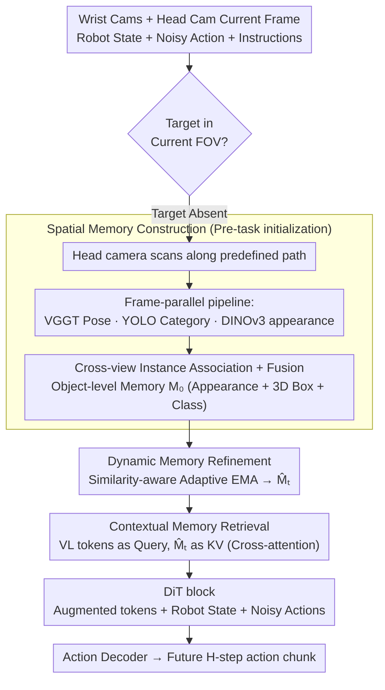

# Spatial Memory for Out-of-Vision Manipulation in Vision-Language-Action

**Conference**: ICML 2026  
**arXiv**: [2605.22283](https://arxiv.org/abs/2605.22283)  
**Code**: To be released  
**Area**: Robotics  
**Keywords**: VLA, Spatial Memory, Out-of-Vision (OOV) Manipulation, Movable Head Camera, Memory-guided Control

## TL;DR
SOMA equips VLA with persistent spatial-semantic memory built via scans from a movable head camera, permitting incremental online updates and instruction-based retrieval. This enables robots to stably manipulate objects outside the current field of view (FOV), reducing first-gaze time, head search paths, and grasp attempts by 40-60% across 5 real OOV tasks.

## Background & Motivation
**Background**: Current mainstream VLA models typically map image-language inputs to actions end-to-end using a multimodal large model with an action head, assuming a fixed desktop or third-person perspective. Models like GR00T-N1.5, π0, OpenVLA-OFT, and SpatialVLA default to "visible" task targets to facilitate calibration and large-scale data collection.

**Limitations of Prior Work**: Pure reactive perception fails once a target is temporarily occluded or falls outside the camera's FOV. Models become unable to locate targets or recall past positional information, leading to blind searching and a sharp rise in failure rates for multi-stage and bimanual tasks.

**Key Challenge**: The perception-action loop is strictly FOV-bound, yet semantic objects for manipulation often span multiple perspectives. Relying on the "spatial imagination" of MLLMs leads to distortion when targets are invisible, while active head scanning without spatial memory causes forgetting in multi-step tasks. A unified mechanism for "scan, remember, and use" is lacking.

**Goal**: Enable VLA to solve OOV at three granularities: (1) Scanning the workspace into a searchable spatial-semantic memory before the task; (2) Incrementally correcting this memory based on new observations during manipulation; (3) Accurately retrieving memory regions relevant to the current sub-goal during instruction reasoning.

**Key Insight**: Failures stem not from "guessing wrong because of invisibility," but from "having seen it but not retaining it." By scanning once to solidify scene instances into object-level memory with 3D geometry, the model can retrieve location, appearance, and category even when targets exit the FOV. The core requirement is a stable memory substrate rather than deeper reasoning.

**Core Idea**: Construct an "object-level spatial-semantic memory bank" via active scanning with a movable head camera, refresh it online using similarity-aware EMA, and retrieve semantically relevant entries via cross-attention between VLM tokens and the memory bank. This mechanism is seamlessly integrated into a DiT-based action diffusion head.

## Method
SOMA models perception as a "memory-centric" process. When the perception module detects that the target is missing from the FOV, it triggers an active scan for memory initialization. During manipulation, the head view merges new observations into memory. The DiT action head retrieves global context from memory to predict action chunks. The framework uses GR00T-N1.5 as a base with three lightweight memory modules and a head scanning script.

### Overall Architecture
Inputs include current frames from wrist (left/right) and head cameras, robot state, noisy action sequences, natural language instructions, and a pre-built scene memory $\mathcal{M}_0$. The output is an action chunk for the next $H$ steps. The pipeline consists of four stages: (1) Head pre-scan $\rightarrow$ Memory construction; (2) Real-time head view updates $\rightarrow$ Dynamic Memory Refinement to obtain $\hat{\mathcal{M}}_t$; (3) Cross-attention using VLM-encoded vision-language tokens as Queries and $\hat{\mathcal{M}}_t$ as Keys/Values to obtain memory-augmented tokens; (4) Augmented tokens + robot state + noisy action tokens enter DiT blocks to produce action chunks. The VLM language decoder remains frozen during training.

### Key Designs

**1. Spatial Memory Construction: Multi-view scanning to solidify the scene into object-level, 3D-geo-referenced, searchable memory.**

To prevent OOV failure, a foundation of real multi-view observations is used instead of MLLM imagination. Before the task, the head camera scans the scene; frames are sampled from video $V$. Three parallel pipelines are used: VGGT for camera pose and geometry, YOLO for 2D detection and categories, and DINOv3 for dense features. Instance appearance embeddings $\mathbf{f}_j^{(i)} \in \mathbb{R}^C$ are obtained via pooling, and 2D boxes are lifted to global 3D coordinates $\mathbf{b}_j^{(i)} \in \mathbb{R}^{8\times 3}$. Instances are associated across views using DINOv3 cosine similarity and 3D geometric consistency. Merged instances form the memory tokens $\mathbf{m}_k^0 = \Phi_{\text{mem}}(\mathbf{f}_k) + \Phi_{\text{pos}}(\mathbf{b}_k)$.

**2. Dynamic Memory Refinement: Online memory updates via similarity-aware adaptive EMA.**

As the scene changes (objects moved or occluded), memory must update without jitter. SOMA processes current head observations through the same pipeline to yield $\mathcal{M}_t$. After instance matching, it computes semantic similarity $s_{kj}^t = \sigma(\Phi_{\text{sim}}([\mathbf{m}_k^{t-1} - \mathbf{m}_j^t]))$ and a dynamic fusion score $g_{kj}^t = \sigma(\Phi_{\text{fuse}}([\mathbf{m}_k^{t-1}, \mathbf{m}_j^t]))$. The adaptive coefficient $\alpha_{kj}^t = g_{kj}^t \cdot s_{kj}^t$ controls the temporal EMA: $\mathbf{m}_k^t = \alpha_{kj}^t \mathbf{m}_j^t + (1 - \alpha_{kj}^t) \mathbf{m}_k^{t-1}$. This allows the system to remain stable during minor view jitter while reacting quickly to actual object movements.

**3. Contextual Memory Retrieval: Instruction-guided cross-attention for on-demand memory injection into the diffusion head.**

Rather than concatenating all memory tokens to the VLM input (which dilutes current observations), SOMA uses a retrieval mechanism. VLM vision-language tokens $\mathbf{X}_{\text{vl}}$ act as Queries, while aligned memory $\hat{\mathcal{M}}_t$ acts as Keys/Values. Scaled dot-product attention $\mathbf{X}_{\text{boost}} = \text{softmax}(\mathbf{Q}\mathbf{K}^\top / \sqrt{C}) \mathbf{V}$ generates memory-augmented tokens. These serve as global spatial priors injected into the DiT blocks alongside robot states and action tokens for joint diffusion.

### Loss & Training
Training involves 400 VR teleoperation demonstrations per real task, divided into a scanning phase (for offline $\mathcal{M}_0$ construction) and a manipulation phase. In simulation, $\mathcal{M}_0$ is built from the first frame. The objective is the standard diffusion action matching loss from GR00T-N1.5. Only perception and action parameters are optimized while freezing the VLM language decoder. Training utilized 32 H200 GPUs for 30k steps with a batch size of 60.

## Key Experimental Results

### Main Results
Performance on 5 real OOV grasping tasks: SOMA consistently reduced first-gaze time, search paths, and grasp attempts by 40-60% compared to GR00T-N1.5.

| Metric (Task 5 Bimanual) | Ours (SOMA) | GR00T-N1.5 | Gain |
|--------|------|----------|------|
| First Gaze Time (s) | 4.7 | 11.5 | -59% |
| Head Search Path (deg) | 70.4 | 164.0 | -57% |
| View Correction Count | 2.3 | 5.3 | -57% |
| Grasp Attempt Count | 1.6 | 3.7 | -57% |
| First Grasp Time (s) | 14.6 | 36.5 | -60% |

SimplerEnv (Visual Matching protocol, OXE Pre-trained + Fractal Fine-tuned):

| Method | Pick Coke Can | Move Near | Open/Close Drawer | Average |
|------|------|------|------|------|
| OpenVLA-OFT | 72.3 | 69.6 | 47.2 | 63.0 |
| GR00T-N1.5 | 47.0 | 70.0 | 18.1 | 45.0 |
| **SOMA** | **85.0** | **73.0** | 31.5 | **63.2** |

### Ablation Study

| Configuration | OOV Avg. SR (%) | Description |
|------|---------|------|
| Scan + GR00T | 18.5 | Scanning only, no persistent memory |
| No-Scan SOMA | 19.8 | Memory initialized from a single frame |
| Scan-only SOMA | 24.1 | Multiview memory, but no online refinement |
| Full SOMA | **28.3** | Scanning + Persistent Memory + Dynamic Refinement |

### Key Findings
- Scanning alone (Scan+GR00T) yields negligible gains, proving that the OOV bottleneck is "memory loss" rather than "lack of scanning."
- Explicit memory structures are valuable even without scanning (No-Scan SOMA), though multi-view scanning provides further benefits.
- SOMA exhibits "near-first-shot" grasping, significantly reducing failed attempts that plague reactive strategies.
- The more complex the task (e.g., bimanual multi-stage), the larger the performance gain ($\sim$60% reduction in search metrics).

## Highlights & Insights
- Elevates "spatial memory" from implicit KV cache to an object-level, 3D-geometric, language-retrievable data structure. This abstraction is applicable to navigation and long-video tracking.
- The use of an adaptive EMA coefficient network is a versatile trick for balancing stability against rapid environmental changes.
- The triggering mechanism is efficient: scanning is only performed if a lightweight detector confirms the target is missing from the FOV, coupling perception cost to task difficulty.
- Placing memory in cross-attention KV instead of the prompt context maintains a compact VLM pathway while allowing the DiT to call spatial evidence on-demand.

## Limitations & Future Work
- Relies on the assumption that VGGT pose drift is negligible during short-range scans; large-scale or dynamic scenes may require full SLAM.
- Instance association via DINOv3 + 3D IoU can struggle with identical objects (e.g., multiple identical cups), requiring more robust instance ID mechanisms.
- Memory focuses on 3D boxes and appearance, failing to track internal states of articulated objects (e.g., drawer openness).
- The scanning phase requires predefined trajectories; future work should learn active "where to look" planning.

## Related Work & Insights
- **vs. MemoryVLA / ContextVLA**: These store token-level features or keyframes ("perceptual memory"). SOMA stores 3D object instances, offering stronger geometric priors and better interpretability.
- **vs. SpatialVLA / RoboBrain**: These rely on internal MLLM spatial priors for implicit reasoning, which collapse when targets are fully OOV. SOMA uses real observations for explicit grounding.
- **vs. SAM2Act / MemER**: SOMA integrates memory at the object-geometry level directly into a DiT diffusion head, avoiding reliance on external planners or redundant VLM inference calls.

## Rating
- Novelty: ⭐⭐⭐⭐ The combination of "scan-memory-retrieval" for VLA is practical and well-integrated.
- Experimental Thoroughness: ⭐⭐⭐⭐ Covers real-world tasks, simulator benchmarks, and behavioral metrics.
- Writing Quality: ⭐⭐⭐⭐ Clear motivation, intuitive diagrams, and well-structured modules.
- Value: ⭐⭐⭐⭐ OOV is a core requirement for long-horizon VLA tasks; SOMA provides a reusable memory plugin paradigm.

<!-- RELATED:START -->

<!-- RELATED:END -->

## Related Papers

- [\[ICLR 2026\] MemoryVLA: Perceptual-Cognitive Memory in Vision-Language-Action Models for Robotic Manipulation](../../ICLR2026/robotics/memoryvla_perceptual-cognitive_memory_in_vision-language-action_models_for_robot.md)
- [\[ICML 2026\] LangForce: Bayesian Decomposition of Vision-Language-Action Models via Latent Action Queries](langforce_bayesian_decomposition_of_vision_language_action_models_via_latent_act.md)
- [\[ICML 2026\] StableVLA: Towards Robust Vision-Language-Action Models without Extra Data](stablevla_towards_robust_vision-language-action_models_without_extra_data.md)
- [\[ICML 2026\] Discrete Diffusion VLA: Bringing Discrete Diffusion to Action Decoding in Vision-Language-Action Policies](discrete_diffusion_vla_bringing_discrete_diffusion_to_action_decoding_in_vision-.md)
- [\[ICML 2026\] Neural Implicit Action Fields: From Discrete Waypoints to Continuous Functions for Vision-Language-Action Models](neural_implicit_action_fields_from_discrete_waypoints_to_continuous_functions_fo.md)

<!-- RELATED:END -->
