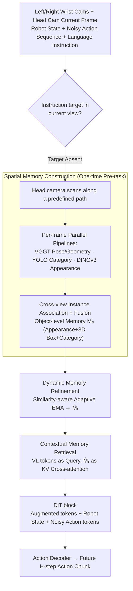

# Spatial Memory for Out-of-Vision Manipulation in Vision-Language-Action

**Conference**: ICML 2026  
**arXiv**: [2605.22283](https://arxiv.org/abs/2605.22283)  
**Code**: To be released  
**Area**: Robotics  
**Keywords**: VLA, Spatial Memory, Out-of-Vision (OOV) Manipulation, Movable Head Camera, Memory-Guided Manipulation

## TL;DR
SOMA equips VLA with a persistent spatial-semantic memory built via active scanning with a movable head camera. This memory supports incremental online updates and instruction-based retrieval, enabling robots to stably manipulate objects outside the current field of view (OOV). In five real-world OOV grasping tasks, SOMA reduces the time to first gaze, head search path, and number of grasp attempts by 40-60%.

## Background & Motivation
**Background**: Current mainstream VLA models typically map image-language pairs to actions end-to-end using a multimodal large model with an action head/module, often under fixed tabletop or third-person viewpoints. This setup facilitates calibration and large-scale data collection, leading almost all major VLA models (e.g., GR00T-N1.5, π0, OpenVLA-OFT, SpatialVLA) to assume task targets are always "visible."

**Limitations of Prior Work**: Once a target is temporarily occluded or falls outside the camera's field of view, purely reactive perception fails. The model can neither locate the target nor recall previously observed position information, resulting in blind searching and sharp increases in failure rates for multi-stage and bimanual tasks.

**Key Challenge**: The perception-action loop is strictly tied to the current field of view, yet the semantic objects being manipulated often span multiple perspectives. Solutions either rely on MLLM "spatial imagination" (where spatial estimation rapidly distorts and propagates errors when targets are invisible) or active head scanning without persistent memory (where information is still forgotten in multi-step tasks). A unified mechanism for "see, remember, and then use" is missing.

**Goal**: Enable VLA to solve OOV at three granularities: (1) scanning the entire workspace into a searchable spatial-semantic memory before the task; (2) incrementally refining this memory based on new observations during manipulation; and (3) precisely retrieving memory regions relevant to the current sub-goal during instruction reasoning.

**Key Insight**: The authors observe that failure modes are not "unable to guess because it's not seen," but rather "seen but not retained." By scanning once to solidify scene instances into object-level memory with 3D geometry, the model can still retrieve position, appearance, and category even after the target leaves the field of view. The core requirement is a stable memory substrate rather than deeper reasoning.

**Core Idea**: Construct an "object-level spatial-semantic memory bank" via an active scan with a movable head camera, refresh it online using similarity-aware EMA, and allow VLM tokens to retrieve semantically relevant entries via cross-attention. This mechanism is seamlessly integrated into a DiT-based action diffusion head.

## Method
SOMA remodels perception as a "memory-centric" process: when the perception module detects the instruction target is missing from the current view, it triggers an active scan for memory initialization. During manipulation, the head view continuously integrates new observations into memory. The DiT action head retrieves global context from the memory to predict action chunks. Built on GR00T-N1.5, the framework adds three lightweight memory modules and a head-scanning script.

### Overall Architecture
Inputs include current frames from left/right-arm wrist cameras and a movable head camera, robot states, noisy action sequences, natural language instructions, and a pre-constructed scene memory $\mathcal{M}_0$. The output is an action chunk for the next $H$ steps. The pipeline consists of four stages: (1) Head pre-scanning → Memory construction; (2) Real-time head view updates during manipulation → Dynamic Memory Refinement to obtain $\hat{\mathcal{M}}_t$; (3) VL tokens encoded by the VLM act as Queries to perform cross-attention with $\hat{\mathcal{M}}_t$, yielding memory-augmented tokens; (4) Augmented tokens + robot states + noisy action tokens enter a DiT block, where an action decoder produces the action chunk. The VLM language decoder remains frozen during training, with optimization focused on perception, memory, and action parameters.

### Key Designs

**1. Spatial Memory Construction: One-time pre-task multi-view scan to solidify the scene into object-level, 3D-geometric, searchable memory.**

The root cause of OOV failure is "seen but not retained," necessitating a foundation of real multi-view observations rather than MLLM imagination. Before the task, the head camera scans a video $V$, sampled into $\tilde{V}$. Each frame runs through three complementary pipelines: VGGT for camera pose and scene geometry, YOLO for 2D detection and category, and DINOv3 for dense features. Instance appearance embeddings $\mathbf{f}_j^{(i)} \in \mathbb{R}^C$ are obtained via 2D boxes and mean pooling, then lifted to global 3D coordinates $\mathbf{b}_j^{(i)} \in \mathbb{R}^{8\times 3}$ using VGGT geometry. Intra-class instance association is performed across views using "DINOv3 cosine similarity + 3D box spatial consistency." Matches above a threshold are merged by averaging appearance and geometry, resulting in a global instance set $\{(\mathbf{f}_k, c_k, \mathbf{b}_k)\}$. These are finally concatenated into memory tokens $\mathbf{m}_k^0 = \Phi_{\text{mem}}(\mathbf{f}_k) + \Phi_{\text{pos}}(\mathbf{b}_k)$.

All three pipelines are essential: YOLO provides semantics, DINOv3 provides fine-grained appearance, and VGGT provides cross-view aligned geometry. Learnable placeholder embeddings and pseudo-boxes are injected when detections are missed to prevent memory sparsification. This foundation of real observations allows the model to read position, appearance, and category even if the target leaves the view.

**2. Dynamic Memory Refinement: Online memory updates using similarity-aware adaptive EMA.**

Scenes change during manipulation (objects move, get occluded, or new objects appear), requiring memory updates. However, fixed EMA coefficients suffer from a trade-off: high coefficients cause jitter, while low coefficients are slow to react to real changes. SOMA processes current frames $o_h^t$ through the same perception pipeline to produce $\mathcal{M}_t$. After intra-class matching, two scores are calculated: semantic similarity $s_{kj}^t = \sigma(\Phi_{\text{sim}}([\mathbf{m}_k^{t-1} - \mathbf{m}_j^t]))$ and dynamic fusion score $g_{kj}^t = \sigma(\Phi_{\text{fuse}}([\mathbf{m}_k^{t-1}, \mathbf{m}_j^t]))$. Their product yields an adaptive coefficient $\alpha_{kj}^t = g_{kj}^t \cdot s_{kj}^t$, used for temporal EMA: $\mathbf{m}_k^t = \alpha_{kj}^t \mathbf{m}_j^t + (1 - \alpha_{kj}^t) \mathbf{m}_k^{t-1}$.

Learning coefficients from similarity allows the model to automatically switch between "maintaining stability during small view jitters" and "rapidly updating when objects actually move." Crucially for OOV, unmatched old memories are retained rather than deleted—since a target leaving the view does not mean it has disappeared.

**3. Contextual Memory Retrieval: Instruction-guided cross-attention for on-demand retrieval and injection into the diffusion action head.**

Concatenating all memory tokens directly into the VLM input would lengthen the context and dilute current observations. SOMA uses a retrieval approach: vision-language tokens $\mathbf{X}_{\text{vl}}$ from the VLM act as the Query, while memory $\hat{\mathcal{M}}_t$ aligned via $\Phi_{\text{align}}$ acts as the Key/Value. Standard scaled dot-product attention $\mathbf{X}_{\text{boost}} = \text{softmax}(\mathbf{Q}\mathbf{K}^\top / \sqrt{C}) \mathbf{V}$ produces memory-augmented tokens. These are injected into the DiT block as global spatial priors, undergoing joint diffusion with original VL tokens, robot states, and noisy action tokens.

Placing memory in the cross-attention KV rather than the prompt context keeps the perception path compact and allows the DiT to call upon spatial evidence relevant only to the current sub-goal during each denoising step, naturally fitting the diffusion action head's workflow.

### Loss & Training
Training data: 400 real VR teleoperation demonstrations per task, each split into a scanning phase (for offline $\mathcal{M}_0$ construction) and a manipulation phase (for training). In simulation, $\mathcal{M}_0$ is built from the first frame. The optimization objective follows the diffusion action matching loss of GR00T-N1.5; the VLM language decoder is frozen while other components are jointly trained. Multi-task batch size of 60, trained for 30k steps on 32 H200 GPUs. At inference, a lightweight detector determines if the target is in view; if absent, head scanning is triggered.

## Key Experimental Results

### Main Results
Behavioral metrics on 5 real OOV grasping tasks: SOMA consistently reduces "time to first gaze, head search angle, view correction count, grasp attempt count, and time to first grasp" to 40-60% of GR00T-N1.5 levels.

| Metric (Task 5 Bimanual) | Ours (SOMA) | GR00T-N1.5 | Relative Reduction |
|--------------------------|-------------|------------|--------------------|
| Time to First Gaze (s)   | 4.7         | 11.5       | -59%               |
| Head Search Path (deg)   | 70.4        | 164.0      | -57%               |
| View Correction Count    | 2.3         | 5.3        | -57%               |
| Grasp Attempt Count      | 1.6         | 3.7        | -57%               |
| Time to First Grasp (s)  | 14.6        | 36.5       | -60%               |

SimplerEnv (Visual Matching protocol, OXE pre-training + Fractal fine-tuning):

| Method       | Pick Coke Can | Move Near | Open/Close Drawer | Average |
|--------------|---------------|-----------|-------------------|---------|
| OpenVLA-OFT  | 72.3          | 69.6      | 47.2              | 63.0    |
| GR00T-N1.5   | 47.0          | 70.0      | 18.1              | 45.0    |
| **SOMA**     | **85.0**      | **73.0**  | 31.5              | **63.2**|

RoboCasa Tabletop GR1 (5 task categories, 300 demo setting): SOMA achieves an average success rate of 52.0%, significantly higher than GR00T-N1.5 (44.3) and Diffusion Policy (39.2), maintaining leadership across all data scales (30/100/300/Full), demonstrating high sample efficiency.

### Ablation Study

| Configuration   | OOV Avg SR (%) | Description                                     |
|-----------------|----------------|-------------------------------------------------|
| Scan + GR00T    | 18.5           | Head scan only, no persistent memory            |
| No-Scan SOMA    | 19.8           | Single-frame memory init, no scanning           |
| Scan-only SOMA  | 24.1           | Multi-view scan, but no online updates          |
| Full SOMA       | **28.3**       | Scanning + persistent memory + dynamic refinement|

### Key Findings
- Adding scanning actions alone (Scan+GR00T) yields negligible gains, proving the OOV bottleneck is "memory deficiency," not "action deficiency." Persistent memory + online refinement are the primary sources of gain.
- Even without multi-view scanning (No-Scan SOMA), the model outperforms Scan+GR00T, indicating that the explicit memory structure itself is valuable.
- Behaviorally, SOMA exhibits "near-perfect hit" grasping—reducing grasp attempts from 3.7 to 1.6, a feat unreachable by reactive strategies.
- Gains scale with task difficulty: ~45% reduction for single-step tasks vs. ~60% for bimanual multi-stage tasks (Task 5), where spatial consistency across stages is critical.

## Highlights & Insights
- Elevates "spatial memory" from implicit KV cache to an object-level, 3D-geometric, language-retrievable explicit data structure. This abstraction is applicable to navigation, long-video QA, and state tracking in HRI.
- Replaces fixed smoothing with an adaptive EMA coefficient—a universal trick for any online memory requiring "stability under small noise but rapid tracking of real changes."
- The trigger mechanism is clever: scanning is not done every step (expensive) but triggered by a lightweight detector only when the target is missing, adapting sensing cost to task difficulty.
- Placing memory in cross-attention KV rather than prompt context maintains VLM backbone compactness and is friendly to diffusion action heads. This paradigm can be adapted to π0, OpenVLA, and others.

## Limitations & Future Work
- Relies on the assumption that VGGT pose drift is negligible during short-range static scans. Geometry alignment may fail in large-scale or dynamic scenes, requiring external SLAM or visual odometry with loop closure.
- Intra-class association relies on DINOv3 + 3D IoU; identical objects (e.g., multiple identical cups) may be merged incorrectly, needing stronger instance ID mechanisms.
- Memory is restricted to 3D boxes and global appearance, lacking internal states for articulated objects (e.g., drawer opening percentage), which limits performance on cupboard/drawer tasks.
- The scanning phase requires predefined trajectories. Future work could involve policies learning active gaze planning for optimal information gain.

## Related Work & Insights
- **vs. MemoryVLA / ContextVLA**: These store token-level visual features or keyframes (perceptual memory). SOMA stores object-level 3D instances, providing stronger geometric priors and better interpretability.
- **vs. SpatialVLA / RoboBrain**: These rely on internal MLLM spatial priors for implicit reasoning and fail when targets are entirely out of view. SOMA uses real multi-view observations for explicit grounding, offering superior OOV robustness.
- **vs. SAM2Act / MemER**: SAM2Act uses SAM2 memory banks + keyframe actions; MemER uses VLM-generated language sub-goals. SOMA builds memory at the object-geometry level and integrates it end-to-end into a DiT head, avoiding reliance on external planners or additional VLM calls.

## Rating
- **Novelty**: ⭐⭐⭐⭐ Implementing a "Scan-Memory-Retrieve" triad for VLA is a clear and practical combination; while individual components are known, the system-level integration is robust.
- **Experimental Thoroughness**: ⭐⭐⭐⭐ Covers 5 real tasks + behavioral metrics + RoboCasa + SimplerEnv. Could benefit from failure analysis and scanning budget ablations.
- **Writing Quality**: ⭐⭐⭐⭐ Clear motivation, intuitive diagrams, and well-structured module explanations.
- **Value**: ⭐⭐⭐⭐ OOV is a critical requirement for VLA in long-horizon tasks. SOMA provides a reusable memory plugin paradigm for any VLA backbone.

<!-- RELATED:START -->

## Related Papers

- [\[ICLR 2026\] MemoryVLA: Perceptual-Cognitive Memory in Vision-Language-Action Models for Robotic Manipulation](../../ICLR2026/robotics/memoryvla_perceptual-cognitive_memory_in_vision-language-action_models_for_robot.md)
- [\[ICLR 2026\] Spatial Forcing: Implicit Spatial Representation Alignment for Vision-language-action Model](../../ICLR2026/robotics/spatial_forcing_implicit_spatial_representation_alignment_for_vision-language-ac.md)
- [\[ICML 2026\] LangForce: Bayesian Decomposition of Vision-Language-Action Models via Latent Action Queries](langforce_bayesian_decomposition_of_vision_language_action_models_via_latent_act.md)
- [\[ICML 2026\] StableVLA: Towards Robust Vision-Language-Action Models without Extra Data](stablevla_towards_robust_vision-language-action_models_without_extra_data.md)
- [\[ICML 2026\] Discrete Diffusion VLA: Bringing Discrete Diffusion to Action Decoding in Vision-Language-Action Policies](discrete_diffusion_vla_bringing_discrete_diffusion_to_action_decoding_in_vision-.md)

<!-- RELATED:END -->
