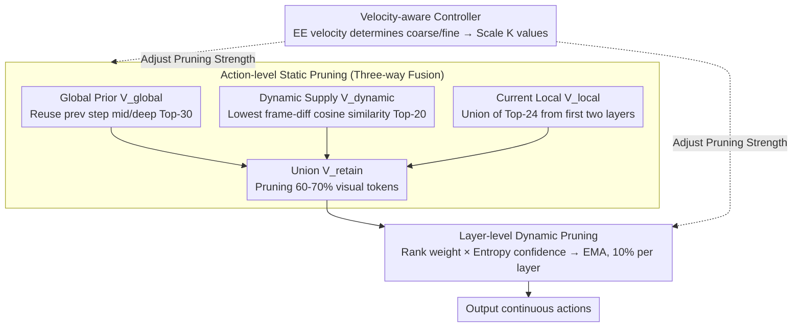

# SpecPrune-VLA: Accelerating Vision-Language-Action Models via Action-Aware Self-Speculative Pruning

**Conference**: ICML 2026  
**arXiv**: [2509.05614](https://arxiv.org/abs/2509.05614)  
**Code**: To be confirmed  
**Area**: Robotics / VLA / Inference Acceleration / Visual Token Pruning  
**Keywords**: VLA acceleration, Token pruning, Self-speculative, Spatio-temporal consistency, Action granularity

## TL;DR
The authors observe that VLA inference is compute-bound, making pruning the optimal acceleration path. Given the high overlap of visual information between consecutive action steps, they propose SpecPrune-VLA. This training-free method uses a three-way fusion (previous global attention + current early-layer local attention + frame-difference dynamic tokens) for static pruning, combined with intra-layer dynamic pruning and a velocity-aware coarse/fine granularity controller. It achieves 1.57× speedup on LIBERO and 1.70× on real robots with negligible success rate loss.

## Background & Motivation
**Background**: Modern VLAs (e.g., OpenVLA-OFT, DB-OFT, CogACT) increasingly adopt a single-step paradigm where one LLM forward pass (prefill only) directly predicts a segment of continuous actions. The models consist of a tokenizer, an LLM backbone, and an action head, with the LLM backbone accounting for >70% of end-to-end latency, representing the primary bottleneck.

**Limitations of Prior Work**: The authors plotted four representative VLAs on a Roofline model using an NVIDIA A800, finding that all fall into the compute-bound region—latency stems mostly from computation rather than memory access. This implies that memory-saving methods like KV-cache reuse or quantization offer limited gains, while **token pruning to reduce computation is the direct solution**. However, existing VLA token pruning methods (EfficientVLA, SP-VLA, VLA-Cache) suffer from two issues: they either rely on single-layer local heuristics (risking deletion of globally important tokens, leading to >20% success rate drops) or focus on KV-cache reuse saving only 17–25% FLOPs.

**Key Challenge**: Local information (early layers of the current step) is cheap but short-sighted and misses semantically relevant tokens; global information (deep layers) is accurate but only available after the model finishes, making post-hoc pruning meaningless. 

**Goal**: (1) Identify a physical fact that allows "early access to global information"; (2) Utilize this fact to design a three-way fusion pruning mechanism; (3) Make the pruning rate adaptive to action sensitivity to avoid failures at critical nodes like contact or placing.

**Key Insight**: The authors made two key observations. **Insight 1 (Which tokens matter)**: Image-to-text attention focuses on different things across layers—shallow layers are broad and redundant, middle layers focus on semantic objects (e.g., cabinets), and deep layers focus on action targets (e.g., plates). Pruning using middle + deep attention can push sparsity to 86% with almost no performance drop, whereas shallow-layer-only pruning fails beyond 10%. **Insight 2 (Spatio-temporal consistency)**: The visual scene remains nearly static between consecutive inference steps. Comparing the Top-30 globally important tokens $V_{t-1}$ from the previous step with the current set $V_t$, the Recall $|V_{t-1}\cap V_t|/|V_t|$ averages 75–88%. This means the **global attention from the previous step serves as a valid global prior for the current step**, bypassing the "only known after execution" dilemma.

**Core Idea**: A training-free two-stage pruning approach. At the action level, static pruning uses a union of "previous global + frame-diff dynamic + current early local" tokens to cut 60-70% of visual tokens. At the layer level, dynamic pruning uses rank-based scores and entropy-derived confidence to prune an additional 10% per layer. A lightweight controller monitors end-effector velocity to reduce pruning intensity during high-precision stages like "contact/placing."

## Method

### Overall Architecture
SpecPrune-VLA is a plug-in acceleration framework for models like OpenVLA-OFT, DB-OFT, or CogACT, requiring **no additional training**. The workflow for one action inference is: (1) **Action-level static pruning**—At the start of the LLM forward pass, it merges $V_{global}$ (Top-K from previous deep/middle attention), $V_{dynamic}$ (Top-K patches with lowest cosine similarity to history), and $V_{local}$ (union of Top-K from current early layers) to get $V_{retain} = V_{global}\cup V_{dynamic}\cup V_{local}$. (2) **Layer-level dynamic pruning**—Remaining tokens enter the LLM; at specified "update layers," EMA scores are updated using rank-based sigmoid weights × entropy-derived confidence, pruning the bottom 10% per layer. (3) **Action-aware controller**—Determines coarse/fine granularity based on previous output velocities, scaling $K$ values via factor $\alpha$.

### Key Designs

**1. Three-way Fusion Action-level Static Pruning**

Pruning 60-70% of tokens at the start requires high recall. Each source has a blind spot: $V_{global}$ misses new critical tokens, $V_{local}$ is short-sighted, and $V_{dynamic}$ ignores static but important background. SpecPrune-VLA uses $V_{retain} = V_{global}\cup V_{dynamic}\cup V_{local}$ to cover "semantic stability + content change + task immediacy." Image-to-text attention is defined as:

$$\text{Score}_l(V_i) = \frac{1}{H\cdot m}\sum_{h=1}^{H}\sum_{j=1}^{m} A_l^h(V_i, t_j)$$

$V_{global}$ uses layers 15 and 32 (middle/deep) from the previous step. $V_{local}$ uses the first two layers of the current step. $V_{dynamic}$ uses cosine similarity $\text{Sim}(\mathbf{P}_m^{i,j}, \mathbf{P}_n^{i,j})$ against velocity-adaptive history frames $T = \lfloor b + k\cdot v\rfloor + 4$ ($k=-1, b=7$), ensuring robustness against camera noise.

**2. Entropy and Rank-based Layer-level Dynamic Pruning**

Remaining tokens are refined per layer. Since layer quality varies, SpecPrune-VLA calculates instantaneous scores $s_i^{(l)} = \omega_{\text{rank},i}^{(l)} \times \omega_{\text{conf}}^{(l)}$. The rank weight $\omega_{\text{rank},i}^{(l)} = \sigma(-k\cdot\text{rank}_i^{(l)}) / \sum_j \sigma(-k\cdot\text{rank}_j^{(l)})$ uses a sigmoid to prioritize top tokens. Layer confidence $\omega_{\text{conf}}^{(l)} = 1/(\bar{H}^{(l)} + \epsilon)$ uses the mean entropy $\bar{H}^{(l)}$ of image-to-text attention; low entropy implies concentrated, reliable attention. Scores are updated via EMA $S_i^{(l)} = (1-\beta) S_i^{(l-1)} + \beta s_i^{(l)}$ ($\beta=0.2$).

**3. Velocity-aware Action-aware Controller**

VLA failures often cluster during contact/placing phases. The controller switches modes based on translational velocity $v_t$ and rotational velocity $v_r$:

$$v_t = \sqrt{(\Delta x)^2 + (\Delta y)^2 + (\Delta z)^2}, \quad v_r = \sqrt{(\Delta\alpha)^2 + (\Delta\beta)^2 + (\Delta\gamma)^2}$$

When $v_t < v_t^{\text{th}}$, $v_r < v_r^{\text{th}}$, and $\Delta z \leq 0$, the system enters "precise" mode, scaling $K$ values to prune more conservatively. This adds only ~1.5ms latency but recovers success rates to baseline levels.

### Loss & Training
**Entirely training-free**—all logic is driven by inference-time statistics. Hyperparameters: $K_{global}=30$, $K_{local}=24$, $K_{dynamic}=20$, global pruning rate $\alpha=0.8$, EMA $\beta=0.2$, layer-wise pruning rate 10%.

## Key Experimental Results

### Main Results
End-to-end comparison on LIBERO (A800 GPU, OpenVLA-OFT backbone):

| Method | Spatial | Object | Goal | Long | Avg SR | Speedup | FLOPs |
|------|---------|--------|------|------|--------|---------|-------|
| OpenVLA-OFT | 97.6 | 96.5 | 97.9 | 94.5 | 96.6 | 1.00× | 100% |
| FastV (ECCV24) | 94.6 | 95.8 | 94.0 | 88.8 | 93.3 | 1.44× | 57% |
| DivPrune (CVPR25) | 92.4 | 91.2 | 89.0 | 84.8 | 89.4 | 1.46× | 54% |
| SparseVLM (ICML25) | 96.8 | 94.2 | 97.6 | 93.6 | 95.6 | 1.28× | 77% |
| VLA-Cache (NIPS25) | 99.0 | 97.7 | 97.4 | 93.6 | 96.9 | 1.07× | 83% |
| EfficientVLA (NIPS25) | 96.5 | 91.1 | 96.0 | 72.1 | 88.9 | 1.52× | 35% |
| **Ours (α=0.8)** | **97.4** | **95.8** | **97.7** | **93.4** | **96.1** | **1.46×** | **43%** |

On SimplerEnv (DB-OFT backbone), Ours achieved 1.44× speedup with 70.1% SR (baseline 70.4%). On RTX 3090, LLM speedup reached 2.09×. Real-world tests on Flexiv Rizon4 showed 1.70× avg speedup.

### Ablation Study

| Configuration | Recall (%) | LIBERO SR (%) | Description |
|------|-----------|---------------|------|
| Full Method | 92 | 96.1 | All components active |
| w/o Global Reuse | 84 | 93.4 | Only local info, -2.7 pt |
| w/o Entropy Weight (Mean) | 66 | 92.0 | Recall drops 26 pt |
| Static + Dynamic (no Controller) | – | 96.8 | Controller recovers 0.6 pt |

### Key Findings
- **Inter-step global attention reuse** is the physical foundation, leveraging 75-88% consistency.
- **Entropy weighting is critical** (96.1% vs 92.0%), proving that layer-wise attention quality is heterogeneously distributed.
- **Pruning sensitivity during contact** is the key to end-to-end robustness; the velocity controller keeps SR near baseline.
- **Cross-architecture stability**: Effective across OpenVLA (VLM), DB-OFT (Diffusion), and CogACT.

## Highlights & Insights
- **Root cause analysis**: Identifying whether VLA is compute-bound vs memory-bound before choosing the optimization direction is a crucial step often missed. Roofline analysis correctly identified token pruning as the solution.
- **Recall as a proxy**: Using consistency recall as a measurable optimization target transforms heuristic tuning into an engineering problem with clear metrics.
- **Entropy as confidence**: This is a valuable general trick for any layer-wise importance aggregation to prevent noisy layers from polluting the decision.
- **Velocity as structure**: Utilizing the inherent structure of the task (EE velocity) rather than just pushing raw latency numbers provides high value for embodied AI deployment.

## Limitations & Future Work
- **High-dynamic scenes**: Heuristic controllers might fail in tasks like catching balls where high velocity persists during critical snapshots.
- **Cold start**: The first step has no prior, requiring full computation or a fallback local strategy.
- **Hyperparameter sensitivity**: $K$ and $\alpha$ require tuning per task family; future work could explore automated scheduling.
- **Scope**: Currently focuses on vision tokens; future work could address text tokens or diffusion-based multi-step denoising redundancies.

## Related Work & Insights
- **vs EfficientVLA**: EfficientVLA uses layer skipping but drops to 72.1% on long-horizon tasks; Ours maintains 93.4% by preserving global semantics.
- **vs VLA-Cache**: VLA-Cache saves memory (1.07× speedup); Ours saves computation (1.46× speedup). They are orthogonal.
- **vs General VLM Pruning (FastV/DivPrune)**: Generic methods lack VLA-specific layer-wise entropy weighting and global reuse, leading to higher accuracy drops.

## Rating
- Novelty: ⭐⭐⭐⭐ (Global reuse + Velocity classification are highly VLA-specific)
- Experimental Thoroughness: ⭐⭐⭐⭐⭐ (Broad tasks, multiple platforms, 6 baselines)
- Writing Quality: ⭐⭐⭐⭐ (Logical insight-driven motivation)
- Value: ⭐⭐⭐⭐⭐ (Training-free, plug-and-play, 1.7× real-world gains)

<!-- RELATED:START -->

## Related Papers

- [\[ICML 2026\] Latent Reasoning VLA: Latent Thinking and Prediction for Vision-Language-Action Models](latent_reasoning_vla_latent_thinking_and_prediction_for_vision-language-action_m.md)
- [\[ICML 2026\] Discrete Diffusion VLA: Bringing Discrete Diffusion to Action Decoding in Vision-Language-Action Policies](discrete_diffusion_vla_bringing_discrete_diffusion_to_action_decoding_in_vision-.md)
- [\[ICLR 2026\] Action-aware Dynamic Pruning for Efficient Vision-Language-Action Manipulation](../../ICLR2026/robotics/action-aware_dynamic_pruning_for_efficient_vision-language-action_manipulation.md)
- [\[ICML 2026\] LangForce: Bayesian Decomposition of Vision-Language-Action Models via Latent Action Queries](langforce_bayesian_decomposition_of_vision_language_action_models_via_latent_act.md)
- [\[ICML 2026\] Contrastive Representation Regularization for Vision-Language-Action Models](contrastive_representation_regularization_for_vision-language-action_models.md)

<!-- RELATED:END -->
