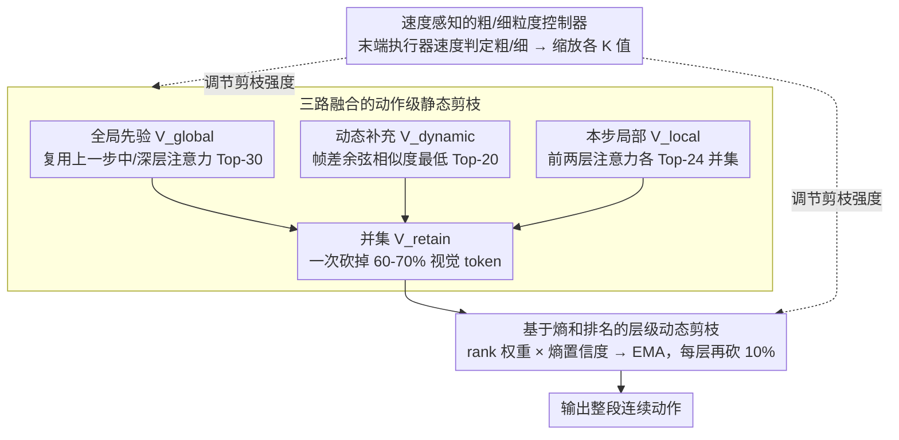

# SpecPrune-VLA: Accelerating Vision-Language-Action Models via Action-Aware Self-Speculative Pruning

**Conference**: ICML 2026  
**arXiv**: [2509.05614](https://arxiv.org/abs/2509.05614)  
**Code**: To be confirmed  
**Area**: Robotics / VLA / Inference Acceleration / Visual Token Pruning  
**Keywords**: VLA Acceleration, Token Pruning, Self-Speculation, Spatiotemporal Consistency, Action Granularity

## TL;DR
The authors observe that VLA inference is compute-bound, making pruning the optimal strategy, particularly since visual information overlaps significantly across consecutive action steps. They propose SpecPrune-VLA: a training-free framework that fuses previous global attention, current early-layer local attention, and frame-difference dynamic tokens for static pruning, supplemented by intra-layer dynamic pruning and a velocity-aware coarse/fine controller. It achieves 1.57× acceleration in simulation (LIBERO) and 1.70× on real-world robots with negligible success rate loss.

## Background & Motivation
**Background**: Modern VLAs (such as OpenVLA-OFT, DB-OFT, CogACT) increasingly adopt a single-step paradigm where one LLM forward pass (prefill-only) directly predicts a continuous action sequence. The model consists of a tokenizer, an LLM backbone, and an action head, with the LLM backbone accounting for >70% of end-to-end latency, representing the primary bottleneck.

**Limitations of Prior Work**: The authors plotted four representative VLAs on a Roofline model using an NVIDIA A800, finding that all fall within the compute-bound region—latency is primarily driven by computation volume rather than memory access. This implies that memory-saving techniques like KV-cache reuse or quantization offer limited gains, whereas **token pruning to reduce computation is the direct solution**. However, existing VLA token pruning methods (EfficientVLA, SP-VLA, VLA-Cache) suffer from two issues: they either rely on single-layer local heuristics (risking the deletion of globally important tokens, leading to >20% success rate drops) or focus on KV-cache reuse, saving only 17–25% FLOPs.

**Key Challenge**: Local information (early-layer attention) is cheap but short-sighted, missing semantically relevant tokens; global information (deep-layer attention) is accurate but only available after the forward pass, making post-hoc pruning useless.

**Goal**: (1) Identify a physical property that makes "global information available in advance"; (2) Utilize this property to design a three-way fusion pruning mechanism; (3) Adapt the pruning rate based on action sensitivity to prevent failures at critical stages like contact or placement.

**Key Insight**: The authors made two key observations. **Insight 1 (Which tokens truly matter)**: Image-to-text attention focuses on different areas across shallow, middle, and deep layers—shallow layers are broad and redundant, middle layers focus on semantic objects (e.g., a cabinet), and deep layers focus on action targets (e.g., a plate). Using middle and deep layer attention for pruning allows a sparsity of 86% with almost no performance loss, whereas shallow-layer-only pruning fails beyond 10%. **Insight 2 (Spatiotemporal Consistency)**: The visual scene remains nearly identical between consecutive inference steps due to constant task goals and short time intervals. The Recall between the Top-30 globally important tokens $V_{t-1}$ from the previous step and $V_t$ from the current step averages 75–88%. This means **the previous step's global attention can serve as a global prior for the current step**, bypassing the "chicken-and-egg" dilemma of needing to complete the forward pass first.

**Core Idea**: A training-free two-level pruning strategy. At the action level, static pruning is performed by fusing three sources (previous global + frame-difference dynamic + current early local) to discard 60-70% of visual tokens. At the layer level, dynamic pruning discards an additional 10% per layer based on attention entropy and ranking. Finally, a lightweight velocity-aware controller reduces pruning rates during "fine-grained" phases like contact or placement to ensure robustness.

## Method

### Overall Architecture
SpecPrune-VLA is a plug-in acceleration framework for models like OpenVLA-OFT, DB-OFT, and CogACT, requiring **no additional training**. The workflow for one action inference step is: (1) **Action-level static pruning**: At the start of the LLM forward pass, it merges $V_{global}$ (Top-K from the previous step's middle/deep attention), $V_{dynamic}$ (K patches with lowest cosine similarity to historical frames), and $V_{local}$ (union of Top-K from the current step's first two layers) to obtain $V_{retain} = V_{global}\cup V_{dynamic}\cup V_{local}$. (2) **Layer-level dynamic pruning**: Remaining tokens enter the LLM, where at specified "update layers," scores are updated using EMA based on sigmoid-ranked weights and entropy-derived layer confidence, pruning the bottom 10% per layer. (3) **Action-aware controller**: Based on the translational and rotational velocities of the previous output action, it determines if the current step is coarse or fine-grained, scaling all $K$ values by a factor $\alpha$ to adapt pruning intensity.

### Key Designs

**1. Three-way fused action-level static pruning: Combining orthogonal importance sources**

To discard 60-70% of visual tokens at the start of the LLM pass, it is crucial not to prune critical tokens. Since three available clues have blind spots—$V_{global}$ might miss new critical tokens, $V_{local}$ is short-sighted, and $V_{dynamic}$ might ignore important static objects—SpecPrune-VLA takes the union $V_{retain} = V_{global}\cup V_{dynamic}\cup V_{local}$ to cover semantic stability, content change, and task immediacy. The image-to-text attention score is defined as:

$$\text{Score}_l(V_i) = \frac{1}{H\cdot m}\sum_{h=1}^{H}\sum_{j=1}^{m} A_l^h(V_i, t_j)$$

where $V_{global}$ uses Top-30 from layers 15 and 32 of the previous step, $V_{local}$ uses the union of Top-24 from the first two layers, and $V_{dynamic}$ selects the lowest Top-20 patches based on cosine similarity $\text{Sim}(\mathbf{P}_m^{i,j}, \mathbf{P}_n^{i,j})$ compared to a velocity-adaptive historical frame $T = \lfloor b + k\cdot v\rfloor + 4$ ($k=-1, b=7$).

**2. Entropy and rank-based layer-level dynamic pruning: Prioritizing layers with clear focus**

Transformer layers vary in attention clarity. SpecPrune-VLA calculates an instantaneous score $s_i^{(l)} = \omega_{\text{rank},i}^{(l)} \times \omega_{\text{conf}}^{(l)}$ for each token: rank weight $\omega_{\text{rank},i}^{(l)} = \sigma(-k\cdot\text{rank}_i^{(l)}) / \sum_j \sigma(-k\cdot\text{rank}_j^{(l)})$ uses a sigmoid to amplify high-ranking tokens, and layer confidence $\omega_{\text{conf}}^{(l)} = 1/(\bar{H}^{(l)} + \epsilon)$ uses the mean entropy $\bar{H}^{(l)}$ of image-to-text attention. Low entropy indicates focused, trustworthy attention. Scores are updated via EMA $S_i^{(l)} = (1-\beta) S_i^{(l-1)} + \beta s_i^{(l)}$ ($\beta=0.2$), pruning the bottom 10% per layer. This entropy-based gating achieves 88% Recall on LIBERO compared to 66% with average weighting.

**3. Velocity-aware coarse/fine controller: Automatic refinement during critical moments**

Analysis shows failures are concentrated in contact/placement phases. SpecPrune-VLA uses end-effector translational velocity $v_t$ and rotational velocity $v_r$ as a switch. When $v_t < v_t^{\text{th}}$, $v_r < v_r^{\text{th}}$, and $\Delta z \leq 0$ (downward contact), the model enters "precise mode," increasing $K$ values for more conservative pruning. This controller adds only ~1.5ms latency but recovers the success rate from 96.8% to 97.4%, matching the baseline.

### Loss & Training
**Completely training-free**—all pruning logic is driven by inference-time statistics like attention scores, entropy, and frame similarity. Hyperparameters: $K_{global}=30$, $K_{local}=24$, $K_{dynamic}=20$ (selected to maximize Recall), global pruning rate $\alpha=0.8$, EMA $\beta=0.2$, layer-wise pruning rate 10%.

## Key Experimental Results

### Main Results
End-to-end comparison on LIBERO (A800 GPU, OpenVLA-OFT backbone):

| Method | Spatial | Object | Goal | Long | Avg SR | Speedup | FLOPs |
|------|---------|--------|------|------|--------|---------|-------|
| OpenVLA-OFT | 97.6 | 96.5 | 97.9 | 94.5 | 96.6 | 1.00× | 100% |
| FastV (ECCV24) | 94.6 | 95.8 | 94.0 | 88.8 | 93.3 | 1.44× | 57% |
| DivPrune (CVPR25) | 92.4 | 91.2 | 89.0 | 84.8 | 89.4 | 1.46× | 54% |
| SparseVLM (ICML25) | 96.8 | 94.2 | 97.6 | 93.6 | 95.6 | 1.28× | 77% |
| VLA-Cache (NIPS25) | 99.0 | 97.7 | 97.4 | 93.6 | 96.9 | 1.07× | 83% |
| EfficientVLA (NIPS25) | 96.5 | 91.1 | 96.0 | 72.1 | 88.9 | 1.52× | 35% |
| **SpecPrune-VLA (α=0.8)** | **97.4** | **95.8** | **97.7** | **93.4** | **96.1** | **1.46×** | **43%** |

On SimplerEnv visual matching tasks (DB-OFT backbone), it achieves a 70.1% SR (baseline 70.4%) with 1.44× speedup. On NVIDIA RTX 3090, it reaches 2.09× acceleration for the LLM component and 1.57× end-to-end; real-world robot (Flexiv Rizon4) experiments show 1.70× acceleration.

### Ablation Study
| Configuration | Recall (%) | LIBERO SR (%) | Description |
|------|-----------|---------------|------|
| Full Method | 92 | 96.1 | All three techniques enabled |
| w/o Global Reuse | 84 | 93.4 | Only local info, -2.7 pt drop |
| w/o Entropy Weighting | 66 | 92.0 | Recall drops by 26 pt |
| Static + Dynamic only | – | 96.8 | Controller recovers 0.6 pt |

### Key Findings
- **Inter-step global attention reuse** is the physical foundation of the method, with 75-88% consistency solving the "look-ahead" problem.
- **Entropy vs. average weighting** shows a significant performance gap (96.1% vs 92.0%), indicating that blind averaging is degraded by noisy, high-entropy layers.
- **Sensitivity at contact stages** is crucial for robustness. The velocity-aware controller treats "task-critical moments" and "transitional actions" differently to maintain success rates.
- **Acceleration is consistent across architectures and platforms**, proving that gains come from reduced computation rather than hardware-specific optimizations.

## Highlights & Insights
- Defining whether VLA is **compute-bound or memory-bound** before choosing an optimization direction is a rigorous first step that many papers skip. Roofline analysis confirms token pruning is the correct path over KV-caching.
- Using **"Spatiotemporal Consistency Recall"** as a measurable proxy for prior effectiveness turns a heuristic approach into an engineering problem with tunable metrics.
- **Entropy as a layer-reliability soft gate** is a generalizable trick for Transformer acceleration to prevent簡單 averaging from being contaminated by high-variance layers.

## Limitations & Future Work
- **Heuristic controller failure in highly dynamic scenes**: In scenarios like catching or hitting a moving ball, high velocities may trigger aggressive pruning at the wrong moments.
- **Dependency on the previous step**: The first inference step lacks a prior and requires fallback strategies; task transitions may experience a "cold start" window.
- **Hyperparameter tuning**: K and $\alpha$ are still tuned by task family; automated deployment would benefit from a dynamic scheduling layer.
- **Scope**: Currently only focuses on visual token pruning, not text tokens, action heads, or diffusion-based denoising steps.

## Related Work & Insights
- **vs EfficientVLA (NeurIPS25)**: EfficientVLA relies on single-layer attention and layer skipping, leading to a drop to 72.1% on LIBERO-Long; SpecPrune-VLA maintains 93.4% through global reuse.
- **vs VLA-Cache (NeurIPS25)**: Focuses on KV-cache, saving only 17-25% FLOPs; SpecPrune-VLA targets computation, saving 57%.
- **vs FastV / DivPrune**: These are general VLM pruning methods. FastV is short-sighted (early layers only), and DivPrune focuses on diversity rather than task relevance. SpecPrune-VLA's entropy weighting and global reuse are VLA-specific optimizations.

## Rating
- Novelty: ⭐⭐⭐⭐ Global reuse and velocity classification are well-integrated VLA-specific insights.
- Experimental Thoroughness: ⭐⭐⭐⭐⭐ Comprehensive evaluation across 8 simulation tasks, real-world robots, multiple platforms, and architectures.
- Writing Quality: ⭐⭐⭐⭐ Logic is clear, especially in motive analysis.
- Value: ⭐⭐⭐⭐⭐ Training-free, plug-and-play, and cross-architecture effectiveness with significant real-world speedup.

<!-- RELATED:START -->

## Related Papers

- [\[ICML 2026\] Latent Reasoning VLA: Latent Thinking and Prediction for Vision-Language-Action Models](latent_reasoning_vla_latent_thinking_and_prediction_for_vision-language-action_m.md)
- [\[ICML 2026\] Discrete Diffusion VLA: Bringing Discrete Diffusion to Action Decoding in Vision-Language-Action Policies](discrete_diffusion_vla_bringing_discrete_diffusion_to_action_decoding_in_vision-.md)
- [\[ICML 2026\] LangForce: Bayesian Decomposition of Vision-Language-Action Models via Latent Action Queries](langforce_bayesian_decomposition_of_vision_language_action_models_via_latent_act.md)
- [\[ICML 2026\] Contrastive Representation Regularization for Vision-Language-Action Models](contrastive_representation_regularization_for_vision-language-action_models.md)
- [\[CVPR 2026\] ACoT-VLA: Action Chain-of-Thought for Vision-Language-Action Models](../../CVPR2026/robotics/acot-vla_action_chain-of-thought_for_vision-language-action_models.md)

<!-- RELATED:END -->
