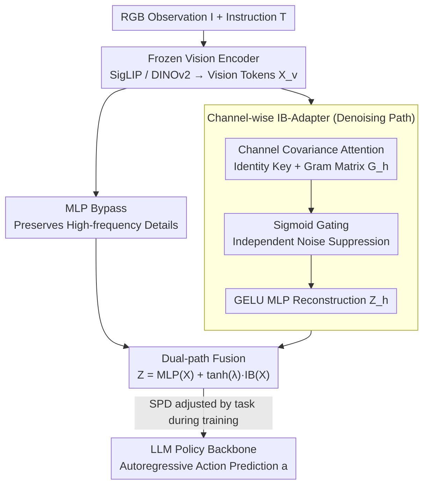

# StableVLA: Towards Robust Vision-Language-Action Models without Extra Data

**Conference**: ICML 2026  
**arXiv**: [2605.18287](https://arxiv.org/abs/2605.18287)  
**Code**: https://github.com/DAGroup-PKU/HumanNet/tree/main/src/model/StableVLA (Available)  
**Area**: Robotics / VLA / Robustness / Information Bottleneck  
**Keywords**: VLA, Visual Robustness, Information Bottleneck, Channel Attention, Zero Data Augmentation

## TL;DR
Addressing the collapse of VLA models under visual perturbations, the authors identify the MLP projector between the vision encoder and the LLM as the primary source of vulnerability. By replacing it with a "Channel-wise Information Bottleneck Adapter (IB-Adapter)" with fewer than 10M parameters, the 0.5B StableVLA achieves an average performance gain of approximately 35% under severe LIBERO perturbations without any additional training data or augmentation strategies. It also exhibits higher stability than the 14× larger OpenPi in real-world pick-and-place tasks.

## Background & Motivation
**Background**: Current mainstream VLAs (OpenVLA, OpenVLA-OFT, π0.5, VLA-Adapter, etc.) consistently follow the paradigm of "frozen vision encoder (SigLIP / DINOv2) + MLP projector + LLM policy backbone." State-of-the-art (SOTA) success rates on benchmarks like LIBERO and CALVIN generally exceed 95%.

**Limitations of Prior Work**: Benchmarks are typically conducted in clean, controlled virtual environments. In real-world applications, robots encounter sensor noise, motion blur, fog/snow, and lens contamination that cannot be fully enumerated. The authors found that after injecting ImageNet-C style synthetic perturbations into LIBERO, the success rate of VLA-Adapter plummeted from 96% to below 50%, reaching zero under heavy blur. This vulnerability is a systemic issue across the VLA paradigm, appearing in OpenVLA, OpenVLA-OFT, and OpenPi-0.5.

**Key Challenge**: The mainstream solution is "data-centric"—stacking perturbed samples or using large-scale data augmentation during training. This approach has two fundamental flaws: first, the combinatorial space of real-world perturbations is infinite, making simulation costs prohibitive; second, models tend to memorize specific noise patterns rather than learning invariance, leading to poor generalization to unseen perturbations. Thus, **intrinsic architectural robustness** is required.

**Goal**: Pinpoint the specific module in VLA that amplifies noise and replace it with a minimal-cost architectural modification that requires no extra data, no extra augmentation, and negligible parameter overhead.

**Key Insight**: By probing feature consistency layer-by-layer, the authors observed that while the vision encoder’s output is relatively robust, extreme degradation occurs at the simple MLP projector—which acts as an "all-pass filter," funneling noise directly into the LLM. Combining this with theoretical observations that self-attention is equivalent to iterative Information Bottleneck (IB) optimization under Gaussian assumptions (natural token clustering), the authors noted that while ViTs perform this in the spatial dimension, VLA projectors lack any such filtering mechanism.

**Core Idea**: Remodel VLA modality alignment as an IB problem. Implement covariance attention + Sigmoid gating in the **channel dimension** (rather than the typical spatial token dimension) to suppress noisy channels. Use an MLP bypass to preserve high-frequency details, resulting in the plug-and-play **Fused IB-Adapter**.

## Method

### Overall Architecture
StableVLA follows the structure of VLA-Adapter (frozen SigLIP/DINOv2 + adapter + 0.5B LLM policy + action head), with the sole modification being the replacement of the MLP projector with the Fused IB-Adapter. Given an RGB observation $\mathbf{I}$ and instruction $\mathbf{T}$, the vision encoder produces $\mathbf{X}_v \in \mathbb{R}^{N \times D_v}$. The Fused IB-Adapter maps this to $\mathbf{Z} \in \mathbb{R}^{N \times D}$ for the LLM, which autoregressively predicts actions $\mathbf{a} = \pi(\text{Concat}(\mathbf{Z}, \mathbf{X}_T))$. The training strategy is identical to VLA-Adapter, training only on clean LIBERO/CALVIN data without perturbation samples; thus, all perturbation evaluations are true zero-shot tests.

The formal objective is the standard IB: $\min_{\phi(\mathbf{Z}\mid\mathbf{X}_v)} \mathcal{L}_{IB} = I(\mathbf{X}_v;\mathbf{Z}) - \beta I(\mathbf{Z};\mathbf{S})$, where $\mathbf{S}$ is task-related "clean semantic codes" and $\beta$ controls the compression-fidelity trade-off. The authors prove that under Gaussian + independent Bernoulli latent variable assumptions, the optimal update for $\mathbf{Z}$ can be written as channel-wise attention: $\mathbf{Z} = \mathbf{V} \cdot \sigma(\beta \mathbf{Q}^\top \mathbf{K})$, where $\sigma$ is the Sigmoid function.

### Key Designs

**1. Channel-wise Covariance Attention: Identifying semantic subspaces in the channel dimension.**
To address the "all-pass" nature of the MLP, the IB-Adapter performs covariance selection in the channel dimension. The input $\mathbf{X}' \in \mathbb{R}^{N \times D}$ is split into $H$ heads $\mathbf{X}'_h \in \mathbb{R}^{N \times d}$. In each head, the query $\mathbf{Q}_h = \mathbf{X}'_h \mathbf{W}_q$ undergoes a learnable transformation, while the key $\mathbf{K}_h = \mathbf{X}'_h$ uses an **identity mapping**. This counter-intuitive design anchors the covariance to the original geometric manifold of the vision tokens, preventing redundant projections from erasing high-frequency spatial cues. The Gram matrix $\mathbf{G}_h = \mathbf{Q}_h^\top \mathbf{K}_h \in \mathbb{R}^{d \times d}$ is computed across the sequence dimension, representing the covariance of channels $i,j$ across all spatial tokens.

**2. Independent Channel Selection with Sigmoid Gating:**
The Gram matrix is converted into gating weights $\mathbf{A}_h = \sigma(\mathbf{G}_h \cdot \boldsymbol{\tau}_h)$ (with learnable temperature $\boldsymbol{\tau}_h$), and features are reconstructed as $\mathbf{Z}_h = \mathbf{V}_h \mathbf{A}_h$ (where $\mathbf{V}_h$ is generated by a two-layer GELU MLP). Channels with low covariance relative to semantic features (noise) result in gate values near 0 and are independently suppressed. Softmax is avoided because it forces competition; Sigmoid corresponds to the "independent Bernoulli latent structure" in the IB derivation, allowing multiple semantic channels to coexist while noise is isolated.

**3. Fused IB-Adapter Architecture:**
A pure IB-Adapter may attenuate high-frequency details, reducing trajectory precision in fine-grained tasks. StableVLA parallels the two paths: $\mathbf{Z} = \text{MLP}(\mathbf{X}) + \tanh(\lambda) \cdot \text{IB-Adapter}(\mathbf{X})$. The MLP bypass maintains high fidelity for precise manipulation, while the IB-Adapter provides robust semantics. During training, a Stochastic Pathway Dropout (SPD) is used: $p_{\text{drop}} \approx 0$ for spatial precision tasks (LIBERO-Long) and $p_{\text{drop}} \approx 0.3$ for long-horizon semantic planning (CALVIN), forcing the policy to internalize robust features.

### Loss & Training
The model inherits the training recipe of VLA-Adapter: training from scratch using only standard light geometric (cropping) and color jittering augmentations to prevent overfitting. No evaluation-time perturbations are seen during training, ensuring that robustness gains are strictly attributable to the architecture.

## Key Experimental Results

### Main Results
Evaluated on LIBERO (Spatial/Object/Goal/Long) and CALVIN using clean data plus three levels (3/4/5) of 18-19 ImageNet-C perturbations. Success rates (%) for Severity 5 (S5) are shown below:

| Model | Params | LIB-Spatial S5 | LIB-Object S5 | LIB-Goal S5 | LIB-Long S5 | CALVIN S5 |
|------|--------|---------------|---------------|-------------|-------------|-----------|
| OpenVLA | 7B | 14.7 | 2.7 | 16.3 | 7.0 | – |
| OpenVLA-OFT | 7B | 72.1 | 52.8 | 70.3 | 40.3 | – |
| OpenPi-0.5 | 3B | 62.4 | 76.4 | 64.2 | 47.7 | – |
| VLA-Adapter | 0.5B | 58.5 | 29.3 | 47.3 | 26.2 | 1.44 |
| **StableVLA** | **0.5B** | **82.0** | **70.2** | **71.9** | **45.3** | **1.51** |

By replacing only the adapter module (<10M parameters), StableVLA improves success rates by 40.2%–139.6% over VLA-Adapter at S5, outperforming the much larger OpenVLA-OFT (7B) and OpenPi-0.5 (3B) in several categories without extra data.

### Ablation Study
Success rate drop ($\Delta$) under real-world perturbations relative to clean performance (smaller negative values indicate higher robustness):

| Task | Method | Clean | Noise $\Delta$ | Blur $\Delta$ | Oil $\Delta$ | Shelter $\Delta$ |
|------|------|-------|---------|--------|-------|-----------|
| Pick&Place | π0.5 (3B) | 100 | -63.3 | -16.7 | -10.0 | -30.0 |
| Pick&Place | VLA-Adapter | 80 | -66.7 | -40.0 | -30.0 | -60.0 |
| Pick&Place | **StableVLA (0.5B)** | 80 | **-30.0** | **-10.0** | **-10.0** | **-20.0** |

### Key Findings
- **Source of Vulnerability**: Empirical evidence confirms the vision encoder is stable; the MLP projector is the point of catastrophic degradation.
- **Channel vs. Spatial**: The channel dimension is the critical IB bottleneck for VLA projectors, distinguishing it from ViT’s spatial-dimension self-attention.
- **Sigmoid > Softmax**: Sigmoid allows multiple semantic channels to persist, whereas Softmax-induced competition degrades performance.
- **Stochastic Pathway Dropout**: Effectiveness is task-dependent; spatial tasks require low dropout to preserve the IB-Adapter as a residual stabilizer.

## Highlights & Insights
- **Unified Theoretical Framework**: The transition from vulnerability diagnosis (MLP all-pass filter) to the IB explanation and channel attention instantiation forms a single, cohesive logical chain.
- **Zero-Data Constraint**: Unlike most robustness research that relies on data augmentation, this work demonstrates that architectural modifications alone can achieve significant robustness, providing a "clean" ablation.
- **Explainability**: K-Means visualization demonstrates that IB-Adapter outputs maintain compact clustering on object centers even under noise, proving the gating mechanism effectively suppresses irrelevant channels.

## Limitations & Future Work
- **Theoretical Assumptions**: The derivation relies on Gaussian and independent Bernoulli assumptions; real vision token distributions are more complex.
- **Perturbation Coverage**: Coverage is limited to ImageNet-C and specific real-robot conditions (oil, shelter); it does not account for dynamic camera shakes or adversarial attacks.
- **Static MLP Path**: The MLP bypass remains an all-pass filter; future designs could further minimize noise leakage through this path.
- **SPD Tuning**: The dropout rate $p_{\text{drop}}$ requires manual per-task tuning. A lightweight gating network could potentially learn to adapt $p_{\text{drop}}$ based on task context.

## Related Work & Insights
- **vs. VLA-Adapter**: StableVLA serves as a direct upgrade, replacing the MLP with Fused IB-Adapter using the same training recipe but gaining >30% robustness.
- **vs. OpenVLA (7B)**: While OpenVLA relies on massive pre-training for robustness, StableVLA achieves comparable stability at 0.5B scale through architectural correction.
- **vs. OpenPi-0.5 (3B)**: OpenPi follows a data-centric route; StableVLA proves that architectural inductive biases can be as effective as large-scale data for handling perturbations.
- **vs. XCiT/FAN**: While these works use channel-wise covariance in vision backbones, StableVLA successfully transfers this concept to the cross-modal projector in VLM-LLM architectures.

## Rating
- Novelty: ⭐⭐⭐⭐
- Experimental Thoroughness: ⭐⭐⭐⭐
- Writing Quality: ⭐⭐⭐⭐
- Value: ⭐⭐⭐⭐⭐

<!-- RELATED:START -->

## Related Papers

- [\[ICML 2026\] LangForce: Bayesian Decomposition of Vision-Language-Action Models via Latent Action Queries](langforce_bayesian_decomposition_of_vision_language_action_models_via_latent_act.md)
- [\[ICML 2026\] Seeing Realism from Simulation: Efficient Video Transfer for Vision-Language-Action Data Augmentation](seeing_realism_from_simulation_efficient_video_transfer_for_vision-language-acti.md)
- [\[ICML 2026\] Neural Implicit Action Fields: From Discrete Waypoints to Continuous Functions for Vision-Language-Action Models](neural_implicit_action_fields_from_discrete_waypoints_to_continuous_functions_fo.md)
- [\[ICML 2026\] Latent Reasoning VLA: Latent Thinking and Prediction for Vision-Language-Action Models](latent_reasoning_vla_latent_thinking_and_prediction_for_vision-language-action_m.md)
- [\[ICML 2026\] Contrastive Representation Regularization for Vision-Language-Action Models](contrastive_representation_regularization_for_vision-language-action_models.md)

<!-- RELATED:END -->
