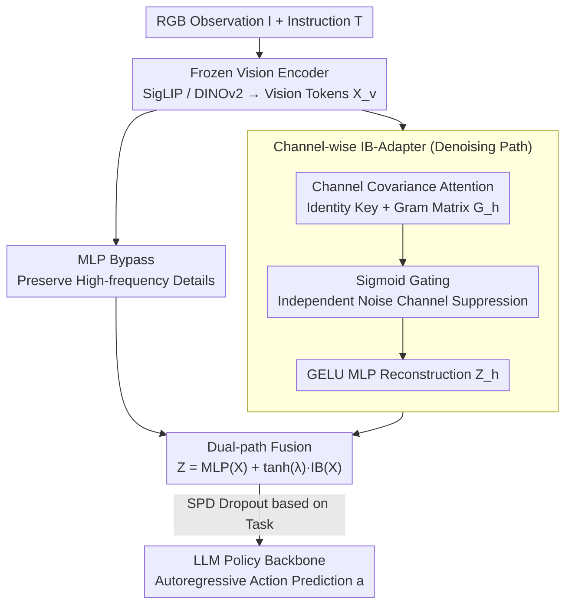

# StableVLA: Towards Robust Vision-Language-Action Models without Extra Data

**Conference**: ICML 2026  
**arXiv**: [2605.18287](https://arxiv.org/abs/2605.18287)  
**Code**: https://github.com/DAGroup-PKU/HumanNet/tree/main/src/model/StableVLA (Available)  
**Area**: Robotics / VLA / Robustness / Information Bottleneck  
**Keywords**: VLA, Visual Robustness, Information Bottleneck, Channel Attention, Zero-data Augmentation

## TL;DR
Addressing the issue of VLA models collapsing under visual perturbations, the authors identify the vulnerable root cause as the MLP projector between the vision encoder and the LLM. By replacing it with a "Channel-wise Information Bottleneck Adapter (IB-Adapter)" with fewer than 10M parameters, the 0.5B StableVLA achieves an average improvement of approximately 35% under severe LIBERO perturbations without any additional training data or augmentation strategies. It also demonstrates superior stability compared to the 14× larger OpenPi in real-world pick-and-place tasks.

## Background & Motivation
**Background**: Current mainstream VLA models (OpenVLA, OpenVLA-OFT, π0.5, VLA-Adapter, etc.) almost uniformly adopt the paradigm of "Frozen Vision Encoder (SigLIP / DINOv2) + MLP Projector + LLM Policy Backbone." Success rates on benchmarks like LIBERO and CALVIN typically exceed 95% under SOTA performance.

**Limitations of Prior Work**: Benchmarks are evaluated in clean, controlled virtual environments. Real-world robotics faces inexhaustible perturbations such as sensor noise, motion blur, fog/snow, and lens smudges. Upon injecting ImageNet-C style synthetic perturbations into LIBERO, the authors found that the VLA-Adapter's success rate dropped from 96% to below 50%, falling to zero under heavy blur. This vulnerability persists across OpenVLA, OpenVLA-OFT, and OpenPi-0.5, indicating a systemic issue in the VLA paradigm rather than a failure of specific models.

**Key Challenge**: The dominant solution is "data-centric"—stacking perturbed samples or using large-scale data augmentation. However, this approach has two fundamental flaws: first, the combinatorial space of real-world perturbations is infinite, making simulation costs prohibitive; second, models tend to memorize specific noise patterns rather than learning invariance, leading to poor generalization to unseen perturbations. Consequently, **intrinsic architectural robustness** is required.

**Goal**: Pinpoint the specific module in VLA that amplifies noise → Replace it with a minimal-cost architectural modification → Simultaneously achieve "no extra data, no extra augmentation, and negligible parameter overhead."

**Key Insight**: By probing feature consistency layer-by-layer, the authors observed that while the vision encoder's output is relatively robust, severe degradation occurs at the simple MLP projector. It acts as an "all-pass filter," pumping noise directly into the LLM. Combining this with theoretical observations that self-attention is equivalent to iterative Information Bottleneck (IB) optimization under Gaussian assumptions—naturally clustering tokens by semantics—the authors noted that while ViT performs this in the spatial dimension, the VLA projector lacks any such filtering mechanism.

**Core Idea**: Reformulate the VLA modality alignment as an IB problem. Use covariance attention and Sigmoid gating in the **channel dimension** (rather than the common spatial token dimension) to suppress noise channels. Combine this with an MLP bypass to preserve high-frequency details, resulting in the plug-and-play "Fused IB-Adapter" module.

## Method

### Overall Architecture
StableVLA maintains the "Frozen SigLIP/DINOv2 + Adapter + 0.5B LLM Policy + Action Head" paradigm of VLA-Adapter. The sole modification is replacing the original MLP projector with the Fused IB-Adapter. Inputs consist of RGB observations $\mathbf{I}$ and instructions $\mathbf{T}$. The vision encoder produces $\mathbf{X}_v \in \mathbb{R}^{N \times D_v}$, which the Fused IB-Adapter maps to $\mathbf{Z} \in \mathbb{R}^{N \times D}$ for the LLM. The LLM then autoregressively predicts actions $\mathbf{a} = \pi(\text{Concat}(\mathbf{Z}, \mathbf{X}_T))$. The training strategy is identical to VLA-Adapter, training only on original LIBERO/CALVIN data without introducing perturbations; thus, all perturbation evaluations are truly zero-shot.

The formalized objective is the standard IB: $\min_{\phi(\mathbf{Z}\mid\mathbf{X}_v)} \mathcal{L}_{IB} = I(\mathbf{X}_v;\mathbf{Z}) - \beta I(\mathbf{Z};\mathbf{S})$, where $\mathbf{S}$ is the task-relevant "clean semantic code" and $\beta$ controls the compression-fidelity tradeoff. The authors prove that under Gaussian and independent Bernoulli latent variable assumptions, the optimal iterative update for $\mathbf{Z}$ can be written as channel-wise attention: $\mathbf{Z} = \mathbf{V} \cdot \sigma(\beta \mathbf{Q}^\top \mathbf{K})$, where $\sigma$ is the Sigmoid function. This bridges "IB optimization" to a "learnable module."

### Key Designs

**1. Channel-wise Covariance Attention (IB-Adapter Core): Identifying Semantic Subspaces in the Channel Dimension**

The diagnosis identifies the MLP projector as an "all-pass filter." The IB-Adapter replaces it with channel-wise covariance selection. The input $\mathbf{X}' \in \mathbb{R}^{N \times D}$ is split into $H$ heads $\mathbf{X}'_h \in \mathbb{R}^{N \times d}$. In each head, queries $\mathbf{Q}_h = \mathbf{X}'_h \mathbf{W}_q$ undergo a learnable linear transformation, but the keys $\mathbf{K}_h = \mathbf{X}'_h$ **use an identity map**. This critical design anchors the covariance to the original geometric manifold of vision tokens, preventing redundant projections from erasing high-frequency spatial cues. The Gram matrix $\mathbf{G}_h = \mathbf{Q}_h^\top \mathbf{K}_h \in \mathbb{R}^{d \times d}$ is then computed along the sequence dimension, where each element represents the covariance of channels $i,j$ across all spatial tokens.

Why the channel dimension instead of spatial dimension as in ViT? Semantics and noise in VLM outputs are heterogeneously distributed across channels. Treating each channel as an IB information unit for selection is more effective for the specific role of a "projector" than spatial-wise IB.

**2. Channel-independent Selection via Sigmoid Gating: Independent Bernoulli vs. Softmax Competition**

The Gram matrix is converted into gating weights $\mathbf{A}_h = \sigma(\mathbf{G}_h \cdot \boldsymbol{\tau}_h)$ with a learnable temperature $\boldsymbol{\tau}_h$, after which features are reconstructed as $\mathbf{Z}_h = \mathbf{V}_h \mathbf{A}_h$ (where $\mathbf{V}_h$ is generated by a two-layer GELU MLP). Channels with low covariance relative to semantic channels result in gate values approaching 0, leading to independent suppression.

Sigmoid is used instead of Softmax. Softmax forces competition between channels, which might eliminate co-existing semantic channels. Sigmoid aligns with the "independent Bernoulli latent structure" assumption in the IB derivation, allowing multiple channels to remain active while noise channels are closed independently.

**3. Fused Architecture: MLP for Details & IB for Robust Semantics**

A pure IB-Adapter may attenuate high-frequency details, causing trajectory precision loss in fine-grained tasks. StableVLA parallels both paths: $\mathbf{Z} = \text{MLP}(\mathbf{X}) + \tanh(\lambda) \cdot \text{IB-Adapter}(\mathbf{X})$. The MLP bypass serves as a high-fidelity path for precise manipulation, while the IB-Adapter provides robust semantics through covariance filtering. $\lambda$ is a learnable parameter controlling the injection strength of robust signals.

During training, a Stochastic Pathway Dropout (SPD) is applied. Its intensity is tuned per task: for spatial-precision tasks (LIBERO-Long), $p_{\text{drop}} \approx 0$ to use IB-Adapter as a residual stabilizer; for long-horizon semantic planning (CALVIN, LIBERO-Object), $p_{\text{drop}} \approx 0.3$ is used to force the policy to internalize robust features.

### Loss & Training
The model inherits the training recipe from VLA-Adapter: training from scratch with only standard geometric (cropping) and color jittering augmentations to prevent overfitting. It **never encounters the perturbation types** used during evaluation, nor does it use specialized robust training techniques. This isolates the robustness gains as being derived solely from the architecture.

## Key Experimental Results

### Main Results
Evaluation was conducted on four LIBERO task suites (Spatial / Object / Goal / Long) and CALVIN using clean data and three severity levels (3/4/5) across 18-19 ImageNet-C perturbation types. The table below shows success rates (%) for severity 5 (CALVIN reports tasks completed 0-5):

| Model | Params | LIB-Spatial S5 | LIB-Object S5 | LIB-Goal S5 | LIB-Long S5 | CALVIN S5 |
|------|--------|---------------|---------------|-------------|-------------|-----------|
| OpenVLA | 7B | 14.7 | 2.7 | 16.3 | 7.0 | – |
| OpenVLA-OFT | 7B | 72.1 | 52.8 | 70.3 | 40.3 | – |
| OpenPi-0.5 | 3B | 62.4 | 76.4 | 64.2 | 47.7 | – |
| VLA-Adapter | 0.5B | 58.5 | 29.3 | 47.3 | 26.2 | 1.44 |
| **StableVLA** | **0.5B** | **82.0** | **70.2** | **71.9** | **45.3** | **1.51** |

By replacing the adapter module (<10M params), StableVLA improves success rates by 40.2% – 139.6% over VLA-Adapter at severity-5. Despite its 0.5B size, it matches or exceeds the 7B OpenVLA-OFT and 3B OpenPi-0.5 without extra data.

### Ablation Study

| Config | LIB-Spatial Clean | LIB-Spatial Avg(Perturbed) | Description |
|------|-------------------|----------------------|------|
| IB-Adapter only | 96.3 | 76.0 | Single IB path, slight clean drop |
| **Fused IB-Adapter** | **96.6** | **79.1** | Dual-path fusion, wins on both |

Real-world robustness (Success rate $\Delta$ relative to clean, smaller negative values denote higher robustness):

| Task | Method | Clean | Noise $\Delta$ | Blur $\Delta$ | Oil $\Delta$ | Shelter $\Delta$ |
|------|------|-------|---------|--------|-------|-----------|
| Pick&Place | π0.5 (3B) | 100 | -63.3 | -16.7 | -10.0 | -30.0 |
| Pick&Place | VLA-Adapter | 80 | -66.7 | -40.0 | -30.0 | -60.0 |
| Pick&Place | **StableVLA (0.5B)** | 80 | **-30.0** | **-10.0** | **-10.0** | **-20.0** |

### Key Findings
- **Vulnerability Root Confirmed**: Layer-wise feature consistency proves that the vision encoder remains stable under noise, while the MLP projector degrades severely.
- **Channel Dimension** is the critical IB dimension for VLA projectors, distinguishing it from ViT's spatial-wise attention.
- **Sigmoid > Softmax**: Sigmoid gating allows concurrent multi-channel activation, avoiding the destructive competition of Softmax.
- **Identity Key Design** preserves high-frequency spatial geometry.
- **Task-Dependent SPD**: Precise manipulation requires $p \approx 0$, while semantic planning benefits from $p \approx 0.3$.

## Highlights & Insights
- **Unified Theoretical Language**: The paper links vulnerability → MLP all-pass filter → IB interpretation → Channel attention instantiation in a single logical chain.
- **Zero-Extra-Data Constraint**: Unlike most robustness work relying on data augmentation, this study bets entirely on architecture, creating a clean experimental comparison.
- **Interpretability**: K-Means visualization shows that IB-Adapter outputs maintain compact clustering on objects under noise, proving that covariance gating successfully suppresses irrelevant channels.
- **Transferable Insight**: Any VLM projection module (VLM, Audio-LM, Multi-modal Agent) facing input noise can potentially benefit from the Fused IB-Adapter, especially under compute or data constraints.

## Limitations & Future Work
- **Theoretical Assumptions**: The derivation relies on Gaussian and independent Bernoulli assumptions; real vision token distributions are more complex.
- **Evaluation Coverage**: Does not cover dynamic camera shake or adversarial perturbations. Absolute performance on CALVIN for a 0.5B model remains relatively low.
- **Noise Leakage**: In the fused architecture, the MLP bypass is still an all-pass filter; some noise likely still passes through.
- **Manual Hyperparameters**: $p_{\text{drop}}$ requires manual tuning. Future work could involve a lightweight gating network to adaptively set $p$ based on task type.

## Related Work & Insights
- **vs VLA-Adapter**: Direct baseline. Replacing only the MLP projector yields a 30%+ robustness gain with negligible parameters.
- **vs OpenVLA/OpenVLA-OFT (7B)**: These rely on massive OpenX pre-training for robustness; StableVLA achieves competitive results at 0.5B through architectural correction.
- **vs OpenPi-0.5 (3B)**: A data-centric representative using massive demonstrations. StableVLA proves that architectural robustness is an independent and effective dimension.
- **vs FAN / XCiT**: While these use channel-wise covariance attention within vision backbones, StableVLA successfully migrates this concept to the VLM-LLM projector location.

## Rating
- Novelty: ⭐⭐⭐⭐ (New application of channel-wise IB for VLA projectors)
- Experimental Thoroughness: ⭐⭐⭐⭐ (LIBERO, CALVIN, Real-world, 19 types of noise)
- Writing Quality: ⭐⭐⭐⭐ (Clear diagnostic-to-theoretical flow)
- Value: ⭐⭐⭐⭐⭐ (Proves projectors are the bottleneck; provides a zero-data solution)

<!-- RELATED:START -->

...

## Related Papers

- [\[ICML 2026\] LangForce: Bayesian Decomposition of Vision-Language-Action Models via Latent Action Queries](langforce_bayesian_decomposition_of_vision_language_action_models_via_latent_act.md)
- [\[ICML 2026\] Seeing Realism from Simulation: Efficient Video Transfer for Vision-Language-Action Data Augmentation](seeing_realism_from_simulation_efficient_video_transfer_for_vision-language-acti.md)
- [\[ICML 2026\] Neural Implicit Action Fields: From Discrete Waypoints to Continuous Functions for Vision-Language-Action Models](neural_implicit_action_fields_from_discrete_waypoints_to_continuous_functions_fo.md)
- [\[ICML 2026\] Latent Reasoning VLA: Latent Thinking and Prediction for Vision-Language-Action Models](latent_reasoning_vla_latent_thinking_and_prediction_for_vision-language-action_m.md)
- [\[ICML 2026\] Contrastive Representation Regularization for Vision-Language-Action Models](contrastive_representation_regularization_for_vision-language-action_models.md)

<!-- RELATED:END -->
