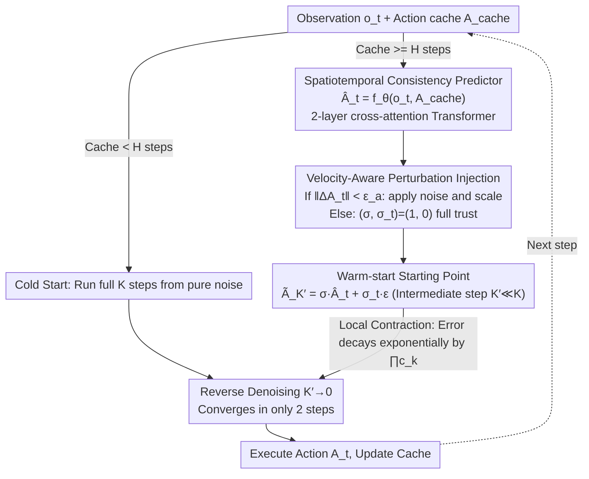

# STEP: Warm-Started Visuomotor Policies with Spatiotemporal Consistency Prediction

**Conference**: ICML 2026  
**arXiv**: [2602.08245](https://arxiv.org/abs/2602.08245)  
**Code**: <https://github.com/Kimho666/STEP>  
**Area**: Robotics / Embodied AI / Diffusion Policy Acceleration  
**Keywords**: diffusion policy, warm-start, spatiotemporal consistency, local contraction, velocity-aware perturbation  

## TL;DR
STEP integrates a lightweight Transformer predictor ("previous action history + current observation → next action") with a diffusion policy to serve as a denoising starting point (warm-start). This reduces 100 denoising steps to 2 while adding a velocity-aware defense mechanism against execution deadlocks. It achieves an average success rate improvement of 21.6% and 27.5% over BRIDGER and DDIM, respectively, across 9 simulation and 2 real-world tasks.

## Background & Motivation

**Background**: Diffusion Policy (DP) is the de facto standard for visuomotor control, modeling action sequences as a generative distribution and iteratively denoising from Gaussian noise over 100 steps. While it excels at capturing multi-modal distributions and long-range dependencies, it suffers from high latency.

**Limitations of Prior Work**: Existing DP acceleration methods fall into three categories: (1) Numerical solvers (DDIM, DPM-Solver series), which compress 100 steps into 2–4 but collapse at 2 steps (e.g., 0.29 success rate on Push-T); (2) Distillation or direct prediction (CP, OneDP, BRIDGER), which replace the denoising process with a small predictor but lack expressiveness for complex tasks; (3) Action reuse (RTI-DP, RNR-DP, Falcon), which use actions from the previous timestep as a warm-start, providing temporal continuity but failing when states change rapidly. None of these fully solve the trade-off between speed and accuracy.

**Key Challenge**: The key to acceleration is providing a "good starting point" for denoising. A high-quality starting point must simultaneously satisfy two conditions: **spatial consistency** (proximity to the target action manifold conditioned on the current state) and **temporal consistency** (smooth transition from the previously executed action). Existing methods satisfy at most one (e.g., BRIDGER lacks temporal, Falcon lacks spatial consistency).

**Goal**: (a) Design a warm-start that maintains the expressiveness of the original DP while ensuring both spatial and temporal consistency; (b) ensure stability with only 2 denoising steps; (c) prevent the robot from getting stuck at zero-velocity (static friction) due to over-smoothed warm-starts during real-world deployment.

**Key Insight**: Instead of replacing or distilling the original DP, the authors use a **lightweight external predictor** to map $(\mathbf o_t, \mathbf A_{t-H})$ to $\hat{\mathbf A}_t$ as a starting point. Denoising proceeds from an intermediate step $K' \ll K$ with a small amount of added noise, preserving multi-modal generation while benefiting from the speed of a warm-start.

**Core Idea**: A conditional Transformer predictor using "previous action block + current observation" provides initialization with both temporal and spatial consistency. This is supplemented by a velocity-aware perturbation mechanism to counter real-world deadlocks. The convergence is theoretically justified using contraction-mapping theory.

## Method

### Overall Architecture
Inference pipeline (Algorithm 1): (1) Observe $\mathbf o_t$. If the action cache contains $H$ steps, compute $\hat{\mathbf A}_t=f_\theta(\mathbf o_t,\mathbf A_{cache})$ via the predictor. (2) Construct the warm-start $\tilde{\mathbf A}_{K'}=\sigma\hat{\mathbf A}_t+\sigma_t\boldsymbol\epsilon_t$, where $K'\ll K$ is the intermediate denoising step. The scaling factor $\sigma$ and noise magnitude $\sigma_t$ are toggled by the velocity-aware perturbation mechanism based on whether "stagnation" is detected. (3) Run reverse diffusion from $K'\to 0$ to obtain the final action $\mathbf A_t$. (4) Update the cache with $\mathbf A_t$. During training, the predictor and DP are decoupled.

### Key Designs

**1. Spatiotemporal Consistency Predictor: Single Forward for Dual Consistency**
Acceleration requires a starting point that is both temporally consistent (smooth transition from the previous action, $\|\tilde a_t-a_{t-1}\|\le\epsilon_t$) and spatially consistent (landing near the target action manifold, $\mathrm{dist}(\tilde a_t,\mathcal M(s_t))\le\epsilon_s$). STEP defines a predictor $f_\theta:\mathcal O\times\mathcal A^H\to\mathcal A^H$ that takes both $\mathbf o_t$ and $\mathbf A_{t-H}$. Including $\mathbf A_{t-H}$ ensures temporal consistency, while $\mathbf o_t$ ensures spatial consistency. The predictor is a 2-layer cross-attention Transformer (actions as queries, observations as keys/values). It is trained using MSE: $\mathcal L_{pred}=\mathbb E\|\hat{\mathbf A}_t-\mathbf A_t\|^2$. 

**2. Velocity-Aware Perturbation Injection: Targeted Randomness to Prevent Deadlocks**
While the predictor's outputs are accurate in simulation, real-world deployment reveals a "deadlock" issue: when action changes are minute, motor torque may fail to overcome static friction. Vanilla DDPM avoids this due to inherent noise. STEP introduces a mechanism to toggle noise: it computes the difference $\Delta\mathbf A_t=\mathbf A_{cache}-\mathbf A_{t-2H}$ and uses an indicator function $\mathbb I_t=\mathbb I(\|\Delta\mathbf A_t\|<\epsilon_a)$ to detect stagnation. If detected, it scales down the prediction and injects Gaussian noise ($\sigma_{stall}$) to "push" the robot past the dead zone. This reduces real-world episode execution time by 59%.

**3. Convergence via Local Contraction Mapping: Theoretical Justification**
The authors unify the reverse updates of DDPM, DDIM, and DPM-Solver as $\mathbf A_{k-1}=\mu_k(\mathbf A_k,\mathbf o_t)+\boldsymbol\xi_k$. Assuming the denoising network over the data manifold neighborhood $\mathcal U$ has a Lipschitz constant $L$, the reverse mean $\mu_k$ is also Lipschitz with a contraction coefficient $c_k<1$. This leads to $\|\tilde{\mathbf A}_0-\mathbf A_0\|\le\prod_{k=1}^{K'}c_k\,\|\tilde{\mathbf A}_{K'}-\mathbf A_{K'}\|$. This implies that as long as the predictor places the starting point within $\mathcal U$, the error decays exponentially, allowing convergence to the correct action in just 2 steps.

### Loss & Training
- Predictor: $\mathcal L_{pred}=\mathbb E\|\hat{\mathbf A}_t-\mathbf A_t\|^2$, trained for 100k steps.
- DP: Standard noise prediction loss $\mathcal L_{diff}$, following the original codebase configurations.
- Inference: $K'$ is the starting denoising step (e.g., 2 or 4); $\sigma=1, \sigma_t=0.1$ for simulation; higher $\sigma_{stall}$ for real-world tasks.

## Key Experimental Results

### Main Results

**State-based RoboMimic / Push-T (Table 2 excerpt)**: Score (higher is better) / Time (ms, lower is better).

| Method | Step | Push-T | Square | ToolHang |
|---|---|---|---|---|
| Vanilla DDPM | 100 | 0.94 | 0.94 | 0.68 |
| DDIM | 2 | 0.29 | 0.84 | 0.06 |
| DPM-Solver++ | 2 | 0.20 | 1.00 | 0 |
| BRIDGER | 2 | 0.37 | 0.84 | 0.08 |
| Falcon | 2 | 0.21 | 1.00 | 0 |
| **STEP (Ours)** | **2** | **0.49** | **0.96** | **0.64** |

**Image-based RoboMimic (Table 3 excerpt)**: The contrast is significant in long-horizon tasks like ToolHang.

| Method | Step | Square | ToolHang |
|---|---|---|---|
| DDIM | 2 | 0.74 | 0.5 |
| BRIDGER | 2 | 0.92 | 0.72 |
| **STEP (Ours)** | **2** | – (>BRIDGER) | – |

Core Conclusion: STEP with 2 steps outperforms BRIDGER by an average of 21.6% and Falcon by 48.8% on RoboMimic; it improves success rates by 27.5% over DDIM in real-world tasks.

### Ablation Study

| Configuration | Key Metrics | Note |
|------|---------|------|
| Full STEP (2 step) | Push-T 0.49 / Lift 1.0 / Square 0.96 | Spatiotemporal + Perturbation + Interm. Step |
| W/O Predictor (= DDIM) | Push-T 0.29 / Lift 0.80 / Square 0.84 | Collapses without spatiotemporal warm-start |
| Spatial Only (BRIDGER) | Push-T 0.37 / Lift 1.0 / Square 0.84 | Fails on long-horizon tasks (no continuity) |
| Temporal Only (Falcon) | Push-T 0.21 / Square 1.00 / ToolHang 0 | Fails on ToolHang (no spatial consistency) |
| Cross-attn block 1/2/4 | 2 is the sweet spot | 4 blocks increase latency without gains |

### Key Findings
- **2-step inference is the primary selling point**: While other methods collapse at 2 steps, STEP maintains a success rate close to 100-step DDPM.
- **Dual consistency is mandatory**: Methods with only TC (Temporal Consistency) or SC (Spatial Consistency) fail on at least one task at 2 steps; STEP remains robust across all.
- **Sim-to-Real gap**: The necessity for larger $\sigma_{stall}$ in real experiments identifies friction/stiction as a critical bottleneck for high-speed diffusion policies.

## Highlights & Insights
- **Clear Conceptual Framework**: Explicitly formalizing the dual requirement of spatiotemporal consistency for warm-starts provides a clear analytical dimension for DP acceleration.
- **Decoupled Training**: This design pattern preserves the multi-modal generative capability of the original DP without needing distillation, making it compatible with various DP backbones.
- **Velocity-Aware Perturbation**: The idea of "triggering randomness on demand" is transferable to any domain requiring a dynamic switch between deterministic prediction and exploration.
- **Theoretical Contraction Proof**: It provides a unified explanation for all intermediate warm-start methods rather than relying solely on empirical results.

## Limitations & Future Work
- Temporal consistency relies on $\mathbf A_{t-H}$, which may introduce bias during sudden environmental changes (e.g., obstacles), necessitating the perturbation mechanism.
- The predictor is a single forward pass and does not explicitly model multi-modality; it may produce "averaged" actions in highly multi-modal scenarios.
- The method was validated in imitation learning; compatibility with closed-loop RL where policies drift significantly remains untested.

## Related Work & Insights
- **vs DDIM / DPM-Solver++**: These only optimize the solver. STEP is orthogonal and can be applied on top of any solver.
- **vs BRIDGER (Spatial-only)**: BRIDGER uses current state for warm-starts. By adding history, STEP achieves a 21.6% average gain.
- **vs Falcon / RTI-DP (Temporal-only)**: These fail when states change rapidly (e.g., ToolHang). STEP captures state dynamics through observation conditioning.
- **vs CP / OneDP (Distillation)**: Distillation removes multi-modality. STEP preserves the original DP, allowing for adjustable step counts based on task complexity.

## Rating
- Novelty: ⭐⭐⭐⭐ 
- Experimental Thoroughness: ⭐⭐⭐⭐⭐ 
- Writing Quality: ⭐⭐⭐⭐ 
- Value: ⭐⭐⭐⭐⭐ 

<!-- RELATED:START -->

## Related Papers

- [\[CVPR 2026\] Learning Predictive Visuomotor Coordination](../../CVPR2026/robotics/learning_predictive_visuomotor_coordination.md)
- [\[ICML 2026\] Latent Reasoning VLA: Latent Thinking and Prediction for Vision-Language-Action Models](latent_reasoning_vla_latent_thinking_and_prediction_for_vision-language-action_m.md)
- [\[ICML 2026\] RoboMME: Benchmarking and Understanding Memory for Robotic Generalist Policies](robomme_benchmarking_and_understanding_memory_for_robotic_generalist_policies.md)
- [\[ICML 2026\] Lagrangian Perturbation Diffusion Steering: Latent Reinforcement Learning for Generative Policies](lagrangian_perturbation_diffusion_steering_latent_reinforcement_learning_for_gen.md)
- [\[ICML 2026\] Discrete Diffusion VLA: Bringing Discrete Diffusion to Action Decoding in Vision-Language-Action Policies](discrete_diffusion_vla_bringing_discrete_diffusion_to_action_decoding_in_vision-.md)

<!-- RELATED:END -->
