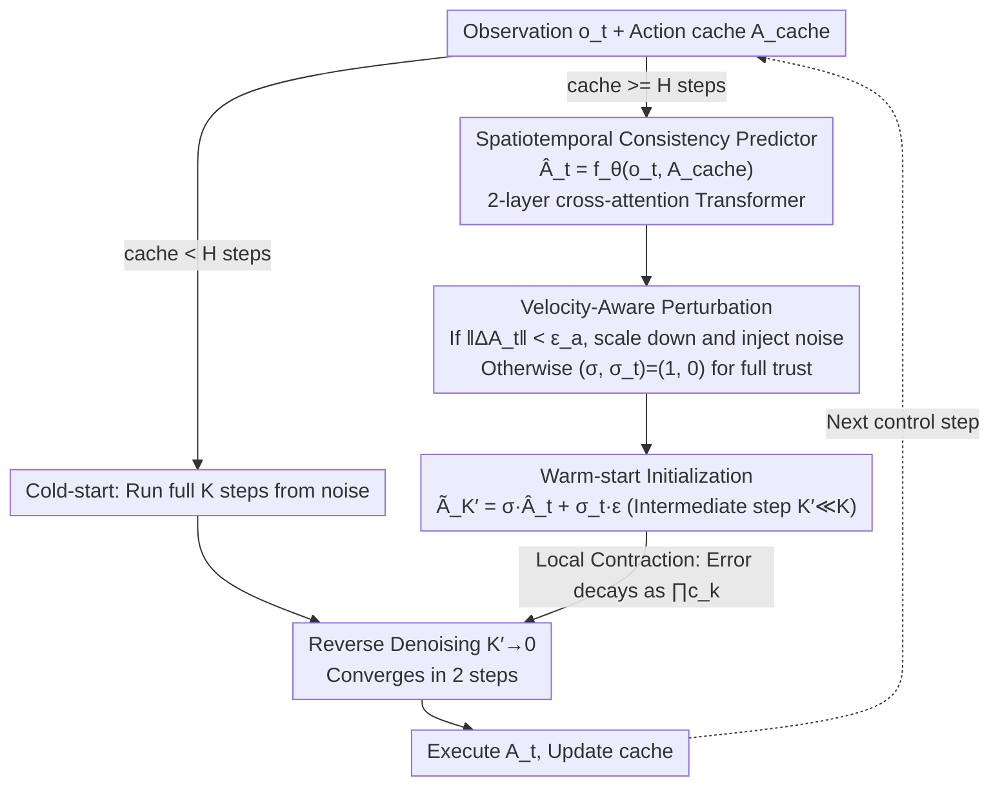

# STEP: Warm-Started Visuomotor Policies with Spatiotemporal Consistency Prediction

**Conference**: ICML 2026  
**arXiv**: [2602.08245](https://arxiv.org/abs/2602.08245)  
**Code**: <https://github.com/Kimho666/STEP>  
**Area**: Robotics / Embodied AI / Diffusion Policy Acceleration  
**Keywords**: diffusion policy, warm-start, spatiotemporal consistency, local contraction, velocity-aware perturbation  

## TL;DR
STEP attaches a lightweight Transformer predictor ("previous action history + current observation → next action") to the diffusion policy. Its output serves as a denoising starting point (warm-start), compressing 100 denoising steps to 2. It also includes a "velocity-aware" execution deadlock defense mechanism that injects noise when action changes are too small. It outperforms BRIDGER/DDIM by an average of 21.6% / 27.5% in success rate across 9 simulation and 2 real-robot tasks.

## Background & Motivation

**Background**: Diffusion Policy (DP) is the current de facto standard for visuomotor control. It models action sequences as a generative distribution and generates action chunks from Gaussian noise through 100 iterative denoising steps. While it captures multi-modality and long-range dependencies with high success rates, it suffers from high latency.

**Limitations of Prior Work**: Existing DP acceleration methods fall into three categories: (1) Numerical solvers (DDIM, DPM-Solver series) can compress 100 steps to 4-2 steps, but performance collapses at 2 steps (Push-T drops to 0.29); (2) Distillation / direct prediction (CP, OneDP, BRIDGER) replaces the denoising process with small predictors, but they lack expressiveness and fail in complex tasks; (3) Action reuse (RTI-DP, RNR-DP, Falcon) uses actions from the previous timestep as a warm-start, which maintains temporal continuity but fails when states change rapidly. All three categories only partially solve for "speed" or "accuracy."

**Key Challenge**: The key to acceleration is providing a "good starting point" for denoising. A good starting point must **simultaneously** satisfy two conditions: **Spatial Consistency** (closeness to the target action manifold conditioned on the current state) and **Temporal Consistency** (smooth transition from the previously executed action). Existing methods satisfy at most one (BRIDGER only spatial, Falcon only temporal), which is insufficient.

**Goal**: (a) Design a warm-start that preserves the original DP's expressiveness while maintaining both spatial and temporal consistency; (b) ensure stability even with only 2 denoising steps; (c) prevent the robot from getting stuck at zero-velocity due to an overly "smooth" warm-start during real-world deployment.

**Key Insight**: Instead of replacing or distilling the original DP, **plug in a light-weight predictor** that maps $(\mathbf o_t, \mathbf A_{t-H})$ to $\hat{\mathbf A}_t$ as a starting point. Then, run denoising starting from an intermediate step $K'<K$ with a small amount of noise. This leverages the speed of a warm-start while retaining the multi-modal generation of the DP.

**Core Idea**: Use a conditional Transformer predictor with "previous action chunk + current observation" to achieve both temporal (action history) and spatial (observation) consistency. Additionally, introduce a velocity-aware perturbation mechanism to counter real-world deadlocks. Finally, use contraction-mapping theory to prove the superior convergence of this initialization.

## Method

### Overall Architecture
Inference pipeline (Algorithm 1): (1) Observe $\mathbf o_t$. If the action cache has reached $H$ steps, compute $\hat{\mathbf A}_t=f_\theta(\mathbf o_t,\mathbf A_{cache})$ using the predictor; (2) Construct the warm-start $\tilde{\mathbf A}_{K'}=\sigma\hat{\mathbf A}_t+\sigma_t\boldsymbol\epsilon_t$, where $K'\ll K$ is the intermediate step. The scaling factor $\sigma$ and noise amplitude $\sigma_t$ are switched between two modes by the velocity-aware perturbation mechanism based on "stagnation" detection; (3) Run reverse diffusion from $K'\to 0$ to obtain the final action $\mathbf A_t$; (4) Update the cache with $\mathbf A_t$ for the next loop. During training, the predictor and DP are trained separately: the DP follows standard noise prediction (Eq. 5), and the predictor follows MSE. They are cascaded during inference.

### Key Designs

**1. Spatiotemporal Consistency Predictor: Achieving Dual Consistency in One Forward Pass**

The key to accelerating denoising is a high-quality starting point. STEP argues that a good start must satisfy both: Temporal Consistency (smooth transition: $\|\tilde a_t-a_{t-1}\|\le\epsilon_t$) and Spatial Consistency (alignment with the current target manifold: $\mathrm{dist}(\tilde a_t,\mathcal M(s_t))\le\epsilon_s$). It uses a simple approach: define a predictor $f_\theta:\mathcal O\times\mathcal A^H\to\mathcal A^H$ that takes the current observation $\mathbf o_t$ and the previous actions $\mathbf A_{t-H}$ to produce $\hat{\mathbf A}_t$. Including $\mathbf A_{t-H}$ ensures temporal consistency, while $\mathbf o_t$ ensures spatial consistency—no extra regularization terms are needed. The predictor is a 2-layer cross-attention Transformer (actions as query, observations as key/value, 128-dim embedding). The training objective is MSE $\mathcal L_{pred}=\mathbb E\|\hat{\mathbf A}_t-\mathbf A_t\|^2$, learning the conditional expectation $\mathbb E[\mathbf A_t\mid\mathbf o_t,\mathbf A_{t-H}]$. Cross-attention is used instead of self-attention to allow actions to "query" the heterogeneous observation sequence.

**2. Velocity-Aware Perturbation Injection: Applying Randomness Only Near Stalls**

While predicted actions are accurate in simulation, real-world deployment faces a "deadlock" issue: when consecutive actions change minimally, motor torque might not overcome static friction or control dead-zones, causing the robot to freeze. Interestingly, vanilla DDPM avoids this due to constant random noise. STEP implements this as an "on-demand" switch: it calculates the action difference $\Delta\mathbf A_t=\mathbf A_{cache}-\mathbf A_{t-2H}$ and detects stagnation using an indicator function $\mathbb I_t=\mathbb I(\|\Delta\mathbf A_t\|<\epsilon_a)$ (Eq. 14). Normally, $(\sigma,\sigma_t)=(1,0)$ (full trust). If a stall is detected, it switches to $(\sigma_{scale},\sigma_{stall})$, scaling the amplitude and injecting Gaussian noise to "push" the robot past the dead-zone ($\epsilon_a=0.01$, $\sigma_{stall}=0.1$ for sim; larger $\sigma_{stall}$ for real robots). This reduces real-world average episode execution time by 59%.

**3. Convergence Proof via Local Contraction Mapping: Explaining Stability with Few Steps**

The authors unify the reverse updates of DDPM, DDIM, and DPM-Solver as $\mathbf A_{k-1}=\mu_k(\mathbf A_k,\mathbf o_t)+\boldsymbol\xi_k$ (Eq. 15). Assuming the denoising network $\epsilon_\theta$ has a Lipschitz constant $L$ within a neighborhood $\mathcal U$ of the data manifold, the reverse mean $\mu_k$ is also Lipschitz with a contraction coefficient $c_k<1$ (Eq. 16). Recursively, this yields $\|\tilde{\mathbf A}_0-\mathbf A_0\|\le\prod_{k=1}^{K'}c_k\,\|\tilde{\mathbf A}_{K'}-\mathbf A_{K'}\|$ (Eq. 18). If the predictor pulls the starting point into neighborhood $\mathcal U$, the initial error decays exponentially. Thus, running only 2 steps from an intermediate $K'$ can converge to the correct action. This derivation is solver-agnostic and applies to both DDIM and DPM-Solver.

### Loss & Training
- Predictor: $\mathcal L_{pred}=\mathbb E\|\hat{\mathbf A}_t-\mathbf A_t\|^2$, 100k steps.
- DP: Uses default configurations of the original codebase.
- Inference Hyperparameters: $K'$ = starting denoising step (e.g., STEP = 2 / 4); $\sigma=1, \sigma_t=0.1$ for simulation; larger $\sigma_{stall}$ for real robots.

## Key Experimental Results

### Main Results

**State-based RoboMimic / Push-T (Partial Table 2)**: Score (higher is better) / Time (ms, lower is better).

| Method | Step | Push-T | Square | ToolHang |
|---|---|---|---|---|
| Vanilla DDPM | 100 | 0.94 | 0.94 | 0.68 |
| DDIM | 2 | 0.29 | 0.84 | 0.06 |
| DPM-Solver++ | 2 | 0.20 | 1.00 | 0 |
| BRIDGER | 2 | 0.37 | 0.84 | 0.08 |
| Falcon | 2 | 0.21 | 1.00 | 0 |
| **STEP (Ours)** | **2** | **0.49** | **0.96** | **0.64** |

**Image-based RoboMimic (Partial Table 3)**: The contrast is particularly evident in long-horizon tasks like ToolHang under visual input.

| Method | Step | Square | ToolHang |
|---|---|---|---|
| DDIM | 2 | 0.74 | 0.5 |
| BRIDGER | 2 | 0.92 | 0.72 |
| **STEP (Ours)** | **2** | – (>BRIDGER) | – |

Key conclusions: STEP with 2 steps outperforms BRIDGER by 21.6% and Falcon by 48.8% on average in RoboMimic. In real-robot experiments, it improves success rate by 27.5% over DDIM and reduces execution time by 59% via velocity-aware perturbations.

### Ablation Study

| Configuration | Key Metrics | Description |
|------|---------|------|
| Full STEP (2 step) | Push-T 0.49 / Lift 1.0 / Square 0.96 | Spatiotemporal + Perturbation + Intermediate start |
| W/O Predictor (= DDIM) | Push-T 0.29 / Lift 0.80 / Square 0.84 | Warm-start degrades to noise; performance collapses |
| Spatial Only (BRIDGER) | Push-T 0.37 / Lift 1.0 / Square 0.84 | No temporal continuity; fails on long-horizon tasks |
| Temporal Only (Falcon) | Push-T 0.21 / Square 1.00 / ToolHang 0 | No spatial consistency; ToolHang becomes 0 |
| Cross-attn block 1/2/4 | 2 is the sweet spot | 4 blocks increase latency without gain (Fig 3) |

### Key Findings
- **2-step inference is the core selling point**: Other methods collapse at 2 steps, while STEP maintains success rates close to 100-step DDPM, pushing the Pareto frontier (latency vs success).
- **Spatiotemporal consistency is essential**: Methods with only TC or only SC fail on at least one task at 2 steps; STEP remains robust across all.
- **Sim-to-Real gap**: Friction and dead-zones are significant bottlenecks; $\sigma_{stall}$ needs to be larger in real-world settings compared to simulation.
- **Lightweight Predictor**: Uses only 128-dim embeddings and 2 cross-attention blocks; extremely easy to embed.

## Highlights & Insights
- **Clear Perspective**: Formally proposes and defines why warm-starts must be "spatiotemporally consistent," providing a simple analytical dimension for DP acceleration.
- **Decoupled Training Engineering**: Preserves the original multi-modal capability of the DP while allowing lightweight acceleration—a practical design pattern compatible with various DP backbones.
- **Velocity-aware Perturbation**: This "on-demand randomness" can be transferred to any domain needing dynamic switching between deterministic prediction and exploration.
- **Contraction Proof**: Provides a unified theoretical explanation for "intermediate-step warm-starts" rather than just empirical observation.

## Limitations & Future Work
- Temporal consistency based on $\mathbf A_{t-H}$ may introduce bias during sudden state changes (e.g., obstacles), requiring the perturbation mechanism to compensate. Stagnation detection currently only looks at action magnitude, which is somewhat coarse.
- The predictor is a single forward pass and does not explicitly model multi-modality; it may "average out" equivalent modes.
- Validated only in imitation learning; compatibility with policy drift in closed-loop RL is untested.
- Real-world $\sigma_{stall}$ requires manual tuning; a learned critic could adaptively determine the need for perturbation.

## Related Work & Insights
- **vs DDIM / DPM-Solver++**: These only modify the solver without warm-starts; STEP is orthogonal and can be used on top of any solver.
- **vs BRIDGER (Spatial-only)**: BRIDGER uses a predictor but lacks temporal continuity; STEP's inclusion of $\mathbf A_{t-H}$ yields a 21.6% average gain.
- **vs Falcon / RTI-DP (Temporal-only)**: These assume smooth dynamics and fail on tasks with rapid state changes like ToolHang; STEP captures these via observation conditioning.
- **vs CP / OneDP (Distillation)**: Distillation destroys the DP's multi-modal nature; STEP retains the DP, allowing a fallback to more denoising steps for complex tasks.

## Rating
- Novelty: ⭐⭐⭐⭐ 
- Experimental Thoroughness: ⭐⭐⭐⭐⭐ 
- Writing Quality: ⭐⭐⭐⭐ 
- Value: ⭐⭐⭐⭐⭐ 

<!-- RELATED:START -->

## Related Papers

- [\[ICML 2026\] Latent Reasoning VLA: Latent Thinking and Prediction for Vision-Language-Action Models](latent_reasoning_vla_latent_thinking_and_prediction_for_vision-language-action_m.md)
- [\[ICML 2026\] RoboMME: Benchmarking and Understanding Memory for Robotic Generalist Policies](robomme_benchmarking_and_understanding_memory_for_robotic_generalist_policies.md)
- [\[CVPR 2026\] SwiftVLA: Unlocking Spatiotemporal Dynamics for Lightweight VLA Models at Minimal Overhead](../../CVPR2026/robotics/swiftvla_unlocking_spatiotemporal_dynamics_for_lightweight_vla_models_at_minimal.md)
- [\[ICML 2026\] Lagrangian Perturbation Diffusion Steering: Latent Reinforcement Learning for Generative Policies](lagrangian_perturbation_diffusion_steering_latent_reinforcement_learning_for_gen.md)
- [\[ICML 2026\] Discrete Diffusion VLA: Bringing Discrete Diffusion to Action Decoding in Vision-Language-Action Policies](discrete_diffusion_vla_bringing_discrete_diffusion_to_action_decoding_in_vision-.md)

<!-- RELATED:END -->
