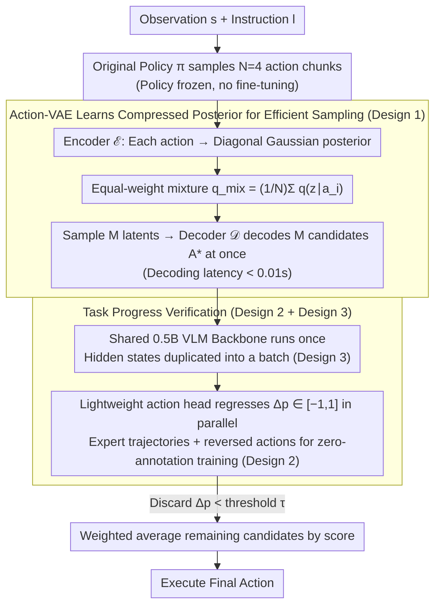

# TapSampling: Inference-Time Sampling with a Task-Progress-Understanding Verifier for Robotic Manipulation

**Conference**: ICML 2026  
**arXiv**: [2605.25547](https://arxiv.org/abs/2605.25547)  
**Code**: Project page (linked in the paper; repository address not provided in the main text)  
**Area**: Robotics  
**Keywords**: Inference-Time Sampling, Action-VAE, Task Progress Verifier, General Robotic Policy, Plug-and-Play  

## TL;DR
TapSampling proposes a policy-agnostic, plug-and-play inference-time sampling framework. It first learns a low-dimensional posterior from a small number of policy-generated actions using an Action-VAE to efficiently sample many candidate actions. Subsequently, a semantically interpretable verifier, which predicts "changes in task progress," is used to score and fuse candidates via weighted averaging. Without fine-tuning original policies, it consistently improves the success rates of various general robotic policies such as Diffusion Policy, OpenVLA, VPP, $\pi_0$, and $\pi_{0.5}$ on CALVIN/LIBERO and real-world robots.

## Background & Motivation

**Background**: Current mainstream general robotic policies are mostly based on VLM/Video Diffusion models, outputting actions via diffusion heads or next-token-prediction (e.g., OpenVLA, $\pi_0$, VPP, Diffusion Policy). While they achieve high performance by scaling data and models, they typically follow a **single-shot inference** paradigm—generating only one action per decision step.

**Limitations of Prior Work**: Both diffusion and autoregressive non-deterministic paradigms naturally exhibit variance. Under the same environment and instruction, policies can be inconsistent. Single-shot inference lacks a mechanism to correct these stochastic failures. While the LLM and diffusion image communities have verified that multiple sampling + verifier selection during inference can stably improve performance, principled solutions for robotics remain scarce.

**Key Challenge**: Implementing inference-time sampling for robotics is hindered by two issues:
(1) **Sampling**: Directly sampling from the policy repeatedly is too slow (order of magnitude increase in latency), while sampling from a Gaussian distribution (like RoboMonkey) ignores correlations across dimensions within an action chunk, causing candidates to deviate from the true action distribution.
(2) **Verification**: Low-level actions (joint angles/end-effector poses/gripper states) lack off-the-shelf VLM evaluators. Existing verifiers often use hand-crafted rewards, preference learning, or offline RL, resulting in scores that lack interpretability and are coupled with specific policy architectures, preventing plug-and-play use.

**Goal**: Construct a **policy-agnostic** inference-time sampling framework that simultaneously addresses "efficient, high-fidelity sampling" and "semantically interpretable, high-throughput verification."

**Key Insight**: The authors observe that when humans judge robot actions, they essentially estimate "how much this action sequence will advance the task progress"—a continuous value with **semantic meaning**. Expert trajectories implicitly contain a monotonically increasing progress curve, allowing for zero-cost generation of positive and negative samples to train a progress predictor. For sampling, rather than re-running the policy, a VAE is learned to compress the action distribution, encoding policy actions into a low-dimensional posterior for batch decoding.

**Core Idea**: Use the **posterior learned by an Action-VAE** for efficient high-fidelity sampling and **task progress change prediction** as a semantically interpretable verifier. The two combined form the plug-and-play TapSampling.

## Method

### Overall Architecture
The inputs are the current observation $s$ and instruction $l$. The pipeline consists of three steps:
1. **Minor Policy Sampling**: Call the original policy $\pi(a\mid s,l)$ to obtain $N$ (default $N=4$) initial action chunks $A_\pi=\{a_i\}_{i=1}^N$.
2. **Posterior Mixing + Decoding**: Pass each $a_i$ through the Action-VAE encoder $\mathcal{E}$ to get a Gaussian $q_\mathcal{E}(z\mid a_i)$. These are mixed into $q_\text{mix}(z\mid A_\pi)=\frac{1}{N}\sum_i q_\mathcal{E}(z\mid a_i)$. Sample $M$ latents from this mixture and decode them to get $M$ candidate actions $A^*=\{\mathcal{D}(z_i)\}_{i=1}^M$ (decoding uses a small transformer, latency $<0.01$s).
3. **Progress Verification + Weighted Fusion**: The verifier $\mathcal{V}(s,l,a)$ predicts a "task progress change" $\Delta p\in[-1,1]$ for each candidate. Candidates with $\Delta p$ below a threshold are discarded; the remaining are weighted-averaged by their scores to produce the final executable action.

### Key Designs

**1. Action-VAE for Compressed Posterior Sampling: Efficiently sampling candidates close to the policy's true distribution.**

Sampling for inference-time scaling faces a dilemma: repeated policy calls are slow ($8\times$ latency increase for $k=16$), while independent Gaussian sampling (RoboMonkey) breaks correlations between time steps and dimensions within action chunks. Action-VAE bridges this by using a low-dimensional posterior. Both the encoder and decoder are transformers: the encoder takes action chunk $a$ and outputs a diagonal Gaussian $q_\mathcal{E}(z\mid a)=\mathcal{N}(z;\mu_\mathcal{E}(a),\mathrm{diag}(\sigma_\mathcal{E}^2(a)))$. The decoder reconstructs actions from latents. The objective $\mathcal{L}_{avae}=\mathcal{L}_{rec}+\lambda_{KL}\mathcal{L}_{KL}$ pulls the posterior toward a standard normal prior.

At inference, the original policy is called $N=4$ times. Each action is encoded and mixed equally as $q_\text{mix}(z\mid A_\pi)=\frac{1}{N}\sum_i q_\mathcal{E}(z\mid a_i)$. $M$ latents are sampled and decoded simultaneously. This achieves both efficiency (4 policy calls + 1 light decoding yields $M$ candidates) and fidelity (Table 5 shows MMD is halved compared to Gaussian sampling, e.g., 0.064 vs 0.098 at $\gamma=2$).

**2. Progress Prediction Verifier Based on Expert Temporal Continuity: Training a semantic scorer with zero-annotation data.**

Since low-level actions lack VLM evaluators, and prior verifiers either lack semantic meaning or are architecture-dependent, this work assumes task progress grows linearly along expert trajectories: $p_i=i/t$. Positive/negative samples are generated from trajectories: positive samples are forward segments $(l,s_i,a_{i:i+k-1})\mapsto k/t$, and negative samples are **temporally reversed actions** $(l,s_i,a_{i:i-k+1}^r)\mapsto -k/t$. The verifier uses a VLA-Adapter (Qwen2.5-0.5B backbone + learnable queries), with an action head regressing $\Delta p$. The loss is $\mathcal{L}_{tap}=\lVert \mathcal{V}(s,l,a)-\Delta p\rVert_1$.

This design provides three benefits: zero manual annotation (standard imitation learning datasets suffice), continuous $[-1,1]$ semantic scores (negative = hindering, small positive = steady, large positive = fast progress), and total decoupling from the original policy.

**3. Shared Backbone Batch-Parallel Verification: Reducing verification latency for $M$ candidates.**

The 0.5B VLM verifier is non-trivial. Rerunning the backbone for each candidate would become a bottleneck (as seen in RoboMonkey's LLaVA-7B reward head). TapSampling exploits the shared $(s,l)$ context: the VLM backbone runs once to get hidden states, which are then duplicated into a batch and fed into a lightweight action head with $M$ candidate actions to regress $\Delta p$ in parallel. This keeps latency nearly constant as $M$ increases ($12\times$ faster than RoboMonkey for $k=16$), making it feasible for real-time control.

### Loss & Training
Two-stage independent training: (1) Action-VAE is trained on action data with $\mathcal{L}_{rec}+\lambda_{KL}\mathcal{L}_{KL}$. (2) The verifier is trained using L1 regression on $\Delta p$. The original policy is **fully frozen and requires no fine-tuning**. Threshold $\tau$ and candidate count $M$ are key inference hyperparameters.

## Key Experimental Results

### Main Results

CALVIN ABC→D (zero-shot long-horizon manipulation, metric is success rate for 1-5 consecutive tasks and Average Length):

| Policy | Avg.Len (Orig.) | Avg.Len (+TapSampling) | Success Rate Gain (Task 5) |
|------|---------------|--------------------------|-----|
| Diffusion Policy | 2.41 | 2.58 (+0.17) | +4.2 |
| OpenVLA | 3.30 | 3.51 (+0.21) | +6.4 |
| VPP (Strong Baseline) | 4.39 | 4.46 (+0.07) | +2.8 |

LIBERO-Long (Hardest subset): $\pi_{0.5}$ average success rate 96.8% → 98.0%. Real-world 7-DoF Franka (Knock Down/Pick & Place/Stack, Seen/Unseen): $\pi_0$ 78.3% → 83.3% (+10 gain on Unseen Stack).

### Ablation Study

Comparison of sampling strategies on CALVIN using VPP ($k=16$):

| Sampling Strategy | Avg.Len | Task 5 Success | Per-step Latency (s) |
|---------|---------|-----------|---------------|
| VPP Original | 4.39 | 78.3 | 0.136 |
| Gaussian Sampling | 4.43 (+0.04) | 79.9 (+1.6) | 0.465 |
| Learned Posterior (Ours) | 4.46 (+0.07) | 81.1 (+2.8) | 0.488 |
| Policy Sampling (Upper Bound) | 4.50 (+0.11) | 82.4 (+4.1) | 2.638 |

Distribution Fidelity (MMD, lower is better, multi-bandwidth RBF):

| Bandwidth $\gamma$ | 2 | 4 | 6 | 8 | 10 |
|------|------|------|------|------|------|
| Gaussian | 0.098 | 0.155 | 0.187 | 0.204 | 0.212 |
| Ours | 0.064 | 0.082 | 0.095 | 0.104 | 0.112 |

### Key Findings
- **Verifier is more critical than the sampler**: Even weak Gaussian sampling improves performance when paired with the proposed verifier. Replacing Policy Sampling with Learned Posterior preserves performance while reducing latency by $5\times$.
- **Verifier scores are semantic**: Choosing the action with the **lowest** verifier score significantly increases step counts or leads to failure, proving $\Delta p$ estimates real progress.
- **Greater gains for weaker base policies**: Diffusion Policy and OpenVLA showed larger gains ($\sim$+0.2 Avg.Len) compared to the already strong VPP (+0.07), suggesting the verifier primarily helps policies avoid stochastic failures.

## Highlights & Insights
- **Migration of Inference-Time Scaling to Robotics**: While "multi-sampling + verifier" is standard for LLMs, robotics was limited by poor verifiers and slow samplers. This work fills those gaps with VAE posteriors and progress-prediction verifiers.
- **"Reversed actions = Negative samples" for Zero-Cost Training**: Leveraging physical reversibility (joint angles/poses) to generate negative samples from expert trajectories avoids manual preference annotation or RL rollouts.
- **Shared Backbone + Batch Action Head**: An engineering highlight that allows for complex verifiers (0.5B VLM) while maintaining constant verification latency, which is applicable to other embodied score-and-select tasks.
- **Weighted Average Action Output**: Treating the verifier as a soft voting mechanism rather than a hard argmax selection is more stable for physical execution.

## Limitations & Future Work
- The linear progress assumption $p_i=i/t$ may fail for **long-horizon, multi-stage tasks** where progress might be non-linear.
- Candidate fusion via weighted averaging might create invalid actions in **multi-modal distributions** (e.g., averaging two distinct valid paths into an invalid middle zone).
- A 0.5B VLM verifier yields a $\sim$0.5s per-step latency on a Franka robot, which is still high for high-frequency control (>100Hz).
- Experimental scope was limited to tabletop manipulation; effectiveness in **mobile manipulation or bimanual coordination** remains unverified.
- Physical reversibility of reversed actions is not strictly true in tasks with **collisions, friction, or non-conservative constraints**.

## Related Work & Insights
- **vs RoboMonkey**: RoboMonkey uses Gaussian sampling + LLaVA-7B preference reward heads. Ours outperforms in fidelity (MMD) and is $12\times$ faster due to batch parallelism.
- **vs TACO**: TACO uses state-count optimization for verifiers and is tightly coupled with the policy; TapSampling is plug-and-play and achieves similar gains on LIBERO-Long with better generality.
- **vs Task Progress Estimation**: Prior works used progress functions as RL rewards based on state $s$; our verifier explicitly conditions on candidate actions $a$ to predict $\Delta p$, enabling direct inference-time scoring.

## Rating
- Novelty: ⭐⭐⭐⭐ Successfully ports inference-time scaling to robotics with specific innovations like reversed-action negative samples and batch scoring.
- Experimental Thoroughness: ⭐⭐⭐⭐ Covers various policies, simulation benchmarks, and real-world tasks, including latency and fidelity analysis.
- Writing Quality: ⭐⭐⭐⭐ Clear motivation and structure.
- Value: ⭐⭐⭐⭐ High practical value for VLA deployment; policy-agnostic gains without re-training are highly desirable for engineering.

<!-- RELATED:START -->

## Related Papers

- [\[ICLR 2026\] Verifier-Free Test-Time Sampling for Vision-Language-Action Models](../../ICLR2026/robotics/verifier-free_test-time_sampling_for_vision-language-action_models.md)
- [\[ICML 2026\] RoboMME: Benchmarking and Understanding Memory for Robotic Generalist Policies](robomme_benchmarking_and_understanding_memory_for_robotic_generalist_policies.md)
- [\[ICML 2026\] Decompose and Recompose: Reasoning New Skills from Existing Abilities for Cross-Task Robotic Manipulation](decompose_and_recompose_reasoning_new_skills_from_existing_abilities_for_cross-t.md)
- [\[ICML 2026\] Drift is a Sampling Error: SNR-Aware Power Distributions for Long-Horizon Robotic Planning](drift_is_a_sampling_error_snr-aware_power_distributions_for_long-horizon_robotic.md)
- [\[CVPR 2026\] Adaptive Action Chunking at Inference-time for Vision-Language-Action Models](../../CVPR2026/robotics/adaptive_action_chunking_at_inference-time_for_vision-language-action_models.md)

<!-- RELATED:END -->
