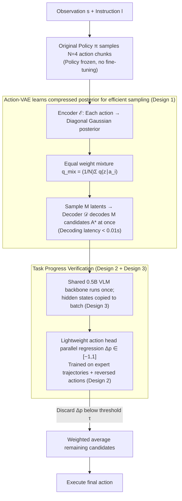

# TapSampling: Inference-Time Sampling with a Task-Progress-Understanding Verifier for Robotic Manipulation

**Conference**: ICML 2026  
**arXiv**: [2605.25547](https://arxiv.org/abs/2605.25547)  
**Code**: Project homepage (marked at the end of the paper, repository address not provided in the main text)  
**Area**: Robotics  
**Keywords**: Inference-time sampling, Action-VAE, Task progress verifier, Generalist robot policies, Plug-and-play  

## TL;DR
TapSampling proposes a policy-agnostic, plug-and-play inference-time sampling framework: it first uses Action-VAE to learn a low-dimensional posterior from a small set of actions generated by the policy, then efficiently samples a large number of candidate actions. A semantically interpretable verifier that "predicts task progress changes" scores the candidates for weighted fusion. Without fine-tuning the original policies, it consistently improves the success rates of various generalist robot policies such as Diffusion Policy, OpenVLA, VPP, $\pi_0$, and $\pi_{0.5}$ on CALVIN/LIBERO and real-world robots.

## Background & Motivation

**Background**: Current mainstream generalist robot policies are mostly based on VLM/video diffusion models, outputting actions through diffusion action heads or next-token prediction (e.g., OpenVLA, $\pi_0$, VPP, Diffusion Policy). While they achieve high performance by scaling data and model size, they all follow the **single-shot inference** paradigm—where one decision outputs only one action.

**Limitations of Prior Work**: Both diffusion and autoregressive non-deterministic paradigms naturally possess variance. Under the same environment and instruction, policies can be inconsistent; single-shot inference lacks any mechanism to correct these stochastic failures. While the LLM and diffusion image communities have verified that multi-sampling at inference time with verifier selection can consistently improve performance, there are almost no principled solutions on the robotics side.

**Key Challenge**: Implementing inference-time sampling on robots is hindered by two issues:
(1) **Sampling**: Repeatedly sampling directly from the policy is too slow (latency increases by orders of magnitude), while sampling from a Gaussian distribution (like RoboMonkey) ignores the correlations across dimensions within an action chunk, causing candidates to deviate from the true action distribution;
(2) **Verification**: Low-level actions (joint angles/end-effector poses/gripper states) lack off-the-shelf VLM evaluators. Existing verifiers often use manual rewards, preference learning, or offline RL training, resulting in scores that lack interpretability and are coupled with specific policy architectures, making them not plug-and-play.

**Goal**: Construct a **policy-agnostic** inference-time sampling framework that simultaneously solves the sub-problems of "efficient and distribution-faithful sampling" and "semantically interpretable and high-throughput verification."

**Key Insight**: The authors observe that when humans judge robot actions, they are essentially estimating "how much this segment of action will advance the task progress"—this is a **semantic** continuous value. Moreover, expert trajectories inherently contain a monotonically increasing progress curve, allowing the creation of positive and negative samples for training this progress predictor at zero cost. For sampling, rather than calling the policy repeatedly, it is better to learn a VAE to compress the action distribution, encoding policy actions into a low-dimensional posterior and then batch-decoding them.

**Core Idea**: Use the **posterior learned by Action-VAE** for efficient and faithful sampling, and **task progress change prediction** as a semantically interpretable verifier. The two combine to form the plug-and-play TapSampling.

## Method

### Overall Architecture
The input consists of the current observation $s$ and instruction $l$. The pipeline follows three steps:
1. **Low-shot Policy Sampling**: Invoke the original policy $\pi(a\mid s,l)$ to obtain $N$ (default $N=4$) initial action chunks $A_\pi=\{a_i\}_{i=1}^N$;
2. **Posterior Mixing + Decoding**: Pass each $a_i$ through the Action-VAE encoder $\mathcal{E}$ to obtain a Gaussian $q_\mathcal{E}(z\mid a_i)$, mixed as $q_\text{mix}(z\mid A_\pi)=\frac{1}{N}\sum_i q_\mathcal{E}(z\mid a_i)$. Sample $M$ latents from this mixture and decode them into $M$ candidate actions $A^*=\{\mathcal{D}(z_i)\}_{i=1}^M$ (decoding involves only one small transformer pass, latency $<0.01$s);
3. **Progress Verification + Weighted Fusion**: The verifier $\mathcal{V}(s,l,a)$ provides a "task progress change" $\Delta p\in[-1,1]$ for each candidate. Candidates with $\Delta p$ below a threshold are discarded, and the rest are weighted-averaged by their scores to obtain the final executed action.

### Key Designs

**1. Action-VAE Learning Compressed Posterior for Efficient Sampling: Sampling candidates quickly and faithfully to the true policy distribution**

The sampling side of inference-time sampling faces a dilemma: repeatedly sampling directly from the policy is too slow (latency increases $\sim 8\times$ when $k=16$ in experiments), while sampling from independent Gaussians (as in RoboMonkey) destroys the correlations between different time steps and dimensions within an action chunk. Action-VAE bridges these by using a low-dimensional posterior. Both the encoder and decoder are transformers: the encoder takes action chunk $a$ and outputs a diagonal Gaussian $q_\mathcal{E}(z\mid a)=\mathcal{N}(z;\mu_\mathcal{E}(a),\mathrm{diag}(\sigma_\mathcal{E}^2(a)))$, and the decoder reconstructs the action from the latent. The training objective $\mathcal{L}_{avae}=\mathcal{L}_{rec}+\lambda_{KL}\mathcal{L}_{KL}$ pulls the posterior toward a standard normal prior.

During inference, the original policy is called only $N=4$ times to obtain $N$ actions. These are encoded and mixed with equal weights $q_\text{mix}(z\mid A_\pi)=\frac{1}{N}\sum_i q_\mathcal{E}(z\mid a_i)$, and $M$ latents are sampled from this mixture for one-time decoding. Thus, both "speed" (4 policy calls + one lightweight decoding to expand to $M$ candidates) and "distribution fidelity" are achieved (Table 5 shows MMD is reduced by about half compared to Gaussian sampling across all RBF bandwidths, e.g., 0.064 vs 0.098 when $\gamma=2$).

**2. Progress Prediction Verifier Based on Expert Trajectory Sequentiality: Training a semantically interpretable scorer with zero labels**

Low-level actions lack VLM evaluators, and existing verifiers rely on manual rewards or preference learning, lacking semantic meaning. This work adopts a simple hypothesis: task progress increases linearly along an expert trajectory. Assigning $p_i=i/t$ to the $i$-th step allows positive and negative samples to be created from the trajectory itself at zero cost: positive samples are forward segments $(l,s_i,a_{i:i+k-1})\mapsto k/t$, and negative samples are **reverse-played actions** $(l,s_i,a_{i:i-k+1}^r)\mapsto -k/t$ (since actions are joint angles/poses, time reversal has clear physical meaning). The verifier uses a VLA-Adapter architecture (Qwen2.5-0.5B backbone + learnable queries, with an action head regressing $\Delta p$), and the loss is $\mathcal{L}_{tap}=\lVert \mathcal{V}(s,l,a)-\Delta p\rVert_1$.

This design achieves three goals: zero human labels for training; outputs are continuous progress values in $[-1,1]$ (negative = hindering task, small positive = stable but slow, large positive = rapid progress), providing much more information than 0/1 rewards; and total decoupling from the original policy, making it universal across Diffusion Policy/OpenVLA/VPP/$\pi_{0.5}$.

**3. Batch Parallel Verification with Shared Backbone: Compressing verification latency for $M$ candidates to near-singular**

A 0.5B VLM verifier is not negligible. If every candidate were to rerun the backbone, it would become an inference bottleneck—RoboMonkey's LLaVA-7B reward head suffered from linear latency growth. TapSampling exploits the fact that all candidates share the same $(s,l)$ context: the VLM backbone runs once to get hidden states, which are then copied as a batch and fed into a lightweight action head with $M$ candidate actions to regress $\Delta p$ in parallel. Thus, the backbone can be large while the single verification latency remains nearly constant. In tests, this is $\sim 12\times$ faster than RoboMonkey when $k=16$, making inference-time sampling truly usable in real-time robotic control.

### Loss & Training
Two-stage independent training: (1) Action-VAE is trained on action data with $\mathcal{L}_{rec}+\lambda_{KL}\mathcal{L}_{KL}$ for reconstruction; (2) The verifier uses L1 regression for $\Delta p$. The original policy is **completely frozen and requires no fine-tuning**. During inference, the threshold $\tau$ and candidate count $M$ are two key hyperparameters.

## Key Experimental Results

### Main Results

CALVIN ABC $\rightarrow$ D (zero-shot long-horizon manipulation, metrics are success rates for completing 1~5 consecutive tasks and Average Success Length Avg.Len):

| Policy | Avg.Len (Original) | Avg.Len (+TapSampling) | Gain in Task 5 Success Rate |
|------|---------------|--------------------------|-----|
| Diffusion Policy | 2.41 | 2.58 (+0.17) | +4.2 |
| OpenVLA | 3.30 | 3.51 (+0.21) | +6.4 |
| VPP (Strong baseline) | 4.39 | 4.46 (+0.07) | +2.8 |

LIBERO-Long (Hardest subset): $\pi_{0.5}$ average success rate 96.8% $\rightarrow$ 98.0%. Real-world 7-DoF Franka (Knock Down/Pick & Place/Stack, including Seen/Unseen objects): $\pi_0$ 78.3% $\rightarrow$ 83.3% (Unseen Stack gain +10).

### Ablation Study

Comparison of three sampling strategies on CALVIN with VPP as the base (candidate count $k=16$):

| Sampling Strategy | Avg.Len | Task 5 | Single-step Latency (s) |
|---------|---------|-----------|---------------|
| VPP Original | 4.39 | 78.3 | 0.136 |
| Gaussian Sampling | 4.43 (+0.04) | 79.9 (+1.6) | 0.465 |
| Learned Posterior (Ours) | 4.46 (+0.07) | 81.1 (+2.8) | 0.488 |
| Policy Sampling (Upper Bound) | 4.50 (+0.11) | 82.4 (+4.1) | 2.638 |

Distribution fidelity (MMD, lower is closer to policy distribution, multi-bandwidth RBF):

| Bandwidth $\gamma$ | 2 | 4 | 6 | 8 | 10 |
|------|------|------|------|------|------|
| Gaussian | 0.098 | 0.155 | 0.187 | 0.204 | 0.212 |
| Ours | 0.064 | 0.082 | 0.095 | 0.104 | 0.112 |

### Key Findings
- **Verifier is more critical than the sampler**: Even the weaker Gaussian Sampling improves performance when paired with this verifier; replacing Policy Sampling with Learned Posterior preserves performance while reducing latency by $5\times$, showing the bottleneck lies in the trade-off between "distribution fidelity" and "latency."
- **Verifier scores have clear semantics**: A reverse experiment—selecting actions with the **highest** vs. **lowest** verifier scores—showed the former significantly reduced steps while the latter increased steps or caused failure, proving $\Delta p$ is a true progress estimate.
- **Weaker base policies see larger gains**: Diffusion Policy/OpenVLA gained $\sim$+0.2 Avg.Len, while the already strong VPP gained only +0.07, aligning with the intuition that the verifier primarily helps policies avoid stochastic failures.

## Highlights & Insights
- **Successfully migrating inference-time scaling to robotics**: While "multi-sampling + verifier" is almost a free lunch in LLMs/Diffusion, it was hindered in robotics by the lack of interpretable verifiers and efficient samplers. This work fills both gaps with VAE posteriors and progress prediction.
- **"Reverse-play actions = Negative samples" is a clever zero-cost data construction**: Leveraging the physical reversibility of robot actions (joint angles/poses) to automatically generate signal-rich negative samples from expert trajectories eliminates the need for preference annotation and RL rollout.
- **Shared backbone + Batch action head** is an engineering highlight in verifier design, allowing for increased verifier complexity (using 0.5B VLM) while keeping verification latency nearly constant. This can be transferred to other embodied tasks requiring score-and-select.
- **Weighted average (not argmax) for output actions** is an insightful trick: treating the verifier as a soft vote rather than a hard selection is more stable than executing only the highest-scoring action.

## Limitations & Future Work
- The linear progress hypothesis $p_i=i/t$ might be inaccurate for **long-horizon, multi-stage tasks** (e.g., picking then placing, where progress might jump between stages), requiring more nuanced non-linear progress modeling.
- Fusing candidate actions through weighted average may result in "averaging to an invalid action" in **multi-modal action distributions**—for example, if two distinct feasible paths exist, the average might fall in an invalid middle region; although threshold filtering mitigates this, it is not systematically discussed.
- The verifier uses Qwen2.5-0.5B, which is not extremely lightweight; the single-step latency on a Franka is $\sim 0.5$s, which is still heavy for high-frequency control (>100Hz).
- Experiments are restricted to tabletop manipulation; effectiveness in **mobile manipulation / bimanual collaboration / contact-rich tasks** remains unverified.
- The physical reversibility assumption for reversed actions does not strictly hold in tasks with **collisions, friction, or non-conservative constraints**. Whether reverse trajectories truly "decrease task progress" requires more rigorous causal analysis.

## Related Work & Insights
- **vs RoboMonkey** (Kwok et al., 2025): RoboMonkey uses Gaussian sampling and a reward head trained on LLaVA-7B preferences. This work wins on both sides: the sampler MMD is significantly lower (0.064 vs 0.098 @ $\gamma=2$), and the verifier is $\sim 12\times$ faster due to batch parallelism, with scores that possess semantic interpretability.
- **vs TACO** (Yang et al., 2025a): TACO uses state-count optimization to train verifiers, which is more tightly coupled with the policy; TapSampling advocates for plug-and-play and achieves similar gains on $\pi_{0.5}$ in LIBERO-Long with better cross-policy universality.
- **vs Task Progress Estimation** (Zhai/Zhang 2025; Ghasemipour 2025): Their progress functions only look at state $s$ and are used as RL rewards; this verifier explicitly conditions on candidate actions $a$ to predict $\Delta p$, allowing it to score actions directly at inference time.
- **vs LLM/Diffusion Verifier-Guided Sampling** (PRM, Best-of-N, Inference-time scaling): The philosophy is identical—trading inference compute for performance. However, this work proves that in physical execution contexts, "verifier interpretability" and "controllable latency" are the keys, providing insights for similar score-and-select processes in LLM Agents or autonomous driving.

## Rating
- Novelty: ⭐⭐⭐⭐ Successfully ports inference-time scaling to robotics with specific innovations in both the sampler and verifier (reversed actions as negative samples, batch scoring with shared backbone).
- Experimental Thoroughness: ⭐⭐⭐⭐ Covers three simulated policies + LIBERO + real-world Franka tasks, including metrics for sampling latency, distribution fidelity (MMD), and verifier high/low score comparisons.
- Writing Quality: ⭐⭐⭐⭐ Clearly structures the motivation, method, and experiments through three central questions, with clear alignment between formulas and diagrams.
- Value: ⭐⭐⭐⭐ Plug-and-play, improves all mainstream VLAs without touching the original policy, making it highly reusable in engineering; validates the paradigm of inference-time scaling in the embodied domain.

<!-- RELATED:START -->

## Related Papers

- [\[ICML 2026\] Drift is a Sampling Error: SNR-Aware Power Distributions for Long-Horizon Robotic Planning](drift_is_a_sampling_error_snr-aware_power_distributions_for_long-horizon_robotic.md)
- [\[ICML 2026\] RoboMME: Benchmarking and Understanding Memory for Robotic Generalist Policies](robomme_benchmarking_and_understanding_memory_for_robotic_generalist_policies.md)
- [\[ICML 2026\] Decompose and Recompose: Reasoning New Skills from Existing Abilities for Cross-Task Robotic Manipulation](decompose_and_recompose_reasoning_new_skills_from_existing_abilities_for_cross-t.md)
- [\[CVPR 2026\] CycleManip: Enabling Cyclic Task Manipulation via Effective Historical Perception and Understanding](../../CVPR2026/robotics/cyclemanip_enabling_cyclic_task_manipulation_via_effective_historical_percepti.md)
- [\[CVPR 2026\] Adaptive Action Chunking at Inference-time for Vision-Language-Action Models](../../CVPR2026/robotics/adaptive_action_chunking_at_inference-time_for_vision-language-action_models.md)

<!-- RELATED:END -->
