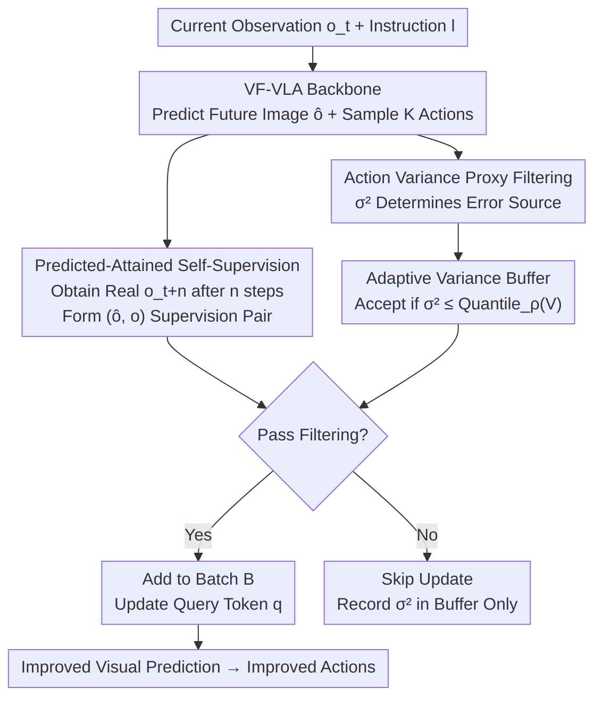

# Test-Time Training for Visual Foresight Vision-Language-Action Models

**Conference**: ICML 2026  
**arXiv**: [2605.08215](https://arxiv.org/abs/2605.08215)  
**Code**: https://github.com/sangwu99/T3VF.git  
**Area**: Robotics / Embodied AI  
**Keywords**: Visual Foresight VLA, Test-Time Training, OOD Robustness, Self-Supervised Learning, Adaptive Filtering

## TL;DR
Addressing the simultaneous dual-stage misalignment of Visual Foresight VLA (VF-VLA) — which predicts future images before generating actions — in Out-of-Distribution (OOD) scenarios, this paper proposes T3VF. It treats the predicted future images and the actual observations after several steps as natural self-supervised pairs. During test-time, the model updates only the minimal visual query modules while filtering noisy steps using "action variance + adaptive quantile buffering." T3VF improves the average success rate on LIBERO-Plus by approximately 5% (relative) with ~1.3× inference overhead, without modifying any network architecture.

## Background & Motivation
**Background**: Vision-Language-Action (VLA) has become the mainstream paradigm for general robot manipulation. A recent category of work utilizes a two-stage structure: the model first predicts the "future visual state the robot should reach" and then generates actions based on this predicted image. These models are termed Visual Foresight VLA (VF-VLA, e.g., WorldVLA, Mantis) and achieve strong performance by explicitly constraining actions through "imagining the future."

**Limitations of Prior Work**: This specific design, where actions depend on predicted images, makes VF-VLA exceptionally fragile under OOD conditions. Since action quality directly depends on the accuracy of future image prediction, any perturbations in the testing environment (e.g., robot initial pose, lighting, background, camera view) cause **simultaneous contamination of both the visual prediction and action generation stages**. The paper empirically demonstrates that while Mantis performs well on in-distribution LIBERO, its performance drops significantly on LIBERO-Plus (containing seven types of perturbations), indicating that both pathways are hit by OOD shifts.

**Key Challenge**: Common practices to mitigate OOD at test-time involve reinforcement learning (RL), which requires additional reward models and incurs high online RL costs. Furthermore, these methods target general VLAs rather than specifically exploiting the structure of VF-VLA. The "dual-stage exposure" vulnerability inherent to VF-VLA has not been previously addressed.

**Key Insight**: The authors identify an overlooked structural dividend in VF-VLA: at step $t$, the model predicts the future image $\hat{o}_{t+n}$ for $n$ steps later. After executing actions for $n$ steps, the environment **actually presents** that frame $o_{t+n}$. This real image naturally serves as the "oracle" for the previous prediction, requiring no additional data collection.

**Core Idea**: Utilize the self-supervised signal from the "predicted image $\hat{o}_{t+n}$ ↔ subsequent real observation $o_{t+n}$" pair to fine-tune the visual prediction pathway on-the-fly during testing. Action variance and adaptive buffering are then used to filter unreliable update steps, correcting the fragile VF-VLA in real-time.

## Method

### Overall Architecture
T3VF maintains the original VF-VLA architecture, only adding a "self-supervision + filtering" test-time training loop to the inference cycle. The original VF-VLA consists of a VLM backbone $P$, an image head $I_h$, and an action head $A_h$: given instruction $l$, current observation $o_t$, and query tokens $q$, the backbone extracts $(h_t^{\text{inst}}, h_t^{\text{img}}, h_t^{\text{act}}) = P(l, o_t, q)$. The image head predicts $\hat{o}_{t+n} = I_h([h_t^{\text{inst}}, h_t^{\text{img}}], o_t)$, and the action head samples $\hat{a}_t \sim A_h(h_t^{\text{act}})$. The training objective is $\mathcal{L}_{\text{train}} = \mathcal{L}_{\text{img}}(\hat{o}_{t+n}, o_{t+n}) + \lambda\,\mathcal{L}_{\text{act}}(\hat{a}_t, a_t)$.

During testing, T3VF accumulates "predicted-attained" image pairs while performing tasks. At each step, $K$ action samples are taken to calculate the variance $\sigma_t^2$, which determines if the prediction error should be attributed to the visual pathway. Updates occur only when the variance falls within the low-quantile range of a recent window, adding the image pair to a batch. Once a batch is full, an update is performed only on the query tokens $q$ (the smallest module in the visual prediction pathway), while the backbone and other parameters remain frozen. As visual prediction becomes more accurate, the dependent action generation improves accordingly.

### Key Designs

**1. Self-Supervision from Predicted-Attained Image Pairs: Pairing "Imagined Future" with "Real Future"**

The root cause of VF-VLA failure under OOD is inaccurate visual prediction, but fixing this at test-time is difficult without labels. The authors found that the temporal structure of VF-VLA contains hidden supervision signals: the $\hat{o}_{t+n}$ predicted at step $t$ is realized by the environment as $o_{t+n}$ after execution. This real frame is the oracle for the original prediction. Thus, predicted-attained pairs $(\hat{o}_{t+n}, o_{t+n})$ are accumulated in a set $\mathcal{B}$. When $|\mathcal{B}|$ reaches batch size $B$, an update is performed to minimize:

$$\mathcal{L}_{\text{TTT}} = \frac{1}{B}\sum_{(\hat{o}_{t+n}, o_{t+n})\in\mathcal{B}} \mathcal{L}_{\text{img}}(\hat{o}_{t+n}, o_{t+n}),$$

where $\mathcal{L}_{\text{img}}$ is the same image loss used during training. A critical trade-off is **updating only the query tokens $q$** while freezing everything else. As $q$ is the minimal module involved in visual prediction, updating it corrects visual bias with minimal overhead. This process runs in parallel with execution, requiring no auxiliary modules, reward models, or external signals—unlike the test-time RL approach.

**2. Action Variance Proxy Filtering: Using "Internal Consistency" to Judge Trustworthiness**

Using all predicted-attained pairs for training is risky: a large difference between $\hat{o}_{t+n}$ and $o_{t+n}$ could stem from inaccurate visual prediction (useful signal) or from the robot deviating from the intended path (noise). Indiscriminate training allows the damage from the latter to offset the gains from the former. The authors use **action variance** as a proxy: at step $t$, $K$ action samples $\{\hat{a}_t^{(k)}\}$ are drawn to calculate:

$$\bar{a}_t = \frac{1}{K}\sum_{k=1}^{K}\hat{a}_t^{(k)}, \qquad \sigma_t^2 = \frac{1}{K}\sum_{k=1}^{K}\big\|\hat{a}_t^{(k)} - \bar{a}_t\big\|_2^2.$$

Low variance indicates high internal confidence in the action; if a large prediction error occurs here, it is likely due to the visual pathway, making it a valuable signal for updating $q$. High variance suggests an ambiguous error source, so the step is skipped. Variance can be calculated immediately after $\hat{a}_t$ is produced, and $K$ samples require only one backbone forward pass with parallel action head decoding, making its cost significantly lower than calculating $\mathcal{L}_{\text{img}}$.

**3. Adaptive Variance Buffer: Replacing Absolute Thresholds with Relative Quantiles**

A fixed threshold is insufficient because task difficulty varies across and within episodes. A fixed threshold might accept too many noisy steps in simple segments or reject everything in difficult ones. The authors replace the fixed threshold with a **sliding variance buffer** $\mathcal{V}_t = \{\sigma_{t'}^2 : t' \in \mathcal{W}_t\}$ (a window of the recent $|\mathcal{V}|$ steps). Step $t$ is accepted into $\mathcal{B}$ only if:

$$\sigma_t^2 \le \mathrm{Quantile}_\rho(\mathcal{V}_t)$$

where $\rho \in (0,1)$ is the quantile threshold. Since the criterion is the relative rank within the recent window, it automatically adjusts to the variance scale of each episode and stabilizes the sample acceptance frequency. Regardless of whether a step is accepted, $\sigma_t^2$ is added to the buffer to ensure continuous updates.

### Loss & Training
The sole test-time objective is $\mathcal{L}_{\text{TTT}}$ (the same image loss $\mathcal{L}_{\text{img}}$ used in training). The action loss $\mathcal{L}_{\text{act}}$ is not used during testing. Trainable parameters are limited to the query tokens $q$; the backbone, other image head weights, and the action head are frozen. Hyperparameters include foresight horizon $n$, batch size $B$, action sample count $K$, buffer length $|\mathcal{V}|$, and quantile threshold $\rho$. The update process is parallelized with environment execution to avoid interrupting inference.

## Key Experimental Results

### Main Results
The baseline is the representative VF-VLA model **Mantis**, evaluated on **LIBERO-Plus** following standard protocols across seven perturbation dimensions. Success rates (%) are reported. Two settings: `w/ Perturbed Train` (fine-tuned on LIBERO-Plus) and `w/o Perturbed Train` (original LIBERO checkpoints, fully OOD during evaluation).

| Setting | Model | Robot | Language | Noise | Layout | Background | Camera | Light | Avg |
|------|------|-------|----------|-------|--------|------------|--------|-------|-----|
| w/ Perturbed Train | Mantis | 29.0 | 47.8 | 47.4 | 42.3 | 60.3 | 50.5 | 67.8 | 49.3 |
| w/ Perturbed Train | Mantis + T3VF | 31.8 | 49.2 | 48.2 | 44.9 | 63.0 | 55.3 | 72.4 | **52.1** |
| w/ Perturbed Train | Gain | +2.8 | +1.4 | +0.8 | +2.6 | +2.7 | +4.8 | +4.6 | **+2.8** |
| w/o Perturbed Train | Mantis | 15.7 | 41.8 | 45.9 | 45.1 | 28.9 | 39.2 | 62.5 | 39.8 |
| w/o Perturbed Train | Mantis + T3VF | 16.5 | 42.6 | 44.8 | 45.4 | 28.7 | 41.5 | 62.3 | **40.3** |
| w/o Perturbed Train | Gain | +0.8 | +0.8 | -1.1 | +0.3 | -0.2 | +2.3 | -0.2 | **+0.5** |

T3VF improves the overall average success rate in both settings. The gain is more pronounced in `w/ Perturbed Train` (+2.8 absolute, representing a ~5% relative improvement), with the largest gains in visual-related dimensions like Camera and Light (+4.8 / +4.6). In the `w/o Perturbed Train` setting, the improvement is smaller (+0.5), which the authors attribute to the base model's inability to absorb supervision signals when failing entirely to adapt to perturbations.

### Ablation Study
Ablation on the most difficult Robot perturbation under the `w/ Perturbed Train` setting:

| Configuration | TTT | Var. Filter | Adaptive Buffer | Success Rate |
|------|-----|----------|------------|--------|
| Base Model | ✗ | ✗ | ✗ | 29.0 |
| + TTT (No Filtering) | ✓ | ✗ | ✗ | 29.8 |
| + Fixed Threshold Filtering | ✓ | ✓ (Fixed) | ✗ | 28.6 |
| + Adaptive Buffer (Full T3VF) | ✓ | ✓ | ✓ | **31.8** |

### Key Findings
- **Predicted-attained pairs are useful even without filtering**: Vanilla TTT raised success from 29.0 to 29.8, confirming these self-supervised signals carry useful information.
- **Fixed thresholds can be counterproductive**: Adding a fixed threshold filter caused a drop to 28.6, supporting the argument that absolute truncation fails to distinguish signal from noise reliably.
- **Adaptive buffering is the primary driver of gain**: Switching to a relative quantile buffer pushed performance to 31.8, as the relative ranking makes the variance proxy truly reliable.
- **Efficiency is controllable**: While unfiltered TTT increases per-episode time to ~1.7× the baseline, T3VF's adaptive filtering limits updates to fewer steps, keeping overhead at ~1.3×.

## Highlights & Insights
- **Turning Temporal Structure into Free Supervision**: The most ingenious aspect is recognizing that "predicted future = real present a few steps later." The oracle is provided automatically by the environment—zero extra data, zero labels, and zero reward models. This is a fundamentally lighter alternative to test-time RL.
- **Variance as both Quality Control and Cost Saver**: Action variance doesn't just attribute error sources; it can be calculated instantly using a single forward pass with parallel decoding. This "early and cheap filtering" design is highly transferable.
- **Relative Quantiles > Absolute Thresholds**: When task difficulty drifts significantly across samples, using quantile rankings within a sliding window instead of fixed thresholds automatically stabilizes the acceptance rate—a strategy applicable to any online sample filtering or early-stopping scenario.

## Limitations & Future Work
- **Conservative Positioning**: T3VF mitigates rather than cures OOD shifts. Gains appear incremental relative to the additional inference overhead, and improvements are minimal in high-zero-shot settings (`w/o Perturbed Train`).
- **Dependency on VF-VLA Architecture**: The method capitalizes on the dual-stage "action depends on prediction" structure and is not directly applicable to non-foresight VLAs.
- **Trade-offs in Updating Only Query Tokens**: While updating only $q$ minimizes overhead, it inevitably caps the correction capability. The optimal parameter subset for updates may vary across different VF-VLA implementations.
- **Assumptions of the Variance Proxy**: The method assumes "low action variance ⇒ error is visual." However, in OOD scenarios, an action head could be both biased and confident (low variance but wrong). This case of proxy failure is not explored in depth.

## Related Work & Insights
- **vs Test-time RL (e.g., EVOLVE-VLA, On-the-fly VLA Adaptation)**: These require separate reward models and incur high online RL costs. T3VF leverages the predictive structure of VF-VLA for self-supervision, keeping overhead at ~1.3× without external signals.
- **vs Standard VF-VLA (WorldVLA, Mantis)**: These works focus on in-distribution performance and architecture designs. This paper is the first to highlight the "dual-stage" OOD vulnerability of visual foresight architectures and provide a plug-and-play fix.
- **Insight**: Any system where "the model predicts an intermediate state realized by the future to make a decision" (world models, planners, predictive control) could adopt this "predicted-attained self-supervision + variance filtering" for test-time self-correction.

## Rating
- Novelty: ⭐⭐⭐⭐ First to identify the dual-stage OOD vulnerability in VF-VLA and utilize temporal predicted-attained pairs for label-free self-supervision.
- Experimental Thoroughness: ⭐⭐⭐ Covers seven perturbations, two settings, ablations, and efficiency analysis, though it only uses the Mantis baseline and shows incremental gains.
- Writing Quality: ⭐⭐⭐⭐ Clear progression from motivation to filtering mechanism, with well-aligned formulas and diagrams.
- Value: ⭐⭐⭐⭐ A low-overhead, plug-and-play test-time correction solution with practical utility for deployed VF-VLA systems.

<!-- RELATED:START -->

## Related Papers

- [\[ICLR 2026\] Verifier-Free Test-Time Sampling for Vision-Language-Action Models](../../ICLR2026/robotics/verifier-free_test-time_sampling_for_vision-language-action_models.md)
- [\[CVPR 2026\] Test-Time Perturbation Tuning with Delayed Feedback for Vision-Language-Action Models](../../CVPR2026/robotics/test-time_perturbation_tuning_with_delayed_feedback_for_vision-language-action_m.md)
- [\[CVPR 2026\] Mantis: A Versatile Vision-Language-Action Model with Disentangled Visual Foresight](../../CVPR2026/robotics/mantis_a_versatile_vision-language-action_model_with_disentangled_visual_foresig.md)
- [\[ICLR 2026\] Hybrid Training for Vision-Language-Action Models](../../ICLR2026/robotics/hybrid_training_for_vision-language-action_models.md)
- [\[ICLR 2026\] VITA: Zero-Shot Value Functions via Test-Time Adaptation of Vision–Language Models](../../ICLR2026/robotics/vita_zero-shot_value_functions_via_test-time_adaptation_of_visionlanguage_models.md)

<!-- RELATED:END -->
