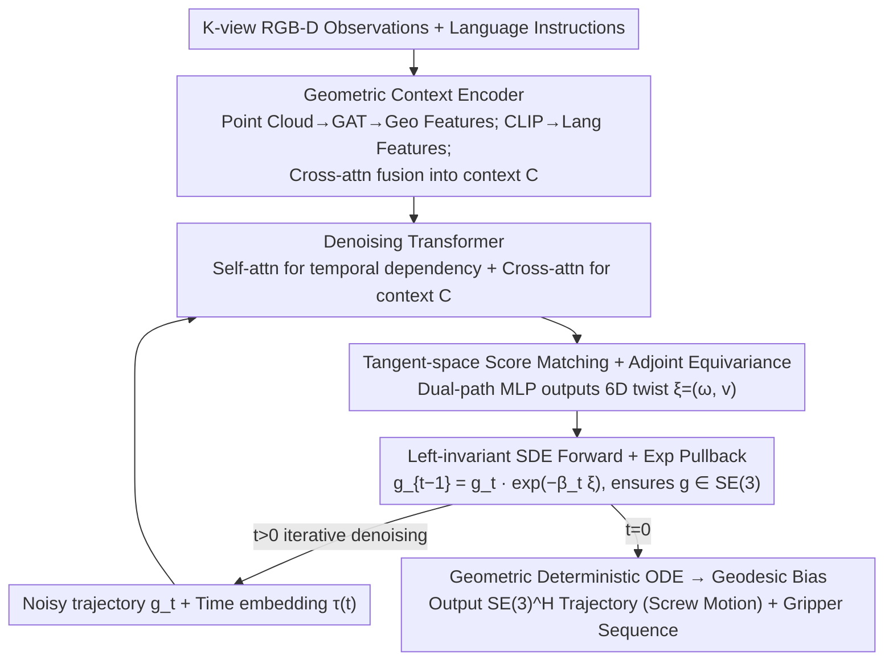

# The Lie We Tell: Correcting the Euclidean Fallacy in Vision-Language-Action Policies via Score Matching on Tangent Space

**Conference**: ICML 2026  
**arXiv**: [2606.01847](https://arxiv.org/abs/2606.01847)  
**Code**: Not declared by the authors (only NSTC/NVIDIA acknowledgments, no repository link provided)  
**Area**: Robotics / VLA Policies / Diffusion Models  
**Keywords**: SE(3) manifold, Lie group diffusion, Left-invariant SDE, Tangent-space score matching, CALVIN  

## TL;DR
Lie Diffuser Actor (LDA) corrects the "Euclidean Fallacy" of flattening $SE(3)$ poses into $\mathbb{R}^{12}$ by returning to manifold-native diffusion: injecting noise into the Lie algebra $\mathfrak{se}(3)$ via left-invariant SDEs, pulling back via the exponential map, and predicting scores in the tangent space. Theoretically, this achieves manifold closure, coordinate equivariance, and geodesic optimality, pushing the average task length on CALVIN ABC→D from 3.27 to 3.51.

## Background & Motivation
**Background**: Diffusion-based VLA policies (e.g., 3D Diffuser Actor, Diffusion Policy, Octo series) have become mainstream in robotic manipulation due to their ability to capture multimodal behaviors and long-range consistency. A common practice is to flatten the $SE(3)$ pose sequence $\mathbf{g} = (g^1, \dots, g^H)$ into $\mathbb{R}^{12 \times H}$ vectors (9D rotation matrix + 3D translation), inject Gaussian noise in Euclidean space, train a denoising network, and then project the output back to $SO(3)$ using SVD or quaternion normalization.

**Limitations of Prior Work**: The authors term this practice the "Euclidean Fallacy" and identify three specific issues: (1) Manifold drift: Gaussian noise combined with a rotation matrix almost certainly violates $R^\top R = I$, forcing the network to waste capacity learning SVD post-processing; (2) Breakdown of equivariance: Euclidean noise distributions do not covary when the workspace undergoes a global rigid-body transformation, binding the score function to the coordinate system; (3) Non-geodesic trajectories: Euclidean interpolation traverses physically unfeasible intermediate poses, discarding the screw motion structure defined by Chasles' Theorem and resulting in high angular jerk. Figure 2 in the paper shows that the orthogonality error of 3D Diffuser Actor is significantly higher than manifold-native methods, and the inter-step variance is large due to SVD projection magnifying effects near degenerate matrices.

**Key Challenge**: Score-based diffusion requires injecting Gaussian noise at each step, but Gaussian distributions are designed for flat vector spaces. $SE(3)$ is a 6D Riemannian manifold with non-zero curvature, making additive noise fundamentally incompatible with its geometry. Relying on post-hoc projection introduces training-inference mismatch, sensitivity to near-degenerate matrices, and non-differentiable projection issues that rewrite the reverse SDE.

**Goal**: Construct a diffusion framework on $SE(3)$ such that (i) intermediate samples at any time $t$ naturally reside in $SE(3)$; (ii) the score function is equivariant under global rigid-body transformations of the workspace; (iii) the deterministic limit of the reverse process converges to geodesics on the manifold.

**Key Insight**: The Lie algebra $\mathfrak{se}(3)$ is the tangent space of $SE(3)$ at the identity, which is a flat 6D vector space where Gaussian noise is well-defined. The exponential map $\exp: \mathfrak{se}(3) \to SE(3)$ is surjective, mapping any twist back to a valid rigid-body transformation. Thus, "adding noise on the manifold" can be redefined as "adding noise in the tangent space and then composing the perturbation with the pose via $\exp$," closing the loop on geometric structure.

**Core Idea**: Formulate the forward diffusion as a left-invariant SDE $g_t = g_0 \cdot \exp(\sigma_t \boldsymbol{\xi})$, where the score network outputs a twist $\boldsymbol{\xi} \in \mathfrak{se}(3)$ instead of $\mathbb{R}^{12}$ noise. The reverse update uses the $\exp$ pullback, ensuring all geometric invariants are maintained by the group structure rather than post-processing.

## Method

### Overall Architecture
LDA consists of a geometric context encoder, an iterative denoising Transformer, a tangent-space prediction head, and a tangent-space score matching objective. While the first two components follow the design of 3D Diffuser Actor, the core geometric contributions reside in the latter three (prediction head + denoising update + training objective). The input consists of $K$-view RGB-D observations and language instructions $\mathcal{L}$, while the output is a pose trajectory $\mathbf{g} = (g^1, \dots, g^H) \in SE(3)^H$ for horizon $H$ plus a binary gripper sequence. Point clouds are back-projected and processed by a GAT (Graph Attention Transformer) to extract geometric features $\mathbf{F}_{\text{geo}}$, while the CLIP text encoder produces language features $\mathbf{F}_{\text{lang}}$, fused via cross-attention into context $\mathcal{C}$. At each diffusion step $t$, the denoising Transformer receives the noisy trajectory $\mathbf{g}_t$ and time embedding $\tau(t)$. It uses self-attention for temporal dependencies and cross-attention to inject $\mathcal{C}$. Finally, the tangent-space prediction head outputs a 6D twist $\boldsymbol{\xi}^h = (\boldsymbol{\omega}^h, \mathbf{v}^h)$ for each waypoint. The denoising update $g_{t-1}^h = g_t^h \cdot \exp(-\beta_t \boldsymbol{\xi}^h)$ composes the perturbation back onto the manifold, ensuring all intermediate states $\in SE(3)$. This iterates until $t=0$, resulting in a final trajectory whose reverse process is naturally biased toward geodesics (screw motions).

### Key Designs

**1. Left-invariant SDE Forward Diffusion + Exponential Map Pullback: Noise in Tangent Space, Group Multiplication on Manifold**

Euclidean methods inject Gaussian noise into rotation matrices, breaking $R^\top R = I$ and requiring SVD projection. This modifies the reverse SDE, introduces sensitivity to near-degenerate matrices (small prediction errors become large rotation errors), and breaks training-inference consistency. LDA moves noise injection to the Lie algebra $\mathfrak{se}(3)$, where Gaussian noise is well-defined, and uses the surjective $\exp$ map to compose perturbations. The forward process takes the Stratonovich form:
$$\mathrm{d}g_t = g_t \cdot \Big(\sigma_t \sum_{i=1}^6 E_i \circ \mathrm{d}W_t^i\Big)$$
where $\{E_i\}$ is an orthonormal basis of $\mathfrak{se}(3)$. Discretization yields $g_t = g_0 \cdot \exp(\sigma_t \boldsymbol{\xi})$ with $\boldsymbol{\xi} \sim \mathcal{N}(\mathbf{0}, \mathbf{I}_6)$. Since $SE(3)$ is closed under group multiplication and $\exp$ maps any twist to a valid rigid transformation, Proposition 4.1 guarantees $g_t \in SE(3)$ a.s. throughout. The reverse SDE is implemented as $g_{t-\Delta t} = g_t \cdot \exp(\sigma_t^2 s_\theta(g_t, t) \Delta t + \sigma_t \sqrt{\Delta t} \boldsymbol{\zeta})$. By embedding geometric constraints into the group structure, the network no longer needs to learn to "fix" bad matrices and can focus on manipulation semantics.

**2. Tangent-space Score Matching + Adjoint Equivariance: Twist Outputs and Automatic Equivariance**

The score network no longer regresses $\mathbb{R}^{12}$ noise but outputs a 6D twist in $\mathfrak{se}(3)$. The prediction head uses a dual-path MLP for angular velocity $\boldsymbol{\omega}^h$ and linear velocity $\mathbf{v}^h$. Training utilizes tangent-space denoising score matching: sampling $t$ and $\boldsymbol{\xi}^h$ from expert trajectories $\mathbf{g}_0$, constructing $g_t^h = g_0^h \cdot \exp(\sigma_t \boldsymbol{\xi}^h)$, and minimizing $\|s_\theta(g_t^h, t) - \boldsymbol{\xi}^h\|^2$. Theorem 4.2 shows that the optimal score satisfies $s_\theta(h \cdot g, t) = \mathrm{Ad}_h(s_\theta(g, t))$, where $\mathrm{Ad}_{(R, \mathbf{p})}(\boldsymbol{\omega}, \mathbf{v}) = (R\boldsymbol{\omega}, R\mathbf{v} + [\mathbf{p}]_\times R\boldsymbol{\omega})$. This means as the workspace undergoes a rigid transformation, the score output covaries according to the adjoint map. Equivariance is essential for robotics; changes in camera extrinsics or table placement should not require retraining. By defining scores in the body-fixed tangent space, the network learns the "intrinsic geometry of the task," facilitating zero-shot transfer in CALVIN ABC→D.

**3. Geometric Deterministic ODE → Geodesic Bias: Screw Motions instead of Euclidean Lines**

Euclidean interpolation traverses physically unfeasible intermediate poses, causing high jerk. LDA’s reverse SDE corresponds to a probability flow ODE $\mathrm{d}g_t/\mathrm{d}t = g_t \cdot \sigma_t^2 s_\theta(g_t, t)$. Proposition 4.3 states that if the score is approximately a constant vector $\boldsymbol{\xi}^*$ along the trajectory, the solution to this ODE is a geodesic under the bi-invariant metric of $SE(3)$, i.e., a screw motion with constant angular and linear velocities. Even as the score varies, this intrinsic formulation biases generated trajectories toward geodesic paths. Look-ahead consistency experiments show that the geodesic jitter between $\hat{x}_0^{(t)}$ and $\hat{x}_0^{(t-1)}$ for LDA is nearly an order of magnitude lower than Euclidean baselines—a direct benefit for steady-state control in real-world deployment.

### Loss & Training
The total loss is $\mathcal{L} = \lambda_s \mathbb{E}_{t, \boldsymbol{\xi}}\left[\sum_h \|s_\theta(g_t^h, t) - \boldsymbol{\xi}^h\|^2\right] + \lambda_p \mathcal{L}_{\text{pos}} + \lambda_g \mathcal{L}_{\text{grip}}$. The score matching term is the primary objective, with position MSE and gripper binary cross-entropy as auxiliary losses. Models were trained for 300K–600K steps on CALVIN, compared against baselines at 600K–800K steps.

## Key Experimental Results

### Main Results
Success rates and average chain lengths on CALVIN ABC→D (train on A/B/C, zero-shot test on D) and ABCD→D:

| Setting | Method | SR1 | SR2 | SR3 | SR4 | SR5 | Avg Len |
|---------|------|-----|-----|-----|-----|-----|---------|
| ABC→D | 3D Diffuser Actor (600K) | 92.2 | 78.7 | 63.9 | 51.2 | 41.2 | 3.27 |
| ABC→D | LDA (600K) w/o GAT | 89.6 | 78.0 | 66.6 | 55.7 | 46.9 | 3.368 |
| ABC→D | LDA (300K) w/o Lie | 90.2 | 80.3 | 69.6 | 58.5 | 48.8 | 3.474 |
| ABC→D | **LDA (300K) full** | **93.7** | **83.4** | **70.3** | 57.6 | 46.2 | **3.512** |
| ABCD→D | 3D Diffuser Actor (800K) | 90.3 | 77.3 | 65.8 | 53.8 | 41.6 | 3.288 |
| ABCD→D | **LDA (300K) full** | 90.6 | 80.4 | **71.1** | **62.6** | **53.7** | **3.584** |

The results show that both modules are independently effective, and their combination outperforms the baseline despite using less than half the training budget. Experiments on OpenVLA-OFT showed that switching to $SE(3)$ score matching increased LIBERO Long success rates from 92.20 to 94.13.

### Key Findings
- **Manifold Constraint Violation (Fig. 5)**: Euclidean baselines show orthogonality errors of $\mathcal{O}(10^0)$ and significant deviations in determinants and quaternion norms (between 0.5–2.0) during reverse diffusion. LDA remains within $\sim 10^{-7}$ floating-point precision. While Euclidean trajectories cut through the interior of the $\mathbb{S}^3$ sphere, LDA trajectories strictly follow the sphere's surface (geodesics).
- **Look-ahead Consistency (Fig. 6)**: The geodesic jitter between $\hat{x}_0^{(t)}$ and $\hat{x}_0^{(t-1)}$ (estimated final action) is nearly an order of magnitude lower for LDA. Euclidean baselines exhibit large jumps in the noisy early steps. This indicates that LDA's target estimation converges monotonically, providing more predictable control signals.
- **Benefits of Equivariance**: CALVIN ABC→D requires zero-shot migration to unseen environment layouts. LDA’s adjoint equivariance ensures that the score function covaries with global workspace transforms, whereas the baseline’s performance is hampered by environmental diversity.

## Highlights & Insights
- The "Euclidean Fallacy" is a compelling conceptual framework, framing common engineering workarounds (SVD, normalization) as a measurable geometric error.
- Moving equivariance from just the encoder to the entire "generation process" represents a significant step forward. LDA ensures equivariance from the encoder through to the final sampling step via left-invariant SDEs.
- High compatibility: LDA acts as a "geometric head" that can be plugged into existing architectures like 3D Diffuser Actor by simply replacing the 12D Euclidean head with a 6D twist head and $\exp$ pullback.

## Limitations & Future Work
- The source code was not released, which may affect reproducibility regarding numerical implementations (e.g., the left Jacobian $V(\boldsymbol{\omega})$ and small-angle handling).
- In tasks purely dominated by translation (e.g., "Put Block in Box"), LDA slightly underperformed the baseline (75% vs 80%), suggesting that unconstrained Euclidean exploration might be beneficial in specific scenarios.
- Comparisons with the largest VLA models (e.g., $\pi_0$, full OpenVLA) were limited to sub-tasks.
- Proposition 4.3 assumes a constant score vector, which does not hold in practice; the "geodesic bias" remains an approximation.

## Related Work & Insights
- **vs. 3D Diffuser Actor**: Shares the point cloud + Transformer + diffusion framework, but LDA replaces the 12D + SVD approach with native $SE(3)$ diffusion.
- **vs. Equivariant Policy Learning**: Previous works focused on the encoder, but equivariance was broken during noise injection. LDA achieves end-to-end equivariance.
- **vs. Riemannian Generative Models**: While Riemannian flow matching is deterministic, LDA preserves SDE noise to maintain multimodal sampling capabilities while ensuring manifold closure.

## Rating
- **Novelty**: ⭐⭐⭐⭐ While Lie group diffusion has appeared elsewhere, the systematic treatment of the "Euclidean Fallacy," combined with Propositions 4.1-4.3 and real-robot verification, pushes the field forward.
- **Experimental Thoroughness**: ⭐⭐⭐ Good coverage across CALVIN, real-robot tasks, and cross-architecture validation, but lacks comparisons with larger VLA baselines and other benchmarks like RLBench.
- **Writing Quality**: ⭐⭐⭐⭐ Clear geometric motivation and well-aligned theorems.
- **Value**: ⭐⭐⭐⭐ Provides a low-overhead, high-gain upgrade path for diffusion-based manipulation policies.

<!-- RELATED:START -->

## Related Papers

- [\[ICML 2026\] Discrete Diffusion VLA: Bringing Discrete Diffusion to Action Decoding in Vision-Language-Action Policies](discrete_diffusion_vla_bringing_discrete_diffusion_to_action_decoding_in_vision-.md)
- [\[ICML 2026\] Spatial Memory for Out-of-Vision Manipulation in Vision-Language-Action](spatial_memory_for_out-of-vision_manipulation_in_vision-language-action.md)
- [\[ICML 2026\] Contrastive Representation Regularization for Vision-Language-Action Models](contrastive_representation_regularization_for_vision-language-action_models.md)
- [\[ICML 2026\] LangForce: Bayesian Decomposition of Vision-Language-Action Models via Latent Action Queries](langforce_bayesian_decomposition_of_vision_language_action_models_via_latent_act.md)
- [\[ICML 2026\] Neural Implicit Action Fields: From Discrete Waypoints to Continuous Functions for Vision-Language-Action Models](neural_implicit_action_fields_from_discrete_waypoints_to_continuous_functions_fo.md)

<!-- RELATED:END -->
