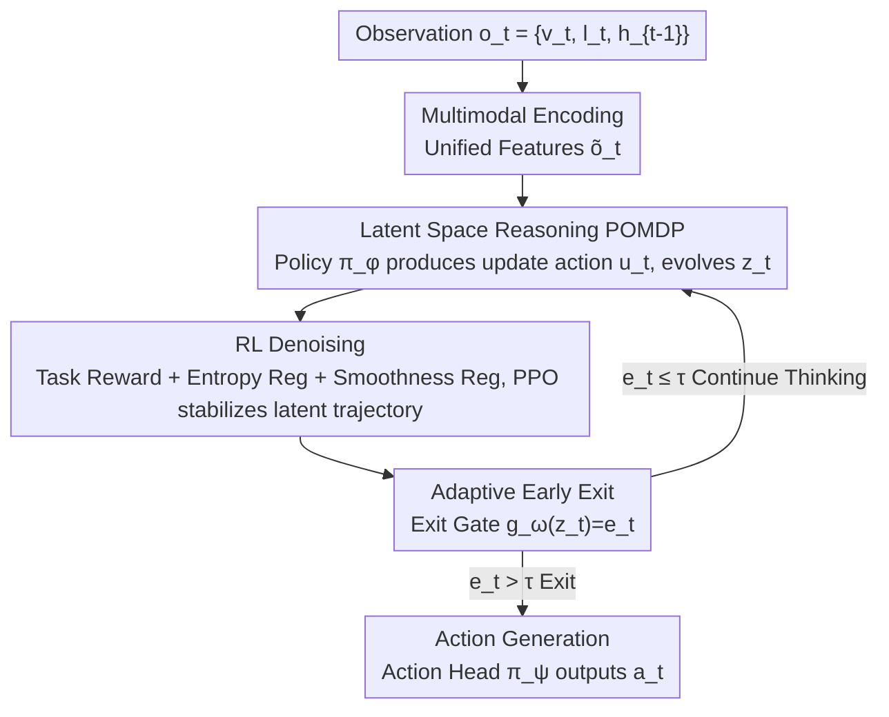

# Think Less, Act Early: Reinforced Latent Reasoning with Early Exit in Vision-Language-Action Models

**Conference**: ICML2026  
**arXiv**: [2606.15099](https://arxiv.org/abs/2606.15099)  
**Code**: TBD  
**Area**: Robotics/Embodied AI  
**Keywords**: Vision-Language-Action Models, Latent Reasoning, Reinforcement Learning, Early Exit, POMDP

## TL;DR
To address the issues of low speed and error accumulation in explicit Chain-of-Thought (CoT) for VLA, the authors propose AVA-VLA—modeling reasoning as a sequence of invisible latent variables, using Reinforcement Learning (RL) to denoise the latent trajectory, and employing an early exit mechanism to adaptively determine reasoning steps based on state confidence. It achieves a 98.3% average success rate on LIBERO while being approximately 6 times faster than explicit CoT reasoning.

## Background & Motivation
**Background**: Vision-Language-Action (VLA) models unify visual perception, language understanding, and action decision-making. To bridge high-dimensional observations and low-level actions, mainstream approaches generate explicit Chain-of-Thought (CoT) or step-by-step plans—first reasoning "why" in text and then deciding the action (e.g., CoT-VLA, SpatialVLA).

**Limitations of Prior Work**: This "unrolled" reasoning has three major flaws. First is **latency**: token-by-token generation of full reasoning text incurs massive computational overhead, failing the low-latency requirements of real-time robots (CoT-VLA latency is near 900ms). Second is **error accumulation**: in multi-step explicit reasoning, early errors propagate and amplify, drifting the intermediate state away from the task goal. Third is the **dependence on human text supervision**, which makes it difficult to generalize to "inexpressible, intuitive" physical skills.

**Key Challenge**: There is a trade-off between reasoning quality and efficiency. Furthermore, explicit text reasoning carries the risk of "unfaithfulness" as pointed out by Turpin et al.—generated text might not reflect the model's true decision basis. Binding reasoning strictly to natural language is itself a bottleneck.

**Goal**: ① Decouple reasoning from token-by-token decoding overheads and text supervision; ② Ensure stability of latent reasoning trajectories without text supervision; ③ Enable reasoning depth to adapt to task difficulty—fast reaction for simple tasks and deep thinking for complex ones.

**Key Insight**: Treat reasoning as **continuous latent dynamics** optimized directly for the final task goal rather than interpretable text. Latent evolution can still guide cross-modal fusion and action generation while skipping the cost of token-by-token decoding.

**Core Idea**: Replace explicit CoT with a "latent variable sequence + RL denoising + early exit" triad—modeling latent state generation as a POMDP sequential decision process, using task rewards to stabilize drifting latent trajectories, and using a gating mechanism to terminate reasoning early based on confidence.

## Method

### Overall Architecture
The operation of AVA-VLA consists of three stages. **(a) Multimodal Encoding**: Encodes vision $v_t$, language $l_t$, and history $h_{t-1}$ into unified features. **(b) Latent Reasoning + RL Denoising Loop** (Core): Models the reasoning process as a POMDP—the reasoning policy $\pi_\phi$ produces an "internal update action" $u_t$ to evolve the latent state $z_t$. This loop is optimized via Reinforcement Learning (with entropy and smoothness regularization) to ensure stability; simultaneously, an exit gate $g_\omega$ continuously evaluates if the current state is sufficient. **(c) Action Generation**: Once the exit gate is triggered (confidence $e_t > \tau$), the finalized latent state is passed to the action head $\pi_\psi$ to directly output the robot action $a_t$. The key to the entire pipeline is that the latent state $z_t$ is placed at the center of decision-making as a compressed, task-relevant abstraction of multimodal observations, filtering out redundancy and noise from raw inputs.

### Key Designs

**1. POMDP Modeling of Latent Space Reasoning: Turning "Thinking" into Optimizable Sequential Decisions**

The pain point is that explicit CoT is slow, prone to error accumulation, and relies on text supervision. The authors introduce an **unobservable latent reasoning state** $z_t \in \mathcal{Z}$, which requires no interpretable semantic structure and is an end-to-end learned state dependent on the decision process. The critical step is: instead of treating latent reasoning as a single forward pass or a static intermediate representation, it is modeled as a POMDP $\mathcal{M}=(\mathcal{Z},\mathcal{O},\mathcal{U},P,R,\gamma)$—where observations $o_t=\{v_t,l_t,h_{t-1}\}$ and $\mathcal{U}$ is the **latent reasoning update action space** (Note: these are not environmental interaction actions; $u_t$ only acts internally to control how the latent state updates). The reasoning policy $\pi_\phi(u_t \mid z_t, o_t)$ is parameterized as a 64-dimensional continuous diagonal Gaussian in the main experiments (continuous modulation provides smoother gradients than discrete selectors, making PPO more stable), and the latent state evolves incrementally:

$$\tilde{o}_t = \psi(o_t), \quad \Delta z_t = g_\theta(z_t, \tilde{o}_t, u_t), \quad z_{t+1} = z_t + \Delta z_t$$

Specifically, this is implemented as $\Delta z_t = \alpha(u_t) \odot \text{Transformer}_\theta(z_t, \tilde{o}_t)$, where $\alpha(u_t)$ is a gating coefficient controlled by the update action. Thus, update actions directly regulate the magnitude and direction of latent state updates, turning "reasoning" into a learnable, controllable dynamic system rather than a fixed, task-agnostic update rule. The action policy $\pi_\psi(a_t \mid z_t, o_t)$ then outputs environmental actions conditioned on the latent state. The entire trajectory $\tau=\{(z_t,o_t,u_t,a_t)\}$ is jointly generated by the reasoning and action policies, unified under the goal of maximizing discounted cumulative rewards $\max \mathbb{E}[\sum_t \gamma^t r(z_t,a_t)]$ for end-to-end task alignment.

**2. RL Denoising: Stabilizing Drifting Latent Trajectories with Task Rewards**

Since $z_t$ lacks explicit supervision, it is susceptible to **representation drift** and error accumulation under noisy inputs, random initialization, or long sequences, passing instability to the action policy. The authors' solution is a compound intrinsic reward for the reasoning policy:

$$r_t = r_{\text{task}}(a_t) - \lambda_1 \mathcal{H}\big(\pi_\phi(\cdot \mid z_t, o_t)\big) - \lambda_2 \lVert z_{t+1} - z_t \rVert^2$$

The first term $r_{\text{task}}$ is the task-level reward (e.g., success signal) measuring decision quality; the second term **entropy regularization** penalizes excessive uncertainty in the update distribution to suppress random perturbations; the third term **smoothness regularization** penalizes the magnitude of change between adjacent latent states, encouraging temporal continuity and stability. These three terms constrain the latent state across task performance, randomness control, and representation stability. Notably, the smoothness term does not force the state to be static but suppresses irrelevant updates caused by noise while preserving responses to task-critical information changes. Optimization uses Actor-Critic: a latent-state-based value function $V^\pi(z_t)$ serves as the baseline to reduce variance in the policy gradient $\nabla_\phi J \approx \mathbb{E}[\nabla_\phi \log \pi_\phi(u_t \mid z_t, o_t)(R_t - V^\pi(z_t))]$. Implementation utilizes **PPO + GAE**, passing sparse task success signals back to each latent update step via the learned critic, thereby assigning credit to intermediate reasoning actions rather than relying solely on the final success metric.

**3. Adaptive Early Exit: Dynamically Deciding Reasoning Steps by State Confidence**

Complexity varies by task and moment—often, shallow reasoning is sufficient, and further updates only increase compute costs and potentially dilute state discriminability due to noise. The authors introduce a parameterized **exit decision function** $e_t = g_\omega(z_t)$, which inputs the current latent state and outputs a scalar confidence value. During reasoning, if $e_t > \tau$, the model stops generating update actions and directly executes action $a_t \sim \pi_\psi(a_t \mid z_t, o_t)$; otherwise, it continues to iterate. This effectively equips the model with an adaptive "fast/slow thinking" switch: cutting redundant computation when the state is stable. $g_\omega$ is calibrated separately after policy training using binary labels (whether additional reasoning yields marginal gains below a threshold). In main experiments, $\tau=0.55$ is chosen via threshold sensitivity scanning. This mechanism reduces the average reasoning steps from 5.0 (without early exit) to 2.3, yielding approximately a 6x overall speedup.

### Loss & Training
The overall objective is to maximize the discounted cumulative reward (Eq. 12). Three sets of parameters $\phi$ (reasoning policy), $\theta$ (transition), and $\psi$ (action policy) are jointly optimized. The RL phase uses PPO+GAE with the compound reward $r_t$ described above. The exit gate $g_\omega$ is calibrated separately using binary marginal gain labels after the main policy training is complete, followed by a threshold scan to determine $\tau$.

## Key Experimental Results

### Main Results
Success rates (%) on four LIBERO suites, "One policy for all" setting:

| Method | Spatial | Object | Goal | Long | Average |
|------|---------|--------|------|------|---------|
| TraceVLA | 84.6 | 85.2 | 75.1 | 54.1 | 74.8 |
| WorldVLA | 87.6 | 96.2 | 83.4 | 60.0 | 81.8 |
| $\pi_0$ | 96.8 | 98.8 | 95.8 | 85.2 | 94.2 |
| UnifiedVLA | 95.4 | 98.8 | 93.6 | 94.0 | 95.5 |
| OpenVLA-OFT | 97.7 | 98.0 | 96.1 | 95.3 | 96.8 |
| **AVA-VLA (Ours)** | **97.8** | **99.4** | **97.8** | **98.1** | **98.3** |

The most significant improvement is in the **Long (long-horizon) suite**: increasing from a second-best 95.3 to 98.1, confirming the role of RL denoising in suppressing error accumulation over long sequences. On CALVIN ABC→D, AVA-VLA also achieves the highest average success rate in both "One policy for all" and "One policy per suite" settings.

### Efficiency Analysis (LIBERO-Spatial)

| Method | Avg Steps | Avg Latency (ms) | P90 Latency (ms) | Throughput (Hz) |
|------|---------|-------------|-------------|----------|
| OpenVLA | 1.0 | 127 | 135 | 7.9 |
| CoT-VLA | 8.5 | 892 | 1,240 | 1.1 |
| PD-VLA | 1.0 | 76 | 82 | 13.2 |
| Ours (w/o Early Exit) | 5.0 | 312 | 340 | 3.2 |
| **Ours (Full)** | **2.3** | **145** | **189** | **6.9** |

### Key Findings
- **Early Exit is the primary driver of speedup**: Removing early exit results in 5.0 average steps and 312ms latency; adding it reduces steps to 2.3 and latency to 145ms—roughly 6x faster than CoT-VLA's 892ms—while success rates actually improve.
- **Latent Reasoning + RL Denoising ensure long-horizon stability**: The 98.1% success rate on the Long suite demonstrates that moving reasoning to the latent space and constraining it with smoothness/entropy regularization effectively mitigates the error propagation found in explicit CoT.
- **Continuous vs. Discrete Update Actions**: Authors found that continuous Gaussian modulation provides smoother gradients and more stable PPO training than discrete Softmax selectors, leading to the selection of continuous $\mathcal{U}\subset\mathbb{R}^{64}$ for main results.

## Highlights & Insights
- **Treating "Reasoning" itself as an RL optimization target**: While RL-for-VLA is often used to fine-tune final actions or output text, this work applies RL directly to **internal latent reasoning steps** for denoising. This is a clean perspective shift—reasoning quality is for the first time directly scored by credit assignment mechanisms (critic + GAE).
- **Early Exit applied to latent reasoning flow rather than the decoding head**: Most VLA speedup methods (like PD-VLA's parallel decoding) modify the decoding side. This paper places early exit on internal deliberation, terminating adaptively based on uncertainty, providing a speedup path orthogonal to decoding acceleration.
- **POMDP formalization provides a unified framework for latent reasoning**: Writing latent state evolution as $(\mathcal{Z},\mathcal{O},\mathcal{U},P,R,\gamma)$ gives theoretical grounding for introducing RL and controlling reasoning depth. This abstraction can be transferred to other embodied tasks requiring multi-step internal deliberation.

## Limitations & Future Work
- Latent reasoning **sacrifices interpretability**: $z_t$ intentionally lacks semantic structure, making it harder to audit "why" the model made a decision compared to explicit CoT—a trade-off in safety-sensitive scenarios.
- The exit threshold $\tau$ and regularization weights $\lambda_1, \lambda_2$ require calibration/scanning; cross-task adaptive calibration has not yet been established. The binary calibration of $g_\omega$ also depends on human-defined thresholds for "marginal gain."
- Main results are validated in LIBERO/CALVIN simulations; whether latent trajectories remain stable under real-world deployment and visual domain shifts remains to be tested.
- Future directions: Replace entropy/smoothness regularization with more principled trajectory constraints; explore joint training of the exit gate and reasoning policy instead of two-stage calibration.

## Related Work & Insights
- **vs. CoT-VLA / SpatialVLA (Explicit CoT)**: They generate explicit reasoning text to improve interpretability but suffer from high latency (CoT-VLA 892ms) and error accumulation. AVA-VLA moves reasoning to the latent space, achieving ~6x speedup and better long-horizon stability at the cost of readability.
- **vs. Coconut / Quiet-STaR (LLM Latent Reasoning)**: These also treat reasoning as continuous latent evolution, but the fundamental difference here is treating latent reasoning as a **Reinforcement Learning problem** using task rewards for denoising; they lack RL credit assignment for latent trajectories.
- **vs. PD-VLA (Efficiency Methods)**: PD-VLA accelerates the **decoding head** via parallel decoding; AVA-VLA's early exit acts on the **latent reasoning flow**, terminating internal deliberation based on state confidence, representing an orthogonal dimension of acceleration.

## Rating
- Novelty: ⭐⭐⭐⭐⭐ The combination of "Latent Reasoning + RL Denoising + Early Exit" is a novel and self-consistent design for VLA.
- Experimental Thoroughness: ⭐⭐⭐⭐ LIBERO/CALVIN + latency analysis are comprehensive, though real-world testing and finer ablation studies are missing.
- Writing Quality: ⭐⭐⭐⭐ POMDP formalization is clear, and the three-stage framework is easy to follow.
- Value: ⭐⭐⭐⭐⭐ Significantly increases speed while maintaining accuracy, which is highly attractive for real-time robotics.

<!-- RELATED:START -->

## Related Papers

- [\[ICML 2026\] Latent Reasoning VLA: Latent Thinking and Prediction for Vision-Language-Action Models](latent_reasoning_vla_latent_thinking_and_prediction_for_vision-language-action_m.md)
- [\[NeurIPS 2025\] ThinkAct: Vision-Language-Action Reasoning via Reinforced Visual Latent Planning](../../NeurIPS2025/robotics/thinkact_vision-language-action_reasoning_via_reinforced_visual_latent_planning.md)
- [\[ICML 2026\] LangForce: Bayesian Decomposition of Vision-Language-Action Models via Latent Action Queries](langforce_bayesian_decomposition_of_vision_language_action_models_via_latent_act.md)
- [\[CVPR 2026\] Cross-Hand Latent Representation for Vision-Language-Action Models](../../CVPR2026/robotics/cross-hand_latent_representation_for_vision-language-action_models.md)
- [\[CVPR 2026\] Fast-ThinkAct: Efficient Vision-Language-Action Reasoning via Verbalizable Latent Planning](../../CVPR2026/robotics/fast-thinkact_efficient_vision-language-action_reasoning_via_verbalizable_latent.md)

<!-- RELATED:END -->
