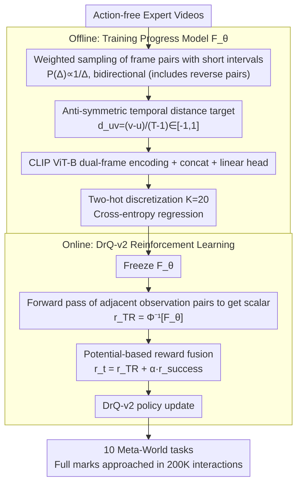

# TimeRewarder: Learning Dense Reward from Passive Videos via Frame-wise Temporal Distance

**Conference**: ICML 2026 Spotlight  
**arXiv**: [2509.26627](https://arxiv.org/abs/2509.26627)  
**Code**: timerewarder.github.io (Project Page)  
**Area**: Robotics / Reinforcement Learning / Imitation Learning  
**Keywords**: Dense Reward Learning, Temporal Distance, Passive Videos, Meta-World, DrQ-v2

## TL;DR
TimeRewarder formalizes "task progress" as the normalized temporal distance between video frame pairs. It trains a self-supervised ViT distance regressor using only action-free expert videos and provides the predicted distance between adjacent frames as a dense reward to DrQ-v2. On 10 Meta-World tasks, it approaches a 9/10 success rate within 200K interactions, even outperforming manually designed environmental dense rewards.

## Background & Motivation
**Background**: Reinforcement Learning (RL) in robotics suffers from poor sample efficiency under sparse rewards. Mainstream remedies involve manually designing dense rewards or distilling proxy rewards from expert trajectories using methods like GAIfO, OT, or VIP. Manual rewards rely heavily on domain knowledge, privileged state access, and repeated tuning, making them difficult to scale. While learning rewards from videos has progressed, goal-conditioned value functions like VIP are hard to converge, Rank2Reward only models ordinal info between adjacent frames which is limited, and triplet-based objectives like PROGRESSOR are overly complex.

**Limitations of Prior Work**: Progress-based reward methods suffer from three specific issues: first, VIP's implicit temporal contrastive objective is theoretically unbounded (proven in Appendix A.3), leading to unstable optimization; second, Rank2Reward only determines "which frame is later" without outputting distance, failing to distinguish between being "one step away" versus "ten steps away"; third, GVL relies on VLM inference order, which leads to high reward noise due to inconsistent outputs.

**Key Challenge**: A reward must satisfy two seemingly conflicting properties—it must provide fine-grained discrimination of "progress" within the expert distribution, while also outputting reasonably low scores for unseen suboptimal behaviors (getting stuck, regressing, pseudo-actions) during RL exploration. Existing objectives either only learn forward progress while ignoring suboptimal samples or rely on goal images, leading to representation degradation when far from the goal.

**Goal**: To learn $F_\theta(o_u, o_v)$ from passive videos such that it (1) assigns high scores to progressive behaviors in RL rollouts and low scores to stagnation or regression; (2) possesses step-level resolution for adjacent frames; and (3) does not depend on goal images or action labels.

**Key Insight**: The authors observe that under an optimal policy, $\mathcal{V}^*(s_t^e) = -\sum_{k=t}^{T-1}\gamma^{k-t}$ is a monotonic transformation of the "remaining time $T-t$." Thus, the time index of expert video frames naturally serves as a potential function. This reduces "reward learning" to "self-supervised regression of normalized temporal differences."

**Core Idea**: Train the model to predict the normalized temporal distance $d_{uv} = (v-u)/(T-1) \in [-1, 1]$ between two frames. Use the predicted distance of adjacent frames as a dense reward, which, when combined with a sparse success signal, drives DrQ-v2.

## Method

### Overall Architecture
TimeRewarder consists of two stages: (1) Offline training of a progress model $F_\theta: \mathcal{O} \times \mathcal{O} \to \mathbb{R}^K$. The input is a pair of frame features encoded by a CLIP-pretrained ViT-B and concatenated; a linear head outputs $K=20$ dimensional logits to predict the two-hot distribution of the normalized temporal distance. (2) During the online exploration phase of DrQ-v2, the adjacent observation pair $(o_t, o_{t+1})$ is fed into the frozen $F_\theta$. The predicted distance $\hat{d}_{t,t+1}$ is used as the step-wise reward, which is then augmented with a binary success signal $r_{\text{success}}$ using a tunable coefficient $\alpha$. The entire pipeline requires no action labels, goal images, or environmental dense rewards.

### Key Designs

**1. Implicit Negative Sampling + Normalized Temporal Distance Regression: Self-learning "Forward for Positive, Backward for Negative" via Anti-symmetric Structure**

The reward must refine progress within the expert distribution and assign low scores to stagnation, regression, or pseudo-actions during RL exploration. TimeRewarder does not explicitly construct failure trajectories; instead, it "embeds" negative samples into the sampling distribution. During training, randomly sampled frame pairs $(o_u, o_v)$ are not restricted to $u < v$, thus the target is $d_{uv}=(v-u)/(T-1)\in[-1,1]$. When RL rollouts crash, miss, or retract, visual differences in adjacent frames resemble "backward playback" segments of the trajectory. The model naturally regresses to small or negative values, effectively treating suboptimal behaviors as reversed segments seen during training. This "anti-symmetric structure" prevents the shortcut where "seeing both frames = high score."

Ablations confirm its criticality: changing the target to a pure forward progress range of $[0,1]$ caused *stick-push* and *basketball* to crash, as missing the target was misjudged as "halfway successful." The "free lunch" here is using the symmetric structure as a negative sample source, saving the engineering burden of constructing failure trajectories.

**2. Weighted Pair Sampling (Short-interval Weighting): Biasing Exposure Towards Adjacent Frames for Precise Step-wise Feedback**

RL rewards are step-wise; the accuracy of adjacent frame distance prediction determines if the feedback is truly "forward-pointing." With uniform sampling, most gradients would be spent on medium-distance pairs near $\Delta=T/2$, which are nearly useless for step rewards. TimeRewarder samples intervals $\Delta=|v-u|$ according to $P(\Delta)\propto 1/\Delta$, biasing exposure to short-interval pairs ($\Delta=1,2,3$) while maintaining long-interval coverage for global progress. Combined with two-hot discretization (splitting $[-1,1]$ into $K=20$ bins and assigning mass to the two nearest bins with cross-entropy loss), the model learns global monotonicity while remaining sharp at bin boundaries.

In ablations, switching to uniform sampling led to significant drops in *stick-push* and *window-open*. Two-hot discretization significantly improved tasks like *basketball* and *disassemble* involving "long preparation + short decisive action," as it preserved sharp transitions at the moment of completion.

**3. Potential-based dense reward + sparse success fusion: Converting the Regressor into an Optimal Policy-Preserving Shaping Reward**

To convert the trained $F_\theta$ into a step reward for RL, TimeRewarder defines $r_{\text{TR}}(o_t, o_{t+1}) = \Phi^{-1}[F_\theta(o_t, o_{t+1})]$ (where $\Phi^{-1}$ maps the two-hot vector back to a $[-1,1]$ scalar). The final training reward is $r_t = r_{\text{TR}}(o_t, o_{t+1}) + \alpha \cdot r_{\text{success}}(o_t)$, where $\alpha$ adaptively balances the scales. Theoretically, using $V(o)=F_\theta(o_0,o)$ as a potential function under the assumption of a deterministic MDP and single-step penalty $r(s)=-1$, $V^*(s)$ is a monotonic transformation of "remaining steps $T-t$." Thus, $r_{\text{TR}}$ is a natural instance of potential-based shaping, preserving the optimal policy.

This fusion compensates for the weaknesses of both: sparse signals are cheap to annotate (human or VLM) but fail to guide exploration, while dense $r_{\text{TR}}$ might suffer scale drift, causing the optimizer to ignore the completion moment. Adding them together maintains DrQ-v2's low engineering complexity while ensuring strong signals at completion, with high robustness to the $\alpha$ coefficient.

### Loss & Training
The training loss is the cross-entropy of the discretized two-hot distribution: $\min_\theta \mathbb{E}[-\mathbf{y}_{uv}^\top \log\text{softmax}(\hat{\mathbf{y}}_{uv})]$, where $\mathbf{y}_{uv} = \Phi(d_{uv})$ is the ground truth two-hot vector and $K = 20$. The backbone is a trainable CLIP-pretrained ViT-B. For downstream RL, DrQ-v2 is used with $F_\theta$ kept frozen. Each task is run for 200K environment interactions across 8 random seeds.

## Key Experimental Results

### Main Results
Comparison of reward learning on 10 Meta-World manipulation tasks (100 action-free expert videos per task):

| Method | Info Source | SR ≈ 100% on 9/10 Tasks | Remarks |
|------|--------|---------------------|------|
| **TimeRewarder** | Frame-pair temporal distance | ✅ | 200K interactions, CLIP ViT-B |
| VIP | Implicit time-contrastive + goal frame | ❌ (Close on few tasks) | Representation degrades OOD |
| Rank2Reward | Adjacent frame order binary classification | ❌ | No explicit distance |
| PROGRESSOR | Triplet Gaussian position estimation | ❌ | Forward progress only |
| GAIfO / OT / ADS | Rollout-expert alignment | ❌ | High online compute cost |
| Env dense reward | Manual privileged dense reward | 9/10 surpassed by TimeRewarder | Usually considered upper bound |
| BC | Action supervision | Reference | Requires action labels |

TimeRewarder achieved the highest final success rate and best sample efficiency in 9/10 tasks, outperforming the environmental manual dense rewards in 9 tasks. The authors attribute this to the fact that manual rewards often have near-zero gradients in the pre-contact phase, whereas TimeRewarder captures subtle progress from videos.

### Ablation Study
Ablation of three core modules (8 seeds, Meta-World):

| Configuration | Most Degraded Task | Symptom | Explanation |
|------|------------------|----------|------|
| **Full TimeRewarder** | — | ~100% on 9/10 | Complete model |
| w/o Implicit Negative Sampling | stick-push, basketball | Miss judged as semi-success | Anti-symmetric structure failed |
| w/o Weighted Sampling (Uniform) | stick-push, window-open | Lack of short-interval resolution | Insufficient local supervision |
| w/o Two-hot Discretization (Reg) | basketball, disassemble | Completion moment smoothed | Long-prep tasks suffered |

### Key Findings
- **Value-Order Correlation (VOC)**: TimeRewarder achieved the highest VOC scores across all tasks on held-out expert videos, proving it learns true temporal monotonicity rather than memorizing the training set. GVL (Gemini-1.5-Pro) in a few-shot setting lagged significantly, showing VLM inference is less stable for reward modeling.
- **OOD Failure Robustness**: In cases like *basketball* (grasping without lifting) or *window-open* (mimicking in mid-air), VIP and Rank2Reward were misled by visual similarity. TimeRewarder was the only method that only "increased value upon contact." PCA visualization showed its feature space forms a consistent progress manifold for training, held-out, and RL rollouts, while failure trajectories clearly deviate.
- **Cross-domain Human-to-Robot**: Using 20 real human demonstrations + 1 Meta-World in-domain demonstration per task, training on either alone yielded low success. Training on both enabled high performance, verifying TimeRewarder's ability to fuse heterogeneous passive videos for reward learning.

## Highlights & Insights
- The complex problem of "learning rewards from passive videos" is reduced to "self-supervised regression of normalized temporal indices," outperforming complex modules like VLMs, triplets, and goal-conditioned value functions. Its simplicity mirrors the impact of contrastive learning replacing manual self-supervision tasks.
- The anti-symmetric $d_{uv} \in [-1, 1]$ design is a "free lunch": it avoids the need for explicit failure trajectories or negative sampling by embedding the model's understanding of suboptimal OOD behavior directly into the target.
- Surpassing manual rewards in 9 tasks is counter-intuitive—it suggests that hand-written shaping functions often remain flat during early "non-contact" stages, while video-learned progress is more sensitive to these pre-contact phases, making it more exploration-friendly for RL.

## Limitations & Future Work
- Single-frame observations face fundamental difficulties in POMDPs under visual aliasing (back-and-forth motion) mapping different stages to the same progress value. The authors suggest window-frame concatenation but did not validate this at scale.
- Evaluation was limited to Meta-World and simplified real-world scenarios, excluding multi-skill long-horizon tasks, dynamic scenes, or multi-object concurrency. Long-term vulnerability to reward hacking remains to be explored.
- The training assumes "near-optimal" expert videos; the degradation when provided with mediocre or noisy demonstrations was not deeply analyzed.

## Related Work & Insights
- **vs VIP**: Both learn value from temporal structure, but VIP uses implicit temporal contrastive + goal conditioning, leading to unbounded targets and representation degradation far from the goal. TimeRewarder uses a bounded regression target and is goal-independent.
- **vs Rank2Reward / PROGRESSOR**: Rank2Reward lacks scale/distance; PROGRESSOR uses complex triplet-Gaussian positioning for forward progress only. TimeRewarder achieves both "distance" and "anti-symmetric suboptimal sensing" with a simpler objective.
- **vs GAIfO / OT / ADS**: These online alignment methods are computationally expensive and unstable. TimeRewarder moves all heavy compute to offline training; online usage requires only one ViT forward pass.
- **vs GVL (VLM Reasoning)**: GVL is sensitive to prompts and model versions. TimeRewarder uses a small model + self-supervision to embed "temporal order" as a continuous, differentiable distance, offering better scalability and reproducibility.

## Rating
- **Novelty**: ⭐⭐⭐⭐ Temporal distance regression is not a new concept, but the combination of anti-symmetry + weighted sampling + two-hot discretization pushes it to the point of outperforming manual dense rewards.
- **Experimental Thoroughness**: ⭐⭐⭐⭐ Covers 10 tasks × 8 seeds, cross-domain human-to-robot, and extensive ablations; lacks long-horizon and adversarial robustness testing.
- **Writing Quality**: ⭐⭐⭐⭐ The experimental sections driven by key questions are smooth, and the analysis of failure modes is clear.
- **Value**: ⭐⭐⭐⭐⭐ Makes "learning dense rewards from videos" truly practical at the Meta-World scale and allows the inclusion of heterogeneous human videos, providing a plug-and-play boost for robotics RL.

<!-- RELATED:START -->

## Related Papers

- [\[ICCV 2025\] Weakly-Supervised Learning of Dense Functional Correspondences](../../ICCV2025/robotics/weakly-supervised_learning_of_dense_functional_correspondences.md)
- [\[ICML 2026\] Position: Good Embodied Reward Models Need Bad Behavior Data](position_good_embodied_reward_models_need_bad_behavior_data.md)
- [\[CVPR 2026\] General Process Reward Modeling for Robotic Reinforcement Learning](../../CVPR2026/robotics/general_process_reward_modeling_for_robotic_reinforcement_learning.md)
- [\[ICLR 2026\] MVR: Multi-view Video Reward Shaping for Reinforcement Learning](../../ICLR2026/robotics/mvr_multi-view_video_reward_shaping_for_reinforcement_learning.md)
- [\[CVPR 2026\] Expanding Spatial and Temporal Context for Robotic Imitation Learning With Scene Graphs](../../CVPR2026/robotics/expanding_spatial_and_temporal_context_for_robotic_imitation_learning_with_scene.md)

<!-- RELATED:END -->
## Related Papers

- [\[ICCV 2025\] Weakly-Supervised Learning of Dense Functional Correspondences](../../ICCV2025/robotics/weakly-supervised_learning_of_dense_functional_correspondences.md)
- [\[ICML 2026\] Position: Good Embodied Reward Models Need Bad Behavior Data](position_good_embodied_reward_models_need_bad_behavior_data.md)
- [\[CVPR 2026\] General Process Reward Modeling for Robotic Reinforcement Learning](../../CVPR2026/robotics/general_process_reward_modeling_for_robotic_reinforcement_learning.md)
- [\[ICLR 2026\] MVR: Multi-view Video Reward Shaping for Reinforcement Learning](../../ICLR2026/robotics/mvr_multi-view_video_reward_shaping_for_reinforcement_learning.md)
- [\[CVPR 2026\] CoMo: Learning Continuous Latent Motion from Internet Videos for Scalable Robot Learning](../../CVPR2026/robotics/como_learning_continuous_latent_motion_from_internet_videos_for_scalable_robot_l.md)

<!-- RELATED:END -->
