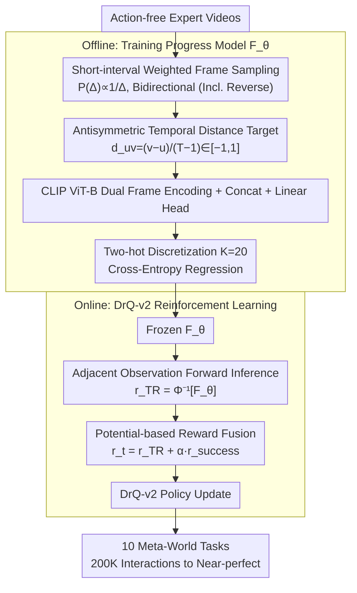

# TimeRewarder: Learning Dense Reward from Passive Videos via Frame-wise Temporal Distance

**Conference**: ICML 2026 Spotlight  
**arXiv**: [2509.26627](https://arxiv.org/abs/2509.26627)  
**Code**: timerewarder.github.io (Project Page)  
**Area**: Robotics / Reinforcement Learning / Imitation Learning  
**Keywords**: Dense reward learning, temporal distance, passive videos, Meta-World, DrQ-v2

## TL;DR
TimeRewarder formalizes "task progress" as the normalized temporal distance between video frame pairs. It trains a ViT distance regressor using self-supervised learning on action-free expert videos and provides the distance between adjacent frames as a dense reward to DrQ-v2. It achieves near-perfect scores (9/10 tasks) on Meta-World within 200K interactions, even surpassing manually designed environment dense rewards.

## Background & Motivation
**Background**: Reinforcement learning for robotics suffers from extremely poor sample efficiency under sparse rewards. Mainstream remedies include manual dense reward design or distilling proxy rewards from expert trajectories using methods like GAIfO, OT, or VIP. Manual rewards rely heavily on domain knowledge, privileged state access, and repeated tuning, making them hard to scale. While learning rewards from videos has progressed, goal-conditioned value functions like VIP struggle to converge, Rank2Reward models only adjacent frame order with limited information, and triplet-based objectives like PROGRESSOR are overly complex.

**Limitations of Prior Work**: Progress-based reward methods exhibit three specific flaws: first, the implicit temporal contrastive objective of VIP is theoretically unbounded (proven in Appendix A.3), leading to unstable optimization; second, Rank2Reward only determines "which frame is later" without outputting distance, failing to distinguish "one step away" from "ten steps away"; third, GVL relies on VLM inference order, resulting in high reward noise due to output inconsistency.

**Key Challenge**: Rewards must simultaneously satisfy two seemingly conflicting properties: fine-grained differentiation of "progress" within the expert distribution, and outputting reasonably low scores for unseen sub-optimal behaviors (stalling, regressing, pseudo-actions) during RL exploration. Existing objectives either focus only on forward progress while ignoring sub-optimal samples or rely on goal images, causing representation degradation when far from the goal.

**Goal**: Learn $F_\theta(o_u, o_v)$ from passive videos such that it (1) assigns high scores to progressive behaviors in RL rollouts and low scores to stagnation or regression; (2) achieves step-level resolution for adjacent frames; and (3) operates without action labels or goal images.

**Key Insight**: The authors observe that under an optimal policy, $\mathcal{V}^*(s_t^e) = -\sum_{k=t}^{T-1}\gamma^{k-t}$ is a monotonic transformation of the "time-to-go $T-t$". Therefore, the temporal index of expert video frames naturally serves as a potential function. This reduces "reward learning" to "self-supervised regression of normalized temporal distance."

**Core Idea**: The model predicts the normalized temporal distance $d_{uv} = (v-u)/(T-1) \in [-1, 1]$ between two frames. The predicted distance between adjacent frames is used as a dense reward, which, combined with a sparse success signal, drives DrQ-v2.

## Method

### Overall Architecture
TimeRewarder consists of two stages: (1) Offline training of a progress model $F_\theta: \mathcal{O} \times \mathcal{O} \to \mathbb{R}^K$. The input is a pair of frame features encoded by a CLIP-pretrained ViT-B and concatenated; a linear head outputs $K=20$ dimensional logits to predict the two-hot distribution of normalized temporal distance. (2) During the online exploration phase of DrQ-v2, adjacent observation pairs $(o_t, o_{t+1})$ are fed into the frozen $F_\theta$. The predicted distance $\hat{d}_{t,t+1}$ is treated as a step-wise reward, combined with the binary success signal $r_{\text{success}}$ using an adjustable $\alpha$ coefficient. The entire pipeline requires no action labels, goal images, or environment rewards.

### Key Designs

**1. Implicit Negative Sampling + Normalized Temporal Distance Regression: Incentivizing Progress and Penalizing Regression via Antisymmetry**

The reward must differentiate progress within the expert distribution and penalize failures during RL exploration. TimeRewarder does not explicitly construct failure trajectories; instead, it "embeds" negative samples into the sampling distribution. During training, randomly sampled frame pairs $(o_u, o_v)$ are not restricted to $u < v$, thus the target $d_{uv}=(v-u)/(T-1)\in[-1,1]$. When an RL rollout hits a wall, misses a grasp, or retracts, the visual difference between adjacent frames resembles a segment from a "reversed trajectory." The model naturally regresses a small or negative value, effectively treating sub-optimal behaviors as reversed segments seen during training. This "antisymmetric structure" prevents the shortcut where "both frames seen = high score."

Ablations confirm its criticality: when the target is changed to a pure forward progress in $[0,1]$, performance on tasks like *stick-push* and *basketball* collapses because missed grasps are misidentified as "half-complete." The "free lunch" here is that using the symmetric structure as a negative sample source eliminates the engineering burden of constructing failure trajectories.

**2. Weighted Pair Sampling (Bias Towards Short Intervals): Sharpening Step-wise Feedback**

RL rewards are step-wise; the accuracy of adjacent frame distance prediction determines whether the feedback truly "points forward." With uniform sampling, most gradients are spent on medium-distance pairs ($\Delta \approx T/2$), which are nearly useless for step rewards. TimeRewarder samples intervals $\Delta=|v-u|$ according to $P(\Delta)\propto 1/\Delta$, biasing exposure towards short-interval pairs ($\Delta=1,2,3$) while maintaining long-interval coverage for global progress. Combined with Two-hot discretization (dividing $[-1,1]$ into $K=20$ bins and assigning probability to the two nearest bins with cross-entropy loss), the model learns global monotonicity while remaining sharp at bin boundaries.

Ablations show that switching to uniform sampling causes significant performance drops in *stick-push* and *window-open*. Two-hot discretization shows notable gains over direct regression in tasks like *basketball* and *disassemble*, which involve "long preparation + short decisive action," by preserving sharp transitions at the moment of completion.

**3. Potential-based Dense Reward + Sparse Success Fusion: Preserving Optimal Policy via Shaping**

To use $F_\theta$ as an RL reward, TimeRewarder defines $r_{\text{TR}}(o_t, o_{t+1}) = \Phi^{-1}[F_\theta(o_t, o_{t+1})]$ (mapping the two-hot vector back to a $[-1,1]$ scalar). The final training reward is $r_t = r_{\text{TR}}(o_t, o_{t+1}) + \alpha \cdot r_{\text{success}}(o_t)$, where $\alpha$ adaptively balances the scales. Theoretically, using $V(o)=F_\theta(o_0,o)$ as a potential function under the assumption of a deterministic MDP with step penalty $r(s)=-1$, $V^*(s)$ is a monotonic transformation of the "time-to-go." Thus, $r_{\text{TR}}$ is a natural instance of potential-based shaping, which preserves the optimal policy.

This fusion leverages the strengths of both signals: sparse success signals (labeled cheaply by humans or VLMs) fail to guide exploration, while dense $r_{\text{TR}}$ might have scale drift. Summing them ensures strong signals at completion without increasing the engineering complexity of DrQ-v2, and performance is robust across different $\alpha$ values.

### Loss & Training
The training loss is the cross-entropy of the discretized two-hot distribution: $\min_\theta \mathbb{E}[-\mathbf{y}_{uv}^\top \log\text{softmax}(\hat{\mathbf{y}}_{uv})]$, where $\mathbf{y}_{uv} = \Phi(d_{uv})$ is the ground truth two-hot vector with $K = 20$. The backbone is a CLIP-pretrained ViT-B (trainable). Features from two frames are independently encoded and concatenated before passing through linear layers. In downstream RL (DrQ-v2), $F_\theta$ is frozen. Each task runs for 200K environment interactions across 8 random seeds.

## Key Experimental Results

### Main Results
Comparison of reward learning on 10 Meta-World manipulation tasks (100 action-free expert videos per task):

| Method | Information Source | 9/10 Tasks SR ≈ 100% | Notes |
|------|--------|---------------------|------|
| **TimeRewarder** | Frame-pair temporal distance | ✅ | 200K interactions, CLIP ViT-B |
| VIP | Implicit time-contrastive + goal | ❌ (Close in few tasks) | Repr. degrades OOD |
| Rank2Reward | Adjacent frame order binary clf | ❌ | No explicit distance |
| PROGRESSOR | Triplet Gaussian pos estimation | ❌ | Forward progress only |
| GAIfO / OT / ADS | Rollout-expert alignment | ❌ | High online compute overhead |
| Env dense reward | Manual privileged dense reward | 9/10 Surpassed by TimeRewarder | Often considered the upper bound |
| BC | Expert action supervision | Baseline | Requires action labels |

TimeRewarder achieves the highest final success rate and best sample efficiency in 9/10 tasks. In 9 tasks, it exceeds the manual environment rewards, attributed to the fact that manual rewards often provide zero gradients in pre-contact stages, whereas TimeRewarder captures subtle progress from video.

### Ablation Study
Removal of core modules (8 seeds, Meta-World):

| Configuration | Most Degraded Task | Symptoms | Explanation |
|------|------------------|----------|------|
| Full TimeRewarder | — | 9/10 near 100% | Full model |
| w/o Implicit Negative Sampling | stick-push, basketball | Missed grasp misjudged | Antisymmetry failure |
| w/o Weighted Sampling (Uniform) | stick-push, window-open | Poor short-interval resolution | Lacks fine-grained local supervision |
| w/o Two-hot Discretization (Regr) | basketball, disassemble | Smoothed completion moment | Hurled by decisive action tasks |

### Key Findings
- **VOC (Value-Order Correlation)**: TimeRewarder scores highest on held-out expert videos across all tasks, proving it learns true temporal monotonicity rather than memorizing the training set. GVL (Gemini-1.5-Pro) in a few-shot setting falls behind, showing VLM inference is less stable for reward modeling.
- **OOD Failures**: In scenarios like "grasping without lifting" in *basketball* or "mimicking in mid-air" in *window-open*, VIP and Rank2Reward are misled by visual similarity. PROGRESSOR saturates post-grasp or gives false peaks. TimeRewarder is the only method that "sees the contact before value increases." PCA visualizations show its feature space forms consistent progress surfaces for training, held-out, and RL rollout trajectories.
- **Cross-domain Human Videos**: In experiments with 20 real human demonstrations + 1 in-domain Meta-World demo across 3 tasks, training on either alone yields low success rates. Mixing them leads to high performance, verifying TimeRewarder's ability to fuse heterogeneous passive videos for reward learning.

## Highlights & Insights
- The complex problem of "learning rewards from passive videos" is reduced to "self-supervised regression of normalized temporal indices," outperforming complex modules like VLMs, triplets, or adversarial discriminators. Its simplicity is reminiscent of replacing manual self-supervised tasks with contrastive learning.
- The antisymmetric $d_{uv} \in [-1, 1]$ design is a "free lunch": it embeds OOD behavior handling into the training objective without requiring explicit failure trajectories. This technique of "using symmetric structures as negative sources" is transferable to other regression tasks requiring robust OOD behavior.
- Surpassing manual environment rewards in 9 tasks is counter-intuitive—it suggests that human-written shaping functions are often flat in early "pre-contact" stages, whereas video-learned progress is more sensitive and RL-friendly.

## Limitations & Future Work
- Single-frame observations may map different task stages to the same progress value under visual aliasing (back-and-forth motion). This is a fundamental challenge in POMDPs. The authors suggest using frame windows, though not extensively validated.
- Evaluations are limited to Meta-World and simplified real-world scenarios, excluding multi-skill long-horizon tasks or dynamic scenes with multiple objects.
- The assumption that expert videos are "near-optimal" remains; how performance degrades with sub-optimal or noisy demonstrations has not been deeply explored.

## Related Work & Insights
- **vs VIP**: Both learn values from temporal structure, but VIP uses implicit temporal contrastive targets and is goal-conditioned, leading to representation degradation far from the goal and optimization difficulties due to unbounded targets. TimeRewarder is goal-independent, has bounded targets, and is more stable.
- **vs Rank2Reward / PROGRESSOR**: Rank2Reward only determines order without scale. PROGRESSOR uses triplets for relative position but follows only forward progress with complex objectives. TimeRewarder achieves both "distance" and "antisymmetric sub-optimal sensing" with a simpler target.
- **vs GAIfO / OT / ADS**: These online alignment methods treat "matching the expert" as a reward, requiring expensive distribution distance calculations per step. TimeRewarder moves computation offline; online use requires only a single ViT forward pass.

## Rating
- **Novelty**: ⭐⭐⭐⭐ Temporal distance regression is not new, but the combination of antisymmetry, weighted sampling, and two-hot discretization reaches the tipping point of surpassing manual dense rewards.
- **Experimental Thoroughness**: ⭐⭐⭐⭐ 10 tasks × 8 seeds, cross-domain human videos, ablations, VOC, and PCA visualizations. Lacks multi-skill long-horizon and adversarial robustness tests.
- **Writing Quality**: ⭐⭐⭐⭐ The experiment section is naturally driven by five key questions. Theoretical and failure mode analyses are clear.
- **Value**: ⭐⭐⭐⭐⭐ Makes "learning dense rewards from videos" truly practical for Meta-World scale tasks and successfully leverages heterogeneous human videos, providing a plug-and-play boost for robotics RL.

## Related Papers

- [\[ICCV 2025\] Weakly-Supervised Learning of Dense Functional Correspondences](../../ICCV2025/robotics/weakly-supervised_learning_of_dense_functional_correspondences.md)
- [\[ICML 2026\] Position: Good Embodied Reward Models Need Bad Behavior Data](position_good_embodied_reward_models_need_bad_behavior_data.md)
- [\[CVPR 2026\] General Process Reward Modeling for Robotic Reinforcement Learning](../../CVPR2026/robotics/general_process_reward_modeling_for_robotic_reinforcement_learning.md)
- [\[ICLR 2026\] MVR: Multi-view Video Reward Shaping for Reinforcement Learning](../../ICLR2026/robotics/mvr_multi-view_video_reward_shaping_for_reinforcement_learning.md)
- [\[CVPR 2026\] VideoWorld 2: Learning Transferable Knowledge from Real-world Videos](../../CVPR2026/robotics/videoworld_2_learning_transferable_knowledge_from_real-world_videos.md)

<!-- RELATED:END -->

<!-- RELATED:START -->

## Related Papers

- [\[ICML 2026\] Position: Good Embodied Reward Models Need Bad Behavior Data](position_good_embodied_reward_models_need_bad_behavior_data.md)
- [\[ICML 2026\] Towards Efficient and Expressive Offline RL via Flow-Anchored Noise-conditioned Q-Learning](towards_efficient_and_expressive_offline_rl_via_flow-anchored_noise-conditioned_.md)
- [\[CVPR 2026\] General Process Reward Modeling for Robotic Reinforcement Learning](../../CVPR2026/robotics/general_process_reward_modeling_for_robotic_reinforcement_learning.md)
- [\[CVPR 2026\] CoMo: Learning Continuous Latent Motion from Internet Videos for Scalable Robot Learning](../../CVPR2026/robotics/como_learning_continuous_latent_motion_from_internet_videos_for_scalable_robot_l.md)
- [\[CVPR 2026\] VideoWorld 2: Learning Transferable Knowledge from Real-world Videos](../../CVPR2026/robotics/videoworld_2_learning_transferable_knowledge_from_real-world_videos.md)

<!-- RELATED:END -->
