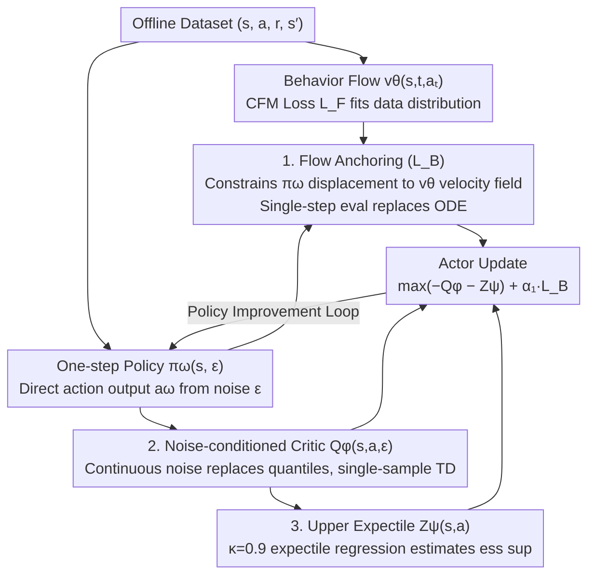

# Towards Efficient and Expressive Offline RL via Flow-Anchored Noise-conditioned Q-Learning

**Conference**: ICML 2026  
**arXiv**: [2605.01663](https://arxiv.org/abs/2605.01663)  
**Code**: https://github.com/brianlsy98/FAN (Available)  
**Area**: Reinforcement Learning / Offline RL / Generative Policy  
**Keywords**: Offline RL, Flow Matching Policy, Distributional Critic, Noise-conditioned Q-learning, Behavior Regularization

## TL;DR
This paper proposes FAN, which compresses "expensive generative policies + distributional critics" into "single-step flow anchoring + single noise sample critic." By using Flow Anchoring to perform behavior regularization within a single flow evaluation and a noise-conditioned critic to replace multi-quantile samples with a single Gaussian noise sample, FAN achieves SOTA performance on D4RL/OGBench while being 5-14× faster to train than similar distributional methods.

## Background & Motivation

**Background**: The core challenge of offline RL is constraining the policy to the behavior distribution of the dataset to avoid OOD overestimation. Recently, two types of highly expressive tools have been widely adopted: (1) **flow/diffusion policies** use flow matching to model multi-modal behavior distributions, offering stronger expressivity than Gaussian policies (e.g., FQL, IDQL, Diffusion-QL); (2) **distributional critics** learn the entire return distribution rather than just the expected value through mechanisms like quantiles (e.g., IQN, CODAC, Value Flows). Combining the two achieves SOTA but at a massive computational cost.

**Limitations of Prior Work**: (i) Flow policies require solving an ODE to generate each action; 10 iterations equals 10× the single-step forward overhead. During training, using the flow for behavior regularization (like $\mathcal{L}_P$ in FQL) requires solving the ODE to get $a_\theta$ before calculating $\|a_\omega-a_\theta\|^2$, multiplying the training cost by the number of flow steps. (ii) Distributional critics typically compute losses across 16-32 quantiles simultaneously. Operations like $\mathrm{ess\,sup}$ introduce additional max-over-samples steps, increasing computation and variance.

**Key Challenge**: There is an inherent conflict between expressivity (multi-modal behaviors + full return distribution) and efficiency (single forward pass + single sample estimation). Prior methods sacrificed training/inference speed for expressivity.

**Goal**: To answer two specific technical questions while retaining the expressivity of flow policies and distributional critics: (1) Can flow policies use only a single iteration for behavior regularization? (2) Can distributional critics be trained using only a single Gaussian noise sample?

**Key Insight**: Behavior regularization essentially constrains the policy distribution to stay close to the behavior distribution; it does not necessarily require sampling real behavioral actions. An equivalent goal is to constrain the policy to "fall on the velocity field trajectories of the behavior flow," which only requires a single flow evaluation. Similarly, distributional information can be encoded using a continuous noise variable $\epsilon$ (instead of discrete quantiles $\tau$). If the critic is written as $Q(s,a, \epsilon)$, it can be learned with a single noise sample.

**Core Idea**: Replace ODE solving with Flow Anchoring—constraining the "displacement" of the one-step policy by the behavior flow velocity field via the flow matching loss $\|(\pi_\omega(s, \epsilon)-\epsilon)-v_\theta(s,t,a_{t,\omega})\|^2$. Use a noise-conditioned critic + upper expectile regression to compress distributional information into a single Gaussian noise sample, utilizing asymmetric expectile estimation with $\kappa \approx 1$ for $\mathrm{ess\,sup}$.

## Method

### Overall Architecture
FAN is a behavior-regularized actor-critic framework comprising four networks:

- One-step policy $\pi_\omega(s, \epsilon)$: Directly outputs an action given state and noise.
- Behavior flow policy $v_\theta(s, t, a_t)$: Fits the dataset $(s, a)$ distribution via flow matching.
- Noise-conditioned critic $Q_\phi(s, a, \epsilon)$: Evaluates Q for a Gaussian noise sample.
- Upper expectile estimator $Z_\psi(s, a)$: Estimates $\mathrm{ess\,sup}_\epsilon Q_\phi(s, a, \epsilon)$ using expectile regression with $\kappa=0.9$.

The actor-critic loop: behavior flow is maintained with BC loss $\mathcal{L}_F$; the critic is trained via TD loss with a Flow Anchoring regularization term $-\alpha_2 R$ added to the target; the policy update is constrained by $-Q_\phi - Z_\psi$ (maximizing return) and $\alpha_1 \mathcal{L}_B$ (Flow Anchoring behavior regularization).

### Key Designs

**1. Flow Anchoring: Replacing ODE for Behavior Regularization**

FQL performs behavior regularization by first solving an ODE to obtain the behavior flow terminal state $a_\theta$, then calculating $\|a_\omega-a_\theta\|^2$. This requires $N$ forward steps per gradient update. FAN's key observation is that to constrain the policy to the behavior distribution, one does not need to sample real actions. An equivalent goal is to constrain the "displacement" of the policy to lie on the velocity field trajectories of the behavior flow—this requires only one flow evaluation. The behavior flow $v_\theta$ is trained with standard CFM loss $\mathcal{L}_F(\theta)=\mathbb{E}[\|v_\theta(s,t,a_t)-(a-\epsilon)\|^2]$ where $a_t=(1-t)\epsilon+ta$. The Flow Anchoring loss for the Actor is:

$$\mathcal{L}_B(\omega)=\mathbb{E}\big[\|(\pi_\omega(s,\epsilon)-\epsilon)-v_\theta(s,t,a_{t,\omega})\|^2\big],\quad a_{t,\omega}=(1-t)\epsilon+t\pi_\omega(s,\epsilon)$$

The critic target also incorporates the same anchoring term $-\alpha_2\mathbb{E}_t[\|\cdot\|^2]$. Theorem B.3 proves this loss is an upper bound on the Wasserstein-2 distance between the policy and behavior distribution. Minimizing it minimizes the distributional distance. This is a classic trick of "replacing the integral with its upper bound"—bypassing the ODE solution to reduce training cost from $O(N_\text{flow})$ to $O(1)$ while maintaining theoretical guarantees.

**2. Noise-conditioned Critic + Operator $\mathcal{T}_n^\pi$: Continuous Noise Instead of Discrete Quantiles**

Standard distributional critics (IQN/CODAC) compute loss across 16-32 quantiles simultaneously, and $\mathrm{ess\,sup}$ requires max-over-samples, increasing computation and variance. FAN encodes distributional information into a continuous noise variable $\epsilon$, writes the critic as $Q(s, a, \epsilon)$, and defines a new operator:

$$\mathcal{T}_n^\pi Q(s,a,\epsilon')\overset{d}{=} r+\gamma\,\mathrm{ess\,sup}_{\epsilon\sim\mathcal{N}(0,I_d)}Q(s',\pi(s',\epsilon'),\epsilon)$$

Theorem 4.1 proves this is a $\gamma$-contraction under the $d_\infty$ metric, ensuring a unique Banach fixed point. Since $\epsilon$ is a continuous variable, it encodes full distributional information. Single-sample training is unbiased in expectation, eliminating multi-quantile overhead. Retaining $\mathrm{ess\,sup}$ instead of taking the mean continues the greedy philosophy of Q-learning, avoiding the OOD underestimation found in expected SARSA methods.

**3. Upper Expectile Regression: Estimating ess sup Without Explicit Max**

If $\mathrm{ess\,sup}_\epsilon Q$ in $\mathcal{T}_n^\pi$ is estimated by directly sampling multiple $\epsilon$ and taking the maximum, it heightens overestimation. FAN instead uses asymmetric expectile regression with $\kappa \approx 1$ to estimate it:

$$\mathcal{L}_2^\kappa(\hat x-x)=|\kappa-\mathbb{1}((\hat x-x)<0)|(\hat x-x)^2$$

Theorem 4.2 proves that as $\kappa \to 1^-$, the minimizer converges to the $\mathrm{ess\,sup}$. Thus, $Z_\psi(s,a)$ is trained with $\mathcal{L}_Z(\psi)=\mathbb{E}_{(s,a),\epsilon}[\mathcal{L}_2^\kappa(Q_{\hat \phi}(s,a,\epsilon)-Z_\psi(s,a))]$ (using $\kappa=0.9$). The actor's value maximization loss $\mathcal{L}_P(\omega)=\mathbb{E}[-Q_\phi(s,a_\omega,\epsilon')-Z_\psi(s,a_\omega)]$ takes both the noise-conditioned Q and the upper expectile. This essentially extends the in-sample max idea of IQL from "maximizing over action" to "maximizing over noise"—fitting quantile-equivalent values with single samples, making bias and variance more controllable than direct maximization.

### Loss & Training
- Joint optimization of five terms: $\mathcal{L}_F(\theta)+\alpha_1\mathcal{L}_B(\omega)+\mathcal{L}_P(\omega)+\mathcal{L}_Q(\phi)+\mathcal{L}_Z(\psi)$, with alternating actor/value updates.
- $\kappa=0.9$, $\tau=0.995$ (target network soft update), with $\alpha_1, \alpha_2$ tuned for behavior regularization strength.
- Inference uses only a single step $\pi_\omega(s, \epsilon)$ sampling without ODE solving.

## Key Experimental Results

### Main Results
On 9 task categories across D4RL (4 antmaze + 12 adroit) and OGBench (25 state + 4 pixel):

| Benchmark | Task Group | ReBRAC | IDQL | FQL | IQN | CODAC | Value Flows | **FAN** |
|-----------|-----------|--------|------|-----|-----|-------|-------------|---------|
| D4RL | antmaze (4) | 73 | 75 | **79±8** | 46±4 | 46±3 | 17±4 | **76±4** |
| D4RL | adroit (12) | 59 | 52±4 | 52±3 | 50±3 | 52±1 | 50±2 | **53±4** |
| OGBench | antsoccer (5) | 16±1 | 33±6 | **60±2** | 24±7 | 33±14 | 27±7 | **60±8** |
| OGBench | puzzle-3x3 (5) | 22±2 | 19±1 | 30±4 | 15±1 | 20±5 | 87±13 | **100±1** |
| OGBench | puzzle-4x4 (5) | 14±3 | 25±8 | 17±5 | 27±4 | 20±18 | 27±4 | **42±10** |
| OGBench | cube-double (5) | 15±6 | 14±5 | 29±6 | 42±8 | 61±6 | 69±4 | 46±11 |
| OGBench | scene (5) | 45±5 | 30±4 | 56±2 | 40±1 | 55±1 | **59±4** | 58±1 |
| OGBench | vis-locomotion (2) | 28±11 | 44±4 | 17±2 | 32±4 | **49±2** | 44±4 | **49±4** |
| OGBench | vis-manipulation (2) | 16±4 | 8±11 | 28±5 | 6±3 | 2±1 | 30±4 | **33±16** |

FAN achieves SOTA in 7 out of 9 categories (within a 95% optimal range), particularly in complex multi-modal tasks like puzzle-3x3, where its 100% success rate significantly outperforms all baselines.

### Ablation Study

| Configuration | 5 OGBench Task Avg | Description |
|------|-------------------|------|
| FAN Full | Optimal | Flow Anchoring + $\mathcal{T}_n^\pi$ |
| NBRAC (Standard BC from ReBRAC) | Worse on 4/5 | Fails to capture multi-modal behavior |
| NFQL (Flow ODE BC from FQL) | Worse on 4/5 | Expressive but computationally expensive |
| FAQL (Flow Anchoring, non-distributional Bellman) | Worse on 4/5 | Loses distributional information |
| Value Flows / CODAC | 5-14× slower | Multi-sample quantile overhead |

### Key Findings
- **Flow Anchoring vs. Standard BC**: On multi-modal behavior tasks (OGBench puzzle/cube), flow-based constraints are significantly better than Gaussian BC, which averages multi-modal data and generates OOD actions.
- **$\mathcal{T}_n^\pi$ vs. Non-distributional Bellman**: FAN outperforms FAQL on 4/5 tasks, proving that distributional information from noise-conditioned critics is beneficial beyond just Flow Anchoring.
- **Efficiency**: FAN is 5-14× faster than IQN/CODAC/Value Flows (tested on cube-double-play). Inference speed exceeds all non-distributional baselines (one-step $\pi_\omega$, $Z_\psi$ not used).
- **Offline-to-Online**: Transitioning from offline training to online fine-tuning by reducing $\alpha_1, \alpha_2$, FAN achieved SOTA on 4/5 OGBench tasks (e.g., puzzle-4x4 17 $\to$ 100). This shows Flow Anchoring is naturally compatible with online exploration.
- **Theory + Experiment Loop**: Theorem 4.1 ($\gamma$-contraction), Theorem 4.2 (expectile convergence), and Theorem B.3 (Wasserstein-2 bound) provide rigorous guarantees that simplification does not sacrifice correctness.

## Highlights & Insights
- **"Replacing integral with its upper bound" is a meta-trick**: FQL solves ODEs to get $a_\theta$ for BC distance; Flow Anchoring directly constrains the displacement to fall on the velocity field—bypassing the ODE solution. This can be transferred to any scenario requiring forward dynamics simulation to calculate loss.
- **Noise variable as a continuous alternative to quantiles**: Replacing discrete grids with continuous Gaussian noise makes single-sample training unbiased in expectation, shifting distributional RL from the quantile paradigm to the "noise-conditioned" paradigm. Using expectiles for $\mathrm{ess\,sup}$ is an elegant reuse of IQL principles.
- **Three-part theoretical support**: Flow Anchoring (Theorem B.3), $\mathcal{T}_n^\pi$ contraction (Theorem 4.1), and upper expectile convergence (Theorem 4.2) ensure that simplifications aren't just based on luck.
- **Offline-to-Online Friendly**: Unlike IDQL/FQL, FAN does not directly sample dataset actions but constrains the policy space, allowing exploration to be "unlocked" naturally during online phases by reducing $\alpha$.
- **Engineering-driven design**: By backtracking from efficiency metrics (training/inference speed), the authors reached SOTA + 14× speedup. This "engineering-driven + theoretical-underpinning" paradigm is highly effective.

## Limitations & Future Work
- Assumes deterministic transitions/rewards for $\mathcal{T}_n^\pi$; stochastic environments would require decoupling noise and state-transitions, which is not discussed.
- Sensitivity of $\mathrm{ess\,sup}$ and $\kappa=0.9$ expectiles to large reward scales is not analyzed. Performance on some task groups (e.g., D4RL adroit) only matched baselines.
- The equality of the Flow Anchoring Wasserstein-2 bound depends on "straight flow trajectories" and Lipschitz conditions; in practice, flow trajectories might not be straight.
- No large-scale or long-horizon tasks (e.g., Atari/Procgen); validation is limited to robotics-oriented D4RL/OGBench environments.
- Single-sample inference is used; multi-sample policy improvement at inference time was not explored for further quality-latency trade-offs.

## Related Work & Insights
- **vs. FQL (Park et al. 2025c)**: FQL uses flow ODE for BC distance → requires $N$ flow steps per update. FAN uses Flow Anchoring → 5-14× speedup and higher OGBench performance.
- **vs. IDQL/Diffusion-QL**: These use diffusion policies requiring multiple reverse steps. FAN uses one-step $\pi_\omega$ + flow constraints, making inference much faster.
- **vs. IQN/CODAC**: These compute loss on fixed quantile grids. FAN uses continuous noise + expectiles to achieve single-sample efficiency, with $\mathrm{ess\,sup}$ fitting the greedy Q-learning philosophy better than mean-based approaches.
- **vs. Value Flows (Dong et al. 2025)**: Both are distributional + flow, but Value Flows requires Jacobian-vector products. FAN's noise-conditioned design is significantly more efficient in wall-clock time.
- **vs. IQL (Kostrikov et al. 2021)**: FAN adopts IQL's in-sample max philosophy but applies it to the noise dimension, replacing "max over OOD action" with "max over noise."

## Rating
- Novelty: ⭐⭐⭐⭐ Flow Anchoring and noise-conditioned $\mathcal{T}_n^\pi$ are original designs, but they represent incremental innovation built on FQL/IQL/IQN.
- Experimental Thoroughness: ⭐⭐⭐⭐⭐ 29 tasks across D4RL/OGBench, comprehensive ablation of Flow Anchoring and $\mathcal{T}_n^\pi$, offline-to-online validation, and FLOPs/wall-clock measurements.
- Writing Quality: ⭐⭐⭐⭐⭐ A clear pipeline from motivation to operator design to theoretical proof. Clear pseudo-code and complete derivations in the appendix.
- Value: ⭐⭐⭐⭐⭐ Achieves a new balance between expressivity and efficiency in offline RL, which is highly useful for production deployment (robotics, autonomous driving).

<!-- RELATED:START -->

## Related Papers

- [\[NeurIPS 2025\] Sample-Efficient Tabular Self-Play for Offline Robust Reinforcement Learning](../../NeurIPS2025/robotics/sample-efficient_tabular_self-play_for_offline_robust_reinforcement_learning.md)
- [\[ICLR 2026\] Statistical Guarantees for Offline Domain Randomization](../../ICLR2026/robotics/statistical_guarantees_for_offline_domain_randomization.md)
- [\[ICLR 2026\] On Entropy Control in LLM-RL Algorithms](../../ICLR2026/robotics/on_entropy_control_in_llm-rl_algorithms.md)
- [\[ICLR 2026\] Cross-Embodiment Offline Reinforcement Learning for Heterogeneous Robot Datasets](../../ICLR2026/robotics/cross-embodiment_offline_reinforcement_learning_for_heterogeneous_robot_datasets.md)
- [\[ICML 2026\] HDFlow: Hierarchical Diffusion-Flow Planning for Long-horizon Tasks](hdflow_hierarchical_diffusion-flow_planning_for_long-horizon_tasks.md)

<!-- RELATED:END -->
