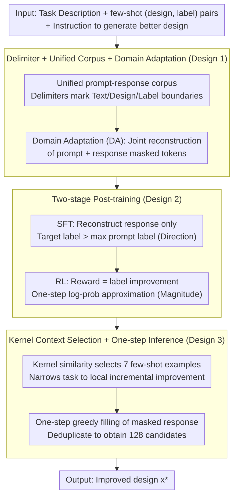

# DiBO: Offline Black-box Optimization with Diffusion Language Models (DNA + Robot Morphology)

**Conference**: ICML 2026 Spotlight  
**arXiv**: [2603.17919](https://arxiv.org/abs/2603.17919)  
**Code**: Available on paper page (link here)  
**Area**: Black-box Optimization / Diffusion Language Model / Design Generation  
**Keywords**: Offline BBO, Diffusion LLM, Bidirectional Modeling, Domain Adaptation, Offline RL

## TL;DR
DiBO adapts the diffusion language model LLaDA-8B for offline black-box optimization. It uses delimiter tokens to unify three heterogeneous signals (prompt/design/label), followed by a three-stage post-training pipeline: Domain Adaptation, Masked-response SFT, and Label-improvement RL. The model achieves SOTA results on several Design-Bench tasks with only 500 labeled samples (e.g., a +8% normalized score gain on DNA tasks) and completes training for a discrete task in 1.5 hours on a single H100.

## Background & Motivation

**Background**: Black-box optimization (BBO) is critical in fields like DNA sequences, robot morphology, and material discovery. However, experimental labeling is expensive, making online optimization unfeasible. Offline BBO assumes a static dataset $\mathcal{D} = \{(\bm{x}_i, y_i)\}$ and aims to find a new design $\bm{x}^*$ that outperforms the dataset. Traditional approaches follow two paths: (a) learning a surrogate $f_\theta(\bm{x})$ followed by gradient ascent (COMs, ICT, MATCH-OPT), though surrogate gradients are unreliable out-of-distribution (OOD); (b) learning inverse generative models (CbAS, MIN, BONET, DDOM) to sample high-scoring designs directly.

**Limitations of Prior Work**: (1) Autoregressive LLMs (OPRO, UniSO-T) generate tokens unidirectionally, but design tasks like DNA involve bidirectional constraints where each site is influenced by both prefix and suffix; (2) existing diffusion BBO methods (DDOM, GTG) mostly use task-specific architectures in continuous spaces, making it difficult to naturally integrate natural language task descriptions; (3) current offline BBO methods suffer from severe overfitting in small-data settings ($N \approx 500$) and lack the relief provided by large model priors.

**Key Challenge**: It is difficult for a single architecture to simultaneously manage bidirectional modeling (suitable for DNA/morphology), integration of textual task descriptions (suitable for general BBO), and the utilization of LLM pre-training priors. Diffusion LLMs are inherently bidirectional, but they are pre-trained on natural text, creating a domain gap with heterogeneous signals like "design tokens + numerical labels."

**Goal**: To adapt diffusion LLMs for BBO, preserving bidirectional modeling advantages while learning the "prompt → superior design" mapping under small-data constraints, and performing fine-grained alignment using RL signals.

**Key Insight**: Solve the semantic conflict between "design/label vs. natural text" using delimiter tokens and a unified prompt-response corpus. Align the model progressively through a three-stage post-training process: masked joint reconstruction, SFT, and RL.

**Core Idea**: Treat the simultaneous prediction of masked prompt and response tokens as the domain adaptation target. Use sample pairs where the response label exceeds all labels in the prompt as SFT data. Finally, utilize "response label - prompt label" as a reward for one-step log-prob RL. This serial workflow allows an 8B diffusion LLM to achieve SOTA in BBO with only 500 samples.

## Method

### Overall Architecture

Input: (1) A natural language task description (including design semantics, format, and optimization goals); (2) a set of few-shot (design, label) pairs; (3) an instruction for the model to "generate a better design." Output: A design + label token sequence wrapped in delimiters.

DiBO adds four components on top of a frozen diffusion LLM: (a) tokenizer extension with two sets of delimiters `|design-start|/|design-end|` and `|label-start|/|label-end|`; (b) a Domain Adaptation (DA) stage jointly predicting masked tokens of prompts and responses in a unified corpus; (c) an SFT stage predicting only masked response tokens, targeting designs with labels higher than those in the prompt; (d) an RL stage using label improvement as a reward, approximated by one-step unmasked log probabilities. During inference, greedy unmasking fills the masked response in one step. The DA→SFT→RL pipeline corresponds to a progression of "recognizing format → providing direction → providing magnitude."

### Key Designs

**1. Delimiter tokens + Unified prompt-response DA: Wrapping heterogeneous signals to teach role boundaries to Diffusion LLMs**

Diffusion LLMs are pre-trained on natural text; feeding "design tokens + numerical labels" directly causes the model to treat labels as noise and fail at segmentation. DiBO extends the tokenizer with 4 delimiters (`|design-start|`, `|design-end|`, `|label-start|`, `|label-end|`). Each sample is formatted as a unified sequence of `[prompt text][few-shot (design, label) pairs][instruction]` + `[response design][response label]`. The DA objective involves reconstructing masked tokens for both prompt and response:

$$\mathcal{L}_{\mathrm{DA}} = -\mathbb{E}\Big[\tfrac{1}{t} \textstyle\sum_{i=1}^{L} \mathbf{1}[q_t^i=[M], o_t^i=[M]] \log p_\theta(q_0^i, o_0^i | q_t, o_t)\Big].$$

Few-shot designs are selected from the offline pool based on kernel similarity to the response design to avoid learning a degenerate mapping. Unlike task-specific architectures like DDOM, this corpus-based approach leverages the pre-training prior and bidirectional attention of the diffusion LLM.

**2. Two-stage post-training: Masked-response SFT for direction, Label-improvement RL for magnitude**

DA only teaches the format. To generate superior designs, the SFT stage freezes the prompt and performs masked reconstruction only on the response: $\mathcal{L}_{\mathrm{SFT}} = -\mathbb{E}[\frac{1}{t} \sum_i \mathbf{1}[o_t^i=[M]] \log p_\theta(o_0^i | q_0, o_t)]$, where the target must satisfy $y(o) > \max y(\text{prompt})$—imposing a hard inductive bias for improvement. The RL stage relaxes this into a continuous reward $r(q, o) = y(o) - y(q)$, with the loss: $\mathcal{L}_{\mathrm{RL}} = -\mathbb{E}[\frac{1}{|o|} \sum_k p_\theta(o_k | q, o_{\text{fullmask}}) \cdot \frac{r(q,o)}{\sigma}]$.

The division of labor is essential: SFT provides the "direction" (to improve), while RL provides the "magnitude" (how much to improve). To make RL feasible for an 8B model on a single GPU, one-step unmasking approximates token-wise log probabilities. While standard diffusion log-probs require stable iterative denoising, design sequences in BBO are short enough for one-step approximation, saving approximately 50× the computation.

**3. Kernel-similarity context selection + One-step greedy inference: Narrows "improvement" to "local steps"**

The assumption of "improving over prompt" fails if the prompt contains only low-scoring designs. During training, DiBO selects the top-7 few-shot examples from the offline pool using kernel similarity $k(o, x_i)$ relative to the target response $o$. This ensures the prompt examples and target are locally close in design space, narrowing the task to "incremental improvement."

Inference uses $n_{few}=7$ in-context examples. A single forward pass with greedy filling is performed on the masked response, and duplicate outputs are discarded until 128 unique candidates are collected. One-step greedy inference is a specific advantage of Diffusion LLMs over AR LLMs for BBO; whereas AR requires $K$ steps for a $K$-token design, diffusion generates it at once.

### Loss & Training

The three stages are serial: DA for 1024 steps (continuous 2048), SFT for 1024 steps, and RL for 128 steps. All stages use PagedAdamW8bit + Bfloat16 + 100-step linear warmup + constant learning rate. Learning rates: $2 \times 10^{-5}$ for DA and SFT, $1 \times 10^{-6}$ for RL to prevent erasing the SFT prior. Each task utilizes an offline pool of 500 samples with $n_{few}=7$ in-context examples.

## Key Experimental Results

### Main Results: Design-Bench (100th percentile normalized score, average of 8 seeds)

| Method | Ant Morphology | D'Kitty Morphology | TF Bind 8 | TF Bind 10 | Average | Rank Mean ↓ |
|------|----------------|---------------------|-----------|------------|------|-------------|
| $\mathcal{D}$(best) | 0.565 | 0.884 | 0.439 | 0.511 | — | — |
| Grad-mean | 0.709 | 0.920 | 0.843 | 0.736 | 0.802 | 4.25 |
| COMs | 0.647 | 0.934 | 0.843 | 0.709 | 0.783 | 4.5 |
| ExPT | **0.929** | 0.950 | 0.810 | 0.703 | 0.848 | 4.0 |
| OPRO (AR LLM) | 0.517 | 0.856 | 0.758 | 0.500 | 0.658 | 14.0 |
| DDOM (Diffusion) | 0.590 | 0.929 | 0.739 | 0.497 | 0.689 | 11.25 |
| MCTS-transfer | 0.648 | 0.910 | 0.857 | 0.628 | 0.761 | 7.25 |
| **DiBO (ours)** | **0.932** | 0.912 | **0.946** | **0.741** | **0.883** | **3.5** |

DiBO ranks first in 3 out of 4 tasks (Ant, TF8, TF10). It leads the strongest baseline by 0.082 on TF Bind 8. On D'Kitty, it slightly trails ExPT by 0.038 but remains competitive. It achieves the best Rank Mean (3.5) and Rank Median (1.0).

### Ablation Study: Diffusion vs. Autoregressive backbone (same DA→SFT→RL process)

| Task | Stage | AR (LLaMA-3.1-8B-Instruct) | DiBO (Diffusion) | Gain |
|------|------|------------------------------|--------------|------|
| TF Bind 8 | DA | 0.803 | 0.883 | +0.080 |
| TF Bind 8 | SFT | 0.875 | 0.939 | +0.064 |
| TF Bind 8 | RL | 0.915 | 0.946 | +0.031 |
| TF Bind 10 | DA | 0.623 | 0.644 | +0.021 |
| TF Bind 10 | SFT | 0.633 | 0.704 | +0.071 |
| TF Bind 10 | RL | 0.682 | 0.741 | +0.059 |
| Ant | RL | 0.930 | 0.932 | +0.002 |
| D'Kitty | RL | 0.912 | 0.912 | 0.000 |

On discrete DNA tasks (TF8/TF10), the diffusion backbone significantly outperforms the AR backbone at all stages, validating that bidirectional modeling provides genuine help for tasks with strong bidirectional dependencies. For continuous robot tasks, the gap narrows, suggesting that 6D/60D continuous designs do not exhibit as strong bidirectional dependencies; the diffusion advantage is primarily centered on discrete + bidirectional scenarios.

### Key Findings

- **Sweet spot for small data + LLM prior**: Achieving SOTA on $N=500$ samples is a highlight; traditional BBO overfits at this scale, while the 8B pre-trained prior acts as a regularizer.
- **Cumulative gains from three-stage post-training**: Score increases across DA → SFT → RL stages (e.g., TF Bind 8 from 0.883 → 0.939 → 0.946), proving they provide complementary signals.
- **OPRO failure highlights the insufficiency of prompting**: OPRO uses prompting without fine-tuning and averages 0.658, much lower than DiBO's 0.883, indicating that LLMs must undergo in-domain adaptation.
- **Training Cost**: One task takes 1.5 GPU hours on a single H100 to complete the full DiBO pipeline, which is extremely efficient for an 8B model.

## Highlights & Insights

- **Delimiters + Unified Corpus is a simple but effective bridge**: Rather than designing a custom architecture, extending the tokenizer with a few tokens resolves heterogeneous signal issues. This method is lightweight and transferable to other "text + numerical + structural" hybrid scenarios.
- **Three-stage post-training matches cognitive hierarchy**: DA teaches format, SFT provides the "superiority" constraint, and RL refines using rewards. This "coarse-to-fine" strategy is a valuable recipe for adapting LLMs to new tasks like scientific discovery.
- **Diffusion LLM advantage over AR LLM in discrete design**: Ablations show diffusion wins in DNA (strong bidirectional) but reaches parity in robot morphology (continuous, weak bidirectional). This provides a specific criterion for when to use diffusion LLMs.
- **One-step unmasking RL cost reduction**: Reducing the RL cost for diffusion models from $N$ denoising steps to 1 step has significant methodological implications for diffusion-based RL.

## Limitations & Future Work

- **Limited Design Space**: Experiments covered DNA (length 8/10) and robot morphology (56D/600D). Scalability to larger spaces (e.g., protein sequences, circuit design) remains unverified.
- **Behavior Policy Assumption**: The RL stage assumes a uniform distribution for the old policy to skip the IS ratio. In offline data with non-uniform distributions, this might introduce bias.
- **Kernel Similarity Vulnerability**: Selecting top-7 examples close to the target might inadvertently leak target information into the prompt, requiring stricter discussion on data leakage.
- **Diminishing gains on TF Bind 10**: The gain on TF10 (+0.005) is significantly smaller than on TF8 (+0.082), possibly due to label noise or scale issues.

## Related Work & Insights

- **vs. OPRO (AR LLM Direct Prompting)**: OPRO uses prompting without tuning; DiBO proves that fine-tuning is necessary.
- **vs. DDOM / GTG (Diffusion BBO)**: These use task-specific diffusion in continuous spaces; DiBO uses a general diffusion LLM to unify text, design, and labels.
- **vs. dLLM (Inference-time MCTS)**: dLLM freezes the model and uses MCTS; DiBO performs direct fine-tuning, demonstrating that training-time adaptation can yield superior results with lower inference costs.
- **Inspiration**: For any field requiring LLMs to handle structured non-textual signals, the "delimiter + unified corpus + three-stage tuning" approach is a universal recipe.

## Rating

- Novelty: ⭐⭐⭐⭐ Systematically adapting diffusion LLMs to BBO is a new paradigm.
- Experimental Thoroughness: ⭐⭐⭐⭐ Covered 4 Design-Bench tasks, 10+ baselines, and rigorous backbone ablations.
- Writing Quality: ⭐⭐⭐⭐ Clear flowcharts and mathematical expressions.
- Value: ⭐⭐⭐⭐⭐ Direct industrial applicability for small-data BBO (drugs, materials, robots).

<!-- RELATED:START -->

## Related Papers

- [\[ICML 2026\] Position: Good Embodied Reward Models Need Bad Behavior Data](position_good_embodied_reward_models_need_bad_behavior_data.md)
- [\[ICML 2026\] HDFlow: Hierarchical Diffusion-Flow Planning for Long-horizon Tasks](hdflow_hierarchical_diffusion-flow_planning_for_long-horizon_tasks.md)
- [\[ICML 2026\] TimeRewarder: Learning Dense Reward from Passive Videos via Frame-wise Temporal Distance](timerewarder_learning_dense_reward_from_passive_videos_via_frame-wise_temporal_d.md)
- [\[ICML 2026\] WestWorld: 知识编码的可扩展轨迹世界模型](westworld_a_knowledge-encoded_scalable_trajectory_world_model_for_diverse_roboti.md)
- [\[ICML 2026\] Optimal and Scalable MAPF via Multi-Marginal Optimal Transport and Schrödinger Bridges](optimal_and_scalable_mapf_via_multi-marginal_optimal_transport_and_schrödinger_b.md)

<!-- RELATED:END -->
