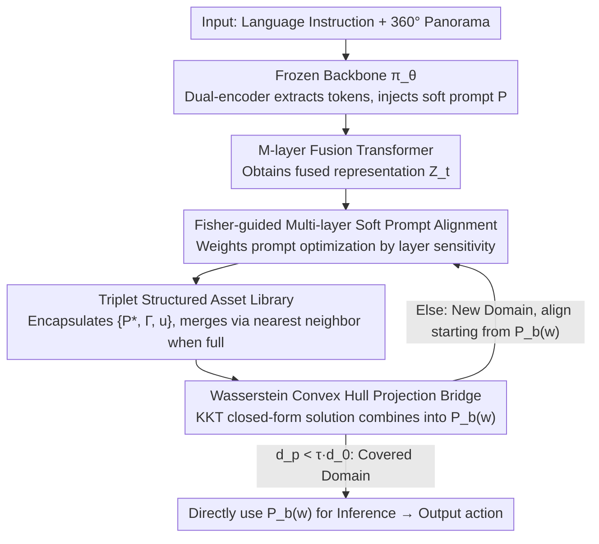

# Turning Adaptation into Assets: Cross-Domain Bridging for Online Vision-Language Navigation

**Conference**: ICML 2026  
**arXiv**: [2605.23257](https://arxiv.org/abs/2605.23257)  
**Code**: None  
**Area**: Multimodal VLM / Vision-Language Navigation / Test-Time Adaptation  
**Keywords**: VLN, Test-Time Adaptation, Soft Prompt, Fisher Information, Convex Hull Projection

## TL;DR
To address the continuous environment distribution shift in online vision-language navigation, this paper proposes the IDEA framework. It encapsulates soft prompts learned during each test-time adaptation, along with domain coordinates and uncertainty, into reusable "assets." It then uses Wasserstein convex hull projection to map the target domain onto a combination of historical assets, obtaining a training-free cross-domain bridge. This achieves an average of +2.5% SR and +1.9% SPL on REVERIE / R2R.

## Background & Motivation

**Background**: Vision-Language Navigation (VLN) requires an embodied agent to find target locations in 3D environments based on language instructions. The mainstream approach is to pre-train a Transformer strategy using large-scale imitation learning and then deploy it directly in new environments. When encountering distribution shifts, recent research has introduced Test-Time Adaptation (TTA) into VLN, mainly categorized into uncertainty-based self-training via entropy minimization (e.g., FSTTA, ReCAP) and reward-driven adjustments based on foundation models or human feedback.

**Limitations of Prior Work**: Existing methods treat the environment of each episode as an isolated transfer task. Every online update overwrites the original parameters, leading to two specific consequences: first, **catastrophic forgetting**, where adaptation learned in previous similar scenes is erased by new updates; second, **negative transfer**, where updates learned in the current domain are blindly applied to the next domain with a completely different style, introducing mismatched priors that degrade performance.

**Key Challenge**: There is a fundamental conflict between viewing adaptation as "transient, isolated parameter updates" and the reality that "correlated or repeating scenes frequently appear in VLN." The former fails to consolidate historical experience into reusable assets, causing all efforts to reset after an episode ends.

**Goal**: Transform TTA in VLN from a "one-time update" into "continuous knowledge accumulation and composition," while ensuring it is plug-and-play, retrievable, and training-free.

**Key Insight**: The authors redefine adaptation as an asset accumulation process. Instead of modifying global parameters, each TTA produces a lightweight asset with "domain coordinates" stored in a finite-capacity library. When facing a new domain, rather than optimizing from scratch, the agent finds an optimal linear combination within the **convex hull** of historical assets to serve as initialization. This approach is promising because adjacent episodes often overlap highly in visual style and semantic priors, and convex combinations naturally reuse partially relevant history rather than all of it.

**Core Idea**: Use Fisher information-weighted multi-layer prompt alignment to solidify domain adaptation into triplet assets $\{P^*, \Gamma, u\}$. Then, use the closed-form solution of Wasserstein convex hull projection to express the target domain as a linear combination of historical assets, serving as a training-free cross-domain bridge.

## Method

### Overall Architecture
The policy backbone $\pi_\theta$ remains frozen throughout. The input consists of a language instruction $I$ and 360° panoramic observations, while the output is an action sequence. IDEA prepends a set of learnable soft prompts $P = \{p_i\}_{i=1}^{L}$ to the visual token sequence. The tokens following the prompts are fed into $M$ layers of the original fusion transformer to obtain the fused representation $\mathcal{Z}_t^{(\ell)}$. During each navigation step, IDEA first constructs a composite bridge prompt $P_b(w)$ from the historical asset library $\mathcal{M}$ as initialization. It then decides whether to use this bridge directly for inference or use it as a starting point for further optimization into a new asset based on whether the prompt significantly reduces the statistical distance from the source domain. The three designs form a complementary loop: a longer, richer asset library provides more bases for the convex hull bridge, while the good initialization from the bridge in turn accelerates the next asset optimization.

### Key Designs

**1. Fisher-guided Multi-layer Soft Prompt Alignment: Aligning only the layers that truly affect decision-making**

When solidifying current domain adaptation into prompts, a hidden risk is that a prompt at a certain layer might align the statistics but not change the action probabilities at all, indicating it is merely fitting task-irrelevant noise. IDEA suppresses such "spurious alignment" using Fisher information. It pre-calculates $(\mu_S^{(\ell)}, \sigma_S^{(\ell)})$ for each layer using 128 source domain samples. During online deployment, it aligns the current batch statistics $(\mu_t^{(\ell)}, \sigma_t^{(\ell)})$ toward the source statistics. The layer-wise loss is:

$$d^{(\ell)}(P) = \|\mu_S^{(\ell)} - \mu_t^{(\ell)}(P)\|_2 + \|\sigma_S^{(\ell)} - \sigma_t^{(\ell)}(P)\|_2$$

The weights $\alpha_\ell$ for each layer are not manually set but updated via EMA ($\beta = 0.1$) after normalizing the trace of the Fisher Information Matrix $\mathrm{Tr}(\Phi(\mathcal{Z}_t^{(\ell)}))$. The Fisher matrix approximates the Hessian using the first-order gradient of the policy log-likelihood, avoiding second-order computation costs. This automatically concentrates weights on layers truly sensitive to actions, ensuring the prompt encodes transferable task priors rather than irrelevant statistics.

**2. Triplet Structured Asset Library: Assigning a "domain fingerprint + quality score" to each prompt**

To make adaptation knowledge reusable, storing prompts alone is insufficient; their domain and reliability must also be known. IDEA encapsulates each optimization result into a triplet $\mathcal{A} := \{P^*, \Gamma, u\}$: $P^*$ is the optimized prompt, $\Gamma$ is the $(\mu, \sigma)$ statistics of the final fusion layer **without the prompt** (acting as an environment descriptor decoupled from the prompt), and $u$ is the prediction entropy during inference with $P^*$ (reflecting asset reliability). Using "statistics without the prompt" as domain coordinates is key—it prevents the retrieval key from being contaminated by the prompt's own perturbations, allowing for fair comparison between assets. When the library reaches its capacity $K_{\max}$, instead of discarding the oldest, the new asset is merged with its nearest neighbor via a 1:1 average ($\mathcal{A}_k \leftarrow \frac{1}{2}(\mathcal{A}_k + \mathcal{A}^*)$), ensuring the library covers early scenes rather than drifting to only recent ones.

**3. Wasserstein Convex Hull Projection Bridge: Finding initialization on the convex hull of historical assets**

When facing a new domain, hard retrieval of a single nearest neighbor easily leads to mismatching—the target domain often partially overlaps with multiple historical domains. IDEA instead finds an optimal linear combination on the convex hull of $K$ historical assets. It uses a set of shared weights $w \in \mathbb{R}^K$ to interpolate simultaneously in both the prompt space and the statistical space: $P_b(w) = \sum_j w_j P_j$ and $\Gamma_b(w) = \sum_j w_j \Gamma_j$. The weights $w$ are solved by minimizing the 2-Wasserstein distance between the target statistics and $\Gamma_b(w)$, with an added uncertainty regularization $\lambda \sum u_j w_j^2$ to suppress unreliable assets. The problem is reduced to a quadratic programming problem under simplex constraints:

$$\min_w \|Aw - b\|_2^2 + \lambda w^\top U w \quad \text{s.t.}\quad \mathbf{1}^\top w = 1,\; w \geq 0$$

The authors derive a closed-form solution using KKT conditions: $w^* = \mathcal{H}^{-1}(g - \nu \mathbf{1})$, where $\mathcal{H} = A^\top A + \lambda U$ and $\nu = \frac{\mathbf{1}^\top \mathcal{H}^{-1} g - 1}{\mathbf{1}^\top \mathcal{H}^{-1} \mathbf{1}}$. Convex combinations naturally support "borrowing a part of style from A + a part of layout from B," and the closed-form solution bypasses iterative optimization, making this bridge a truly training-free shortcut.

### Loss & Training
Single-step process: First, calculate $w$ and the bridge $P_b(w)$ via Eq. 12. Measure the statistical distances $d_p$ and $d_0$ before and after adding the prompt. If $d_p < \tau \cdot d_0$, it is considered a covered domain, and inference proceeds directly with $P_b(w)$. Otherwise, it is a new domain; perform multi-layer alignment optimization initialized from $P_b(w)$ to obtain a new asset and store it in the library according to the capacity strategy. Theoretical side: Convex hull projection weights tighten the upper bound of the target domain generalization error; the closed-form solution is Lipschitz stable with respect to statistical estimation perturbations.

## Key Experimental Results

### Main Results

| Dataset (Eval) | Metric | Ours (IDEA) | Prev. SOTA | Gain |
|----------------|--------|-------------|------------|------|
| REVERIE Val unseen (HAMT) | SR | 34.92 | 33.06 (ReCAP) | +1.86 |
| REVERIE Val unseen (HAMT) | SPL | 31.52 | 30.51 (FSTTA) | +1.01 |
| REVERIE Test unseen (HAMT) | SR | 32.81 | 30.51 (ReCAP) | +2.30 |
| REVERIE Val seen (HAMT) | OSR | 50.67 | 48.49 (ReCAP) | +2.18 |
| REVERIE Val seen (HAMT) | RGSPL | 26.82 | 25.81 (Tent) | +1.01 |

The advantage is maintained consistently across four backbones (HAMT / DUET, etc.) and three benchmarks (REVERIE / R2R / R2R-CE).

### Ablation Study

| Configuration | Key Effect | Description |
|---------------|------------|-------------|
| Full IDEA | Full SR=34.92 | Fisher weighting + Asset library + Convex hull bridge |
| Equality weighting (w/o Fisher) | Significant drop | No longer distinguishes policy-sensitive layers; prompts fit irrelevant noise |
| Hard nearest neighbor (w/o Convex Hull) | Performance drop | Single historical asset cannot cover partially overlapping new domains |
| Optimization from scratch (w/o Bridge) | Latency increase | Loses the training-free shortcut |

### Key Findings
- On HAMT, IDEA’s inference latency is 245.8ms, slightly higher than SAR (197ms) but much lower than ViDA ($5.49 \times 10^3$ ms) and FSTTA (613ms), proving the overhead of the closed-form KKT solution is acceptable.
- Performance gains on the harder Test unseen split (+2.30 SR) are larger than on Val unseen (+1.86 SR), indicating the asset library provides greater benefits in truly unfamiliar environments—exactly where historical reuse should excel.
- The paper validates "asset library portability"—a library learned by one agent can be directly used by a new agent to skip the cold-start phase, a byproduct of the plug-and-play design.

## Highlights & Insights
- **Reaching beyond "parameter-level updates" to "knowledge-level accumulation" in TTA**: This is a conceptual shift that gives online VLN truly reusable intermediate products for the first time, rather than gradient steps that evaporate after each episode.
- **Fisher trace as a "functional vs. spurious" alignment discriminator**: Approximating the Hessian with first-order gradients avoids second-order costs. This idea is highly generalizable to other tasks needing to distinguish whether statistical matching affects decision-making.
- **Combination of Convex Hull + KKT Closed-form Solution**: Compressing a seemingly expensive geometric projection problem into a few matrix operations is a classic way to deploy theoretical tools into real-time systems. This can be transferred to other "prototype combination" scenarios (e.g., few-shot retrieval, model merging).
- **Using "statistics without prompt" as domain coordinates**: Decoupling the retrieval key from the learnable content is a trick worth adopting in any prompt-based continual learning to avoid unfair comparisons between assets caused by their unique prompt perturbations.

## Limitations & Future Work
- The merging strategy for library capacity $K_{\max}$ is a simple 1:1 nearest neighbor average, which might "blur" assets over time and lose precise characterization of rare scenes. Sophisticated merging/eviction based on frequency or uncertainty could be explored.
- The convex hull projection assumes the target domain must fall within the convex combination of history; for extreme, unseen scenarios (out-of-library coverage), it degrades to nearest neighbor performance. The paper does not fully discuss failure modes in such OOD-of-library cases.
- EMA coefficient $\beta = 0.1$ and uncertainty regularization $\lambda$ are fixed hyperparameters; whether they are universal across different backbones/benchmarks requires systematic sensitivity analysis.
- Theoretical results rely on the assumption that "features follow a multivariate Gaussian distribution." Empirical validation of whether real fusion features in VLN satisfy this assumption is missing.

## Related Work & Insights
- **vs FSTTA / ReCAP**: Both are online TTA for VLN. While they perform "consistency/entropy minimization updates on fixed parameters," this paper solidifies each update into stored assets. The difference is that their updates reset after an episode, whereas this paper builds a long-term library. The advantage here is mitigating catastrophic forgetting, while the disadvantage is the extra library management components.
- **vs Tent / SAR**: Classic TTA uses BN calibration/entropy regularization. This paper upgrades them to prompt-level updates + multi-layer weighting + Fisher guidance. It narrows "what to update" from all BN layers to a set of prompts and changes the "success metric" from entropy to policy-sensitive layers.
- **vs ViDA**: Also uses prompts for TTA, but ViDA re-optimizes at every step without reuse. This paper uses convex hull projection to combine multiple prompts and skip optimization, achieving an order of magnitude speedup in latency.

## Rating
- **Novelty**: ⭐⭐⭐⭐⭐ Reframing TTA as "Asset Accumulation + Convex Hull Bridging" is a truly new abstraction, not just a collection of common tricks.
- **Experimental Thoroughness**: ⭐⭐⭐⭐ Comparison across four backbones, three benchmarks, and multiple TTA baselines is solid, though ablation scans for $K_{\max}$ and Fisher alternatives could be finer.
- **Writing Quality**: ⭐⭐⭐⭐ Logic is clear, and the method figure effectively maps to the three designs, though the KKT derivation and Fisher approximation have a high barrier for non-TTA readers.
- **Value**: ⭐⭐⭐⭐⭐ The proposed plug-and-play asset library sharing between agents has direct significance for real-world embodied AI deployment.

<!-- RELATED:START -->

## Related Papers

- [\[ICLR 2026\] All-day Multi-scenes Lifelong Vision-and-Language Navigation with Tucker Adaptation](../../ICLR2026/robotics/all-day_multi-scenes_lifelong_vision-and-language_navigation_with_tucker_adaptat.md)
- [\[ICCV 2025\] Bridging Domain Generalization to Multimodal Domain Generalization via Unified Representations](../../ICCV2025/robotics/bridging_domain_generalization_to_multimodal_domain_generalization_via_unified_r.md)
- [\[CVPR 2026\] Bridging the 2D-3D Gap: A Hierarchical Semantic-Geometric Map for Vision Language Navigation](../../CVPR2026/robotics/bridging_the_2d-3d_gap_a_hierarchical_semantic-geometric_map_for_vision_language.md)
- [\[CVPR 2026\] Cross from Left to Right Brain: Adaptive Text Dreamer for Vision-and-Language Navigation](../../CVPR2026/robotics/cross_from_left_to_right_brain_adaptive_text_dreamer_for_vision-and-language_nav.md)
- [\[CVPR 2026\] Cross-Domain Demo-to-Code via Neurosymbolic Counterfactual Reasoning](../../CVPR2026/robotics/cross-domain_demo-to-code_via_neurosymbolic_counterfactual_reasoning.md)

<!-- RELATED:END -->
