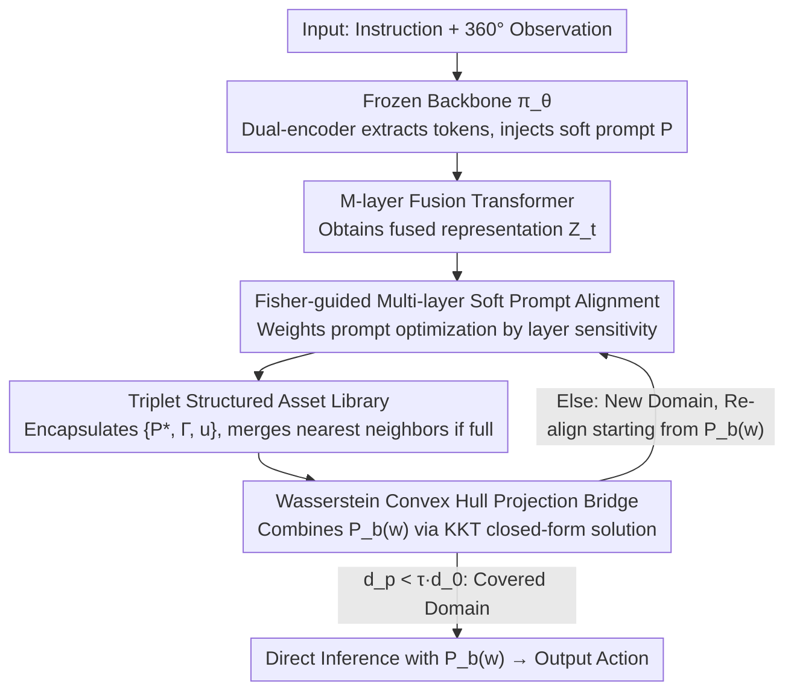

# Turning Adaptation into Assets: Cross-Domain Bridging for Online Vision-Language Navigation

**Conference**: ICML 2026  
**arXiv**: [2605.23257](https://arxiv.org/abs/2605.23257)  
**Code**: None  
**Area**: Multimodal VLM / Vision-Language Navigation / Test-Time Adaptation  
**Keywords**: VLN, Test-Time Adaptation, Soft Prompt, Fisher Information, Convex Hull Projection

## TL;DR
To address the continuous environment distribution drift in online vision-language navigation, this paper proposes the IDEA framework. It encapsulates soft prompts learned during each test-time adaptation, along with domain coordinates and uncertainty, into reusable "assets." By utilizing Wasserstein convex hull projection to map the target domain onto a combination of historical assets, a training-free cross-domain bridge is achieved, resulting in an average improvement of +2.5% SR and +1.9% SPL on REVERIE / R2R.

## Background & Motivation

**Background**: Vision-Language Navigation (VLN) requires an embodied agent to find target locations in 3D environments based on linguistic instructions. The mainstream approach involves pre-training a Transformer policy using large-scale imitation learning, followed by direct deployment in new environments. When encountering distribution drift, recent research has introduced Test-Time Adaptation (TTA) to VLN, primarily categorized into uncertainty-driven self-training based on entropy minimization (e.g., FSTTA, ReCAP) and reward-driven adjustments based on foundation models or human feedback.

**Limitations of Prior Work**: Existing methods treat the environment of each episode as an isolated transfer task. Every online update overwrites the original parameters, leading to two specific consequences: first, **catastrophic forgetting**, where adaptations learned during visits to similar scenes are washed away by new updates; second, **negative transfer**, where updates learned in the current domain are blindly applied to a subsequent domain with a completely different style, introducing mismatched priors that degrade performance.

**Key Challenge**: There is a fundamental conflict between treating adaptation as "transient, isolated parameter updates" and the "frequent occurrence of related or repeated scenes in VLN." The former fails to consolidate historical experience into reusable assets, meaning all efforts are reset after an episode ends.

**Goal**: Transform TTA in VLN from "one-off updates" into "continuous accumulation and combination of knowledge," while ensuring the approach is plug-and-play, searchable, and training-free.

**Key Insight**: The authors redefine adaptation as a process of asset accumulation. Instead of modifying global parameters, each TTA trial produces a lightweight asset with "domain coordinates," stored in a finite-capacity library. When facing a new domain, rather than optimizing from scratch, the agent finds an optimal linear combination on the **convex hull** of historical assets to serve as an initialization. This approach is promising because adjacent episodes often overlap significantly in visual style and semantic priors, and convex combinations naturally allow for the reuse of partially relevant historical data.

**Core Idea**: Use Fisher information-weighted multi-layer prompt alignment to solidify domain-specific adaptations into triplet assets $\{P^*, \Gamma, u\}$. Then, use the closed-form solution of Wasserstein convex hull projection to represent the target domain as a linear combination of historical assets, serving as a training-free cross-domain bridge.

## Method

### Overall Architecture
The policy backbone $\pi_\theta$ remains frozen throughout. The input consists of a linguistic instruction $I$ and 360° panoramic observations, while the output is an action sequence. IDEA prepends a set of learnable soft prompts $P = \{p_i\}_{i=1}^{L}$ to the visual token sequence. The tokens following the prompt are fed into $M$ layers of the original fusion transformer to obtain fused representations $\mathcal{Z}_t^{(\ell)}$. During each navigation step, IDEA first constructs a bridge prompt $P_b(w)$ from the historical asset library $\mathcal{M}$ as an initialization. Based on whether the prompt significantly reduces the statistical distance to the source domain, IDEA decides to either use this bridge directly for inference or use it as a starting point for further optimization into a new asset to be stored. These three designs form a complementary loop: a larger asset library provides more bases for the convex hull bridge, while the bridge provides a superior initialization that accelerates subsequent asset optimization.

### Key Designs

**1. Fisher-guided multi-layer soft prompt alignment: Aligning only layers that truly affect decisions**

When solidifying domain adaptation into prompts, a hidden risk exists: a prompt at a certain layer might align statistical distributions without changing action probabilities, indicating it is merely fitting task-irrelevant noise. IDEA suppresses this "spurious alignment" using Fisher information. It pre-calculates $(\mu_S^{(\ell)}, \sigma_S^{(\ell)})$ for each layer using 128 source domain samples. During online phase, it aligns the batch statistics $(\mu_t^{(\ell)}, \sigma_t^{(\ell)})$ toward the source, with the per-layer loss defined as:

$$d^{(\ell)}(P) = \|\mu_S^{(\ell)} - \mu_t^{(\ell)}(P)\|_2 + \|\sigma_S^{(\ell)} - \sigma_t^{(\ell)}(P)\|_2$$

The layer weights $\alpha_\ell$ are not manually set but updated via EMA ($\beta = 0.1$) using the normalized trace of the Fisher Information Matrix $\mathrm{Tr}(\Phi(\mathcal{Z}_t^{(\ell)}))$. The Fisher matrix approximates the Hessian using the first-order gradient of the policy log-likelihood, saving second-order computation costs. This automatically concentrates weights on layers sensitive to actions, ensuring prompts encode transferable task priors rather than irrelevant statistics.

**2. Triplet structured asset library: Assigning a "domain fingerprint + quality score" to each prompt**

To make adaptation knowledge reusable, storing prompts alone is insufficient; their associated domains and reliability must also be known. IDEA encapsulates each optimization result into a triplet $\mathcal{A} := \{P^*, \Gamma, u\}$. $P^*$ is the optimized prompt, $\Gamma$ represents the fusion layer $(\mu, \sigma)$ statistics **without the prompt** (serving as a prompt-decoupled environment descriptor), and $u$ is the predictive entropy during inference with $P^*$ (reflecting asset reliability). Using "unprompted statistics" as domain coordinates is critical—it prevents contamination from prompt perturbations during retrieval, allowing for fair comparison between assets. When the library reaches its maximum capacity $K_{\max}$, instead of discarding the oldest entry, IDEA merges the new asset with its nearest neighbor using a 1:1 average ($\mathcal{A}_k \leftarrow \frac{1}{2}(\mathcal{A}_k + \mathcal{A}^*)$). This ensures the library does not drift to only contain recent assets, preserving coverage of early scenes.

**3. Wasserstein convex hull projection bridge: Finding new domain initializations on the historical asset convex hull**

When facing a new domain, hard retrieval of a single nearest neighbor often leads to mismatching, as target domains frequently overlap partially with multiple historical domains. IDEA instead finds an optimal linear combination on the convex hull of $K$ historical assets. It uses a set of shared weights $w \in \mathbb{R}^K$ to interpolate simultaneously in the prompt space and statistical space: $P_b(w) = \sum_j w_j P_j$ and $\Gamma_b(w) = \sum_j w_j \Gamma_j$. The weights $w$ are solved by minimizing the 2-Wasserstein distance between the target statistics and $\Gamma_b(w)$, with an added uncertainty regularization $\lambda \sum u_j w_j^2$ to suppress unreliable assets. The problem reduces to quadratic programming under simplex constraints:

$$\min_w \|Aw - b\|_2^2 + \lambda w^\top U w \quad \text{s.t.}\quad \mathbf{1}^\top w = 1,\; w \geq 0$$

The authors derive a closed-form solution $w^* = \mathcal{H}^{-1}(g - \nu \mathbf{1})$ using KKT conditions, where $\mathcal{H} = A^\top A + \lambda U$ and $\nu = \frac{\mathbf{1}^\top \mathcal{H}^{-1} g - 1}{\mathbf{1}^\top \mathcal{H}^{-1} \mathbf{1}}$. This convex combination naturally supports "borrowing style from A and layout from B," while the closed-form solution bypasses iterative optimization, making the bridge a truly training-free shortcut.

### Loss & Training
Single-step workflow: First, calculate $w$ and the bridge $P_b(w)$ via Eq. 12. Measure statistical distances $d_p$ and $d_0$ before and after applying the prompt. If $d_p < \tau \cdot d_0$, it is treated as a covered domain, and inference proceeds directly with $P_b(w)$. Otherwise, it is treated as a new domain; multi-layer alignment optimization is performed starting from $P_b(w)$ to generate a new asset for the library. Theoretically, the convex hull projection weights tighten the upper bound of the target domain generalization error, and the closed-form solution is Lipschitz stable regarding statistical estimation perturbations.

## Key Experimental Results

### Main Results

| Dataset (Eval) | Metric | Ours (IDEA) | Prev. SOTA | Gain |
|---------------|------|-----------|-----------|------|
| REVERIE Val unseen (HAMT) | SR | 34.92 | 33.06 (ReCAP) | +1.86 |
| REVERIE Val unseen (HAMT) | SPL | 31.52 | 30.51 (FSTTA) | +1.01 |
| REVERIE Test unseen (HAMT) | SR | 32.81 | 30.51 (ReCAP) | +2.30 |
| REVERIE Val seen (HAMT) | OSR | 50.67 | 48.49 (ReCAP) | +2.18 |
| REVERIE Val seen (HAMT) | RGSPL | 26.82 | 25.81 (Tent) | +1.01 |

The method maintains consistent advantages across four backbones (HAMT, DUET, etc.) and three benchmarks (REVERIE, R2R, R2R-CE).

### Ablation Study

| Configuration | Key Effect | Description |
|------|---------|------|
| Full IDEA | Full SR=34.92 | Fisher weighting + Asset library + Convex hull bridge |
| Equal-weighted alignment (w/o Fisher) | Performance drop | Fails to distinguish policy-sensitive layers; prompts fit irrelevant noise |
| Hard nearest neighbor (w/o Convex Hull) | Performance drop | Single historical assets cannot cover partially overlapping new domains |
| Per-step optimization (w/o Bridge Init) | Latency increase | Loses the training-free shortcut for inference |

### Key Findings
- On HAMT, IDEA's inference latency is 245.8ms, slightly higher than SAR (197ms) but significantly lower than ViDA ($5.49 \times 10^3$ ms) and FSTTA (613ms), proving the acceptable overhead of the closed-form KKT solution.
- The performance gain on the more difficult "Test unseen" split (+2.30 SR) is greater than on "Val unseen" (+1.86 SR), suggesting that the asset library provides greater benefits in truly unfamiliar environments—a scenario where historical reuse should excel.
- The paper validates "asset library portability"—a library learned by one agent can be directly used by a new agent to skip the cold-start phase, a byproduct of the plug-and-play design.

## Highlights & Insights
- **Abstracting TTA from "parameter-level updates" to "knowledge-level accumulation"**: This conceptual shift allows online VLN to have truly reusable intermediate products for the first time, rather than gradient steps that evaporate after an episode.
- **Fisher trace as a "functional vs. spurious" alignment discriminator**: Approximating the Hessian with first-order gradients avoids second-order costs. This is a versatile idea for tasks requiring distinction on whether statistical matching impacts decision-making.
- **Combining Convex Hull + KKT Closed-form solution**: Reducing an expensive geometric projection problem to a few matrix operations is a model approach for bringing theoretical tools into real-time systems. This can be transferred to other "prototype combination" scenarios (e.g., few-shot retrieval, model merging).
- **Using "unprompted statistics" as domain coordinates**: Decoupling the retrieval key from the learnable content is a trick worth adopting in any prompt-based continual learning to prevent disparate prompt perturbations from hindering fair comparisons within the library.

## Limitations & Future Work
- The 1:1 averaging strategy for the $K_{\max}$ library capacity limit may lead to "blurring" of assets over time, potentially losing precise depictions of rare scenes. More sophisticated merging or eviction strategies based on frequency or uncertainty could be explored.
- The convex hull projection assumes the target domain must fall within the convex combination of historical assets. For truly unseen extreme scenarios (outside library coverage), it degrades to nearest-neighbor performance; the paper does not fully discuss failure modes in these OOD-of-library cases.
- The Fisher trace EMA coefficient $\beta = 0.1$ and the uncertainty regularization $\lambda$ are fixed hyperparameters. Their universality across different backbones and benchmarks requires more systematic sensitivity analysis.
- Theoretical results are built on the assumption that "features follow a multivariate Gaussian distribution." Empirical validation of whether real fusion features in VLN satisfy this assumption is lacking.

## Related Work & Insights
- **vs. FSTTA / ReCAP**: These are also online TTA methods for VLN. They perform "consistency/entropy minimization updates on fixed parameters." IDEA freezes each update as an asset; while former methods reset updates after an episode, IDEA accumulates a long-term reusable library. IDEA significantly mitigates catastrophic forgetting but introduces library storage/retrieval components.
- **vs. Tent / SAR**: Classical TTA uses BN calibration and entropy regularization. IDEA upgrades these to the prompt level with multi-layer weighting and Fisher guidance. It narrows "what to update" from all BN parameters to a set of prompts and changes "how to measure update validity" from entropy to policy sensitivity.
- **vs. ViDA**: ViDA also uses prompts for TTA but re-optimizes at every step without reuse. IDEA uses convex hull projection to combine prompts and skip optimization, achieving an order of magnitude faster latency than ViDA.

## Rating
- Novelty: ⭐⭐⭐⭐⭐ Reframing TTA as "Asset Accumulation + Convex Hull Bridge" is a genuinely new abstraction rather than a simple collection of tricks.
- Experimental Thoroughness: ⭐⭐⭐⭐ Extensive comparisons across four backbones, three benchmarks, and multiple TTA baselines, though ablation scans on $K_{\max}$ and Fisher alternatives could be more detailed.
- Writing Quality: ⭐⭐⭐⭐ The logical chain is clear, and the method diagram effectively maps to the designs. However, the KKT derivation and Fisher approximation sections may have a high barrier for readers without a TTA background.
- Value: ⭐⭐⭐⭐⭐ The proposed plug-and-play asset library is shareable across different agents, which has direct implications for real-world embodied AI deployment.

<!-- RELATED:START -->

## Related Papers

- [\[ICML 2026\] Online Self-Training for Co-Adaptation in Hierarchical Diffusion Policies](online_self-training_for_co-adaptation_in_hierarchical_diffusion_policies.md)
- [\[ICLR 2026\] All-day Multi-scenes Lifelong Vision-and-Language Navigation with Tucker Adaptation](../../ICLR2026/robotics/all-day_multi-scenes_lifelong_vision-and-language_navigation_with_tucker_adaptat.md)
- [\[ICCV 2025\] Bridging Domain Generalization to Multimodal Domain Generalization via Unified Representations](../../ICCV2025/robotics/bridging_domain_generalization_to_multimodal_domain_generalization_via_unified_r.md)
- [\[CVPR 2026\] Bridging the 2D-3D Gap: A Hierarchical Semantic-Geometric Map for Vision Language Navigation](../../CVPR2026/robotics/bridging_the_2d-3d_gap_a_hierarchical_semantic-geometric_map_for_vision_language.md)
- [\[CVPR 2026\] Cross from Left to Right Brain: Adaptive Text Dreamer for Vision-and-Language Navigation](../../CVPR2026/robotics/cross_from_left_to_right_brain_adaptive_text_dreamer_for_vision-and-language_nav.md)

<!-- RELATED:END -->
