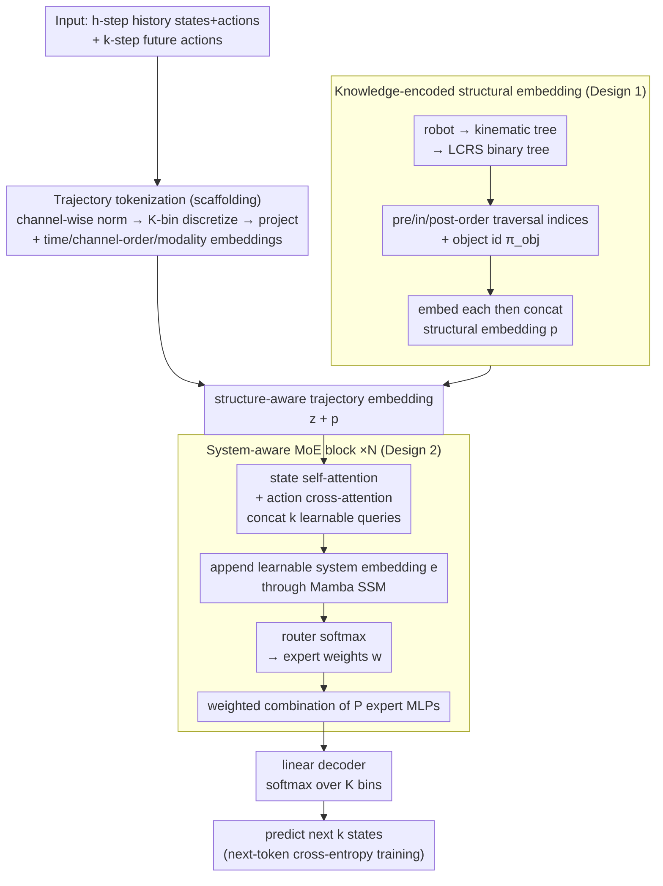

# WestWorld: Scalable Trajectory World Models with Knowledge Encoding

**Conference**: ICML 2026 Spotlight  
**arXiv**: [2603.14392](https://arxiv.org/abs/2603.14392)  
**Code**: https://github.com/511205787/WestWorld  
**Area**: Robotics / Embodied AI / World Models  
**Keywords**: World Models, Knowledge Encoding, Trajectory Prediction, Robot Diversity, Cross-Embodiment

## TL;DR
WestWorld unifies the trajectory dynamics of diverse heterogeneous robots into one scalable world model using a system-aware MoE (Sys-MoE) plus a knowledge-encoded structural embedding—after pretraining on 89 simulated and real environments, it achieves markedly lower zero-/few-shot trajectory-prediction MAE/MSE than MLP Ensemble, TDM, and TrajWorld, improves downstream MPPI control, and deploys successfully to a real Unitree Go1.

## Background & Motivation

**Background**: A trajectory world model builds dynamics directly on low-level state-action signals (joint positions/velocities, torques, etc.), and is a foundational component for robot dynamics learning, planning, and control; the complementary line uses video generation to model observations implicitly. The hardest obstacle to extending a trajectory world model to many heterogeneous robots is that different robots differ enormously in sensor/actuator dimensionality, sampling rate, and kinematic structure.

**Limitations of Prior Work**: Recent methods (TDM, TrajWorld, etc.) quantize each system's continuous states/actions into tokens and jointly train a flexible Transformer, enabling multi-system pretraining inside a single dense model. But two fundamental limitations remain: (1) **Scalability**—forcing wildly different dynamics to share one dense parameter set causes gradient conflicts and negative transfer, so performance drops as robot diversity grows; (2) **Zero-shot generalization**—treating trajectories as pure token sequences discards robot morphological structure, leaving no physical inductive bias and yielding poor generalization to unseen robots. (Earlier zero-padding-to-max-dimension approaches are limited by dimensionality caps and degrade cross-environment generalization.)

**Goal**: Use a single model to learn the dynamics of $n$ different robotic systems, achieving both scalable pretraining (with the number of robots) and zero-/few-shot generalization to new systems.

**Core Idea**: The model has two core components—(1) a **Knowledge-Encoded Embedding (KNEE) Modular** that injects robot morphological connectivity into trajectory representations as an inductive bias, improving zero-shot generalization; (2) a **System-aware Mixture-of-Experts (Sys-MoE)** that implicitly learns per-system dynamics by dynamically routing/combining experts via a learnable system embedding, isolating cross-robot interference and improving scalability. The underlying hypothesis: complex system dynamics can be approximated by composing a set of "basis dynamics" with system-dependent coefficients, so each expert learns part of the basis and the system embedding computes the combination weights.

## Method

### Overall Architecture
WestWorld must use one model to do trajectory world-model prediction for many heterogeneous robots (arms, quadrupeds, humanoids, etc.), facing two tensions: first, the huge differences in sensor/actuator dimensionality and dynamics across robots mean that cramming them into one shared dense parameter set causes gradient conflicts and negative transfer that block scaling as robot variety grows; second, modeling trajectories as pure token sequences discards morphological structure and lacks physical inductive bias, so zero-shot transfer to unseen robots generalizes poorly.

The pipeline runs as follows: first, treat each state/action dimension of a trajectory as a scalar **channel**, do channel-wise min-max normalization, discretize into a categorical vector over $K$ bins, then project to a $d$-dim embedding and add time-step, channel-order, and modality (state/action) embeddings to get a tokenized representation (this step follows TrajWorld and is scaffolding); next, a **knowledge-encoded structural embedding** injects the robot's morphological connectivity into these tokens as an inductive bias; the result is fed into a stack of **system-aware MoE blocks (Sys-MoE)**, where each block first aggregates state-action information with attention, then uses a learnable system embedding to drive expert routing, dynamically composing experts per robotic system to model their respective dynamics; finally a linear decoder outputs a distribution over $K$ bins for each of the next $k$ states, trained with next-token cross-entropy, predicting $k$ steps in parallel in a single forward pass at inference. The two core contributions map exactly to the two key designs below—the structural embedding handles "zero-shot generalization" and Sys-MoE handles "scalability".

### Key Designs

**1. Knowledge-encoded structural embedding: inject robot morphology into the trajectory representation as an inductive bias**

Existing trajectory world models are almost all purely data-driven, looking only at state-action observations and ignoring the domain knowledge that "robots of different morphologies should obey different physical constraints"—without explicit structural information, the model struggles both to capture underlying system dynamics and to zero-shot generalize to new robots. The authors' insight: robots with similar connectivity often share high-level dynamical behaviors (e.g., SLIP-like bouncing locomotion), so morphological connectivity should be written into the model as an inductive bias. Concretely: model each articulated object as a rooted kinematic tree, convert it to a binary tree via the LCRS (left-child right-sibling) transform; for each body node take three traversal indices—pre-order/in-order/post-order—to uniquely locate it in the tree, and in multi-object scenes add an object id $\pi_{\text{obj}}$ (the robot is 0, other objects sorted by Euclidean distance to the robot from near to far). Embed each of these indices into a $d/4$-dim vector and concatenate into the structural embedding:

$$\bm{p}^{(i,j)} = \mathrm{Concat}\big(\bm{e}_{\text{obj}}(\pi_{\text{obj}}^{i}),\, \bm{e}_{\text{pre}}(\pi_{\text{pre}}^{i,j}),\, \bm{e}_{\text{in}}(\pi_{\text{in}}^{i,j}),\, \bm{e}_{\text{post}}(\pi_{\text{post}}^{i,j})\big)$$

then add $\bm{p} \in \mathbb{R}^{d}$ to the corresponding state/action token. This injects morphological structure directly into the trajectory representation, letting the model transfer learned dynamics to unseen robots via structural similarity—precisely the source of zero-shot generalization.

**2. System-aware Mixture-of-Experts (Sys-MoE): route experts via a system embedding to avoid cross-robot interference**

Robots of different morphologies have very different dynamics; forcing them to share one parameter set causes gradient conflicts and task interference, blocking scaling as robot variety grows. The authors' insight: complex system dynamics can be approximated by composing a set of "basis dynamics" with system-dependent coefficients—so let experts each learn part of the basis dynamics and use the system embedding to compute the combination weights. A Sys-MoE block has two steps:

(i) **Attention aggregation**—first apply self-attention over state channels to capture correlations among state variables, then use cross-attention to inject action embeddings into the state representation (this channel-wise attention naturally supports the varying state/action dimensionality across robots), and concatenate $k$ learnable query embeddings so that a single forward pass predicts the next $k$ steps:

$$\hat{\bm{S}}_t = \mathrm{LN}\big(\tilde{\bm{S}}_t + \text{Cross-Atten}(\tilde{\bm{S}}_t, \bm{A}_t)\big)$$

(ii) **System-aware routing**—append a learnable system embedding $\bm{e}$ to the attention output and pass it through a Mamba-style selective SSM; take the SSM output $\bm{U}_{L+1}$ at the system-embedding position, run it through a router softmax to get mixing weights over $P$ experts, and use them to weight-sum the expert (MLP) outputs:

$$\bm{w} = \mathrm{Softmax}(\mathrm{Router}(\bm{U}_{L+1})), \qquad \bm{Y}_{1:L}^{(m)} = \sum_{p=1}^{P} w_p\, E_p(\bm{U}_{1:L}^{(m)})$$

Unlike LLMs that route per token, here routing is decided by the "system"—all channels of the same robot share one set of expert combination weights, while different robots get their own. This isolates gradient conflicts across robots and scales smoothly with the number of robots, the source of the model's scalability. Multiple Sys-MoE blocks are stacked to increase expressiveness for complex dynamics.

## Key Experimental Results

**Pretraining data**: pretrained on 89 complex environments—80 simulated robotic environments from UniTraj + 9 real-world robot-arm datasets from Open X-Embodiment; evaluation covers four categories: zero-shot, few-shot, scalability, and downstream control. Baselines are MLP Ensemble (PETS-style probabilistic dynamics ensemble), TDM (Gato architecture, flattens spatio-temporal features into a 1D sequence for autoregression), and TrajWorld (Transformer trajectory model with temporal-variate attention); all baselines are pretrained from scratch on the same data for fairness. The prediction setting is uniform: 50-step history window input, predict the next 100 steps.

### Zero-shot trajectory prediction (Table 1; normalized-space MAE/MSE ×10⁻², lower is better)

| Method | Walker2D MAE | Walker2D MSE | Hopper MAE | Hopper MSE | Franka MAE | Franka MSE |
|------|------|------|------|------|------|------|
| MLP Ensemble | 26.006 | 12.028 | 19.987 | 7.216 | 12.164 | 4.271 |
| TDM | 20.122 | 6.428 | 17.634 | 5.076 | 23.686 | 8.435 |
| TrajWorld | 22.261 | 8.623 | 17.388 | 5.441 | 13.102 | 5.127 |
| **WestWorld** | **16.350** | **5.064** | **13.731** | **3.368** | **7.737** | **2.539** |

On three unseen but structurally similar environments (Hopper and Walker2D from D4RL; a real-world mobile Franka manipulator interacting with articulated objects), WestWorld is best on MAE/MSE across all three for 100-step long-horizon prediction.

### Few-shot adaptation (Table 2; fine-tune with only 10 episodes, mean over 3 seeds, MAE/MSE ×10⁻²)

| Method | Cassie MAE | A1 MAE | UR5 MAE |
|------|------|------|------|
| MLP Ensemble | 14.369 | 14.357 | 15.181 |
| TDM | 14.510 | 10.624 | 18.578 |
| TrajWorld | 7.834 | 5.138 | 8.066 |
| **WestWorld** | **5.316** | **4.227** | **4.925** |

On three real-world datasets with a significant domain gap from the pretraining distribution (Cassie bipedal jumping, Unitree A1 quadruped locomotion, UR5 tabletop manipulation), WestWorld consistently outperforms all baselines.

### Downstream model-based control (Table 3; MPPI accumulated reward, higher is better)

| Method | Pretrain | Walker2D | Hopper | Go1 |
|------|------|------|------|------|
| TrajWorld | ✓ | 1933.52 | 534.32 | 0.49 |
| **WestWorld** | ✗ | 707.61 | 554.92 | 0.43 |
| **WestWorld** | ✓ | **2134.60** | **2253.51** | **2.20** |

Embedding the learned dynamics model into MPPI (sampling-based MPC; planning horizon 100 for Walker2D/Hopper, 40 for Go1): pretraining improves control for nearly all methods/systems, and WestWorld is best under both "from-scratch / pretrained-fine-tune" regimes across the three systems, with especially large gains after pretraining.

### Ablation (Table 4; zero-shot MAE ×10⁻²)

| Config | Walker2D MAE | Hopper MAE | Franka MAE |
|------|------|------|------|
| w/o Sys-MoE (replaced by equal-param dense SSM) | 18.707 | 15.978 | 9.392 |
| w/o structural embedding (KNEE) | 21.156 | 16.227 | 7.897 |
| **Full WestWorld** | **16.350** | **13.731** | **7.737** |

Removing the structural embedding clearly hurts the morphologically more complex Hopper/Walker2D and hurts Franka less, showing it is especially key for zero-shot generalization to unseen complex systems; replacing Sys-MoE with an equal-parameter dense SSM degrades all tasks, showing Sys-MoE is critical for jointly modeling diverse dynamics and mitigating inter-task interference.

### Real-world deployment
WestWorld is distilled into a lightweight two-layer student model, fine-tuned with simulated Go1 control data, and deployed inside MPPI on a real Unitree Go1: the distilled WestWorld stably completes straight-line walking toward the target, while a TrajWorld distilled under the same protocol fails to reliably stand and walk forward.

### Key Findings
- Scalability (Fig. 4): as the number of environments grows from 1 to 89, WestWorld's error barely rises; TrajWorld degrades significantly with more environments (gradient interference / negative transfer of the shared dense model).
- Sys-MoE routing weights (Fig. 3; 6 layers × 4 experts) show near-sparse, system-dependent expert specialization, confirming the hypothesis that "complex dynamics ≈ basis dynamics combined with system-dependent coefficients".

## Highlights & Insights
- **Solving multi-robot scalability with MoE**: routing experts via a system embedding instead of "one dense model brute-forcing all dynamics" isolates cross-robot gradient conflicts and scales smoothly with the number of robots (error barely rises from 1→89 environments).
- **Morphological structure as an explicit inductive bias**: encoding connectivity via a kinematic tree + LCRS binary-tree traversal indices lets structurally similar robots share high-level dynamics, which is where zero-shot generalization comes from.
- **End-to-end from prediction to control to real hardware**: not only lower MAE/MSE, but also leading downstream MPPI control, and distilled deployment to a real Unitree Go1.
- **Interpretable expert specialization**: the system-dependent sparse pattern of routing weights gives direct evidence for the "basis-dynamics composition" hypothesis.

## Limitations & Future Work
- **Models trajectories only, no vision**: currently models only low-level state-action trajectories without visual observations; the authors explicitly set the next step as a multimodal world model fusing vision + trajectory.
- **Depends on a morphological-structure prior**: the structural embedding requires the robot's kinematic connectivity (kinematic tree), limiting applicability to systems whose structure is unknown or hard to specify.
- **Real deployment needs distillation + sim fine-tuning**: real-time deployment to Go1 first distills into a lightweight student and fine-tunes on simulation data, still subject to sim-to-real gaps (actuator/contact mismatch, ground friction, battery-dependent torque limits, state-estimation noise).
- **Downstream isolates only "pretraining's effect on dynamics modeling"**: the control experiments fix MPPI and do not jointly optimize the controller/policy, which is left to future work.

## Related Work & Insights
- **vs TrajWorld**: both are Transformer trajectory world models, but TrajWorld uses a single shared dense model + temporal-variate attention and degrades with more environments due to gradient interference; WestWorld routes experts per system via Sys-MoE for better scalability.
- **vs TDM**: TDM is based on Gato and flattens spatio-temporal features into a 1D sequence for autoregression; WestWorld does channel-wise attention and explicitly injects morphological structure.
- **vs MLP Ensemble (PETS-style)**: a traditional probabilistic dynamics ensemble is a single-robot paradigm; WestWorld targets multi-robot unified pretraining.
- **Video vs trajectory world models**: another line uses video generation to capture dynamics implicitly; this work focuses on low-level trajectory world models, the two being complementary.
- **Insight**: combining "domain structural knowledge (morphology/kinematics) as an explicit inductive bias" with "MoE isolating heterogeneous sub-tasks" is an effective paradigm for unified multi-morphology robot models, extensible to manipulation and navigation.

## Rating
- Novelty: ⭐⭐⭐⭐⭐ The combination of Sys-MoE (expert routing via a system embedding) + knowledge-encoded structural embedding targets scalability and zero-shot generalization for multi-morphology robot world models.
- Experimental Thoroughness: ⭐⭐⭐⭐⭐ 89-environment pretraining + four evaluation categories (zero-shot/few-shot/scalability/downstream MPPI control) + ablation + real Go1 deployment.
- Writing Quality: ⭐⭐⭐⭐ Clear problem motivation, complete method and experiment organization.
- Value: ⭐⭐⭐⭐⭐ Provides a scalable solution for unified multi-morphology robot world models, all the way through to real-hardware control.

<!-- RELATED:START -->

## Related Papers

- [\[CVPR 2026\] IGen: Scalable Data Generation for Robot Learning from Open-World Images](../../CVPR2026/robotics/igen_scalable_data_generation_for_robot_learning_from_open-world_images.md)
- [\[ICLR 2026\] Experience-based Knowledge Correction for Robust Planning in Minecraft](../../ICLR2026/robotics/experience-based_knowledge_correction_for_robust_planning_in_minecraft.md)
- [\[ICLR 2026\] Test-Time Mixture of World Models for Embodied Agents in Dynamic Environments](../../ICLR2026/robotics/test-time_mixture_of_world_models_for_embodied_agents_in_dynamic_environments.md)
- [\[ICML 2026\] Optimal and Scalable MAPF via Multi-Marginal Optimal Transport and Schrödinger Bridges](optimal_and_scalable_mapf_via_multi-marginal_optimal_transport_and_schrödinger_b.md)
- [\[ICCV 2025\] TesserAct: Learning 4D Embodied World Models](../../ICCV2025/robotics/learning_4d_embodied_world_models.md)

<!-- RELATED:END -->
