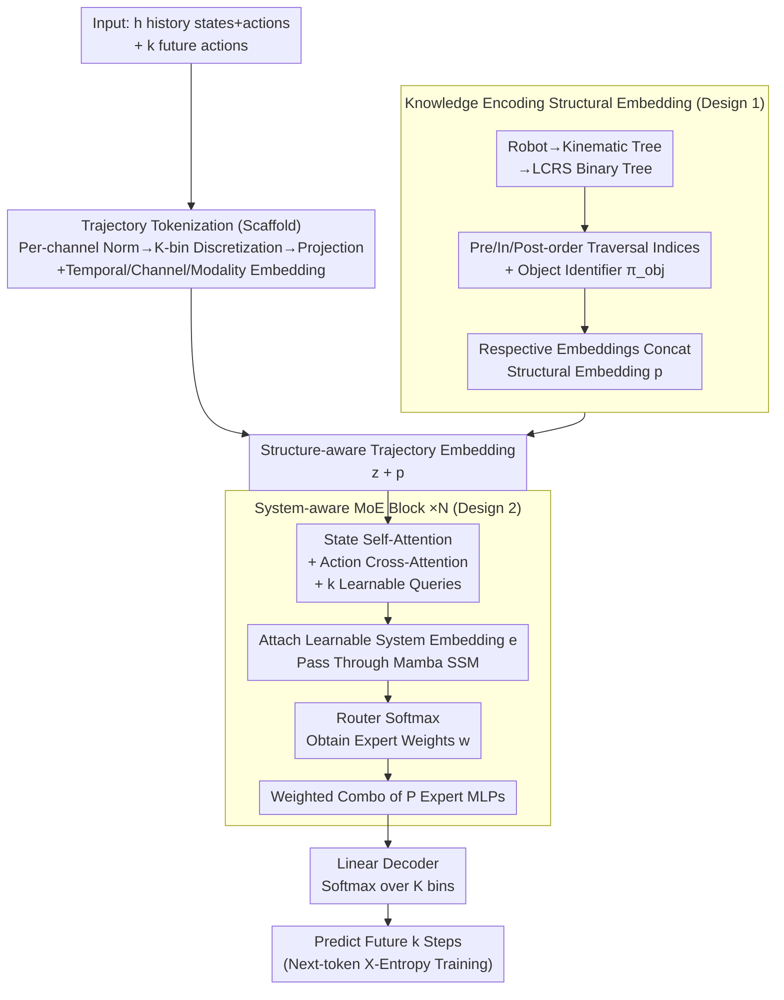

# WestWorld: Scalable Trajectory World Models with Knowledge Encoding

**Conference**: ICML 2026 Spotlight  
**arXiv**: [2603.14392](https://arxiv.org/abs/2603.14392)  
**Code**: https://github.com/511205787/WestWorld  
**Area**: Robotics / Embodied AI / World Models  
**Keywords**: World Models, Knowledge Encoding, Trajectory Prediction, Robot Diversity, Cross-Embodiment  

## TL;DR
WestWorld integrates trajectory dynamics of diverse heterogeneous robots into a single scalable world model using System-aware MoE (Sys-MoE) and knowledge-encoded structural embeddings. After pre-training on 89 simulated and real environments, its zero-shot/few-shot trajectory prediction MAE/MSE significantly outperforms MLP Ensemble, TDM, and TrajWorld. It also enhances downstream MPPI control and successfully deploys to a real Unitree Go1.

## Background & Motivation

**Background**: Trajectory world models model dynamics directly on low-level states and actions (joint positions/velocities, torques, etc.). These serve as fundamental components for robot dynamics learning, planning, and control, in contrast to video world models that implicitly model observations via video generation. The primary obstacle to generalizing trajectory world models across heterogeneous robots is the massive variance in sensor/actuator dimensions, sampling rates, and kinematic structures.

**Limitations of Prior Work**: Recent works (TDM, TrajWorld, etc.) tokenize continuous states/actions of various systems for joint training using flexible Transformers. However, these methods face two fundamental limitations: (1) **Scalability**—forcing highly divergent dynamics to share the same dense parameters leads to gradient conflict and negative transfer, causing performance to drop significantly as the number of robots increases; (2) **Zero-shot Generalization**—treating trajectories purely as token sequences ignores morphological structures, lacking the physical inductive bias necessary for generalizing to unseen robots. (Earlier zero-padding approaches were restricted by dimensionality limits and compromised cross-environment generalization.)

**Goal**: To learn the dynamics of $n$ different robot systems within a single model that is scalable with the number of robots during pre-training and capable of zero-shot/few-shot generalization to new systems.

**Core Idea**: The model consists of two core components—(1) **Knowledge Encoding Embedding (KNEE)**, which injects robot morphological structures as inductive biases into trajectory representations to improve zero-shot generalization; (2) **System-aware Mixture of Experts (Sys-MoE)**, which uses learnable system embeddings to dynamically route and combine experts, implicitly learning individual system dynamics while isolating cross-robot interference for better scalability. The underlying mechanism is based on the assumption that complex system dynamics can be approximated by a linear combination of "basis dynamics" weighted by system-dependent coefficients.

## Method

### Overall Architecture
WestWorld aims to provide trajectory predictions for various heterogeneous robots (arms, quadrupeds, humanoids, etc.) by addressing two key challenges: the massive differences in sensor/actuator dimensions and dynamics—which cause gradient conflict in shared dense parameters—and the loss of morphological information when modeling trajectories as pure token sequences.

The pipeline operates as follows: each state/action dimension of a trajectory is treated as a scalar **channel**. These are min-max normalized, discretized into $K$ bins, projected into $d$-dimensional embeddings, and combined with temporal, channel-order, and modality (state/action) embeddings to form tokens (following the TrajWorld scaffold). Next, **Knowledge Encoding Structural Embeddings** inject the robot's kinematic structure as inductive bias into these tokens. The tokens are then processed through stacked **System-aware MoE (Sys-MoE) blocks**. Within each block, attention mechanisms aggregate state-action information, followed by a router driven by a learnable system embedding that dynamically combines experts to model specific dynamics. Finally, a linear decoder outputs the distribution over $K$ bins for the next $k$ future steps, trained via next-token cross-entropy.

### Key Designs

**1. Knowledge Encoding Structural Embedding: Injecting Morphology as Inductive Bias**

Existing trajectory world models are mostly data-driven, looking only at state-action observations and ignoring the domain knowledge that robots of different morphologies must obey different physical constraints. Without explicit structural information, models struggle to capture underlying dynamics and generalize to new robots. The **Key Insight** is that robots with similar connections often share high-level dynamic behaviors (e.g., SLIP-like hopping). Thus, morphological relationships are injected as inductive bias. Specifically, each articled object is modeled as a rooted kinematic tree converted to an LCRS (Left-Child Right-Sibling) binary tree. Each body node is uniquely located using pre-order, in-order, and post-order traversal indices. In multi-object scenes, an object ID $\pi_{\text{obj}}$ is added (0 for the robot, others sorted by Euclidean distance). These indices are embedded and concatenated:

$$\bm{p}^{(i,j)} = \mathrm{Concat}\big(\bm{e}_{\text{obj}}(\pi_{\text{obj}}^{i}),\, \bm{e}_{\text{pre}}(\pi_{\text{pre}}^{i,j}),\, \bm{e}_{\text{in}}(\pi_{\text{in}}^{i,j}),\, \bm{e}_{\text{post}}(\pi_{\text{post}}^{i,j})\big)$$

The vector $\bm{p} \in \mathbb{R}^{d}$ is added to the corresponding tokens. This allows the model to transfer learned dynamics to unseen robots via structural similarity.

**2. System-aware Mixture of Experts (Sys-MoE): Routing Experts with System Embeddings**

To prevent gradient conflict between diverse robot dynamics, the **Key Insight** is that complex dynamics can be approximated by combining "basis dynamics" using system-related coefficients. The Sys-MoE block operates in two steps:

(i) **Attention Aggregation**: Self-attention is applied to state channels to capture correlations, and cross-attention injects action embeddings into state representations. $k$ learnable query embeddings are appended for single-forward prediction of $k$ future steps:

$$\hat{\bm{S}}_t = \mathrm{LN}\big(\tilde{\bm{S}}_t + \text{Cross-Atten}(\tilde{\bm{S}}_t, \bm{A}_t)\big)$$

(ii) **System-aware Routing**: A learnable system embedding $\bm{e}$ is appended to the attention output and passed through a Mamba-style selective SSM. The SSM output at the system embedding position $\bm{U}_{L+1}$ is used by the router to calculate weights across $P$ experts via softmax:

$$\bm{w} = \mathrm{Softmax}(\mathrm{Router}(\bm{U}_{L+1})), \qquad \bm{Y}_{1:L}^{(m)} = \sum_{p=1}^{P} w_p\, E_p(\bm{U}_{1:L}^{(m)})$$

Unlike token-level routing in LLMs, all channels of a single robot share the same expert weights, isolating gradients and enabling smooth scaling across robot systems.

## Key Experimental Results

**Pre-training**: 89 complex environments—80 from UniTraj (simulated) + 9 from Open X-Embodiment (real robot arms). Baselines: MLP Ensemble (PETS-style probabilistic ensemble), TDM (Gato-style autoregressive), TrajWorld (Transformer with temporal-variable attention). All baselines were pre-trained on the same data. Prediction setup: 50 history steps to predict 100 future steps.

### Main Results (Zero-shot Trajectory Prediction, Normalized Space MAE/MSE ×10⁻²)

| Method | Walker2D MAE | Walker2D MSE | Hopper MAE | Hopper MSE | Franka MAE | Franka MSE |
|------|------|------|------|------|------|------|
| MLP Ensemble | 26.006 | 12.028 | 19.987 | 7.216 | 12.164 | 4.271 |
| TDM | 20.122 | 6.428 | 17.634 | 5.076 | 23.686 | 8.435 |
| TrajWorld | 22.261 | 8.623 | 17.388 | 5.441 | 13.102 | 5.127 |
| **Ours** | **16.350** | **5.064** | **13.731** | **3.368** | **7.737** | **2.539** |

Across unseen environments (Hopper/Walker2D from D4RL; real Franka data), WestWorld achieves the best 100-step long-term prediction accuracy.

### Few-shot Adaptation (10 Episodes Fine-tuning, MAE/MSE ×10⁻²)

| Method | Cassie MAE | A1 MAE | UR5 MAE |
|------|------|------|------|
| MLP Ensemble | 14.369 | 14.357 | 15.181 |
| TDM | 14.510 | 10.624 | 18.578 |
| TrajWorld | 7.834 | 5.138 | 8.066 |
| **Ours** | **5.316** | **4.227** | **4.925** |

WestWorld consistently outperforms all baselines on real-world datasets with significant domain shifts (Cassie bipedal, A1 quadruped, UR5 manipulation).

### Main Results (Downstream MPPI Control, Cumulative Return)

| Method | Pre-train | Walker2D | Hopper | Go1 |
|------|------|------|------|------|
| TrajWorld | ✓ | 1933.52 | 534.32 | 0.49 |
| **Ours** | ✗ | 707.61 | 554.92 | 0.43 |
| **Ours** | ✓ | **2134.60** | **2253.51** | **2.20** |

Integrating the dynamics model into MPPI (horizon 100/40), WestWorld outperforms baselines in both "from scratch" and "pre-train + fine-tune" settings.

### Ablation Study (Zero-shot MAE ×10⁻²)

| Configuration | Walker2D MAE | Hopper MAE | Franka MAE |
|------|------|------|------|
| w/o Sys-MoE (Dense SSM) | 18.707 | 15.978 | 9.392 |
| w/o Structural Embedding (KNEE) | 21.156 | 16.227 | 7.897 |
| **Ours (Full)** | **16.350** | **13.731** | **7.737** |

Removing structural embeddings severely impacts complex systems (Hopper/Walker2D), while replacing Sys-MoE with a dense SSM increases error across all tasks, confirming Sys-MoE's role in mitigating interference.

### Highlights & Insights
- **Scalability via MoE**: Using system embeddings to route experts prevents gradient conflicts in multi-robot training, allowing the model to scale smoothly (error remains flat as environments increase from 1 to 89).
- **Morphology as Inductive Bias**: Encoding structural connectivity via LCRS tree indices allows the model to leverage structural similarity for zero-shot generalization.
- **End-to-End Prediction to Control**: Validated higher performance in MPPI control and successfully distilled for deployment on a real Unitree Go1.
- **Interpretable Specialization**: Learned routing weights show sparse, system-specific patterns, supporting the "basis dynamics" hypothesis.

### Limitations & Future Work
- **No Vision**: Currently models only low-level trajectories; future work will focus on integrating visual observations.
- **Dependency on Priors**: Requires kinematic trees, which may be difficult to obtain for unknown or complex systems.
- **Sim-to-Real Deployment**: Real-world Go1 deployment requires distillation and simulation fine-tuning to handle sim-to-real gaps (friction, contact, noise).
- **Decoupled Optimization**: Pre-training focus is on dynamics modeling; joint optimization of the controller/policy is a future step.

### Related Work & Insights
- **vs TrajWorld**: WestWorld addresses the scalability degradation found in TrajWorld's dense parameters by using system-aware routing.
- **vs TDM**: Whereas TDM uses flattened sequences, WestWorld uses channel-wise attention and explicit structural encoding.
- **Insight**: Combining domain-specific structural knowledge as inductive bias with MoE for task isolation is an effective paradigm for unifying diverse robot models.

## Rating
- **Novelty**: ⭐⭐⭐⭐⭐ (Sys-MoE + Structural Embedding for cross-embodiment scaling).
- **Experimental Thoroughness**: ⭐⭐⭐⭐⭐ (89 Envs, zero-shot/few-shot/control/real-world).
- **Writing Quality**: ⭐⭐⭐⭐ (Clear motivation and structure).
- **Value**: ⭐⭐⭐⭐⭐ (Scalable foundation for multi-robot world models).

<!-- RELATED:START -->

## Related Papers

- [\[CVPR 2026\] Scalable Trajectory Generation for Whole-Body Mobile Manipulation](../../CVPR2026/robotics/scalable_trajectory_generation_for_whole-body_mobile_manipulation.md)
- [\[ICLR 2026\] World-In-World: World Models in a Closed-Loop World](../../ICLR2026/robotics/world-in-world_world_models_in_a_closed-loop_world.md)
- [\[CVPR 2026\] Dexterous World Models](../../CVPR2026/robotics/dexterous_world_models.md)
- [\[ICLR 2026\] Empowering Multi-Robot Cooperation via Sequential World Models](../../ICLR2026/robotics/empowering_multi-robot_cooperation_via_sequential_world_models.md)
- [\[CVPR 2026\] IGen: Scalable Data Generation for Robot Learning from Open-World Images](../../CVPR2026/robotics/igen_scalable_data_generation_for_robot_learning_from_open-world_images.md)

<!-- RELATED:END -->
