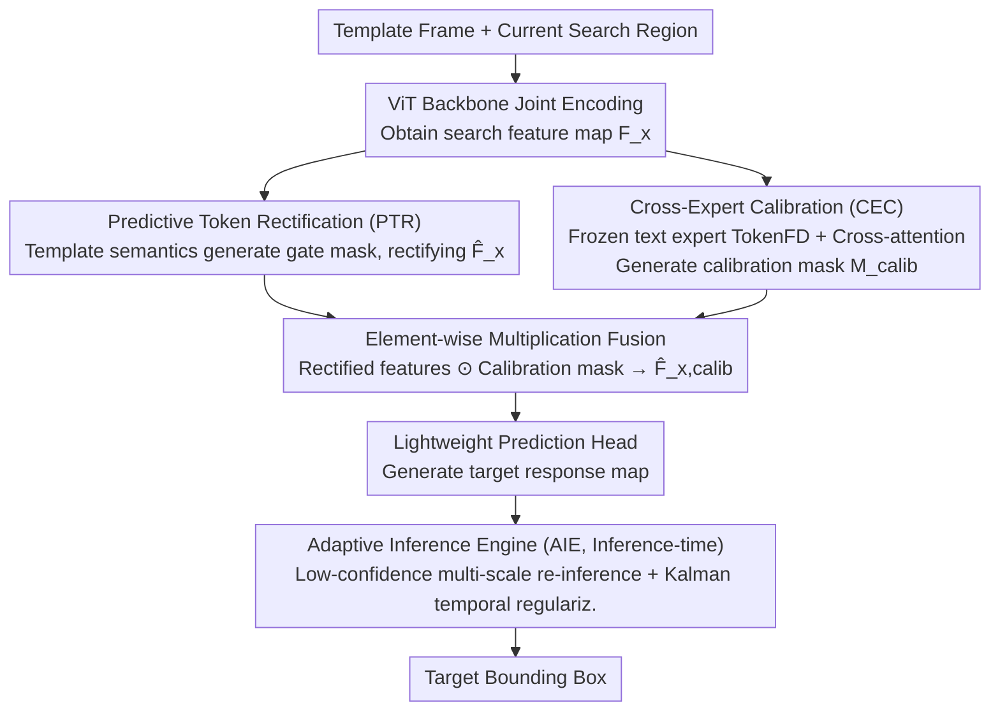

# Beyond Detection: A Structure-Aware Framework for Scene Text Tracking

**Conference**: ICML2026  
**arXiv**: [2605.17270](https://arxiv.org/abs/2605.17270)  
**Code**: https://github.com/EdisonYCM/SymTrack  
**Area**: Video Understanding  
**Keywords**: Scene Text Tracking, Visual Object Tracking, Dual-branch architecture, Text feature calibration, Adaptive inference  

## TL;DR
The authors propose SymTrack, a detection-free dual-branch scene text tracking framework. It addresses feature bottlenecks caused by perspective distortion through Predictive Token Rectification (PTR), eliminates high visual ambiguity among text instances using Cross-Expert Calibration (CEC), and stabilizes fine-grained localization with an Adaptive Inference Engine (AIE). It significantly surpasses SOTA on three benchmarks (up to +12.32% AUC).

## Background & Motivation

**Background**: Text tracking in videos is currently predominantly handled by Video Text Spotting (VTS) frameworks—which perform detection, recognition, and association for every frame. This is computationally expensive and highly sensitive to detection failure; a single missed detection leads to track fragmentation. An alternative is directly applying general visual object trackers (e.g., OSTrack, ODTrack), but these models lack the ability to model text-specific features.

**Limitations of Prior Work**: General trackers face three main challenges: (1) **Perspective distortion**—the planar structure of text undergoes severe deformation under viewpoint changes, causing misalignment between template and search region features, making it difficult for shallow prediction heads to extract targets from high-entropy features; (2) **High visual ambiguity**—adjacent characters have similar structures, and general models lack discriminative power for text features, leading to tracking drift; (3) **Fine-grained structural sensitivity**—tiny deviations in text localization can alter semantic content, yet temporal modeling in mainstream frame-by-frame matching is insufficient to suppress jitter.

**Key Challenge**: The combination of a strong ViT backbone and a shallow prediction head creates an **information bottleneck**—the encoder is powerful while the decoder is too weak, making it impossible to effectively distinguish targets from distractors in the feature space. Simultaneously, general trackers lack text domain priors and cannot utilize text-specific high-frequency structural features.

**Key Insight**: The authors advocate for a "tracking-first, detection-free" paradigm shift—instead of relying on frame-by-frame detection, text structure is modeled directly in continuous frames, with text-specific feature experts introduced as orthogonal supplements.

**Core Idea**: A collaborative dual-branch architecture is used for feature correction (spatial + temporal) and text semantic calibration (cross-modal priors). During testing, an Adaptive Inference Engine dynamically adjusts search regions and temporal smoothness. This three-pronged approach addresses the three major challenges of scene text tracking.

## Method

### Overall Architecture
The input to SymTrack consists of the first-frame template and the current search region, which are jointly encoded by a ViT backbone to obtain the search feature map $F_x$. Features then enter a collaborative dual-branch structure: the **upper PTR branch** uses template semantics to spatially rectify $F_x$, while the **lower CEC branch** utilizes a frozen text expert to provide a text prior calibration mask. The outputs of both branches are fused via element-wise multiplication and fed into a lightweight prediction head. During inference, the AIE further stabilizes the output to produce the final target bounding box.

### Key Designs

**1. Predictive Token Rectification (PTR): Pre-rectifying the search map at the feature level to clear the information bottleneck between backbone and shallow head**

The mismatch between a strong ViT backbone and a shallow prediction head causes an information bottleneck. Under perspective distortion, template and search features misalign, making it hard for the head to select the target. Instead of geometric resampling (which introduces noise), PTR performs soft rectification at the feature level: it extracts a semantic query $\mathbf{q}_{\text{sem}} = \frac{1}{N_z}\sum_{i=1}^{N_z}z_i$ from template tokens $\mathcal{Z}$, maps it via MLP to channel-wise modulation weights $\mathbf{w}_m \in \mathbb{R}^C$, and performs depth-wise correlation with search features to generate a probabilistic gate mask $M = \sigma(\text{Conv}_{1\times1}(F_x \circledast \mathbf{w}_m))$. Finally, $\hat{F}_x = F_x \odot M$. This template-driven gating adaptively suppresses interference from distortion, contributing +4.96% AUC on its own.

**2. Cross-Expert Calibration (CEC): Injecting text domain priors to resolve high visual ambiguity between adjacent characters**

General trackers lack text discriminability and drift easily when adjacent character structures are similar. CEC runs a frozen text-specific high-resolution backbone (TokenFD visual encoder) in parallel to extract text features $\mathcal{Z}_{txt}$ and $\mathcal{X}_{txt}$ from the template and search regions. After dimension alignment via linear projection, it performs multi-head cross-attention using search features as queries and template features as keys/values: $\mathcal{E}_{txt} = \mathcal{A}_{cross}(\mathcal{X}'_{txt}, \mathcal{Z}'_{txt}, \mathcal{Z}'_{txt})$. After residual connection and LayerNorm, a convolutional head generates the calibration mask $M_{calib} \in [0,1]^{H\times W}$. The frozen expert preserves fine-grained discriminative power learned from large-scale text data, while cross-attention focuses calibration on regions consistent with the template text, suppressing background and similar text interference. It adds +2.12% AUC on top of PTR.

**3. Adaptive Inference Engine (AIE): Training-free search region adjustment and trajectory smoothing at inference time**

Small localization errors in text tracking can change semantics, but frame-by-frame temporal modeling is insufficient to suppress jitter. Furthermore, static search windows often lose targets due to rapid scale changes under perspective shifts. AIE employs a two-pronged approach during inference: **Dynamic search regions**—when prediction confidence $c(S)$ falls below threshold $\tau_{\text{uncert}}=0.98$, it re-runs inference with scaling factors $\{0.95, 1.05\}$ to select the optimal scale; **Temporal regularization**—it constructs a constant-velocity linear state-space model $s_t = [c_x, c_y, v_x, v_y]^T$, fusing motion prediction and visual output with a weight $\alpha_{kalman}=0.5$. This Kalman regularization suppresses jitter and long-term drift. With AIE, average search region coverage improves from 83.27% to 95.25%.

## Key Experimental Results

| Benchmark | Metric | Ours (SymTrack) | Best Competitor | Gain |
|------|------|---------|------------|------|
| ArTVideoSOT | AUC | **77.74%** | ROMTrack (70.62%) | +7.12% |
| DSTextSOT | AUC | **70.66%** | ODTrack (62.71%) | +7.95% |
| BOVTextSOT | AUC | **77.06%** | ODTrack (64.74%) | +12.32% |
| ArTVideoSOT | Precision | **95.88%** | ROMTrack (87.13%) | +8.75% |

| Ablation Study (ArTVideoSOT) | AUC | Gain |
|------------------------|-----|------|
| Baseline (No PTR/CEC/AIE) | 69.50% | — |
| +PTR | 74.46% | +4.96% |
| +PTR+CEC | 76.58% | +2.12% |
| +PTR+CEC+AIE (Full) | **77.74%** | +1.16% |

| Model | AUC | Params | Speed |
|------|-----|--------|------|
| SymTrack (Full) | 77.74% | 395.9M | 22 fps |
| SymTrack w/o TokenFD | 75.45% | 92.7M | 89 fps |
| SeqTrack | 64.35% | 306.5M | 16 fps |

**Key Findings**: Even when the strongest competitor, ODTrack, is fine-tuned on text tracking data, SymTrack still leads by +9.83% AUC (BOVTextSOT). This proves the performance gap stems from the architecture rather than the data domain.

## Highlights & Insights
- **Value of Paradigm Shift**: VTS methods fail almost completely under SOT format evaluation (TransDETR achieves only 9.18% AUC vs SymTrack's 77.74%), demonstrating the necessity of "detection-free" approaches for text tracking.
- **Dual-branch Synergy**: PTR contributes +4.96%, and CEC adds another +2.12% on top of PTR; their synergistic effect significantly outperforms using either individually.
- **AIE and Search Region Coverage**: The introduction of AIE improved the average Search Region Coverage (SRC) from 83.27% to 95.25% (+11.98%), which is critical for handling rapid text scale changes under perspective distortion.
- **Competitive Lightweight Version**: The version without TokenFD (92.7M, 89fps) still achieves 75.45% AUC, outperforming all competitors and making it suitable for real-time scenarios.

## Limitations & Future Work
- The frozen TokenFD text expert introduces approximately 300M additional parameters, reducing inference speed from 89fps to 22fps, which limits real-time application.
- Benchmark datasets are converted from VTS annotations and lack dedicated SOT-designed labels for long-term occlusion and extreme motion.
- AIE hyperparameters ($\tau_{\text{uncert}}$, $\alpha_{kalman}$) are manually set; adaptive learning has not been explored.
- Validated only on English/Chinese text; generalization to complex script systems like Arabic remains unknown.

## Related Work & Insights
- **Evolution of General Trackers**: SiamRPN++ → TransT → OSTrack (one-stream) → ODTrack (temporal modeling via token sequences), yet all lack text feature modeling.
- **VTS Paradigm**: TransVTSpotter and TransDETR treat tracking as a byproduct of detection; a single-frame detection failure results in irrecoverable track fragmentation.
- **Text Feature Experts**: TokenFD, a visual encoder pre-trained on large-scale text data, provides high-fidelity text priors for CEC.
- **Insight**: This work indicates that in domain-specific tracking tasks, a "domain expert + general backbone" dual-branch fusion paradigm is superior to pure general models or pure end-to-end systems. This could be generalized to other fine-grained tracking scenarios (e.g., sheet music, barcodes, license plate tracking).

## Rating
- Novelty: 8/10 — First to systematically define the scene text tracking task and propose a dedicated framework; dual-branch synergy is innovative.
- Experimental Thoroughness: 9/10 — Comprehensive comparisons across three benchmarks + fine-tuning control experiments + detailed ablation + visualization.
- Writing Quality: 8/10 — Clear problem analysis and motivation, though some mathematical notation is redundant.
- Value: 7/10 — Opens a new task and benchmark, but the application scenario is relatively niche and real-time performance needs improvement.

<!-- RELATED:START -->

## Related Papers

- [\[CVPR 2026\] Beyond Appearance: Camouflaged Object Detection via Geometric Structure](../../CVPR2026/segmentation/beyond_appearance_camouflaged_object_detection_via_geometric_structure.md)
- [\[ECCV 2024\] EAFormer: Scene Text Segmentation with Edge-Aware Transformers](../../ECCV2024/segmentation/eaformer_scene_text_segmentation_with_edge-aware_transformers.md)
- [\[CVPR 2025\] A Distractor-Aware Memory for Visual Object Tracking with SAM2](../../CVPR2025/segmentation/a_distractor-aware_memory_for_visual_object_tracking_with_sam2.md)
- [\[CVPR 2026\] Structure-Aware Representation Distillation for Tiny-Dense Object Segmentation](../../CVPR2026/segmentation/structure-aware_representation_distillation_for_tiny-dense_object_segmentation.md)
- [\[CVPR 2025\] Towards Generalizable Scene Change Detection](../../CVPR2025/segmentation/towards_generalizable_scene_change_detection.md)

<!-- RELATED:END -->
