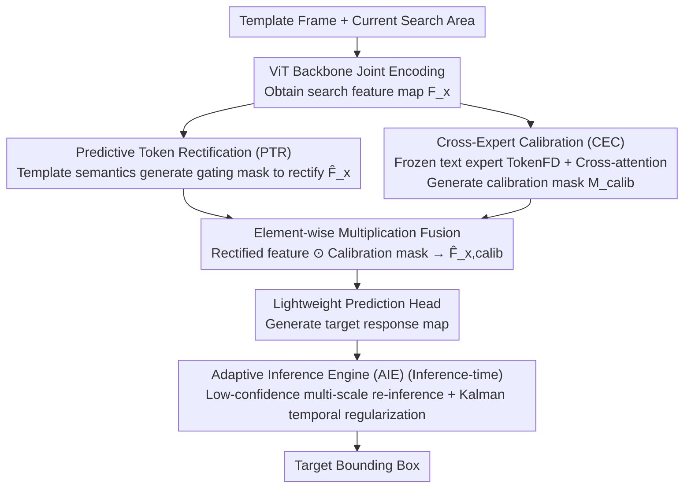

# Beyond Detection: A Structure-Aware Framework for Scene Text Tracking

**Conference**: ICML2026  
**arXiv**: [2605.17270](https://arxiv.org/abs/2605.17270)  
**Code**: https://github.com/EdisonYCM/SymTrack  
**Area**: Video Understanding  
**Keywords**: Scene Text Tracking, Visual Object Tracking, Dual-branch Architecture, Text Feature Alignment, Adaptive Inference  

## TL;DR
SymTrack is proposed as a detection-free dual-branch scene text tracking framework. It addresses feature bottlenecks caused by perspective distortion through Predictive Token Rectification (PTR), eliminates high visual ambiguity between text instances via Cross-Expert Calibration (CEC), and stabilizes fine-grained localization using an Adaptive Inference Engine (AIE). It significantly advances the SOTA across three benchmarks (up to +12.32% AUC).

## Background & Motivation

**Background**: Current video text tracking is primarily performed as an extension of Video Text Spotting (VTS) frameworks—VTS performs detection + recognition + association for every frame, which is computationally expensive and extremely sensitive to detection failures; a missed detection in a single frame can lead to fragmented trajectories. Another approach involves directly applying generic visual object trackers (e.g., OSTrack, ODTrack), but these models lack the feature modeling capabilities specific to text characters.

**Limitations of Prior Work**: Generic trackers face three major challenges: (1) **Perspective Distortion**—the planar structure of text undergoes severe deformation under viewpoint changes, causing significant misalignment between template and search area features, making it difficult for shallow prediction heads to extract targets from high-entropy features; (2) **High Visual Ambiguity**—adjacent text characters share similar structures, and generic models lack text-specific discriminative power, leading to tracking drift; (3) **Fine-grained Structural Sensitivity**—minor deviations in text localization can alter semantic content, yet temporal modeling in mainstream frame-by-frame matching schemes is insufficient to suppress jitter.

**Key Challenge**: The combination of a powerful ViT backbone and a shallow prediction head creates an **information bottleneck**—the encoder is strong while the decoder is too weak, preventing effective differentiation between targets and distractors in the feature space. Furthermore, generic trackers lack domain priors for text and cannot leverage text-specific high-frequency structural features.

**Key Insight**: The authors advocate for a "tracking-first, detection-free" paradigm shift—modeling text structures directly in continuous frames without relying on per-frame detection, while introducing text-specific feature experts as an orthogonal supplement.

**Core Idea**: A collaborative dual-branch architecture is employed to perform both feature rectification (spatial + temporal) and text semantic calibration (cross-modal priors). An adaptive inference engine is then used to dynamically adjust search areas and temporal smoothing during testing, addressing the three major challenges of scene text tracking simultaneously.

## Method

### Overall Architecture
The input to SymTrack consists of the first-frame template and the current search area. After joint encoding by a ViT backbone, the search feature map $F_x$ is obtained. It then enters a collaborative dual-branch structure: the **upper branch (PTR)** utilizes template semantics to perform spatial rectification on $F_x$, while the **lower branch (CEC)** utilizes a frozen text expert to provide a text-prior calibration mask. The outputs of both branches are fused via element-wise multiplication and fed into a lightweight prediction head. During the inference phase, the output is further stabilized by the AIE to produce the final target bounding box.

### Key Designs

**1. Predictive Token Rectification (PTR): Pre-rectifying the search map at the feature level to clear the information bottleneck between the backbone and the shallow head.**

The combination of a strong ViT backbone and a shallow prediction head creates an information bottleneck. When perspective distortion occurs, template and search features become severely misaligned, making it difficult for the shallow head to identify the target. PTR does not perform geometric resampling (which introduces noise) but instead implements soft rectification at the feature level. Semantic queries $\mathbf{q}_{\text{sem}} = \frac{1}{N_z}\sum_{i=1}^{N_z}z_i$ are extracted from template tokens $\mathcal{Z}$, mapped via MLP to channel-level modulation weights $\mathbf{w}_m \in \mathbb{R}^C$, and depth-correlated with search features to obtain a probabilistic gating mask $M = \sigma(\text{Conv}_{1\times1}(F_x \circledast \mathbf{w}_m))$, resulting in $\hat{F}_x = F_x \odot M$. This template-driven gating adaptively suppresses distractor activations caused by perspective distortion, contributing +4.96% AUC on its own.

**2. Cross-Expert Calibration (CEC): Injecting text domain priors to resolve high visual ambiguity between adjacent characters.**

Generic trackers lack text discriminative power and easily drift when adjacent characters have similar structures. CEC runs a frozen, text-specific high-resolution backbone (TokenFD visual encoder) in parallel to extract text features $\mathcal{Z}_{txt}$ and $\mathcal{X}_{txt}$ from the template and search areas, respectively. After linear projection for dimension alignment, multi-head cross-attention is performed with search features as query and template features as key/value: $\mathcal{E}_{txt} = \mathcal{A}_{cross}(\mathcal{X}'_{txt}, \mathcal{Z}'_{txt}, \mathcal{Z}'_{txt})$. Following Residual + LayerNorm, a calibration mask $M_{calib} \in [0,1]^{H\times W}$ is generated via a convolutional head. The frozen expert preserves fine-grained discriminative power learned from large-scale text data, while cross-attention focuses calibration on regions consistent with the template text, effectively suppressing background and similar text interference. It adds another +2.12% AUC on top of PTR, collaborating with rather than simply overlapping it.

**3. Adaptive Inference Engine (AIE): Training-free search area adjustment and trajectory smoothing during testing.**

Minor deviations in text localization can alter semantics, but per-frame matching is insufficient to suppress jitter. Furthermore, text scales change drastically under perspective shifts, causing static search windows to lose targets. AIE employs two mechanisms during inference: dynamic search areas—where re-inference is performed at the best scale using factors $\{0.95, 1.05\}$ if the prediction confidence $c(S)$ falls below $\tau_{\text{uncert}}=0.98$; and temporal regularization—building a constant-velocity linear state-space model $s_t = [c_x, c_y, v_x, v_y]^T$ to filter and fuse motion predictions with visual outcomes using a fusion weight $\alpha_{kalman}=0.5$. Kalman regularization utilizes motion continuity to suppress jitter and long-term drift, increasing average search region coverage from 83.27% to 95.25%.

## Key Experimental Results

| Benchmark | Metric | SymTrack | Best Comparison | Gain |
|------|------|---------|------------|------|
| ArTVideoSOT | AUC | **77.74%** | ROMTrack 70.62% | +7.12% |
| DSTextSOT | AUC | **70.66%** | ODTrack 62.71% | +7.95% |
| BOVTextSOT | AUC | **77.06%** | ODTrack 64.74% | +12.32% |
| ArTVideoSOT | Precision | **95.88%** | ROMTrack 87.13% | +8.75% |

| Ablation Study (ArTVideoSOT) | AUC | Increment |
|------------------------|-----|------|
| Baseline (w/o PTR/CEC/AIE) | 69.50% | — |
| +PTR | 74.46% | +4.96% |
| +PTR+CEC | 76.58% | +2.12% |
| +PTR+CEC+AIE (Full) | **77.74%** | +1.16% |

| Model | AUC | Params | Speed |
|------|-----|--------|------|
| SymTrack (Full) | 77.74% | 395.9M | 22 fps |
| SymTrack w/o TokenFD | 75.45% | 92.7M | 89 fps |
| SeqTrack | 64.35% | 306.5M | 16 fps |

**Key Findings**: Even when the strongest competitor ODTrack is fine-tuned on text tracking data, SymTrack still leads by +9.83% AUC (BOVTextSOT), proving that the performance gap stems from architecture rather than data domains.

## Highlights & Insights
- **Value of Paradigm Shift**: VTS methods fail almost completely under SOT evaluation metrics (TransDETR achieves only 9.18% AUC vs. 77.74% for SymTrack), thoroughly demonstrating the necessity of "detection-free" approaches for text tracking.
- **Dual-branch Synergy**: PTR contributes +4.96%, and CEC adds another +2.12% on top of PTR; the synergy between the two is significantly more effective than using either alone.
- **AIE Search Region Coverage**: The introduction of AIE improved the average Search Region Coverage (SRC) from 83.27% to 95.25% (+11.98%), which is critical for handling drastic text scale changes under perspective distortion.
- **Competitiveness without TokenFD**: The lightweight version (92.7M, 89fps) still reaches 75.45% AUC, outperforming all comparison methods and making it suitable for real-time scenarios.

## Limitations & Future Work
- The frozen TokenFD text expert introduces approximately 300M additional parameters, reducing inference speed from 89fps to 22fps, which limits real-time application.
- Benchmark datasets were converted from VTS annotations and lack specialized long-term occlusion and extreme motion labels designed specifically for SOT.
- Hyperparameters for AIE ($\tau_{\text{uncert}}$, $\alpha_{kalman}$) were manually set; adaptive learning for these remains unexplored.
- Validation was performed only on English/Chinese text; generalization to complex writing systems like Arabic is unknown.

## Related Work & Insights
- **Evolution of Generic Trackers**: SiamRPN++ → TransT → OSTrack (one-stream) → ODTrack (temporal modeling via token sequences), yet all lack text-specific feature modeling.
- **VTS Paradigm**: TransVTSpotter and TransDETR treat tracking as a byproduct of detection; a failure in single-frame detection leads to irrecoverable trajectory breaks.
- **Text Feature Experts**: TokenFD, a visual encoder pre-trained on large-scale text data, provides high-fidelity text priors for CEC.
- **Insight**: This work suggests that in domain-specific tracking tasks, a dual-branch fusion paradigm of "domain expert + generic backbone" is superior to purely generic models or pure end-to-end systems. This can be extended to other fine-grained tracking scenarios (e.g., sheet music, barcodes, license plate tracking).

## Rating
- Novelty: 8/10 — First to systematically define the scene text tracking task and propose a specialized framework; the collaborative dual-branch design is innovative.
- Experimental Thoroughness: 9/10 — Comprehensive comparisons across three benchmarks + fine-tuning control experiments + detailed ablation + visualization analysis.
- Writing Quality: 8/10 — Clear problem analysis and well-motivated methods, though some mathematical notation is slightly redundant.
- Value: 7/10 — Establishes a new task and benchmark, though the application scenario is relatively niche and real-time performance needs improvement.

<!-- RELATED:START -->

## Related Papers

- [\[CVPR 2026\] Beyond Appearance: Camouflaged Object Detection via Geometric Structure](../../CVPR2026/segmentation/beyond_appearance_camouflaged_object_detection_via_geometric_structure.md)
- [\[ECCV 2024\] EAFormer: Scene Text Segmentation with Edge-Aware Transformers](../../ECCV2024/segmentation/eaformer_scene_text_segmentation_with_edge-aware_transformers.md)
- [\[CVPR 2025\] A Distractor-Aware Memory for Visual Object Tracking with SAM2](../../CVPR2025/segmentation/a_distractor-aware_memory_for_visual_object_tracking_with_sam2.md)
- [\[CVPR 2026\] Structure-Aware Representation Distillation for Tiny-Dense Object Segmentation](../../CVPR2026/segmentation/structure-aware_representation_distillation_for_tiny-dense_object_segmentation.md)
- [\[CVPR 2026\] SAM2Text: Towards Prompt-Free and Multi-Resolution Video Scene Text Segmentation](../../CVPR2026/segmentation/sam2text_towards_prompt-free_and_multi-resolution_video_scene_text_segmentation.md)

<!-- RELATED:END -->
