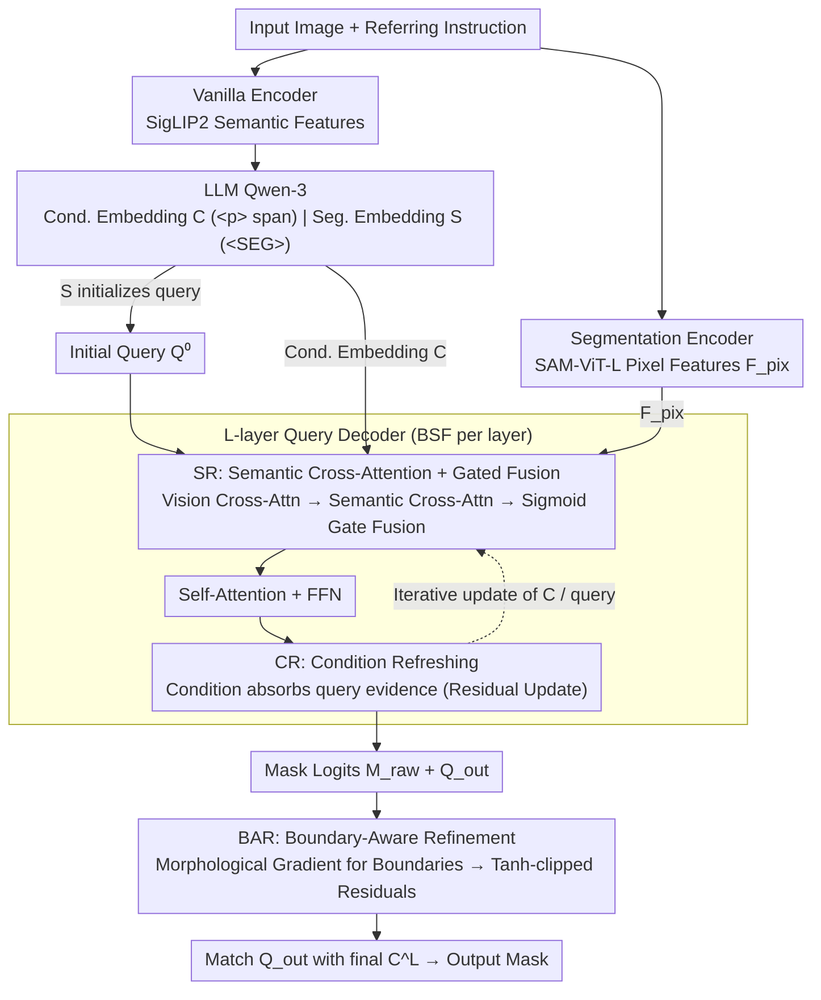

# FlowSeg: Dynamic Semantic Guidance for LLM-Conditioned Segmentation

**Conference**: ICML 2026  
**arXiv**: [2605.29461](https://arxiv.org/abs/2605.29461)  
**Code**: https://zkzhang98.github.io/FlowSeg_page  
**Area**: Segmentation / LLM-conditioned segmentation / Vision-language alignment  
**Keywords**: LLM-conditioned segmentation, bidirectional semantic flow, referring expression segmentation, reasoning segmentation, boundary refinement

## TL;DR
This paper points out that current query-based LLM-conditioned segmentation follows a "propose-then-select" paradigm—candidate masks are often accurate enough, but errors occur due to incorrect selection. To address this, FlowSeg is proposed, where LLM conditional embeddings participate in query refinement at every decoder layer and are continuously updated by new visual evidence. Combined with a lightweight boundary refinement module, it achieves consistent performance gains on RefCOCO/+/g and ReasonSeg.

## Background & Motivation
**Background**: LLM-conditioned segmentation couples Large Language Models with pixel-level segmentation decoders (SAM-style or Mask2Former-style query decoders), forming a rapidly evolving main line from LISA → PSALM → HyperSeg → Sa2VA → X-SAM. Mainstream frameworks are almost all query-based "propose-then-select": a set of learnable queries decodes candidate masks from visual features through $L$ decoder layers, and finally, the conditional embedding from the LLM is used for similarity matching with queries to select the one most similar to the target.

**Limitations of Prior Work**: The authors systematically analyzed failure cases of SOTA models like X-SAM on RefCOCO/+/g and found that "many failures are not due to insufficient mask quality, but wrong matching"—in the vast majority of failed samples, at least one candidate mask already has high IoU overlap with the GT, but is not selected due to a low score from the matching module. This "semantic misalignment" is particularly prevalent in references involving ambiguous attributes or relational descriptions.

**Key Challenge**: In current pipelines, semantic and visual interactions are shallow and unidirectional—the conditional embeddings calculated by the LLM are either injected as fixed key/values for cross-attention or reserved entirely for the matching stage. The iterative trajectory of queries is still primarily driven by visual features, with language only playing a role at the "end-stage scoring" moment. Furthermore, conditional embeddings remain static throughout, failing to incorporate visual evidence decoded by the decoder.

**Goal**: To reconstruct the internal interactions of the decoder without altering the LLM-segmentor backbone—allowing semantics to participate in mask generation dynamics from layer 0 and permitting conditional embeddings to be corrected by new visual signals during the decoding process, thereby solving "semantic misalignment" at the architectural level.

**Key Insight**: Oracle experiments provide a strong signal—if candidates are selected according to an oracle, the cIoU upper bounds of X-SAM and FlowSeg on RefCOCO/+/g are both close to 91%, which is nearly identical. This indicates that candidate generation is nearly saturated, and the bottleneck lies in selection. Solving the selection problem "ahead of time" during the decoding process is more direct than training a stronger post-hoc scorer.

**Core Idea**: Use "Bidirectional Semantic Flow" (BSF) to let the condition and query update each other at every decoder layer, topped with a lightweight "Boundary-Aware Refinement" (BAR) that "only modifies uncertain boundaries and leaves confident interiors untouched."

## Method

### Overall Architecture
FlowSeg inherits the standard scaffold of dual visual encoders + LLM + query decoder from LISA / X-SAM: (1) A Vanilla Encoder (SigLIP2-so400m) extracts semantic features for the LLM; (2) A Segmentation Encoder (SAM-ViT-L) extracts pixel features $\mathbf{F}_{\text{pix}}$ for the segmentation decoder. The LLM uses Qwen-3, with `
...
` tags embedding phrase spans and `<SEG>` tags marking segmentation output positions in the input instructions. Two types of vectors are extracted from the LLM hidden states: the conditional embedding $\mathbf{C}_{\text{LLM}}$ (from the `
` span) and the segmentation embedding $\mathbf{S}_{\text{LLM}}$ (from the `<SEG>` position), which are projected via $\phi_{\text{llm}}$ to obtain $\mathbf{C}, \mathbf{S}$. $\mathbf{S}$ is added to the initial query $\mathbf{Q}^{(0)}$ to provide global multimodal context. The decoder adopts the Mask2Former architecture with $N=200$ queries, but FlowSeg replaces the internal process of each decoder layer with BSF—consisting of two sub-flows: SR (language flows into vision) and CR (vision refreshes the condition). The output stage applies BAR refinement to mask probabilities. Finally, $\mathbf{Q}_{\text{out}}$ after $L$ layers is matched with the final $\mathbf{C}^L$ to output the segmentation mask. The three contribution modules SR / CR / BAR are the key designs detailed below.

### Key Designs

**1. BSF - SR (Semantic Refinement): Injecting language conditions into each decoder layer without overriding visual dominance.**

In old pipelines, language only appears during end-stage scoring, and query iteration is almost entirely vision-driven. SR introduces language into every layer: it first performs standard vision cross-attention $\mathbf{Q}_{\text{vis}}^{(l)}=\mathrm{MHA}(\mathbf{Q}^{(l-1)},\mathbf{F},\mathbf{F})$, then allows it to perform semantic cross-attention on the LLM conditional embeddings $\mathbf{Q}_{\text{sem}}^{(l)}=\mathrm{MHA}(\mathbf{Q}_{\text{vis}}^{(l)},\mathbf{C}^{(l-1)},\mathbf{C}^{(l-1)})$. The two branches are adaptively fused using a sigmoid gate $\mathbf{g}^{(l)}=\sigma(\mathbf{W}_g\cdot[\mathbf{Q}_{\text{vis}}^{(l)}\|\mathbf{Q}_{\text{sem}}^{(l)}])$, resulting in $\mathbf{Q}_{\text{fused}}^{(l)}=\mathbf{g}^{(l)}\odot\mathbf{Q}_{\text{vis}}^{(l)}+(1-\mathbf{g}^{(l)})\odot\mathbf{Q}_{\text{sem}}^{(l)}$, followed by standard self-attention and FFN. Two intentional choices are critical: the gating allows shallow layers to rely more on vision and deep layers to rely more on semantics, matching the decoding rhythm of "building coarse spatial hypotheses then converging with language." Placing semantic injection after vision cross-attention, rather than before, allows language to "prune/veto" hypotheses based on existing spatial candidates rather than driving attention from scratch—direct concatenation or hard replacement would destroy spatial priors learned by the visual backbone.

**2. BSF - CR (Condition Refreshing): Allowing conditional embeddings to be updated by visual evidence during decoding.**

Injecting language into vision is not enough—conditional embeddings are typically static vectors from the LLM that cannot absorb new visual evidence decoded by the decoder, which is the root of "selection misalignment." CR performs a reverse cross-attention at the end of each layer, allowing the condition to absorb the current query state: $\mathbf{C}^{(l)}=\mathbf{C}^{(l-1)}+\mathrm{MHA}(\mathbf{C}^{(l-1)},\mathbf{Q}_{\text{s}}^{(l)},\mathbf{Q}_{\text{s}}^{(l)})$ (where $\mathbf{Q}_{\text{s}}^{(l)}$ is the fused query after self-attention). The residual form ensures the condition is not overwritten but incrementally corrected by visual verification. Its contribution is most evident in ablation studies: adding only SR (unidirectional) only yields +0.5%, while adding CR to close the feedback loop jumps to +1.5%. The intuition is that once candidate masks collect visual evidence for a "red" region, the condition can evolve from an abstract "red" to "the specific part of the red object I want," leading to more accurate final matching.

**3. Boundary-Aware Refinement (BAR): After correct global selection, modify only uncertain boundaries.**

BSF resolves global semantic misalignment, but residual errors often cluster around object contours. BAR follows the "enhancement-not-replacement" principle: it first uses morphological gradients to identify boundary pixels from the mask probability map $\mathbf{B}=\mathbb{I}[(\mathrm{dilate}(\mathbf{M}_{\text{prob}})-\mathrm{erode}(\mathbf{M}_{\text{prob}}))>\epsilon]$ (with $\epsilon=0.1$). Then, a lightweight network outputs tanh-clipped residuals only within $\mathbf{B}$: $\Delta\mathbf{M}=\tanh(f_{\text{refine}}([\mathbf{M}_{\text{raw}}\|f_{\text{comp}}(\mathbf{F}_{\text{pix}})]))\cdot\alpha$ (where $\alpha$ is learnable). Finally, $\mathbf{M}_{\text{refined}}=\mathbf{M}_{\text{raw}}+\Delta\mathbf{M}\odot\mathbf{B}$. Multiplying by the mask $\mathbf{B}$ strictly confines modifications to the uncertainty zone—allowing changes to any pixel might destroy stable internal predictions. Morphological boundary extraction is training-free and tolerant of fuzzy boundaries. The entire BSF+BAR setup adds only 5.93M parameters (+0.12%) and 4.28ms latency (+1.39%).

### Loss & Training
End-to-end training in three stages: (1) segmentor pre-training for 36 epochs; (2) vision-language alignment for 1 epoch; (3) multi-task joint training for 2 epochs, using AdamW with lr=$4\times 10^{-5}$, wd=0.05, and bs=8/GPU × 8 GPUs (H20). The loss consists of LLM next-token loss plus segmentation loss $\mathcal{L}_{\text{seg}}=\mathcal{L}_{\text{CE}}+\lambda_{\text{dice}}\mathcal{L}_{\text{dice}}+\lambda_{\text{mask}}\mathcal{L}_{\text{mask}}$ ($\lambda_{\text{dice}}=\lambda_{\text{mask}}=5.0$, $\lambda_{\text{cls}}=2.0$). Deep supervision is applied to all decoder layers to facilitate semantic propagation.

## Key Experimental Results

### Main Results

Referring expression segmentation (cIoU) on RefCOCO / RefCOCO+ / RefCOCOg + ReasonSeg (gIoU/cIoU), compared against SOTAs such as LISA, PixelLM, GSVA, SAM4MLLM, PSALM, HyperSeg, Sa2VA-8B, and X-SAM.

| Dataset | LISA-7B | HyperSeg | X-SAM | **FlowSeg** | vs X-SAM |
|--------|---------|----------|-------|-------------|----------|
| RefCOCO val | 74.9 | 84.8 | 85.1 | **85.8** | +0.7 |
| RefCOCO+ val | 65.1 | 79.0 | 78.0 | **80.2** | +2.2 |
| RefCOCOg val | 67.9 | 79.4 | 83.8 | **86.5** | +2.7 |
| RefCOCOg test | 70.6 | 78.9 | 83.9 | **86.1** | +2.2 |
| ReasonSeg test cIoU | 34.1 | – | 41.0 | **54.7** | +13.7 |
| ReasonSeg test gIoU | 36.8 | – | 57.8 | **60.5** | +2.7 |

The massive +13.7% cIoU jump on ReasonSeg confirms that "referring expressions requiring complex reasoning" rely most heavily on continuous semantic participation during decoding. Backbone-controlled ablations (Table 4) show that upgrading X-SAM's LLM to Qwen3 only yields marginal gains, whereas FlowSeg outperforms X-SAM even when using the original Phi-3-3.8B, proving the gains stem from the architecture rather than a stronger LLM.

### Ablation Study

| Configuration | RefCOCO | RefCOCO+ | RefCOCOg | Avg. |
|------|---------|----------|----------|------|
| Baseline | 85.0 | 78.3 | 84.1 | 82.4 |
| + SR (semantic refinement) | 85.4 | 79.0 | 84.3 | 82.9 (+0.5) |
| + SR + CR (= Full BSF) | 85.6 | 79.9 | 86.2 | 83.9 (+1.5) |
| + SR + CR + BAR (Full) | **85.8** | **80.2** | **86.5** | **84.2 (+1.8)** |

### Key Findings
- Unidirectional semantic injection (SR only) yields small gains (+0.5%); jump to +1.5% only occurs after adding CR—closed-loop feedback is the key; unidirectional "language guiding vision" is insufficient.
- Oracle upper bound experiments (Table 5): Oracle cIoU for both FlowSeg and X-SAM is around 91%; the gap comes from selection rather than generation, validating the motivation.
- On the failure subset of X-SAM (cIoU < 0.5), FlowSeg improves the average IoU of these cases from 4.6 to 49.2 (+44.6), with a rescue rate of 44.6%. Even on the harder cIoU < 0.2 subset, it rescues +43.4, showing BSF primarily fixes semantic misalignment failures.
- BAR contributes +0.3% avg cIoU—boundary refinement is the icing on the cake, but ensuring it "only moves boundaries" prevents it from degrading stable internal predictions.
- Only +5.93M parameters / +4.28ms latency, making it engineering-friendly.

## Highlights & Insights
- **Diagnosis-driven Architectural Reform**: Identifying that "the problem is in selection, not generation" via oracle experiments followed by targeted BSF design—this methodology of "quantifying the bottleneck before prescribing" is highly reusable for LLM-conditioned dense prediction tasks.
- **Bidirectional Flow vs. Unidirectional Injection**: Years of experience in cross-modal attention suggested "adding a text-to-vision path," but this paper proves via ablation that performance is truly unlocked only when the condition is also refreshed. This provides a clear direction for all query-based multimodal decoders (detection, HOI, video referring).
- **Enhancement-not-replacement Boundary Refinement**: Using morphological gradients to unsupervisedly delineate "areas to change," combined with tanh-clipped residuals, is a safe paradigm to avoid retrying bad internal representations, applicable to any output head needing "local repair."
- **Lightweight & Plug-and-play**: BSF simply replaces internal modules of decoder layers without changing the LLM or visual encoder, allowing it to be integrated into any Mask2Former-like head.

## Limitations & Future Work
- Evaluation is still limited to the "one expression at a time" protocol; multi-target / multi-mask / coreference resolution scenarios are not covered (though X-SAM targets these, FlowSeg did not extend to those multi-task settings).
- The ReasonSeg val set is small (340 cases), leading to fluctuating results; the paper suggests "relying on the test set." Val cIoU was actually lower than X-SAM's, though gIoU was much higher, suggesting a need for standardized evaluation.
- BSF performs two extra attentions per layer; while parameters and latency remain low, if the query count $N$ increases significantly (e.g., video segmentation), the $O(|C|\cdot N)$ cost of condition refinement needs reassessment.
- BAR uses a fixed threshold $\epsilon=0.1$ for morphological operations; adaptive thresholds or learnable boundary detectors might further improve complex boundary scenarios.
- The semantic flow between the LLM and decoder is handled via a one-time transfer of `
` and `<SEG>` tokens; finer hierarchies (e.g., each token flowing to different decoder layers) are potential extensions.

## Related Work & Insights
- **vs. LISA / HyperSeg / X-SAM**: These belong to the "propose-then-select" paradigm with static LLM conditions. FlowSeg transforms internal decoder interactions from unidirectional to bidirectional without changing the LLM backbone, thus serving as a general gain for this family.
- **vs. PSALM / Sa2VA**: These primarily extend task scope (video, multi-task), but the decoders remain passive recipients of language. FlowSeg's BSF is orthogonal and can be stacked on top of them.
- **vs. Mask2Former / DETR family**: Traditional query decoders completely ignore language-side iteration. FlowSeg effectively adds a "language-side iteration" to the Mask2Former decoder, completing the query design paradigm.
- **vs. cross-modal attention (e.g., PSALM using text as KV)**: The difference lies in whether text is a fixed KV pair—previous works let text flow unidirectionally into vision; FlowSeg allows text to be updated by vision, enabling co-evolution.

## Rating
- Novelty: ⭐⭐⭐⭐ Neither bidirectional flow nor boundary refinement are entirely new concepts, but the combination and the diagnosis-design loop for "semantic misalignment" are fresh.
- Experimental Thoroughness: ⭐⭐⭐⭐ Main results + backbone-controlled + oracle + failure case rescue + component ablations + overhead analysis are comprehensive, though not extended to multi-mask/video tasks.
- Writing Quality: ⭐⭐⭐⭐⭐ Section 1 motivation is very clear; Algorithm 1 provides 14 lines of BSF pseudocode that are extremely easy to reproduce.
- Value: ⭐⭐⭐⭐ The +13.7 cIoU on ReasonSeg is a significant leap; the BSF module is compact and portable, providing a general upgrade path for future LLM-conditioned dense prediction.

<!-- RELATED:START -->

## Related Papers

- [\[CVPR 2026\] GeoGuide: Hierarchical Geometric Guidance for Open-Vocabulary 3D Semantic Segmentation](../../CVPR2026/segmentation/geoguide_hierarchical_geometric_guidance_for_open-vocabulary_3d_semantic_segment.md)
- [\[ECCV 2024\] Cs2K: Class-Specific and Class-Shared Knowledge Guidance for Incremental Semantic Segmentation](../../ECCV2024/segmentation/cs2k_class-specific_and_class-shared_knowledge_guidance_for_incremental_semantic.md)
- [\[CVPR 2026\] CrackSSM: Reviving SSMs for Crack Segmentation via Dynamic Scanning](../../CVPR2026/segmentation/crackssm_reviving_ssms_for_crack_segmentation_via_dynamic_scanning.md)
- [\[ICCV 2025\] Enhancing Transformers Through Conditioned Embedded Tokens](../../ICCV2025/segmentation/enhancing_transformers_through_conditioned_embedded_tokens.md)
- [\[CVPR 2026\] Efficient Video Object Segmentation and Tracking with Recurrent Dynamic Submodel](../../CVPR2026/segmentation/efficient_video_object_segmentation_and_tracking_with_recurrent_dynamic_submodel.md)

<!-- RELATED:END -->
