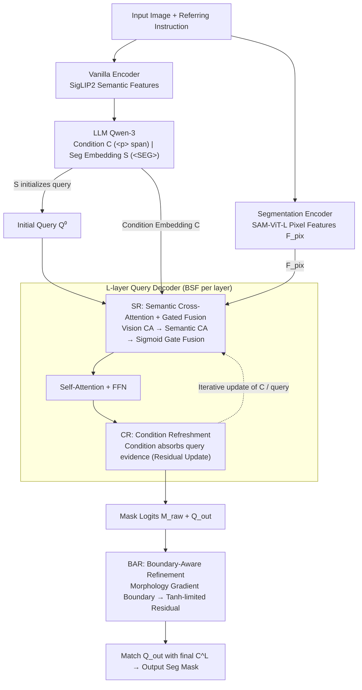

# FlowSeg: Dynamic Semantic Guidance for LLM-Conditioned Segmentation

**Conference**: ICML 2026  
**arXiv**: [2605.29461](https://arxiv.org/abs/2605.29461)  
**Code**: https://zkzhang98.github.io/FlowSeg_page  
**Area**: Segmentation / LLM-Conditioned Segmentation / Vision-Language Alignment  
**Keywords**: LLM-conditioned segmentation, bidirectional semantic flow, referring expression segmentation, reasoning segmentation, boundary refinement

## TL;DR
This paper points out that current query-based LLM-conditioned segmentation follows a "propose-then-select" paradigm—candidate masks are often accurate enough, but errors occur due to incorrect selection. To address this, FlowSeg is proposed, which incorporates LLM condition embeddings into every decoder layer for query refinement and allows them to be continuously updated by new visual evidence. Combined with a lightweight boundary refinement module, it achieves consistent performance gains on RefCOCO/+/g and ReasonSeg.

## Background & Motivation
**Background**: LLM-conditioned segmentation couples Large Language Models with pixel-level segmentation decoders (e.g., SAM-style or Mask2Former-style query decoders). This has formed a rapid evolutionary path: LISA → PSALM → HyperSeg → Sa2VA → X-SAM. Most mainstream frameworks use a query-based propose-then-select approach: a set of learnable queries decodes candidate masks from visual features through $L$ decoder layers, and finally, similarity matching is performed between the LLM's condition embeddings and the queries to select the one most similar to the target.

**Limitations of Prior Work**: The authors systematically analyzed failure cases of SOTAs like X-SAM on RefCOCO/+/g and found that "many failures are not due to insufficient mask quality, but incorrect matching"—in most failed samples, at least one candidate mask already has a high IoU overlap with the GT, but it is not selected because the scoring module assigns it too low a value. This "semantic misalignment" is particularly prevalent in references involving ambiguous attributes or relational descriptions.

**Key Challenge**: In current pipelines, semantic and visual information interact shallowly and unidirectionally. LLM-calculated condition embeddings are either injected as fixed keys/values for cross-attention or reserved entirely for the matching stage. The iteration trajectory of queries is still primarily driven by visual features; language only plays a role at the "end-stage scoring" moment, and condition embeddings are never updated, failing to absorb visual evidence decoded by the decoder.

**Goal**: To restructure the internal interactions of the decoder without changing the LLM-segmentor backbone—allowing semantics to participate in mask generation dynamics from layer 0 and permitting condition embeddings to be corrected by new visual signals during the decoding process, thereby solving "semantic misalignment" at the architectural level.

**Key Insight**: Oracle experiments provide a strong signal—if candidates are selected according to an oracle, the cIoU upper bounds of X-SAM and FlowSeg on RefCOCO/+/g are both close to 91%, nearly identical. This indicates that candidate generation is already near its peak; the bottleneck lies in selection. Solving the selection problem "during" the decoding process is more direct than training a stronger post-hoc scorer.

**Core Idea**: Use "Bidirectional Semantic Flow" (BSF) to allow conditions and queries to update each other in every decoder layer, followed by a lightweight "Boundary-Aware Refinement" (BAR) that "only targets uncertain boundaries without touching confident interiors."

## Method

### Overall Architecture
FlowSeg inherits the standard scaffold of dual visual encoders + LLM + query decoder used in LISA / X-SAM: (1) A Vanilla Encoder (SigLIP2-so400m) extracts semantic features for the LLM; (2) A Segmentation Encoder (SAM-ViT-L) extracts pixel features $\mathbf{F}_{\text{pix}}$ for the segmentation decoder. LLM uses Qwen-3, with the instruction embedding `
...
` for phrase spans and `<SEG>` for segmentation output positions. Two types of vectors are taken from the LLM hidden states: condition embedding $\mathbf{C}_{\text{LLM}}$ (from the `
` span) and segmentation embedding $\mathbf{S}_{\text{LLM}}$ (from the `<SEG>` position), which are projected via $\phi_{\text{llm}}$ to obtain $\mathbf{C}$ and $\mathbf{S}$. $\mathbf{S}$ is added to the initial query $\mathbf{Q}^{(0)}$ to provide global multimodal context. The decoder adopts the Mask2Former architecture with $N=200$ queries, but FlowSeg replaces the internal process of each decoder layer with BSF—consisting of two sub-flows: SR (language into vision) and CR (vision refreshing condition). In the output stage, mask probabilities are refined by BAR; finally, $\mathbf{Q}_{\text{out}}$ after $L$ layers is matched with the final $\mathbf{C}^L$ to output the segmentation mask. The three contribution modules SR / CR / BAR are the three key designs below.

### Key Designs

**1. BSF - SR (Semantic Refinement): Injecting language conditions at each decoder layer without overshadowing vision.**

In old pipelines, language only appeared during end-stage scoring, and query iterations were almost entirely vision-driven. SR brings language forward to every layer: first, vision cross-attention $\mathbf{Q}_{\text{vis}}^{(l)}=\mathrm{MHA}(\mathbf{Q}^{(l-1)},\mathbf{F},\mathbf{F})$ is performed as usual, then it performs semantic cross-attention on the LLM condition embeddings $\mathbf{Q}_{\text{sem}}^{(l)}=\mathrm{MHA}(\mathbf{Q}_{\text{vis}}^{(l)},\mathbf{C}^{(l-1)},\mathbf{C}^{(l-1)})$. The two paths are fuesd adaptively using a sigmoid gate $\mathbf{g}^{(l)}=\sigma(\mathbf{W}_g\cdot[\mathbf{Q}_{\text{vis}}^{(l)}\|\mathbf{Q}_{\text{sem}}^{(l)}])$, resulting in $\mathbf{Q}_{\text{fused}}^{(l)}=\mathbf{g}^{(l)}\odot\mathbf{Q}_{\text{vis}}^{(l)}+(1-\mathbf{g}^{(l)})\odot\mathbf{Q}_{\text{sem}}^{(l)}$, followed by standard self-attention and FFN. Two strategic choices are key: the gating allows shallow layers to use more vision and deep layers to use more semantics, matching the decoding rhythm of "building coarse spatial hypotheses then converging with language." Placing semantic injection after vision cross-attention ensures language "prunes/rejects" hypotheses based on existing spatial candidates rather than driving attention from scratch—direct concatenation or hard replacement would destroy spatial priors learned by the visual backbone.

**2. BSF - CR (Condition Refreshment): Allowing condition embeddings to be updated by visual evidence during decoding.**

Letting language flow into vision is not enough—condition embeddings are static vectors from the LLM that cannot absorb new visual evidence decoded by the decoder, which is the root of "selection mismatch." CR performs a reverse cross-attention at the end of each layer, letting the condition absorb current query states: $\mathbf{C}^{(l)}=\mathbf{C}^{(l-1)}+\mathrm{MHA}(\mathbf{C}^{(l-1)},\mathbf{Q}_{\text{s}}^{(l)},\mathbf{Q}_{\text{s}}^{(l)})$ ($\mathbf{Q}_{\text{s}}^{(l)}$ is the self-attended fused query). The residual form ensures the condition is not overwritten but incrementally corrected by visual confirmation. This component shows its value in the ablation: adding only SR (unidirectional) only yields +0.5%, while closing the feedback loop with CR jumps to +1.5%. The intuition is that once the candidate mask has gathered visual evidence of a "red" region, the condition can evolve from an abstract "red" to a concrete "the specific part of that red object I want," leading to more accurate matching.

**3. Boundary-Aware Refinement (BAR): Refining uncertain boundaries while keeping the confident interior intact.**

While BSF solves global semantic misalignment, residual errors are mostly concentrated on object outlines. BAR follows the principle of "enhancement rather than replacement": first, boundary pixels are identified from the mask probability map using morphological gradients $\mathbf{B}=\mathbb{I}[(\mathrm{dilate}(\mathbf{M}_{\text{prob}})-\mathrm{erode}(\mathbf{M}_{\text{prob}}))>\epsilon]$ (where $\epsilon=0.1$). Then, a lightweight network outputs a $\tanh$-limited residual $\Delta\mathbf{M}=\tanh(f_{\text{refine}}([\mathbf{M}_{\text{raw}}\|f_{\text{comp}}(\mathbf{F}_{\text{pix}})]))\cdot\alpha$ (where $\alpha$ is learnable) only within $\mathbf{B}$. Finally, $\mathbf{M}_{\text{refined}}=\mathbf{M}_{\text{raw}}+\Delta\mathbf{M}\odot\mathbf{B}$. Multiplying by $\mathbf{B}$ restricts modifications strictly to the uncertainty zone—allowing changes to any pixel might degrade the stable internal predictions of the decoder. Boundary extraction via morphology is training-free and tolerant of blur. The combined BSF+BAR adds only 5.93M parameters (+0.12%) and 4.28ms latency (+1.39%).

### Loss & Training
End-to-end training in three stages: (1) Segmentor pretraining for 36 epochs; (2) Vision-language alignment for 1 epoch; (3) Multi-task joint training for 2 epochs using AdamW with lr=$4\times 10^{-5}$, wd=0.05, and bs=8/GPU × 8 GPUs (H20). The loss is the LLM next-token loss plus segmentation loss $\mathcal{L}_{\text{seg}}=\mathcal{L}_{\text{CE}}+\lambda_{\text{dice}}\mathcal{L}_{\text{dice}}+\lambda_{\text{mask}}\mathcal{L}_{\text{mask}}$ ($\lambda_{\text{dice}}=\lambda_{\text{mask}}=5.0$, $\lambda_{\text{cls}}=2.0$). Deep supervision is applied to all decoder layers to facilitate semantic propagation.

## Key Experimental Results

### Main Results

Evaluated on RefCOCO / RefCOCO+ / RefCOCOg (cIoU) and ReasonSeg (gIoU/cIoU), compared with SOTAs like LISA, PixelLM, GSVA, SAM4MLLM, PSALM, HyperSeg, Sa2VA-8B, and X-SAM.

| Dataset | LISA-7B | HyperSeg | X-SAM | **Ours** | vs X-SAM (Gain) |
|--------|---------|----------|-------|-------------|----------|
| RefCOCO val | 74.9 | 84.8 | 85.1 | **85.8** | +0.7 |
| RefCOCO+ val | 65.1 | 79.0 | 78.0 | **80.2** | +2.2 |
| RefCOCOg val | 67.9 | 79.4 | 83.8 | **86.5** | +2.7 |
| RefCOCOg test | 70.6 | 78.9 | 83.9 | **86.1** | +2.2 |
| ReasonSeg test cIoU | 34.1 | – | 41.0 | **54.7** | +13.7 |
| ReasonSeg test gIoU | 36.8 | – | 57.8 | **60.5** | +2.7 |

The massive +13.7% cIoU jump on ReasonSeg confirms that "referring expressions requiring complex reasoning" rely most heavily on continuous semantic involvement during decoding. Backbone-controlled ablations show that upgrading X-SAM's LLM to Qwen3 yields marginal gains, while FlowSeg outperforms X-SAM even when using X-SAM's original Phi-3-3.8B, proving the gains stem from the architecture rather than a stronger LLM.

### Ablation Study

| Configuration | RefCOCO | RefCOCO+ | RefCOCOg | Avg. |
|------|---------|----------|----------|------|
| Baseline | 85.0 | 78.3 | 84.1 | 82.4 |
| + SR (semantic refinement) | 85.4 | 79.0 | 84.3 | 82.9 (+0.5) |
| + SR + CR (= BSF) | 85.6 | 79.9 | 86.2 | 83.9 (+1.5) |
| + SR + CR + BAR (Full) | **85.8** | **80.2** | **86.5** | **84.2 (+1.8)** |

### Key Findings
- Unidirectional semantic injection (SR only) yields small gains (+0.5%); adding CR closes the loop for a jump to +1.5%. A closed feedback loop is key; unidirectional "language guiding vision" is insufficient.
- Oracle bound experiments: Both FlowSeg and X-SAM have an oracle cIoU around 91%; the gap comes from selection rather than generation, validating the motivation.
- On the failure subset of X-SAM (cIoU < 0.5), FlowSeg improves the average IoU of these cases from 4.6 to 49.2 (+44.6 gain), with a rescue rate of 44.6%. In the harder cIoU < 0.2 subset, it still rescues +43.4, proving BSF primarily fixes semantic misalignment failures.
- BAR contributes +0.3% avg cIoU. Boundary refinement is the "cherry on top," but ensuring it "only moves boundaries" prevents it from degrading the stable interior predictions of the BSF.
- Minimal overhead: +5.93M parameters / +4.28ms latency, making it engineering-friendly.

## Highlights & Insights
- **Diagnosis-Driven Architecture**: Uses oracle experiments to pinpoint that "the problem is selection, not generation," followed by the targeted BSF design. This methodology of "quantifying the bottleneck before prescribing a solution" is highly reusable for LLM-conditioned dense prediction tasks.
- **Bidirectional Flow vs. Unidirectional Injection**: Conventional experience in cross-modal attention often focuses on adding a "text-to-vision" path, but this paper proves via ablation that performance is truly unlocked only when the condition is also refreshed. This provides a clear direction for improving all query-based multimodal decoders (detection, HOI, video referring).
- **Enhancement-not-Replacement Refining**: Unsupervisely identifying "areas to change" via morphological gradients and adding $\tanh$-limited residuals is a robust paradigm to avoid retraining and damaging internal representations. It can be applied to any output head requiring "local repair."
- **Lightweight & Pluggable**: BSF simply replaces internal modules in decoder layers without modifying the LLM or visual encoder, allowing it to be integrated into any Mask2Former-like head.

## Limitations & Future Work
- Evaluation is still limited to "one expression at a time" protocols. Multi-target / multi-mask / coreference resolution scenarios are not covered (X-SAM covers these, but this paper did not extend to those multi-task settings).
- The ReasonSeg val set is too small (340 cases), leading to high variance. The paper explicitly states that the "test set is the standard"; val cIoU is actually lower than X-SAM's, though gIoU is much higher, indicating a need for more standardized evaluation.
- BSF performs two extra attention operations per layer. Although parameters and latency are low, the cost of condition refinement $O(|C|\cdot N)$ should be reassessed if the number of queries $N$ increases significantly (e.g., in video segmentation).
- BAR uses a fixed threshold $\epsilon=0.1$ for morphology. Adaptive thresholds or learnable boundary detectors might further improve complex boundary scenarios.
- Semantic flow between LLM and decoder is mediated only once via `
` and `<SEG>` tokens. Finer hierarchies (e.g., each token flowing to different decoder layers) are potential expansions.

## Related Work & Insights
- **vs LISA / HyperSeg / X-SAM**: These belong to the "propose-then-select" paradigm with static LLM condition embeddings. FlowSeg changes the internal interaction from unidirectional to bidirectional without modifying the LLM backbone, thus serving as a general enhancement for this family.
- **vs PSALM / Sa2VA**: These works focus on expanding task spaces (video, multi-task), but the decoders remain passive recipients of language. FlowSeg's BSF is orthogonal and can be stacked on top of them.
- **vs Mask2Former / DETR Family**: Traditional query decoders entirely ignore language-side iterations. FlowSeg completes the paradigm by adding a "language-side iteration" within the Mask2Former decoder.
- **vs Cross-modal Attention (e.g., text as KV in PSALM)**: The difference lies in whether text is a fixed KV. Previous works let text flow unidirectionally into vision; FlowSeg lets text be updated by vision, forming a co-evolution.

## Rating
- Novelty: ⭐⭐⭐⭐ Bidirectional flow and boundary refinement are not entirely new concepts, but the combination and the diagnosis–design loop specifically for "semantic misalignment" are fresh.
- Experimental Thoroughness: ⭐⭐⭐⭐ Comprehensive main experiments, backbone-controlled tests, oracle bounds, failure case rescue, component ablation, and overhead analysis. Exposure to multi-mask/video settings is missing.
- Writing Quality: ⭐⭐⭐⭐⭐ Section 1 motivation is very clear. Algorithm 1 provides 14 lines of BSF pseudocode for easy reproduction.
- Value: ⭐⭐⭐⭐ +13.7 cIoU on ReasonSeg is a significant improvement. The BSF module is compact and portable, providing a general upgrade path for future LLM-conditioned dense prediction.

<!-- RELATED:START -->

## Related Papers

- [\[CVPR 2026\] GeoGuide: Hierarchical Geometric Guidance for Open-Vocabulary 3D Semantic Segmentation](../../CVPR2026/segmentation/geoguide_hierarchical_geometric_guidance_for_open-vocabulary_3d_semantic_segment.md)
- [\[ECCV 2024\] Cs2K: Class-Specific and Class-Shared Knowledge Guidance for Incremental Semantic Segmentation](../../ECCV2024/segmentation/cs2k_class-specific_and_class-shared_knowledge_guidance_for_incremental_semantic.md)
- [\[ICCV 2025\] Enhancing Transformers Through Conditioned Embedded Tokens](../../ICCV2025/segmentation/enhancing_transformers_through_conditioned_embedded_tokens.md)
- [\[CVPR 2026\] CrackSSM: Reviving SSMs for Crack Segmentation via Dynamic Scanning](../../CVPR2026/segmentation/crackssm_reviving_ssms_for_crack_segmentation_via_dynamic_scanning.md)
- [\[CVPR 2026\] Efficient Video Object Segmentation and Tracking with Recurrent Dynamic Submodel](../../CVPR2026/segmentation/efficient_video_object_segmentation_and_tracking_with_recurrent_dynamic_submodel.md)

<!-- RELATED:END -->
