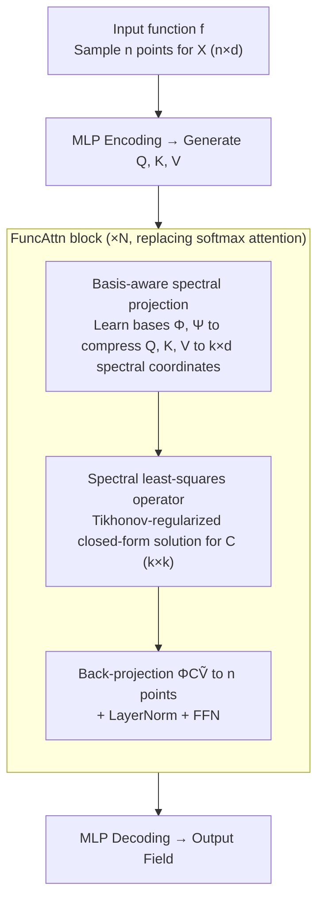

# Functional Attention: From Pairwise Affinities to Functional Correspondences

**Conference**: ICML 2026  
**arXiv**: [2605.31559](https://arxiv.org/abs/2605.31559)  
**Code**: https://github.com/xjffff/FUNCATTN  
**Area**: Scientific Computing / Operator Learning / Attention Mechanism  
**Keywords**: Operator learning, functional mapping, spectral attention, PDE solving, geometric correspondence

## TL;DR
This paper reinterprets softmax attention in Transformers as a "least-squares linear operator between two learned functional bases." Borrowing the idea of functional maps from shape matching, it compresses the $n \times n$ pairwise affinity matrix into a $k \times k$ compact spectral operator, achieving SOTA performance in PDE solving, 3D point cloud segmentation, and OOD generalization simultaneously.

## Background & Motivation
**Background**: Operator learning focuses on learning a mapping $\mathcal{O}:\mathcal{F}\to\mathcal{G}$ between two infinite-dimensional function spaces $\mathcal{F}, \mathcal{G}$. Mainstream directions include: (1) Fixed spectral domain methods like FNO/U-NO/WMT (Fourier, Wavelet, Laplacian bases); (2) Attention-based methods like Galerkin Transformer, OFormer, GNOT, and Transolver after discretizing fields into tokens.

**Limitations of Prior Work**: Fixed basis methods depend on grid structures and degrade on non-rectangular domains or irregular meshes. Token-based attention is flexible but either suffers from $O(n^2)$ dense affinity or uses linear attention approximations. Both treat "functions" as "sets of sample points," ignoring the underlying global functional structure, leading to parameter redundancy and sensitivity to resolution.

**Key Challenge**: The true role of attention is to induce a linear operator on the value space, but current mainstream practices instantiate it as an $n \times n$ pairwise affinity matrix. This intermediate representation binds complexity to the number of tokens and allows "functionally identical operators" to be redundantly expressed by infinitely many different point-level affinity matrices.

**Goal**: To skip pairwise affinities and directly estimate a compact linear operator $\mathbf{C} \in \mathbb{R}^{k \times k}$ between "learned functional bases." It must be (i) discretization-invariant, (ii) numerically stable/provably Lipschitz, and (iii) compatible with both regular PDEs and point clouds/irregular geometries.

**Key Insight**: Functional maps (Ovsjanikov et al., 2012) in geometry processing provide a paradigm: correspondences between 3D shapes are represented as small-scale linear mappings between two Laplace-Beltrami spectral bases, solved via regularized least squares. This paper adapts this to attention: query and key-value learn adaptive bases, and attention is viewed as the optimal linear operator mapping $\mathbf{K}$ to the spectral coordinates of $\mathbf{Q}$.

**Core Idea**: Replace the softmax affinity matrix with a $k \times k$ operator $\mathbf{C}^* = \tilde{\mathbf{Q}}\tilde{\mathbf{K}}^\top(\tilde{\mathbf{K}}\tilde{\mathbf{K}}^\top + \lambda \mathbf{I}_k)^{-1}$ solved via Tikhonov-regularized least squares, resulting in FuncAttn.

## Method

### Overall Architecture
FuncAttn follows the standard Transformer backbone: the input function $f$ is sampled at $n$ points to obtain $\mathbf{X} \in \mathbb{R}^{n \times d}$, encoded by an MLP, and passed through $N$ FuncAttn blocks before being decoded back to the output field. Inside each FuncAttn block, the traditional $\mathrm{Softmax}(\mathbf{Q}\mathbf{K}^\top/\sqrt{d_k})\mathbf{V}$ is replaced by a three-step pipeline: (a) project $\mathbf{Q}, \mathbf{K}, \mathbf{V}$ into spectral coordinates $\tilde{\mathbf{Q}}, \tilde{\mathbf{K}}, \tilde{\mathbf{V}} \in \mathbb{R}^{k \times d}$ using learned bases $\mathbf{\Phi}, \mathbf{\Psi} \in \mathbb{R}^{n \times k}$; (b) solve for the compact operator $\mathbf{C} \in \mathbb{R}^{k \times k}$ via Tikhonov-regularized least squares in the spectral space; (c) project back to $n$ spatial points using $\mathbf{\Phi}\mathbf{C}\tilde{\mathbf{V}}$. The subsequent LayerNorm and FFN are consistent with standard Transformers. Since the size $k \times k$ of $\mathbf{C}$ is independent of the number of sampling points $n$, the pipeline is naturally well-defined across different resolutions.

### Key Designs

**1. Basis-aware Spectral Projection: Compressing discrete samples into fixed-basis-independent spectral coordinates**

Fixed Fourier bases require regular grids and are geometry-insensitive, degrading on irregular meshes. FuncAttn learns separate bases $\mathbf{\Phi}, \mathbf{\Psi}$ for query and key-value, constructed as $\mathcal{B} = \mathrm{Softmax}(\mathrm{Linear}(\mathbf{X})) \in \mathbb{R}^{n \times k}$ by applying softmax along the $k$ dimension. The projection is $\tilde{\mathbf{Q}} = \mathbf{\Phi}^\dagger\mathbf{Q}$, implemented using the transpose $\mathbf{\Phi}^\top$ instead of the pseudoinverse for numerical stability to compress $n \times d$ samples to $k \times d$ coordinates. Softmax normalization ensures partition-of-unity and prevents basis degradation. Proposition 4.3 shows that as temperature $\tau \to 0$, each basis function degenerates to $\mathbf{1}_{\Lambda_j}$, recovering $P_0$ piecewise constant elements in FEM; at normal temperatures, they are "learned soft partitions." Table 7 confirms that freely learned bases outperform "learned + orthogonal constraints" and "Fourier bases."

**2. Spectral Domain Least-Squares Operator: Solving the $\mathbf{K} \to \mathbf{Q}$ transport as a $k \times k$ compact operator**

The true function of attention is to induce a linear operator, but mainstream approaches instantiate it as $n \times n$ affinities. Borrowing from functional maps—where point-level matching is complex but spectral domain mapping is a small convex problem—this work solves $\min_\mathbf{C}\|\tilde{\mathbf{Q}}-\mathbf{C}\tilde{\mathbf{K}}\|_F^2+\lambda\|\mathbf{C}\|_F^2$. The closed-form solution is $\mathbf{C}^* = \tilde{\mathbf{Q}}\tilde{\mathbf{K}}^\top(\tilde{\mathbf{K}}\tilde{\mathbf{K}}^\top+\lambda\mathbf{I}_k)^{-1}$. Unlike softmax, elements of $\mathbf{C}$ can be negative, implicitly providing "contrastivity." The low rank $k \ll n$ reduces complexity and acts as an implicit regularizer for structured data generalization. The Tikhonov term $\lambda$ ensures numerical stability, and Proposition 4.5 proves the Lipschitz upper bound is $C_1/\lambda+C_2/\lambda^2$, theoretically linking stability to $\lambda$.

**3. Resolution Invariance: Migration across mesh resolutions with the same parameters**

The $n \times n$ matrix in softmax binds models to specific resolutions. However, operator learning aims to learn the operator itself, not its sampling. Since $\mathbf{C} \in \mathbb{R}^{k \times k}$ is independent of $n$ and spectral projection $\mathbf{\Phi}^\top\mathbf{Q}$ is a linear projection on the $n$ dimension, the attention remains well-defined for any $n$. Models can be trained on coarse grids (e.g., 1D Burgers $n=2048$) and tested on 8192 points via a direct forward pass without finetuning. Resolution invariance is a zero-cost benefit of the architecture.

## Key Experimental Results

### Main Results

Compared against 14 baselines including spectral methods (FNO, WMT, etc.) and attention methods (Galerkin, Transolver, etc.) on 6 PDE benchmarks. Relative $L_2$ loss $\times 100$.

| Dataset | Galerkin | Transolver | LNO | **Ours** | vs Transolver |
|--------|----------|------------|------|---------|----------|
| Elasticity | 2.40 | 0.64 | 0.73 | **0.50** | -21.9% |
| Airfoil | 1.18 | 0.53 | 0.54 | **0.43** | -18.9% |
| Darcy | 0.84 | 0.57 | 0.60 | **0.42** | -26.3% |
| Pipe | 0.98 | 0.31 | **0.25** | 0.29 | -6.5% |
| Navier-Stokes | 14.01 | 9.44 | 8.45 | **8.00** | -15.3% |
| Plasticity | 1.20 | 0.13 | 0.31 | **0.11** | -15.4% |

SOTA was achieved on 5 out of 6 datasets, with relative improvements of 6%–26% over Transolver. Other highlights: RNA 3D point cloud segmentation reached 89.0%; AirfRANS OOD relative lift error was 23.4% (vs. Transolver 32.2%).

### Ablation Study

| Configuration | Elasticity | Darcy | Airfoil | Remarks |
|------|-----------|-------|---------|------|
| $k=16$ | 0.65 | 0.49 | 0.51 | Limited expression |
| $k=64$ | **0.50** | 0.42 | 0.43 | Recommended default |
| $k=512$ | 0.56 | 0.41 | 0.48 | Overfitting detected |
| Fourier Basis | / | / | 0.51 | Fixed < Learned |
| Learnable (Free) | / | / | **0.43** | Free learning is best |

### Key Findings
- $k$ is not "the larger the better": overfitting occurs beyond a threshold. $k=64$ is the optimal "performance/cost" trade-off.
- Free-learned bases > Orthogonally-constrained bases > Fixed Fourier bases. Standard SGD in Euclidean space finds better local minima than optimization on orthogonal manifolds.
- Replacing FuncAttn with Fourier bases still outperforms most baselines (e.g., Airfoil 0.51 vs. Galerkin 0.65), proving the superiority of the "Spectral Domain + Least Squares" paradigm itself.
- OOD improvements (27%–42%) significantly exceed in-distribution gains (6%–26%), suggesting function-level representations capture more transferable physical structures than token-level attention.

## Highlights & Insights
- **Paradigm Reinterpretation**: Instead of viewing attention as something to be "compressed or approximated," it is systematically related to functional maps—treating attention as a "linear operator estimation problem between function spaces."
- **Closed-form LS + Learned Bases**: It ground the theoretical observation of Galerkin Transformers into an executable algorithm by explicitly calculating $\mathbf{C}$ as a least-squares solution rather than letting the network learn it implicitly.
- **Provable Stability**: Proposition 4.5 directly links the Lipschitz constant of the layer to Tikhonov $\lambda$, giving the "temperature-like hyperparameter" an explicit mathematical meaning for the first time.
- **Signed Affinities**: The elements of $\mathbf{C}$ can be negative, which, compared to the non-negative constraint of softmax, provides the contrastive capability needed for fine-grained classification in tasks like RNA segmentation.

## Limitations & Future Work
- The learned bases utilize only a single linear layer with softmax; more structured bases (e.g., GNN-based) could be explored.
- Lack of formal analysis for generalization bounds; current Lipschitz proof focuses on stability but does not bound expressivity or relate error to the compression ratio $k/n$.
- $\lambda$ is currently a fixed hyperparameter; data-adaptive $\lambda$ or learned curvature-dependent regularization could be beneficial.
- Whether domains without natural functional space interpretations (e.g., NLP) can benefit remains an open question.

## Related Work & Insights
- **vs Galerkin Transformer (Cao 2021)**: Galerkin implicitly treats $\mathbf{Q}/\mathbf{K}/\mathbf{V}$ as Hilbert space functions, but the attention is still $\mathbf{K}^\top\mathbf{V}$; this work explicitly separates "functions" and "bases."
- **vs Transolver (Wu 2024)**: Transolver's "slice-and-attend" uses softmax on slice tokens; this work replaces slicing with a spectral framework and attention with least squares.
- **vs FNO Family**: FNO is limited by grid and periodicity assumptions; this work generalizes the "spectral domain parameterization" to learned, grid-independent bases.
- **vs Functional Maps (Ovsjanikov 2012)**: This work translates the functional maps framework into attention, replacing LB bases with data-adaptive ones and descriptor matching with query/key mechanisms.

## Rating
- Novelty: ⭐⭐⭐⭐⭐ Excellent bridging of functional maps and attention.
- Experimental Thoroughness: ⭐⭐⭐⭐ Extensive coverage of PDEs and 3D tasks, though NLP/Image exploration is missing.
- Writing Quality: ⭐⭐⭐⭐⭐ Clear derivation of motivation and algorithmic structure.
- Value: ⭐⭐⭐⭐ Provides a new attention template for the scientific computing community.

<!-- RELATED:START -->

## Related Papers

- [\[ECCV 2024\] Self-supervised Co-salient Object Detection via Feature Correspondences at Multiple Scales](../../ECCV2024/segmentation/self-supervised_co-salient_object_detection_via_feature_correspondences_at_multi.md)
- [\[NeurIPS 2025\] Attention (as Discrete-Time Markov) Chains](../../NeurIPS2025/segmentation/attention_as_discrete-time_markov_chains.md)
- [\[CVPR 2026\] MARSS: Radar Semantic Segmentation via Modular Attention and State Space Models](../../CVPR2026/segmentation/marss_radar_semantic_segmentation_via_modular_attention_and_state_space_models.md)
- [\[CVPR 2026\] DeBias-CLIP: CLIP Is Shortsighted — Paying Attention Beyond the First Sentence](../../CVPR2026/segmentation/clip_shortsighted_beyond_first_sentence.md)
- [\[CVPR 2026\] MixerCSeg: An Efficient Mixer Architecture for Crack Segmentation via Decoupled Mamba Attention](../../CVPR2026/segmentation/mixercseg_an_efficient_mixer_architecture_for_crack_segmentation_via_decoupled_m.md)

<!-- RELATED:END -->
