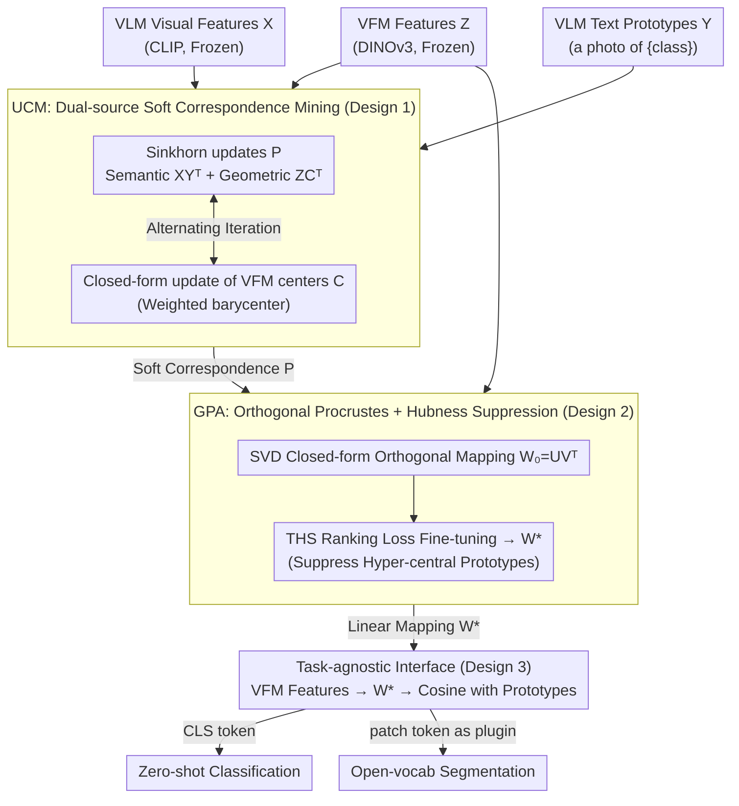

# Geometry-Preserving Unsupervised Alignment for Heterogeneous Foundation Models

**Conference**: ICML 2026  
**arXiv**: [2606.04385](https://arxiv.org/abs/2606.04385)  
**Code**: https://github.com/Yuteam14/GPUA (Yes)  
**Area**: Self-Supervised / Representation Learning / Multi-modal Alignment  
**Keywords**: Vision Foundation Models, VFM-VLM Fusion, Cross-lingual Alignment, Orthogonal Procrustes, Sinkhorn, hubness

## TL;DR
GPUA treats VLMs like CLIP (rich semantics, low local precision) and VFMs like DINOv3 (fine-grained, lacking semantics) as two "visual languages." It uses optimal transport to mine soft correspondences and solves an orthogonal Procrustes problem to learn a geometry-preserving linear mapping that translates VFM features into the VLM space. This process is entirely unsupervised, requires no updates to pre-trained parameters, and achieves an average gain of 11.8% in zero-shot classification.

## Background & Motivation
**Background**: The computer vision community identifies two primary camps of foundation models: **VLMs** (e.g., CLIP) use large-scale image-text contrastive pre-training to provide a language-aligned semantic space for open-vocabulary recognition; **VFMs** (e.g., DINOv3) follow self-supervised routes, offering clear patch-level feature structures and strong local discriminative power, but lack language anchors. Combining them is a consensus direction, typically seen in open-vocabulary segmentation pipelines connecting CLIP semantics with DINO fine-grained details.

**Limitations of Prior Work**: Existing fusion schemes suffer from two major flaws: (1) **Requirement for deep access**—they rely on extracting intermediate layer features or issuing dense mask queries, which is infeasible for closed-source models, APIs, or restricted deployments; (2) **Task/structure coupling**—fusion mechanisms are designed around pixel-level prediction, mask generation, or spatial post-processing, making them difficult to transfer to global semantic decision tasks like image-level zero-shot classification.

**Key Challenge**: To make heterogeneous foundation models "directly compatible at the representation layer," one must find a **task-agnostic, feature-only, parameter-free** alignment mechanism. However, representation spaces across models vary in dimensionality, scale, and geometry. Conventional alignment relies on supervised projections or alternating optimization, which are sensitive to initialization and prone to trivial solutions.

**Goal**: (1) Formulate a definition for "translating VFM features to VLM semantic space"; (2) Solve this mapping in a fully unsupervised manner without frozen parameter updates; (3) Suppress the common modality gap and hubness issues in VLM space to ensure translated features work for both zero-shot classification and segmentation.

**Key Insight**: The authors draw an analogy to **cross-lingual word embedding alignment** in NLP. Word vector spaces of different languages can be aligned via a geometry-preserving linear mapping solved by **orthogonal Procrustes** (Lample et al., 2018; Artetxe et al., 2018), where the "isomorphism hypothesis" has been validated. In vision, VFM features serve as "visual language" word vectors, while the VLM text side provides the "target language dictionary." By mining reliable "pseudo-dictionary" correspondences, the optimal mapping can be directly obtained via SVD.

**Core Idea**: VFM-VLM alignment is split into two stages: first, use **Sinkhorn-style optimal transport** to mine a soft correspondence matrix $P$ under dual constraints of VLM semantic structure and VFM geometric structure; then, feed $P$ into orthogonal Procrustes to solve for a closed-form mapping $W$, followed by fine-tuning $W$ with a hubness-aware ranking loss to suppress hyper-central prototypes.

## Method

### Overall Architecture
Input: VFM visual features $Z \in \mathbb{R}^{N \times d_v}$, VLM visual features $X \in \mathbb{R}^{N \times d_t}$, and VLM text prototypes $Y \in \mathbb{R}^{K \times d_t}$ (obtained from prompts like "a photo of {class}" via a text encoder, where $K$ is the number of classes).

Stage 1 (**UCM**, Unsupervised Correspondence Mining): Alternating updates of the soft correspondence matrix $P \in \mathbb{R}^{N \times K}_+$ and latent VFM centers $C \in \mathbb{R}^{K \times d_v}$. $P$ reflects both "VLM semantic scores" and "VFM geometric clustering," solved as an entropy-regularized transport problem via Sinkhorn.

Stage 2 (**GPA**, Geometry-Preserving Alignment): Use $P$ from Stage 1 to solve for an orthogonal mapping $W_0=UV^\top$ in closed form via SVD, ensuring $ZW$ stays close to the prototype mixture $PY$. $W_0$ is then fine-tuned to $W^*$ using a topology-aware hubness suppression loss $\mathcal{L}_{\text{THS}}$.

Inference: Image $\to$ VFM produces CLS/patch tokens $\to$ apply $W^*$ mapping to VLM semantic space $\to$ calculate cosine similarity with text prototypes for classification/segmentation. **Pre-trained VFM and VLM remain frozen; the pipeline learns only a lightweight linear transformation.**

### Key Designs

**1. UCM: Dual-source Soft Correspondence Mining**

To feed a "pseudo-dictionary" to orthogonal Procrustes, one must mine reliable soft assignments $P$ from VFM samples to VLM text prototypes without labels. The authors highlight a risk: simply assigning images to the nearest prototype in VLM space ($\min_P \|X-PY\|_F^2$) is equivalent to a K-means assignment step with fixed text centers, which is noisy under domain shift. Thus, latent centers $C$ in VFM space are introduced and shared with $P$: $\min_{P,C} (1-\lambda)\|Z-PC\|_F^2 + \lambda\|X-PY\|_F^2$. Geometric clustering and semantic assignment are locked by the same $P$. By relaxing $P$ to a non-negative matrix $\Pi(r,c)$ with marginal constraints and adding entropy regularization $-\varepsilon H(P)$, the $P$ subproblem becomes $\max_{P\in\Pi(r,c)}\langle P,(1-\lambda)ZC^\top+\lambda XY^\top\rangle+\varepsilon H(P)$, solved via Sinkhorn-Knopp. The $C$ subproblem is a closed-form barycenter $C_k=\sum_i P_{ik}Z_i / \sum_i P_{ik}$. This design ensures VLM provides semantic priors while VFM provides geometric priors on which samples belong together.

**2. GPA: Orthogonal Procrustes + Topology-aware Hubness Suppression**

With $P$, a "geometry-preserving" linear translation $W$ from VFM to VLM is learned. Solving $\min_W \|ZW - PY\|_F^2$ s.t. $W^\top W=I$ using $P$ as a soft dictionary is the classic orthogonal Procrustes problem, with the closed-form solution $W_0=UV^\top$ via $\text{SVD}(Z^\top PY)$. The orthogonality constraint ensures $W$ is approximately isometric, preventing collapse or shearing and preserving the VFM neighborhood geometry in VLM space. To address hubness (where a few prototypes become nearest neighbors for many samples), $W_0$ is refined using a topology-aware ranking loss $\mathcal{L}_{\text{THS}}=\frac{1}{NK}\sum_i\sum_{c\in\mathcal{N}_i^K}(d_i^++m_{i,c}^{\text{base}}+h_c-d_{i,c})_+$, where $d_i^+$ is the distance to the correct prototype, $d_{i,c}$ is the distance to competitor $c$, $m_{i,c}^{\text{base}}$ is a semantic margin, and $h_c$ is a hubness penalty based on frequency.

**3. Task-agnostic Interface: Feature-level Plug-and-play**

The alignment framework serves both image-level zero-shot classification and patch-level open-vocabulary segmentation. For classification, the VFM CLS token undergoes UCM+GPA, and $W^*$ is applied during inference. For segmentation, DINOv3 patch features are translated into the semantic space of frameworks like MaskCLIP/SCLIP/SC-CLIP as a plugin, without altering their heads or training. GPUA thus enhances both global discriminative power and fine-grained boundaries. The only requirement is feature access, making it compatible with closed-source models and APIs.

### Loss & Training
$$\mathcal{L}=\underbrace{(1-\lambda)\|Z-PC\|_F^2+\lambda\|X-PY\|_F^2-\varepsilon H(P)}_{\text{Stage 1: UCM}}+\underbrace{\|ZW-PY\|_F^2 \text{ s.t. } W^\top W=I + \eta\mathcal{L}_{\text{THS}}}_{\text{Stage 2: GPA}}$$. Stage 1 uses alternating Sinkhorn and barycenter updates; Stage 2 solves SVD for $W_0$ followed by gradient refinement. GPUA uses the full dataset; GPUA* uses 16 samples per class.

## Key Experimental Results

### Main Results
Zero-shot image classification (11 datasets, CLIP protocol, DINOv3 as VFM):

| Method | Flowers | Pets | Caltech | FGVC | EuroSAT | UCF101 | DTD | Food | Cars | SUN | ImageNet | Avg |
|------|---------|------|---------|------|---------|--------|-----|------|------|-----|----------|-----|
| CLIP | 70.7 | 89.1 | 93.2 | 24.7 | 48.3 | 67.5 | 43.5 | 85.9 | 65.6 | 62.5 | 66.6 | 65.2 |
| ZLaP | 73.5 | 87.1 | 93.1 | 25.4 | 55.6 | 71.5 | 48.6 | 86.9 | 65.6 | 67.4 | 70.0 | 67.7 |
| DPE | 75.1 | 91.1 | 94.8 | 29.0 | 55.8 | 70.4 | 54.2 | 86.2 | 67.3 | 70.1 | 71.9 | 69.6 |
| StatA | 75.2 | 92.4 | 94.2 | 24.7 | 67.3 | 73.5 | 48.4 | 87.1 | 68.0 | 68.7 | 69.9 | 69.9 |
| COSMIC | 82.1 | 94.2 | 96.8 | 31.4 | 58.8 | 76.2 | 58.2 | 86.6 | 71.3 | 72.3 | 78.2 | 73.3 |
| GPUA* (16-shot) | 86.6 | 94.5 | 98.1 | 34.7 | **80.3** | 78.4 | 56.7 | 87.9 | 77.4 | 72.6 | 74.3 | 76.5 |
| **GPUA (full)** | **83.8** | **95.0** | **95.3** | **33.8** | **88.2** | **80.4** | **58.5** | **89.5** | **77.7** | **74.2** | **75.4** | **77.4** |
| Gain vs CLIP | +14.0 | +6.0 | +3.8 | +5.5 | **+34.9** | +13.2 | +14.7 | +3.0 | +11.7 | +11.7 | +10.5 | **+11.8** |

GPUA achieves an average gain of 11.8 points. Significant improvements in EuroSAT (+34.9) and Flowers (+14.0) suggest that **VFM geometric details are successfully integrated into the VLM semantic space**.

### Ablation Study

| Configuration | Key Finding |
|------|---------|
| Full GPUA | UCM + GPA + THS |
| w/o VFM term ($\lambda=1$) | Performance degrades; geometric priors are essential. |
| w/o VLM term ($\lambda=0$) | Lost semantic alignment. |
| Direct SVD w/o THS | Hubness issues occur; hyper-central prototypes emerge. |
| w/o Orthogonal Constraint | Training collapse or geometric distortion. |
| Replacing VFM (DINOv2/v3) | Stronger VFMs lead to higher alignment gains. |

### Key Findings
- Geometric signals from the VFM side ($Z-PC$ term) are critical for preventing noise under domain shift.
- Orthogonality is the source of stability, preventing overfitting to pseudo-label noise.
- t-SNE visualizations show that GPUA pulls visual clusters accurately toward semantic anchors while preserving intra-class structure.

## Highlights & Insights
- The analogy of **cross-lingual alignment $\to$ cross-model alignment** is elegant, allowing the use of mature NLP tools like Procrustes and Sinkhorn in vision.
- The **two-stage (P then W) decoupling** improves stability compared to traditional alternating optimization, which is sensitive to initialization.
- Being **task-agnostic and parameter-frozen** makes GPUA a zero-cost plugin for closed-source APIs, which is more practical for industry deployment than end-to-end fine-tuning.

## Limitations & Future Work
- The reliance on a **single linear mapping** $W$ might be insufficient for highly non-linear modality gaps (e.g., LLM vs. vision).
- UCM currently requires an unlabeled calibration set, which is not strictly zero-shot in the purest sense.
- Orthogonality implies information loss when $d_v$ and $d_t$ differ significantly (e.g., 4096-d DINOv3 to low-d VLM text space).

## Related Work & Insights
- **vs LFA**: LFA uses alternating optimization; GPUA uses a two-stage approach with geometric priors, offering better stability.
- **vs Fusion Pipelines**: GPUA acts as a feature-level translator that can be plugged into existing segmentation frameworks.
- **vs Test-time Adaptation**: Unlike TDA methods that tune CLIP internally, GPUA leaves CLIP untouched and only applies an external mapping $W$.

<!-- RELATED:START -->

## Related Papers

- [\[CVPR 2026\] GKD: Generalizable Knowledge Distillation from Vision Foundation Models for Semantic Segmentation](../../CVPR2026/segmentation/gkd_generalizable_knowledge_distillation_vfm.md)
- [\[CVPR 2026\] From 2D Alignment to 3D Plausibility: Unifying Heterogeneous 2D Priors and Penetration-Free Diffusion for Occlusion-Robust Two-Hand Reconstruction](../../CVPR2026/segmentation/from_2d_alignment_to_3d_plausibility_unifying_heterogeneous_2d_priors_and_penetr.md)
- [\[CVPR 2026\] Unsupervised Multi-Scale Segmentation of 3D Subcellular World with Stable Diffusion Foundation Model](../../CVPR2026/segmentation/unsupervised_multi-scale_segmentation_of_3d_subcellular_world_with_stable_diffus.md)
- [\[CVPR 2026\] Metric-Guided Feature Fusion of Visual Foundation Models for Segmentation Tasks](../../CVPR2026/segmentation/metric-guided_feature_fusion_of_visual_foundation_models_for_segmentation_tasks.md)
- [\[CVPR 2025\] Uni4D: Unifying Visual Foundation Models for 4D Modeling from a Single Video](../../CVPR2025/segmentation/uni4d_unifying_visual_foundation_models_for_4d_modeling_from_a_single_video.md)

<!-- RELATED:END -->
