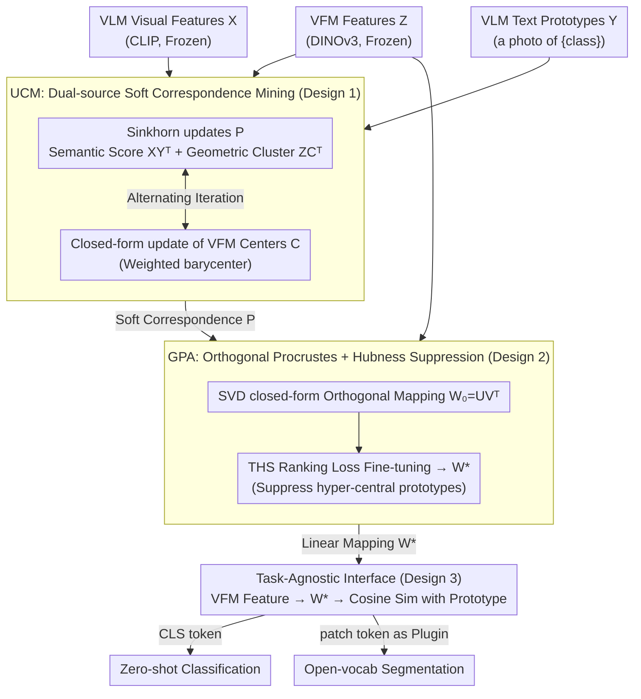

# Geometry-Preserving Unsupervised Alignment for Heterogeneous Foundation Models

**Conference**: ICML 2026  
**arXiv**: [2606.04385](https://arxiv.org/abs/2606.04385)  
**Code**: https://github.com/Yuteam14/GPUA (Available)  
**Area**: Self-Supervised / Representation Learning / Multi-modal Alignment  
**Keywords**: Visual Foundation Models, VFM-VLM Fusion, Cross-lingual Alignment, Orthogonal Procrustes, Sinkhorn, hubness

## TL;DR
GPUA treats VLMs like CLIP (rich semantics, insufficient local precision) and VFMs like DINOv3 (fine-grained detail, lacking semantics) as two "visual languages." It uses Optimal Transport to mine soft correspondences and solves the Orthogonal Procrustes problem to learn a geometry-preserving linear mapping that translates VFM features into the VLM space. This process is entirely unsupervised, requires no updates to pre-trained parameters, and achieves an average 11.8% improvement in zero-shot classification.

## Background & Motivation
**Background**: The computer vision community relies on two major camps of foundation models: **VLMs** such as CLIP, which provide a language-aligned semantic space via large-scale image-text contrastive pre-training and support open-vocabulary recognition; and **VFMs** such as DINOv3, which utilize self-supervised learning to produce patch-level features with clear structures and strong local discriminative power but lack language anchors. Combining both is a consensus direction, typically seen in open-vocabulary segmentation pipelines where CLIP semantics are merged with DINO's fine-grained details.

**Limitations of Prior Work**: Existing fusion solutions generally suffer from two major flaws: (1) **Dependence on deep access**—they either require internal layer features or dense mask queries, making them incompatible with closed-source models, APIs, or restricted deployments; (2) **Task/Architecture coupling**—the fusion mechanisms are designed specifically for pixel-level prediction, mask generation, or spatial post-processing, making them inapplicable to "global semantic decision" tasks like image-level zero-shot classification.

**Key Challenge**: To make heterogeneous foundation models "directly compatible at the representation layer," one must find an **alignment mechanism that is task-agnostic, looks only at features, and leaves parameters untouched**. however, cross-model representation spaces differ in dimensionality, scale, and geometry. Conventional alignment either relies on supervised projections or alternating optimization, which is highly sensitive to initialization and prone to trivial solutions.

**Goal**: (1) Formulate a definition for "translating VFM features into VLM semantic space"; (2) Solve this mapping in a completely unsupervised manner without modifying parameters; (3) Suppress the common modality gap and hubness issues in VLM spaces to ensure translated features are effective for zero-shot classification and segmentation.

**Key Insight**: The authors analogize this problem to **cross-lingual word embedding alignment** in NLP. Word vector spaces of different languages can be aligned using **Orthogonal Procrustes** to solve for a geometry-preserving linear mapping (Lample et al., 2018; Artetxe et al., 2018), as the "isomorphism hypothesis" has been verified. In vision, VFM features serve as "visual language" word vectors, while the VLM text-side provides the "target language dictionary." Once reliable "pseudo-dictionary" correspondences are mined, the optimal mapping can be solved directly via SVD.

**Core Idea**: VFM-VLM alignment is split into two stages: first, use **Sinkhorn-style Optimal Transport** to mine a soft correspondence matrix $P$ under the dual constraints of VLM semantic structure and VFM geometric structure. Second, input $P$ into Orthogonal Procrustes to obtain a closed-form mapping $W$, followed by fine-tuning $W$ with a hubness-aware ranking loss to suppress "hyper-central" prototypes.

## Method

### Overall Architecture
Input: VFM visual features $Z\in\mathbb{R}^{N\times d_v}$, VLM visual features $X\in\mathbb{R}^{N\times d_t}$, and VLM text prototypes $Y\in\mathbb{R}^{K\times d_t}$ (obtained via text encoder from prompts like "a photo of {class}", where $K$ is the number of classes).

Stage 1 (**UCM**, Unsupervised Correspondence Mining): Iteratively update the soft correspondence matrix $P\in\mathbb{R}^{N\times K}_+$ and latent VFM centers $C\in\mathbb{R}^{K\times d_v}$. $P$ reflects both "VLM semantic scoring" and "VFM geometric clustering," solving an entropy-regularized transport problem via Sinkhorn.

Stage 2 (**GPA**, Geometry-Preserving Alignment): Solve an orthogonal mapping $W_0=UV^\top$ in closed form using $P$ from Stage 1 via SVD, ensuring $Z W$ approximates the prototype mixture $PY$. Then, fine-tune $W_0$ to obtain $W^*$ using a topology-aware hubness suppression loss $\mathcal{L}_{\text{THS}}$.

Inference: Image $\to$ VFM produces CLS / patch tokens $\to$ Apply $W^*$ mapping to VLM semantic space $\to$ Calculate cosine similarity with text prototypes for classification/segmentation results. **Both pre-trained VFM and VLM remain frozen; the pipeline only learns a lightweight linear transformation.**

### Key Designs

**1. UCM: Dual-source Soft Correspondence Mining (Geometry + Semantics)**

To feed a "pseudo-dictionary" into Orthogonal Procrustes, reliable soft assignments $P$ from "VFM sample $\to$ VLM text prototype" must be mined without labels. The authors identify a risk: simply assigning images to the nearest prototype in VLM space ($\min_P \|X-PY\|_F^2$) is equivalent to a K-means assignment step with fixed text centers, which is noisy under domain shift. Thus, latent VFM centers $C$ are introduced to share $P$: $\min_{P,C} (1-\lambda)\|Z-PC\|_F^2 + \lambda\|X-PY\|_F^2$, forcing geometric clustering and semantic assignment to coincide. By relaxing $P$ to a non-negative matrix $\Pi(r,c)$ with marginal constraints and adding entropy regularization $-\varepsilon H(P)$, the $P$ sub-problem becomes $\max_{P\in\Pi(r,c)}\langle P,(1-\lambda)ZC^\top+\lambda XY^\top\rangle+\varepsilon H(P)$, solvable via Sinkhorn-Knopp iterations. The $C$ sub-problem is a closed-form barycenter $C_k=\sum_i P_{ik}Z_i / \sum_i P_{ik}$. Benefits include: VLM provides semantic priors, VFM provides geometric priors, and the decoupling of $P$ and $W$ eliminates sensitivity to initialization.

**2. GPA: Orthogonal Procrustes + Topology-Aware Hubness Suppression**

Given $P$, the goal is to learn a "geometry-preserving" linear translation $W$. Solving $\min_W \|ZW - PY\|_F^2$ s.t. $W^\top W=I$ is the classical Orthogonal Procrustes problem with a closed-form solution $W_0=UV^\top$, where $U\Sigma V^\top=\text{SVD}(Z^\top PY)$. The orthogonal constraint ensures $W$ is approximately isometric, preventing collapse or shear, and preserving VFM neighborhood geometry in VLM space. To address hubness (where few prototypes become nearest neighbors for many samples), the authors optimize a topology-aware ranking loss $\mathcal{L}_{\text{THS}}=\frac{1}{NK}\sum_i\sum_{c\in\mathcal{N}_i^K}(d_i^++m_{i,c}^{\text{base}}+h_c-d_{i,c})_+$. Here, $h_c=\frac{1}{N}\sum_i \mathbb{I}(c\in\mathcal{N}_i^K)$ is a hubness penalty: the more frequent a prototype acts as a neighbor, the larger the required margin between it and the sample.

**3. Task-Agnostic Interface: Feature-level Plug-and-Play**

The same framework serves both image-level zero-shot classification and patch-level open-vocabulary segmentation. Classification applies $W^*$ to the VFM CLS token. Segmentation applies $W^*$ at the patch level, translating DINOv3 patch features into semantic spaces like MaskCLIP, SCLIP, or SC-CLIP as an agnostic plugin. It requires only feature access, making it compatible with closed-source models and APIs, and is orthogonal to existing downstream frameworks.

### Loss & Training
$\mathcal{L}=\underbrace{(1-\lambda)\|Z-PC\|_F^2+\lambda\|X-PY\|_F^2-\varepsilon H(P)}_{\text{Stage 1: UCM}}+\underbrace{\|ZW-PY\|_F^2 \text{ s.t. } W^\top W=I + \eta\mathcal{L}_{\text{THS}}}_{\text{Stage 2: GPA}}$. Stage 1 iterates via Sinkhorn and closed-form barycenters. Stage 2 solves the SVD for $W_0$ and refines it with gradient descent. GPUA uses the full training set; GPUA* uses 16 samples per class.

## Key Experimental Results

### Main Results
Zero-shot image classification (11 datasets, CLIP protocol, DINOv3 as VFM):

| Method | Flowers | Pets | Caltech | FGVC | EuroSAT | UCF101 | DTD | Food | Cars | SUN | ImageNet | Avg |
|------|---------|------|---------|------|---------|--------|-----|------|------|-----|----------|-----|
| CLIP | 70.7 | 89.1 | 93.2 | 24.7 | 48.3 | 67.5 | 43.5 | 85.9 | 65.6 | 62.5 | 66.6 | 65.2 |
| ZLaP | 73.5 | 87.1 | 93.1 | 25.4 | 55.6 | 71.5 | 48.6 | 86.9 | 65.6 | 67.4 | 70.0 | 67.7 |
| DPE | 75.1 | 91.1 | 94.8 | 29.0 | 55.8 | 70.4 | 54.2 | 86.2 | 67.3 | 70.1 | 71.9 | 69.6 |
| StatA | 75.2 | 92.4 | 94.2 | 24.7 | 67.3 | 73.5 | 48.4 | 87.1 | 68.0 | 68.7 | 69.9 | 69.9 |
| COSMIC | 82.1 | 94.2 | 96.8 | 31.4 | 58.8 | 76.2 | 58.2 | 86.6 | 71.3 | 72.3 | 78.2 | 73.3 |
| GPUA* (16-shot) | 86.6 | 94.5 | 98.1 | 34.7 | **80.3** | 78.4 | 56.7 | 87.9 | 77.4 | 72.6 | 74.3 | 76.5 |
| **GPUA (full)** | **83.8** | **95.0** | **95.3** | **33.8** | **88.2** | **80.4** | **58.5** | **89.5** | **77.7** | **74.2** | **75.4** | **77.4** |
| Gain vs CLIP | +14.0 | +6.0 | +3.8 | +5.5 | **+34.9** | +13.2 | +14.7 | +3.0 | +11.7 | +11.7 | +10.5 | **+11.8** |

GPUA achieves an average gain of 11.8 points. Gains are highest in remote sensing (EuroSAT, +34.9) and fine-grained tasks (Flowers, +14.0), indicating that **VFM geometric details effectively augment VLM semantic space**.

### Ablation Study

| Configuration | Key Finding |
|------|---------|
| Full GPUA | Best performance (UCM + GPA + THS). |
| w/o VFM term ($\lambda=1$) | Performance degrades to LFA-style; validates geometric prior. |
| w/o VLM term ($\lambda=0$) | Loses semantic alignment entirely. |
| w/o THS | Severe hubness; samples converge to few hyper-central prototypes. |
| w/o Orthogonal Constraint | Training collapse or geometric distortion; orthogonality is essential. |
| Replace VFM (DINOv2 vs DINOv3) | Stronger VFMs lead to higher alignment gains. |

### Key Findings
- Geometric signals from the VFM side (the $Z-PC$ term) are critical; relying only on VLM self-scoring leads to high noise under domain shift.
- The orthogonal constraint is the source of stability; without it, the SVD path degrades to ordinary least squares, over-fitting to pseudo-label noise.
- t-SNE visualization confirms the original VLM modality gap is mitigated, with visual clusters accurately aligned to semantic anchors while retaining intra-class structures.

## Highlights & Insights
- **Cross-lingual to Cross-model**: The inductive bias of treating "VFM features as visual language" allows mature NLP tools (Procrustes, Sinkhorn, hubness loss) to be reused without "reinventing the wheel."
- **Two-stage Decoupling**: Unlike alternating optimization, solving $P$ first and then $W$ provides significant stability and serves as a useful engineering pattern for correspondence-based mapping problems.
- **Zero-cost Plugin**: The "task-agnostic, frozen parameters, single matrix" combination makes GPUA suitable for industrial deployment where fine-tuning large models is impractical.

## Limitations & Future Work
- The reliance on a **single linear mapping** $W$ might be insufficient for highly non-linear modality gaps (e.g., LLM text vs. Vision), though it suffices for CLIP/DINO.
- UCM currently requires an unlabeled calibration set, which adds a cost step compared to "pure" zero-shot CLIP.
- The orthogonal constraint causes information loss when $d_v \gg d_t$ (e.g., 4096-dim DINOv3 vs low-dim VLM text).

## Related Work & Insights
- **vs LFA**: LFA uses alternating optimization; GPUA uses two-stage decoupling and geometric priors for higher stability.
- **vs Multi-model Segmentation Pipelines**: Most methods are deeply coupled with segmentation; GPUA acts as a task-agnostic feature-level translator.
- **vs Test-Time Adaptation (TDA/DPE)**: TDA tunes internal CLIP representations; GPUA leaves CLIP untouched, making it lighter for deployment.

<!-- RELATED:START -->

## Related Papers

- [\[CVPR 2026\] From 2D Alignment to 3D Plausibility: Unifying Heterogeneous 2D Priors and Penetration-Free Diffusion for Occlusion-Robust Two-Hand Reconstruction](../../CVPR2026/segmentation/from_2d_alignment_to_3d_plausibility_unifying_heterogeneous_2d_priors_and_penetr.md)
- [\[ICML 2026\] Unsupervised Hierarchical Skill Discovery](unsupervised_hierarchical_skill_discovery.md)
- [\[CVPR 2026\] GKD: Generalizable Knowledge Distillation from Vision Foundation Models for Semantic Segmentation](../../CVPR2026/segmentation/gkd_generalizable_knowledge_distillation_vfm.md)
- [\[CVPR 2025\] Uni4D: Unifying Visual Foundation Models for 4D Modeling from a Single Video](../../CVPR2025/segmentation/uni4d_unifying_visual_foundation_models_for_4d_modeling_from_a_single_video.md)
- [\[ICCV 2025\] Can Generative Geospatial Diffusion Models Excel as Discriminative Geospatial Foundation Models?](../../ICCV2025/segmentation/can_generative_geospatial_diffusion_models_excel_as_discriminative_geospatial_fo.md)

<!-- RELATED:END -->
