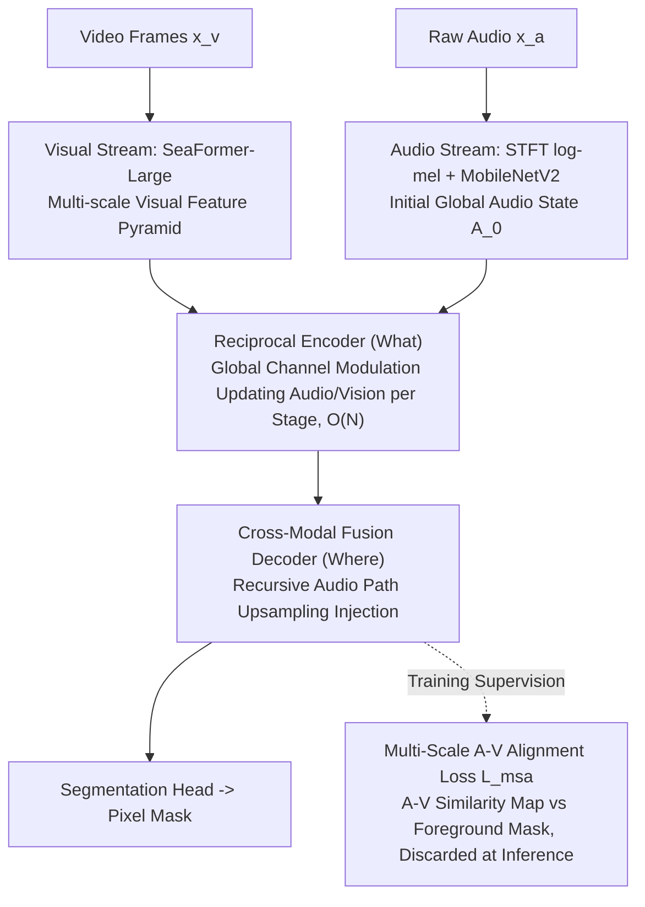

# LightAVSeg: Lightweight Audio-Visual Segmentation

**Conference**: ICML 2026  
**arXiv**: [2605.08805](https://arxiv.org/abs/2605.08805)  
**Code**: None  
**Area**: Audio-Visual Segmentation / Mobile Inference / Cross-modal Interaction  
**Keywords**: AVS, Channel Modulation, Linear Complexity, SeaFormer, Mobile CPU

## TL;DR
LightAVSeg decouples "semantic filtering (what)" and "spatial localization (where)" by replacing $\mathcal{O}(N^2)$ cross-modal attention with global channel modulation. This allows the AVS model to achieve 50.4 mIoU (MS3) with only 20.5M parameters and reach an on-device latency of 163.4 ms on Snapdragon 8 Elite, which is approximately $8\times$ faster than AVSegFormer-R50.

## Background & Motivation

**Background**: Audio-Visual Segmentation (AVS) aims to achieve pixel-level localization of sounding objects in videos. Mainstream methods (AVSegFormer / SelM) utilize Transformer cross-modal attention for dense token fusion, reaching 70+ mIoU at the cost of heavy models (151M parameters) and extremely high latency (1271 ms/frame on Snapdragon 8 Elite).

**Limitations of Prior Work**: Deploying AVS to AR/VR or mobile devices is highly challenging. Existing "lightweight" works often only replace the backbone (e.g., swapping ResNet-50 for MobileNetV2), but the cross-modal interaction module itself remains the bottleneck—its complexity is $\mathcal{O}(N^2)$ where $N \propto H \times W$, leading to a computational explosion as resolution increases.

**Key Challenge**: The attention mechanism is essentially overkill for AVS—audio inherently provides global semantic information about "what" is sounding, while visual features already carry sufficient spatial structure. Constructing a dense pixel-to-pixel affinity matrix is a waste of computational resources.

**Goal**: Design a mobile-friendly AVS framework that reduces the complexity of cross-modal interaction from $\mathcal{O}(N^2)$ to $\mathcal{O}(N)$ while maintaining accuracy comparable to R50-series competitors, while avoiding spurious cross-modal correlations often learned by lightweight models.

**Key Insight**: The authors base their work on the observation that "audio is responsible for what, while vision is responsible for where." By structurally decoupling these tasks, audio only needs to increase the weights of relevant visual channels through channel-level modulation, without participating in dense spatial calculations.

**Core Idea**: Use an iterative Reciprocal Audio-Visual Encoder to update audio states via global visual descriptor gating at each stage, then inject them into visual features as channel biases. Employ a Cross-Modal Fusion Decoder to maintain the recursive audio path during upsampling. Use a Multi-Scale Audio-Visual Alignment Loss to force pixel-level alignment during training, which is discarded during inference.

## Method

### Overall Architecture
LightAVSeg is a dual-stream architecture: visual and audio streams are encoded lightly, followed by a hierarchical fusion path that gradually injects audio cues into visual representations. Inputs are video frames $x_v \in \mathbb{R}^{T \times 3 \times H \times W}$ and raw audio waveforms $x_a$. The visual stream uses SeaFormer-Large to extract a multi-scale feature pyramid $\{V_i\}_{i=1}^N$. The audio stream uses STFT to obtain log-mel spectrograms, thereafter encoded by MobileNetV2 into an initial global state $A_0 \in \mathbb{R}^{T \times C_a \times 1 \times 1}$ (temporally aligned frame-by-frame with visual frames). The Reciprocal Encoder handles "semantic filtering (what)," updating audio states $A_i$ using global visual descriptor gating at each stage and writing back to visual features $\widetilde{V}_i^{enc}$ via channel bias. The Cross-Modal Fusion Decoder handles "spatial localization (where)," maintaining a recursive audio path $A_i^\ast \to \hat{A}_i$ during upsampling and injecting it into visual decoding features $\widetilde{V}_i^{dec}$. Finally, the segmentation head outputs the mask. During training, an additional multi-scale audio-visual alignment loss constrains cross-modal consistency, with a total loss $\mathcal{L} = \mathcal{L}_{\text{seg}} + \lambda \mathcal{L}_{\text{msa}}$, where $\mathcal{L}_{\text{seg}}$ is Dice + BCE and $\lambda = 0.5$; this branch is discarded during inference.

### Key Designs

**1. Reciprocal Audio-Visual Encoder (What): Audio handles "what" via global channel modulation to update vision at $\mathcal{O}(N)$ complexity**

Cross-modal attention builds an $N \times N$ affinity matrix with $\mathcal{O}(N^2)$ complexity, blowing up at high resolutions. For AVS, this is overkill because audio essentially provides global semantics of "what is sounding," while visual features already possess spatial structure. The Encoder performs point-to-point projection + broadcasting: visual features $V_i$ are $1{\times}1$ max-pooled into global descriptors $V_i^{1\times1}$ (intentionally discarding spatial info to force semantic selection). Then, h-sigmoid gating updates the audio state $A_i = \text{Conv}_{1\times1}(A_{i-1}) \odot \sigma_h(\text{Conv}_{1\times1}(V_i^{1\times1}))$, and finally $\widetilde{V}_i^{enc} = V_i + \mathcal{B}(A_i)$ adds audio back as a spatially broadcasted channel bias. This maintains strict $\mathcal{O}(N)$ complexity and makes audio increasingly scene-specific with depth, suppressing visually irrelevant noise early.

**2. Cross-Modal Fusion Decoder (Where + Recursive Audio Path): Sustained audio guidance injection in the upsampling path**

If audio guidance is injected only in the encoder, the global semantic consistency established early is diluted at the decoder's high-resolution layers where visual spatial scales change drastically. The Decoder maintains a recursive audio path parallel to visual decoding: each stage fuses the previous decoded audio $A_{i-1}$ with the corresponding encoder audio $A_i$ via a $1{\times}1$ convolution with ReLU to obtain $A_i^\ast$. This is then gated by visual global descriptors $\hat{A}_i = A_i^\ast \odot \sigma_h(\text{Conv}_{1\times1}(\widetilde{V}_i^{enc1\times1}))$, and finally $\widetilde{V}_i^{dec} = \widetilde{V}_i^{enc} + \mathcal{B}(\text{Conv}_{1\times1}(\hat{A}_i))$ is added to visual decoding features as a global channel bias. This recursive path ensures every layer "hears" task-relevant audio context.

**3. Multi-Scale Audio-Visual Alignment Loss ($\mathcal{L}_{\text{msa}}$): Explicitly supervising A-V similarity maps with foreground masks to suppress spurious correlations**

Lightweight models are prone to learning false cross-modal correlations. An explicit signal is needed to anchor "which visual part the audio corresponds to." For each scale $i$, $\widetilde{V}_i^{dec}$ and $\hat{A}_i$ are $\ell_2$-normalized along the channel dimension. The spatial cosine similarity map $\text{sim}_i = \langle \bar{v}_i, \bar{a}_i \rangle$ is calculated, sharpened with temperature $\tau=0.1$, and sigmoid-transformed to get $s_i$. It is upsampled to GT size and aligned with the foreground mask using BCE: $\mathcal{L}_{\text{msa}} = \frac{1}{S} \sum_i \text{BCE}(\hat{s}_i, M)$. BCE is chosen over KL because KL has high estimation variance and sensitivity to normalization, while BCE is more stable on bounded $[0,1]$ scores. Multi-scale supervision forces coarse semantic alignment in shallow layers and fine boundary alignment in deep layers, achieving "coarse-to-fine" refinement.

### Loss & Training
Total loss $\mathcal{L} = \mathcal{L}_{\text{seg}} + 0.5 \mathcal{L}_{\text{msa}}$, where $\mathcal{L}_{\text{seg}} = \mathcal{L}_{\text{dice}} + \mathcal{L}_{\text{bce}}$. Input size is $224 \times 224$. Trained with AdamW (lr $10^{-4}$, batch 8) for 60 epochs. Visual backbone SeaFormer-Large is pretrained; audio backbone MobileNetV2 is pretrained on AudioSet and frozen. Latency is measured using the TNN framework on mobile devices.

## Key Experimental Results

### Main Results

| Method | Backbone | Parameters | Mobile (ms) | S4 $\mathcal{M}_J$ | MS3 $\mathcal{M}_J$ |
|------|----------|------|-------------|--------------------|----------------------|
| AVSegFormer | R50+VGGish | 151.1M | 1271.4 | 76.5 | 49.5 |
| SelM | R50+VGGish | 117.6M | 1003.8 | 76.6 | 54.5 |
| AVSBench (Sea+MNetV2) | Sea+MNetV2 | 30.2M | 237.1 | 47.9 | 35.2 |
| AVSegFormer (Sea+MNetV2) | Sea+MNetV2 | 51.0M | 432.6 | 53.8 | 40.7 |
| **LightAVSeg (Ours)** | Sea+MNetV2 | **20.5M** | **163.4** | **75.6** | **50.4** |

### Ablation Study

| Configuration | MS3 $\mathcal{M}_J$ | Description |
|------|----------------------|------|
| ResNet-50 (R50) backbone | 52.9 | Accuracy upper bound, but 675 ms mobile latency is unacceptable |
| SeaFormer-Tiny | 30.6 | 22.1 ms extremely fast but accuracy collapses |
| SeaFormer-Base | 44.2 | 80.2 ms / 44.2 mIoU mediocre balance |
| **SeaFormer-Large (Selected)** | **50.4** | **163.4 ms optimal balance** |
| $\mathcal{L}_{\text{seg}}$ only | 49.3 | Baseline |
| $+\mathcal{L}_{\text{AVM}}$ | 49.2 | Adding AVSBench KL is ineffective |
| $+\mathcal{L}_{\text{mix}}$ | 48.8 | Performance drops |
| $+\mathcal{L}_{\text{msa}}$ (Ours) | **50.4** | BCE-based alignment is stable and effective |

### Key Findings
- In MS3 multi-source scenarios, LightAVSeg (50.4) actually outperforms the heavy AVSegFormer-R50 (49.5). The authors suggest global channel modulation is better at suppressing noise from multi-source overlap than dense attention, aligning with the observation that lightweight models suffer less from "spurious attention."
- Simply swapping for a lightweight backbone (AVSegFormer-Sea) only yields 40.7 MS3 mIoU, indicating the interaction module is the true bottleneck—the core empirical takeaway of this paper.
- Multi-scale supervision of $\mathcal{L}_{\text{msa}}$ leads to "coarse-to-fine" evolution: shallow activation maps perform global semantic filtering, while deep layers approach boundaries.

## Highlights & Insights
- Explicitly decomposing cross-modal interaction into "semantic filtering (what) + spatial localization (where)" is a portable design principle—applicable to any task where Modality A provides global context and Modality B carries spatial structure (e.g., RGB-D, text-guided segmentation).
- Re-injecting audio as a "global channel bias" to vision is parameter-free yet expressive, proving the efficiency of channel modulation in low-cost cross-modal scenarios.
- Using a training-only alignment loss that is discarded at inference is an excellent example of the "hard work during training, zero cost during inference" paradigm for latency-constrained deployment.

## Limitations & Future Work
- The audio stream uses a spectral-level MobileNetV2 to extract a global vector, missing temporal details; this might be insufficient for rapidly changing multi-source scenarios (e.g., alternating instruments).
- $\mathcal{L}_{\text{msa}}$ assumes "global audio corresponds to the whole foreground," which is insufficient for fine-grained alignment in multi-source scenes where different sources occupy different foreground regions.
- Testing was conducted only at $224 \times 224$; no data is provided for higher resolutions (1080p video frames) in real deployment.
- Mobile latency was only tested on Snapdragon 8 Elite, lacking coverage for mid-to-low-end chips.

## Related Work & Insights
- **vs AVSegFormer / SelM**: They use cross-attention for dense pixel fusion ($\mathcal{O}(N^2)$); Ours uses channel modulation + broadcasting ($\mathcal{O}(N)$), slightly outperforming heavy R50 versions on MS3.
- **vs SeaFormer / TopFormer**: These are pure visual mobile segmentation works; Ours migrates their "squeeze-enhanced attention" to cross-modal scenarios with audio-visual decoupling.
- **vs AVSBench (KL Alignment)**: AVSBench uses KL divergence for alignment; Ours demonstrates that BCE is more stable on bounded scores and directly aligns high-response regions with foreground masks.

## Rating
- Novelty: ⭐⭐⭐⭐ "What/where decoupling + channel modulation" achieves linear complexity for AVS interaction.
- Experimental Thoroughness: ⭐⭐⭐⭐ Three benchmarks (S4/MS3/AVSS) + thorough backbone/loss ablation + on-device latency measurements.
- Writing Quality: ⭐⭐⭐⭐ Clear framework diagrams, formulas, and concise writing.
- Value: ⭐⭐⭐⭐⭐ Directly serves real scenarios like mobile AR/video editing; a key step for on-device AVS.

<!-- RELATED:START -->

## Related Papers

- [\[CVPR 2025\] Audio-Visual Instance Segmentation](../../CVPR2025/segmentation/audio-visual_instance_segmentation.md)
- [\[CVPR 2025\] Robust Audio-Visual Segmentation via Audio-Guided Visual Convergent Alignment](../../CVPR2025/segmentation/robust_audio-visual_segmentation_via_audio-guided_visual_convergent_alignment.md)
- [\[CVPR 2025\] Dynamic Derivation and Elimination: Audio Visual Segmentation with Enhanced Audio Semantics](../../CVPR2025/segmentation/dynamic_derivation_and_elimination_audio_visual_segmentation_with_enhanced_audio.md)
- [\[CVPR 2026\] SouPLe: Enhancing Audio-Visual Localization and Segmentation with Learnable Prompt Contexts](../../CVPR2026/segmentation/souple_enhancing_audio-visual_localization_and_segmentation_with_learnable_promp.md)
- [\[ICCV 2025\] Implicit Counterfactual Learning for Audio-Visual Segmentation](../../ICCV2025/segmentation/implicit_counterfactual_learning_for_audio-visual_segmentation.md)

<!-- RELATED:END -->
