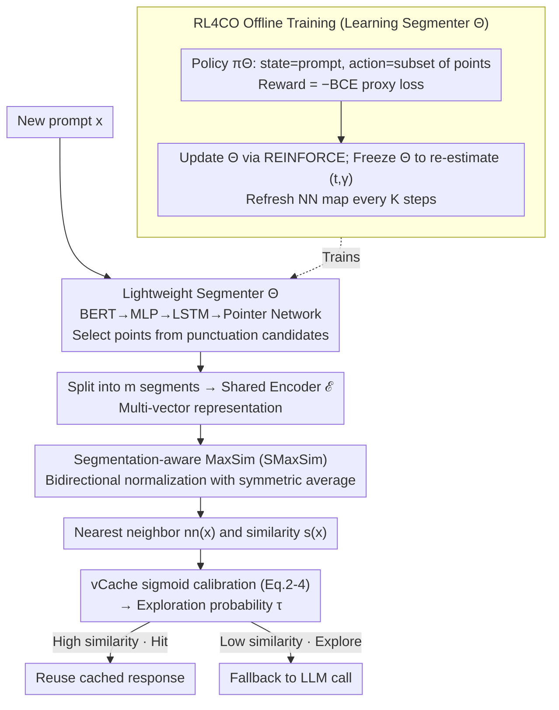

# MVR-cache: Optimizing Semantic Caching via Multi-Vector Retrieval and Learned Prompt Segmentation

**Conference**: ICML 2026  
**arXiv**: [2605.24914](https://arxiv.org/abs/2605.24914)  
**Code**: https://github.com/PKU-SDS-lab/MVR-Cache (Available)  
**Area**: LLM Efficiency / Semantic Caching / Multi-Vector Retrieval  
**Keywords**: Semantic Caching, Multi-Vector Retrieval, MaxSim, Prompt Segmentation, Reinforcement Learning, vCache

## TL;DR
MVR-cache upgrades the similarity metric for LLM semantic caching from "single-vector cosine" to "multi-vector MaxSim after learned segmentation." By training a lightweight segmentation model using REINFORCE, it increases the cache hit rate by up to 37% while maintaining the same error rate upper bound $\delta$.

## Background & Motivation
**Background**: LLM inference is expensive and slow. Semantic caching is a mainstream cost-reduction method—encoding historical prompts into a vector space so that the response can be directly reused if a new prompt is "similar enough." Production systems like Azure, LiteLLM, and GPTCache utilize this. The latest vCache (Schroeder et al., 2025) can learn an adaptive threshold for each prompt to provide a theoretical $1-\delta$ guarantee for the final error rate.

**Limitations of Prior Work**: Almost all these methods rely on **cosine similarity of the entire prompt**. For complex prompts, a single global vector cannot capture the **critical sub-segments** that determine whether LLM responses are consistent. The counter-example in Figure 1 is highly intuitive: a positive movie review $x$ and a negative movie review $x_1$ may have a very high cosine similarity as they share prominent keywords like "crime drama," but they lead to inconsistent LLM responses due to opposite sentiments. Mistaking this for a hit pollutes the output.

**Key Challenge**: Whether a cache should hit is inherently determined by whether "two prompts result in equivalent LLM responses," which often depends on **fine-grained matching of local segments**. Single-vector cosine compresses the entire semantics into a single point, causing **fine differences to be averaged out**. This leads to either raising the threshold (making hit rate unusable) or lowering it (violating the $\delta$ error bound).

**Goal**: Within the "adaptive threshold + error rate certificate" framework of vCache, replace the similarity metric with a finer-grained version. The goal is to **significantly increase the hit rate under the same $\delta$**. This is decomposed into three sub-problems: (1) what similarity structure to use; (2) how to seamlessly integrate it with vCache's sigmoid calibration and threshold learning; and (3) how to train a **lightweight, variable-length output** segmentation model end-to-end without increasing online inference latency.

**Key Insight**: The Information Retrieval (IR) community has established that splitting query/docs into multiple vectors for MaxSim (ColBERT) is more accurate than single-vector cosine retrieval. However, token-level segmentation in IR is inefficient for caching, and recent methods like POQD suffer from high latency by using an LLM for segmentation. The authors observe that the segmentation strategy can be **directly learned using the "cache hit rate (under $\delta$ constraints)" as a reward**, rather than adopting fixed splits from IR.

**Core Idea**: Train a lightweight segmenter $\Theta$ (BERT+LSTM+Pointer Network) that inputs a prompt and outputs a set of segmentation positions. Replace the internal similarity in vCache with multi-vector MaxSim after segmentation. Solve the "combinatorial + non-differentiable" training difficulty using a proxy BCE loss (theoretically equivalent to maximizing hit rate) and REINFORCE.

## Method

### Overall Architecture
Online path: New prompt $x$ arrives → Segmenter $\Theta$ selects split points from punctuation candidates to divide $x$ into $m$ segments → Shared encoder $\mathcal{E}$ embeds each segment into a vector to obtain a multi-vector representation → Compute **symmetrized segmentation-aware MaxSim** (SMaxSim) with each cached prompt → Obtain the nearest neighbor $nn_\Theta(x)$ and its score $s_\Theta(x)$ → Feed into the vCache sigmoid calibration module (Eq. 2-4) to get the exploration probability $\tau$ → Decide whether to reuse the cached response or fallback to the LLM.

Offline training path: Treat the segmentation model as an RL4CO policy $\pi_\Theta$. The state is the prompt, the action is the "subset of split points," and the reward is the negative of the "similarity alignment BCE loss." Optimize the expected reward using REINFORCE, periodically refreshing the nearest neighbor mappings.

### Key Designs

**1. Lightweight Variable-Length Pointer-Network Segmenter $\Theta$: Dynamic Online Segmentation**

Whether a cache can hit often depends on whether a specific key sub-segment matches, rather than the average semantics of the whole prompt. To achieve fine-grained matching, the prompt must first be divided into semantic segments. $\Theta$ restricts candidate split positions to punctuation $\mathcal{P}_x$ to ensure natural semantic boundaries. The architecture uses a BERT encoder $\Theta_1$ for token embeddings → MLP $\Theta_2$ → single-layer LSTM $\Theta_3$ for context vector $d_1$ → Pointer-Network attention $\Theta_4$ to compute $u_{1j}=v^\top\tanh(W_1 h_j + W_2 d_1)$, using a mask $\mathbf{I}(j\in\mathcal{P}_x)$ to zero out non-candidate positions. After picking the first point, $d_1'$ is fed back to the LSTM as $d_2$ to pick the next, until `<stop>` is emitted. The Pointer Network naturally handles the "variable output length based on input" setting. The model consumes only 500-600 MB of GPU memory, making its latency negligible compared to the LLM.

**2. Segmentation-aware MaxSim (SMaxSim): Symmetric Multi-Vector Matching**

After obtaining segment vectors, standard ColBERT MaxSim is asymmetric: $\text{MaxSim}(x,x_j)$ only ensures $x$'s segments are found in $x_j$, leading to "short prompt parasitism" false positives. SMaxSim calculates bidirectional MaxSim normalized by segment count, then takes the symmetric average: $\text{SMaxSim}_\Theta(x_i,x_j)=0.5\cdot[\tfrac{1}{|x_i|}\text{MaxSim}(x_i,x_j)+\tfrac{1}{|x_j|}\text{MaxSim}(x_j,x_i)]$. The score $s_\Theta(x)=\text{SMaxSim}_\Theta(x,nn_\Theta(x))$ is fed into the vCache sigmoid calibration $\Pr(c=1\mid s)=1/(1+e^{-\gamma(s-t)})$. This retains the "fine-grained local matching" of multi-vector methods while ensuring semantic reciprocity. The interface remains identical, allowing MVR-cache to inherit vCache's $1-\delta$ error rate certificate automatically.

**3. RL4CO Training Aimed at "Hit Rate": Direct Strategy Optimization**

The segmentation policy must serve the downstream objective of maximizing the hit rate under $\delta$ constraints. The paper provides an equivalence theorem (Thm 3.3): minimizing the BCE proxy loss $\sum \ell_{\mathrm{BCE}}(\mathcal{L}(\text{SMaxSim}_\Theta(x_i,x_j);t_i,\gamma_i),c_j)$ is strictly equivalent to maximizing the vCache hit rate (assuming Gaussian distributions). Since $\Theta$ outputs discrete sets of points, segmentation is treated as a policy $\pi_\Theta(\vec{p}\mid x)$ with negative BCE as the reward. Optimization via REINFORCE solves the "combinatorial optimization + global coupling" problem by periodically refreshing nearest neighbor maps $nn_\Theta(\cdot)$ to amortize costs.

### Loss & Training
The proxy objective is $\sum_i\sum_{nn_\Theta(x_j)=x_i}\ell_{\mathrm{BCE}}(\mathcal{L}(\text{SMaxSim}_\Theta(x_i,x_j);t_i,\gamma_i),c_j)$, where $c_j$ is the binary label indicating whether $x_j$ and its nearest neighbor $x_i$ have identical LLM responses (via exact string match). Only **3K** training samples per dataset are required to train the segmentation model.

## Key Experimental Results

### Main Results
Testing on four datasets: **SemCacheClassification (45K)**, **SemCacheSearchQueries (150K)**, **PromptBench (38K)**, and **QNLI (29K)**; using BGE embeddings and GPT-4o-mini; default $\delta=0.01$.

| Dataset | Protocol | MVR-cache Hit Rate Gain vs vCache | Error Rate |
|--------|------|-------------------------------|--------|
| SemCacheSearchQueries | always-cache | **+37%** (Max gain) | $<\delta=0.01$ |
| SemCacheClassification | cache-on-miss | +9% (≈ 4.1K GPT-4 calls saved) | $<\delta$ |
| PromptBench | cache-on-miss | Cumulative hit rate leads all baselines | $<\delta$ |
| QNLI | cache-on-miss | Significantly higher than baselines | $<\delta$ |

End-to-end latency (Table 1, minutes, algorithmic overhead without LLM calls in parentheses):

| Method | SemCacheClassification | SemCacheSearchQueries | PromptBench | QNLI |
|------|------------------------|-----------------------|-------------|------|
| vCache | 408.49 (23.21) | 6361.52 (69.77) | 1870.57 (19.58) | 1536.00 (14.10) |
| ColBert | 501.46 (25.84) | 6521.89 (130.00) | 2294.38 (150.32) | 1626.37 (39.28) |
| POQD | 971.51 (492.92) | 6990.08 (628.33) | 2945.20 (959.60) | 2648.80 (1048.48) |
| **MVR-cache** | **383.32 (34.14)** | **6345.61 (111.26)** | **1866.58 (27.49)** | **1504.43 (17.62)** |

MVR-cache's algorithmic overhead is slightly higher than vCache, but because the higher hit rate saves LLM calls, total end-to-end latency is reduced (up to 6% total reduction). POQD's algorithmic overhead exceeds the LLM cost itself.

### Key Findings
- Segmentation granularity is the decisive factor for MVR in caching: Token-level is too fine, whole prompt is too coarse; learned semantic segmentation at punctuations is the "sweet spot."
- vCache's "adaptive threshold + error certificate" is a plug-and-play container: upgrading the similarity metric $s$ automatically upgrades the error guarantees.
- Data requirements are low (3K samples). Combined with weak supervision, the one-time human effort is quickly recouped by saved LLM fees.

## Highlights & Insights
- **Equivalence Theorem between hit rate and BCE**: Provides a bridge connecting RL rewards to system metrics. This "theoretical proxy loss + RL" approach can be reused for other non-differentiable system optimizations like cache eviction or scheduling.
- **Pointer Network + candidate masking**: A simple yet effective solution for "variable length selection within semantic boundaries," fitting the inductive bias of segmentation better than BIO tagging.
- **Symmetric normalization of MaxSim**: Using segment counts to normalize resolves the "sub-string matching" false positive issue in caching—a logic applicable to any task using MaxSim.

## Limitations & Future Work
- Punctuation-based split boundaries may be inflexible for Chinese, code, or instructions without punctuation; a more general boundary generator is needed.
- Training depends on "exact string match" of LLM responses; for open-ended generation, this label is noisy and requires LLM-as-judge or embedding-based equivalence.
- Nearest neighbor refreshes ($K$ steps) scale with cache size; incremental maintenance is needed for massive caches.
- Theoretical guarantees rely on Gaussian distribution assumptions for $\Pr(s\mid c)$.

## Related Work & Insights
- **vs vCache**: MVR-cache uses vCache as an external framework and upgrades the "similarity" within it.
- **vs ColBERT**: MVR-cache focuses on semantic-level splits and symmetric matching rather than token-level asymmetric retrieval.
- **vs POQD**: POQD uses LLMs for segmentation which is too slow for online caching; MVR-cache uses a lightweight Pointer Network and optimizes directly for hit rate.

## Related Papers

- [\[CVPR 2026\] SAM2Text: Towards Prompt-Free and Multi-Resolution Video Scene Text Segmentation](../../CVPR2026/segmentation/sam2text_towards_prompt-free_and_multi-resolution_video_scene_text_segmentation.md)
- [\[CVPR 2026\] Test-Time Multi-Prompt Adaptation for Open-Vocabulary Remote Sensing Image Segmentation](../../CVPR2026/segmentation/test-time_multi-prompt_adaptation_for_open-vocabulary_remote_sensing_image_segme.md)
- [\[CVPR 2026\] Love Me, Love My Label: Rethinking the Role of Labels in Prompt Retrieval for Visual In-Context Learning](../../CVPR2026/segmentation/love_me_love_my_label_rethinking_the_role_of_labels_in_prompt_retrieval_for_visu.md)
- [\[CVPR 2026\] MatAnyone 2: Scaling Video Matting via a Learned Quality Evaluator](../../CVPR2026/segmentation/matanyone_2_scaling_video_matting_via_a_learned_quality_evaluator.md)
- [\[CVPR 2026\] ROSE: Retrieval-Oriented Segmentation Enhancement](../../CVPR2026/segmentation/rose_retrieval-oriented_segmentation_enhancement.md)

<!-- RELATED:END -->

<!-- RELATED:START -->

## Related Papers

- [\[CVPR 2026\] SAM2Text: Towards Prompt-Free and Multi-Resolution Video Scene Text Segmentation](../../CVPR2026/segmentation/sam2text_towards_prompt-free_and_multi-resolution_video_scene_text_segmentation.md)
- [\[CVPR 2026\] Love Me, Love My Label: Rethinking the Role of Labels in Prompt Retrieval for Visual In-Context Learning](../../CVPR2026/segmentation/love_me_love_my_label_rethinking_the_role_of_labels_in_prompt_retrieval_for_visu.md)
- [\[CVPR 2026\] Test-Time Multi-Prompt Adaptation for Open-Vocabulary Remote Sensing Image Segmentation](../../CVPR2026/segmentation/test-time_multi-prompt_adaptation_for_open-vocabulary_remote_sensing_image_segme.md)
- [\[CVPR 2026\] ROSE: Retrieval-Oriented Segmentation Enhancement](../../CVPR2026/segmentation/rose_retrieval-oriented_segmentation_enhancement.md)
- [\[CVPR 2026\] V²-SAM: Marrying SAM2 with Multi-Prompt Experts for Cross-View Object Correspondence](../../CVPR2026/segmentation/v2-sam_marrying_sam2_with_multi-prompt_experts_for_cross-view_object_corresponde.md)

<!-- RELATED:END -->
