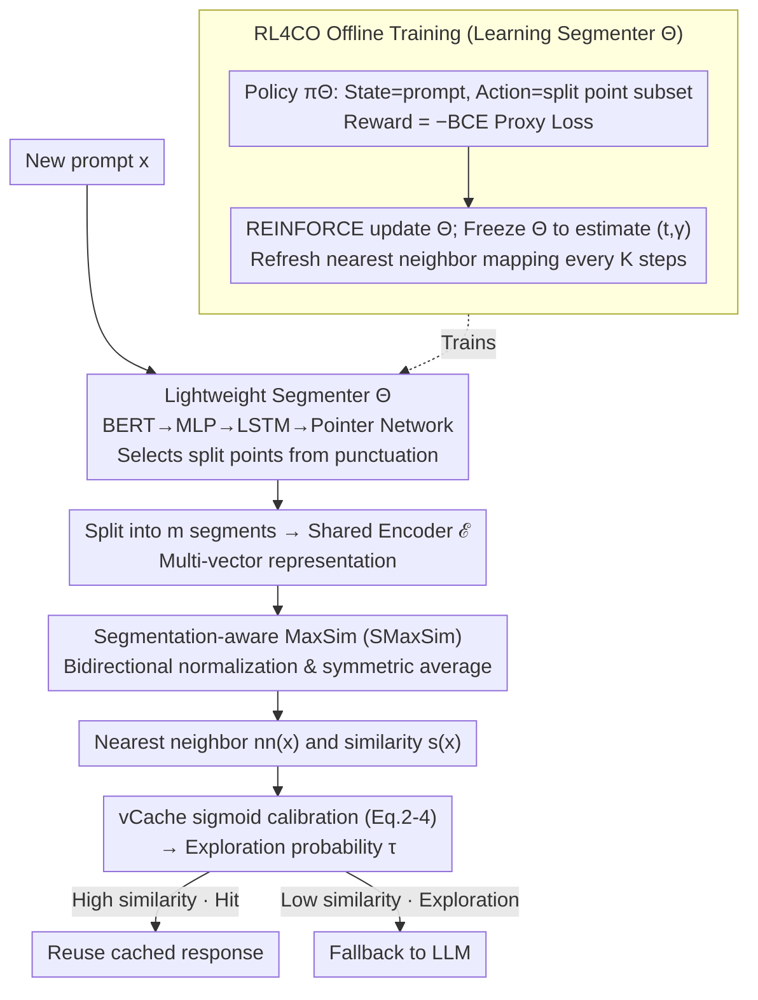

# MVR-cache: Optimizing Semantic Caching via Multi-Vector Retrieval and Learned Prompt Segmentation

**Conference**: ICML 2026  
**arXiv**: [2605.24914](https://arxiv.org/abs/2605.24914)  
**Code**: https://github.com/PKU-SDS-lab/MVR-Cache (Available)  
**Area**: LLM Efficiency / Semantic Caching / Multi-Vector Retrieval  
**Keywords**: Semantic Caching, Multi-Vector Retrieval, MaxSim, Prompt Segmentation, Reinforcement Learning, vCache

## TL;DR
MVR-cache upgrades the similarity metric for LLM semantic caching from "single-vector cosine" to "multi-vector MaxSim after learned segmentation." By training a lightweight segmentation model via REINFORCE, it boosts cache hit rates by up to 37% while maintaining the same error rate upper bound $\delta$.

## Background & Motivation
**Background**: LLM inference is expensive and slow. Semantic caching is a mainstream cost-reduction method that embeds historical prompts into a vector space; a new prompt retrieves a cached response if it is "similar enough" to a history entry. Production systems like Azure, LiteLLM, and GPTCache utilize this. The recent vCache (Schroeder et al., 2025) even learns adaptive thresholds per prompt to provide a theoretical $1-\delta$ guarantee on the final error rate.

**Limitations of Prior Work**: Existing methods almost exclusively use **global cosine similarity of the entire prompt**. For complex prompts, a single global vector fails to capture the **critical sub-segments** that determine whether LLM responses are consistent. Figure 1 in the paper provides a clear counterexample: a positive movie review $x$ and a negative review $x_1$ may exhibit high cosine similarity due to shared keywords like "crime drama," but their opposing sentiment leads to inconsistent LLM responses, causing cache pollution if a hit is incorrectly triggered.

**Key Challenge**: Whether a cache hit should occur depends on whether two prompts yield equivalent LLM responses, which often relies on **fine-grained matching of local segments**. Single-vector cosine compresses the entire semantic space into a single point, **averaging out precise differences**. This forces a trade-off: either raising the threshold (dropping hit rate to unusable levels) or lowering it (violating the $\delta$ error bound).

**Goal**: Within the "adaptive threshold + error rate certificate" framework of vCache, replace the similarity metric with a finer-grained version to **significantly improve hit rates under the same $\delta$**. The problem is decomposed into three parts: (1) what similarity structure to use; (2) how to integrate it seamlessly with vCache's sigmoid calibration/threshold learning; and (3) how to learn a **lightweight, variable-length** segmentation model end-to-end without prohibitive online inference latency.

**Key Insight**: The Information Retrieval (IR) community has long established that decomposing queries/documents into multiple vectors for MaxSim (ColBERT) is more accurate than single-vector cosine. However, token-level segmentation from IR is inefficient and suboptimal for caching, while recent work like POQD using LLMs for segmentation introduces excessive latency. The authors observe that the segmentation strategy can be **learned directly using the "cache hit rate (under $\delta$ constraints)" as a reward**, rather than relying on fixed IR heuristics.

**Core Idea**: A lightweight segmenter $\Theta$ (BERT+LSTM+Pointer Network) is trained to output segmentation positions for a prompt. Multi-vector MaxSim after segmentation replaces the similarity metric in vCache. The "combinatorial + non-differentiable" training challenge is solved via REINFORCE with a proxy BCE loss theoretically equivalent to "maximizing hit rate."

## Method

### Overall Architecture
Online Path: A new prompt $x$ arrives → The segmenter $\Theta$ selects split points from candidate punctuation marks to divide $x$ into $m$ segments → A shared encoder $\mathcal{E}$ embeds each segment into a vector, forming a multi-vector representation → **Symmetrized segmentation-aware MaxSim** (SMaxSim) is computed against cached prompts → The nearest neighbor $nn_\Theta(x)$ and its score $s_\Theta(x)$ are retrieved → This is fed into vCache's sigmoid calibration module (Eq. 2-4) to obtain exploration probability $\tau$ → Determines whether to reuse a cached response or fallback to the LLM.

Offline Training Path: The segmenter is treated as a policy $\pi_\Theta$ in RL4CO. The state is the prompt, the action is the "subset of split points," and the reward is the negative of the "similarity alignment BCE loss" calculated with current segments. REINFORCE optimizes the expected reward, with periodic refreshes of the nearest neighbor mapping.

### Key Designs

**1. Lightweight Variable-Length Pointer-Network Segmenter $\Theta$: Online Segmentation into Semantic Units**

Cache hits often depend on matching specific key sub-segments rather than the global semantic average. Global cosine similarity fails when different prompts (e.g., positive vs. negative reviews) share significant keywords. Fine-grained matching requires segmenting the prompt, and the quality of multi-vector representations depends on the segmentation strategy. Token-level segmentation is inefficient, and LLM-based segmentation (POQD) is too slow for online use. $\Theta$ restricts candidate split points to punctuation marks $\mathcal{P}_x$, selecting a subset from this restricted set—ensuring segments are neither too small nor split across natural semantic boundaries. The architecture uses a BERT encoder $\Theta_1$ for token embeddings → MLP $\Theta_2$ → single-layer LSTM $\Theta_3$ for context vector $d_1$ → Pointer-Network attention $\Theta_4$ to calculate $u_{1j}=v^\top\tanh(W_1 h_j + W_2 d_1)$. A mask $\mathbf{I}(j\in\mathcal{P}_x)$ zeros out non-candidate positions. After selecting one split point, $d_1'$ is fed back to the LSTM as $d_2$ to select the next, masking already chosen positions until a `<stop>` token is emitted. The Pointer Network naturally handles inputs with variable output lengths. The model requires only 500-600 MB of GPU memory, making its latency negligible compared to LLM inference.

**2. Segmentation-aware MaxSim (SMaxSim): Replacing Global Cosine with Symmetric Multi-Vector Matching**

Once segment vectors are obtained, they must be compared to produce a score. ColBERT's MaxSim is the baseline but is asymmetric: $\text{MaxSim}(x,x_j)$ only ensures $x$ matches portions of $x_j$, not vice versa, leading to false positives where short prompts "parasitize" longer ones. SMaxSim addresses this by computing bidirectional MaxSim scores, normalizing them by the number of segments, and taking the symmetric average: $\text{SMaxSim}_\Theta(x_i,x_j)=0.5\cdot[\tfrac{1}{|x_i|}\text{MaxSim}(x_i,x_j)+\tfrac{1}{|x_j|}\text{MaxSim}(x_j,x_i)]$. The score $s_\Theta(x)=\text{SMaxSim}_\Theta(x,nn_\Theta(x))$ is fed into vCache's sigmoid calibration $\Pr(c=1\mid s)=1/(1+e^{-\gamma(s-t)})$. Parameters $(t,\gamma)$ are estimated via MLE, with confidence intervals used for a conservative $\tau$. This retains the benefits of fine-grained matching while ensuring bidirectional semantic equivalence. It remains scale-invariant for prompts of varying lengths and inherits vCache's $1-\delta$ error rate certificate.

**3. Hit-Rate Targeted RL4CO Training: Optimizing Segmentation for $\delta$-Constrained Hits**

The segmentation strategy must serve the downstream objective of maximizing hits. The paper provides an equivalence theorem (Thm 3.3, assuming $\Pr(s\mid c)\sim\mathcal{N}(\mu_c,\sigma^2)$ and balanced classes): minimizing the BCE proxy loss $\sum \ell_{\mathrm{BCE}}(\mathcal{L}(\text{SMaxSim}_\Theta(x_i,x_j);t_i,\gamma_i),c_j)$ is strictly equivalent to maximizing the vCache hit rate. Since $\Theta$ outputs a discrete set of split points, the process is treated as a policy $\pi_\Theta(\vec{p}\mid x)$ with a reward equal to the negative BCE. Optimization is performed via REINFORCE: $\max_\Theta \mathbb{E}_{\vec{p_{x_i}},\vec{p_{x_j}}\sim\pi_\Theta}[\text{Reward}]$. During training, $\Theta$ is periodically frozen to update MLE estimates of $(t_i,\gamma_i)$, and the nearest neighbor mapping $nn_\Theta(\cdot)$ is refreshed every $K$ steps to manage computational overhead. The BCE proxy provides a dense reward signal with theoretical guarantees, making combinatorial optimization feasible.

### Loss & Training
The proxy objective is $\sum_i\sum_{nn_\Theta(x_j)=x_i}\ell_{\mathrm{BCE}}(\mathcal{L}(\text{SMaxSim}_\Theta(x_i,x_j);t_i,\gamma_i),c_j)$, where $c_j$ is a binary label indicating if $x_j$ and its current nearest neighbor $x_i$ produce identical LLM responses (via exact string match). The segmentation model can be trained effectively with only **3K** samples per dataset.

## Key Experimental Results

### Main Results
Testing on four datasets: **SemCacheClassification (45K)**, **SemCacheSearchQueries (150K)**, **PromptBench (38K, including SQUAD-V2 perturbation)**, and **QNLI (29K)**. BGE is used for embeddings and GPT-4o-mini for the LLM, with a default $\delta=0.01$. Protocols include cache-on-miss only and always-cache. Baselines include vCache, ColBert + vCache, and POQD + vCache.

| Dataset | Protocol | MVR-cache Hit Rate Gain vs vCache | Error Rate |
|--------|------|-------------------------------|--------|
| SemCacheSearchQueries | always-cache | **+37%** (Max Gain) | $<\delta=0.01$ |
| SemCacheClassification | cache-on-miss | +9% (≈ 4.1K GPT-4 calls saved) | $<\delta$ |
| PromptBench | cache-on-miss | Cumulative hit rate leads all baselines | $<\delta$ |
| QNLI | cache-on-miss | Significantly higher than baselines | $<\delta$ |

End-to-end latency (Table 1, minutes; algorithmic overhead excluding LLM calls in parentheses):

| Method | SemCacheClassification | SemCacheSearchQueries | PromptBench | QNLI |
|------|------------------------|-----------------------|-------------|------|
| vCache | 408.49 (23.21) | 6361.52 (69.77) | 1870.57 (19.58) | 1536.00 (14.10) |
| ColBert | 501.46 (25.84) | 6521.89 (130.00) | 2294.38 (150.32) | 1626.37 (39.28) |
| POQD | 971.51 (492.92) | 6990.08 (628.33) | 2945.20 (959.60) | 2648.80 (1048.48) |
| **MVR-cache** | **383.32 (34.14)** | **6345.61 (111.26)** | **1866.58 (27.49)** | **1504.43 (17.62)** |

MVR-cache's algorithmic overhead is slightly higher than vCache, but it achieves faster end-to-end latency (up to 6% reduction) because the higher hit rate saves significant LLM calls. POQD's algorithmic overhead exceeds the LLM cost itself due to LLM-based segmentation.

### Ablation Study

| Configuration | Key Finding | Description |
|------|---------|------|
| MVR-cache (Full) | Highest Hit Rate | Includes learned segmentation + SMaxSim + RL training |
| w/ ColBERT token-level | Significant drop | Proves "learned semantic segmentation" > "token-level" |
| w/ POQD LLM-based | Similar hit rate, huge latency | Online latency is unacceptable |
| Unidirectional MaxSim | More false positives | Validates need for SMaxSim bidirectional normalization |
| 3K Training samples → Larger | Negligible gain | 3K labels are sufficient |
| Weak supervision | Saves **80.4%** GPT-4 calls | Uses GPT-4o-mini as proxy for labels |
| Cross-distribution (PromptBench → QNLI) | Outperforms all baselines | Segmenter demonstrates cross-dataset generalization |

### Key Findings
- Segmentation granularity is the decisive factor for MVR in caching: tokens are too granular, the whole prompt is too coarse, and LLM-based splitting is too slow. Learned semantic-level punctuation segmentation is the "sweet spot."
- the vCache framework is a modular container: upgrading the similarity metric $s$ automatically improves the performance while keeping the error guarantees.
- Data requirements are minimal (3K samples). Combined with weak supervision, the one-time implementation cost is low and quickly offset by saved LLM fees.

## Highlights & Insights
- **The equivalence theorem between "hit rate maximization" and "BCE minimization"** serves as a vital bridge between RL rewards and system metrics. This "theoretical proxy loss + RL" approach is reusable for other non-differentiable system optimizations like cache eviction or scheduling.
- **Pointer Network + candidate masking** is a minimalist yet effective solution for selecting variable-length segments within semantic boundaries, better-fitting the inductive bias of "segmentation" than BIO tagging or binary classification.
- **Symmetric normalized MaxSim** is a simple yet elegant fix—adding a normalization term and averaging—to solve the "false hit" problem of asymmetric matching in caching. This modification is valuable for any downstream task using MaxSim.

## Limitations & Future Work
- Punctuation-based boundaries may lack flexibility for Chinese text, code, or long unpunctuated instructions; future work could explore sentence-piece or chunk-level candidates.
- Training depends on "exact string match" of LLM responses. For open-ended generation, this label becomes noisy, necessitating more robust equivalence metrics (e.g., embedding similarity or LLM-as-judge).
- The overhead of periodically refreshing the nearest neighbor ($K$ steps) increases with cache size; incremental kNN maintenance is needed.
- The theoretical guarantee relies on the assumption of $\Pr(s\mid c)$ being Gaussian. While empirically justified in the Appendix, the behavior under extreme non-Gaussian distributions remains an open question.

## Related Work & Insights
- **vs vCache** (Schroeder et al., 2025): vCache evolves thresholds from global to per-prompt, providing error certificates. MVR-cache keeps this shell but upgrades the internal similarity metric.
- **vs ColBERT** (Khattab & Zaharia, 2020): ColBERT uses token-level, asymmetric MaxSim. MVR-cache utilizes semantic-level symmetric segmentation, which is better aligned with "bi-directional semantic equivalence" in caching.
- **vs POQD** (Liu et al., 2025): POQD uses LLM-based query segmentation for retrieval accuracy. MVR-cache prioritizes online latency by using a lightweight Pointer Network and a "hit rate proxy" reward.

<!-- RELATED:START -->

## Related Papers

- [\[CVPR 2026\] Test-Time Multi-Prompt Adaptation for Open-Vocabulary Remote Sensing Image Segmentation](../../CVPR2026/segmentation/test-time_multi-prompt_adaptation_for_open-vocabulary_remote_sensing_image_segme.md)
- [\[CVPR 2026\] V²-SAM: Marrying SAM2 with Multi-Prompt Experts for Cross-View Object Correspondence](../../CVPR2026/segmentation/v2-sam_marrying_sam2_with_multi-prompt_experts_for_cross-view_object_corresponde.md)
- [\[CVPR 2025\] Semantic Library Adaptation: LoRA Retrieval and Fusion for Open-Vocabulary Semantic Segmentation](../../CVPR2025/segmentation/semantic_library_adaptation_lora_retrieval_and_fusion_for_open-vocabulary_semant.md)
- [\[CVPR 2026\] MatAnyone 2: Scaling Video Matting via a Learned Quality Evaluator](../../CVPR2026/segmentation/matanyone_2_scaling_video_matting_via_a_learned_quality_evaluator.md)
- [\[AAAI 2026\] Guideline-Consistent Segmentation via Multi-Agent Refinement](../../AAAI2026/segmentation/guideline-consistent_segmentation_via_multi-agent_refinement.md)

<!-- RELATED:END -->
