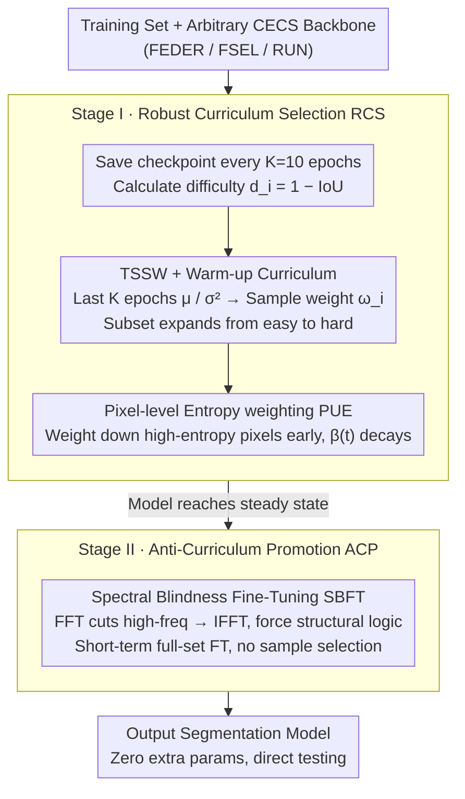

# Refining Context-Entangled Content Segmentation via Curriculum Selection and Anti-Curriculum Promotion

**Conference**: ICML 2026  
**arXiv**: [2602.01183](https://arxiv.org/abs/2602.01183)  
**Code**: https://github.com/ChunmingHe/CurriSeg  
**Area**: Image Segmentation / Camouflaged Object Detection / Curriculum Learning  
**Keywords**: Camouflaged Object Segmentation, Curriculum Learning, Anti-Curriculum Learning, Frequency Domain Fine-tuning, Sample Reliability

## TL;DR
CurriSeg keeps the segmentation network architecture unchanged and modifies only the training schedule: it first pushes the model to a stable state using a robust curriculum based on "temporal loss statistics + pixel entropy weighting," and then performs anti-curriculum "spectral blindness" fine-tuning (removing high frequencies to force the model to capture structural semantics). This approach consistently improves FEDER / FSEL / RUN by 2–4% on camouflaged/polyp segmentation benchmarks such as CHAMELEON / CAMO / COD10K / NC4K with zero additional parameters and shorter training time.

## Background & Motivation

**Background**: Context-Entangled Content Segmentation (CECS) refers to a class of segmentation tasks where the target and background highly overlap in texture, color, and shape, typically represented by Camouflaged Object Detection (COD), polyp segmentation, and medical lesion segmentation. Prevailing methods focus on iterating network architectures: multi-scale aggregation (SINet, FEDER), attention refinement (Pang, FSEL), edge/uncertainty branches, Transformer context, and frequency-domain modules.

**Limitations of Prior Work**: The training paradigm for almost all these methods follows "shuffling-minibatch-standard supervision," ignoring learning dynamics such as "sample order, sample difficulty, and pixel difficulty." In CECS scenarios where features are extremely blurred, this uniform treatment causes two issues: (1) "Easy samples" often carry spurious correlations—e.g., prominent background textures or clear target contours—causing the model to rely on these surface-level shortcuts immediately; (2) "Hard samples" contain both informative samples and noisy/ambiguous samples, and uniform weighting allows dirty samples to hinder optimization.

**Key Challenge**: Standard Curriculum Learning (CL) aims to move from "easy to hard," which can inadvertently push the model into a "high-frequency texture bias" zone, as easy samples are exactly those with the most prominent high-frequency textures; consequently, the model fails to learn when it encounters hard samples. Conversely, skipping curriculum learning entirely leads to interference from high-variance or label-noise samples. Furthermore, segmentation exhibits pixel-level heterogeneity—boundaries and low-contrast pixels are inherently difficult, and treating them equally with homogeneous pixels allows gradients to be hijacked by unreliable regions.

**Goal**: (1) Design a truly robust curriculum for CECS that distinguishes hard-but-informative samples from noisy/ambiguous samples; (2) simultaneously manage pixel-level uncertainty to prevent early training from being dominated by boundary noise; (3) introduce "anti-curriculum" difficulty once the model enters a stable state, forcing it to abandon texture shortcuts in favor of low-frequency structures.

**Key Insight**: The authors draw an analogy to biological learning—predators solidify basic skills in simple scenarios before confronting complex environments. In machine learning, this corresponds to a "stabilize-then-perturb" two-stage process: first using a robust curriculum to converge on reliable basic features from a clean subset, then using anti-curriculum to proactively strip high-frequency information and force the model away from texture shortcuts.

**Core Idea**: Temporal statistics of sample losses (mean + variance) are used to distinguish "hard but useful" from "noise/outliers," combined with pixel-entropy soft weighting for the first-stage robust curriculum. The second stage utilizes Spectral Blindness Fine-Tuning (SBFT) to suppress high frequencies, compelling the model to use low-frequency structures and context for decision-making. The entire process requires no architectural changes or additional parameters.

## Method

### Overall Architecture
CurriSeg is a training scheduling framework wrapped around any CECS backbone, executing two stages sequentially:

- **Stage I — Robust Curriculum Selection (RCS)**: A historical checkpoint $f_{\theta^{(k)}}$ is saved every $K=10$ epochs to calculate difficulty scores $d_i=1-\mathrm{IoU}(f_{\theta^{(k)}}(x_i), y_i)$ for all samples. The training subset is expanded by percentile (warm-up curriculum). Simultaneously, the mean/variance of difficulty over the most recent $K$ epochs provides sample-level weights $\omega_i$, while pixel entropy provides pixel-level soft weights $W_{h,w}(t)$.
- **Stage II — Anti-Curriculum Promotion (ACP)**: After the model stabilizes, SBFT is applied. High-frequency components of the input images are removed according to a fixed cutoff frequency, forcing the model to rely only on low-frequency structures and context.

The resulting segmentation model requires no architectural changes and is evaluated directly on the original test set.

### Key Designs

**1. Temporal Statistical Sample Weighting (TSSW) + Warm-up Curriculum: Distinguishing "Hard but Useful" from "Noisy/Outlier" at the sample level**

In CECS, features are extremely blurred, and hard samples are mixed with truly informative hard samples and noisy/ambiguous ones. Traditional CL cannot distinguish them using static difficulty. TSSW uses temporal statistics as a "sample reliability probe": it calculates difficulty $d_i=1-\mathrm{IoU}$ using historical checkpoints, maintains a cyclic buffer of length $K$ for each sample, and computes the mean $\mu_i=\frac{1}{K}\sum_k d_i^{(k)}$ and variance $\sigma_i^2=\frac{1}{K}\sum_k(d_i^{(k)}-\mu_i)^2$. After min-max normalization, these are converted into weights: $\omega_i^\mu=1-\tilde\mu_i$ favors low-mean loss (easy to learn), while $\omega_i^\sigma=\exp(-(\tilde\sigma_i^2-\sigma^*)^2/(2\gamma^2))$ ($\sigma^*=0.5, \gamma=0.2$) uses a bell-shaped function to favor "moderate variance." Extremely low variance suggests the sample is never learned (likely label noise), while extremely high variance suggests oscillation at the decision boundary (likely ambiguous). The final weight $\omega_i=W^s_{\min}+(1-W^s_{\min})\cdot\omega_i^\mu\cdot\omega_i^\sigma\cdot(1-\tilde\mu_i(1-\tilde\sigma_i^2))$ specifically suppresses "high mean-low variance" outlier patterns. The sample subset also uses a warm-up: starting with the easiest 60% subset $\mathcal{S}_t=\{i\mid d_i\le \mathrm{Per}(\{d_n\},p(t))\}$, where $p(t)$ increases linearly to 100% within $T_c$ epochs. The core intuition is that stable high loss indicates true outliers, while oscillating high loss indicates samples worth learning.

**2. Pixel-level Uncertainty entropy Weighting (PUE): Suppressing gradients of uncertain pixels within a single image**

Segmentation targets exhibit pixel-level heterogeneity—boundaries and low-contrast pixels are inherently difficult, and treating them equally can lead to gradients being hijacked. PUE calculates binary entropy $H_{h,w}=-p\log_2 p-(1-p)\log_2(1-p)\in[0,1]$ for the prediction probability $p_{h,w}=\sigma(\hat y_{h,w})$, and defines a soft weight $W_{h,w}(t)=W_{\min}+(1-W_{\min})\cdot(1-\beta(t)\cdot H_{h,w})$, where $\beta(t)=1-t/T_c$ decays with the curriculum and $W_{\min}=0.1$ maintains a baseline. Early on, $\beta$ is large, flattening the influence of high-entropy pixels; later, $\beta$ decreases, restoring full-pixel supervision. Unlike previous methods that use uncertainty to "filter pseudo-labels," the goal here is not to hide uncertain regions but to prevent them from dominating gradients initially. Maintaining a lower bound ensures that signals from boundaries are not completely blocked.

**3. Spectral Blindness Fine-Tuning (SBFT) Anti-Curriculum: Proactively stripping high frequencies to force low-frequency structural learning**

Standard CL traps models in "high-frequency texture bias." SBFT does the opposite: after the model stabilizes, it applies a 2D FFT to images, sets high-frequency coefficients to zero (or decays them) based on a fixed cutoff frequency, and then applies an IFFT back to the spatial domain as input. The model is forced to perform segmentation using only the remaining low-frequency luminance, shape, and context. This stage does not use RCS sample selection and performs short-term fine-tuning on the full set. In CECS, target and background textures overlap heavily; hence, high frequencies often act as interference. SBFT drives decision-making toward more robust low-frequency channels.

### Loss & Training
- Stage I: The original segmentation loss (BCE+IoU, etc.) is multiplied by sample weight $\omega_i$ and pixel weight $W_{h,w}(t)$.
- Stage II: Maintains the original segmentation loss but uses SBFT frequency-filtered images as input. RCS subset selection and weighting are disabled.
- The framework requires no changes to the baseline architecture and introduces no new trainable parameters. The only overhead is periodic checkpoint saving and maintaining the buffer for $\mu_i, \sigma_i^2$.

## Key Experimental Results

### Main Results
Four camouflaged object detection datasets (CHAMELEON / CAMO / COD10K / NC4K) and three backbones (ResNet50 / Res2Net50 / PVT V2) were used to evaluate CurriSeg on FEDER / FSEL / RUN:

| Baseline → w/ CurriSeg | Backbone | CHAMELEON $F_\beta\uparrow$ | CAMO $F_\beta\uparrow$ | COD10K $F_\beta\uparrow$ | NC4K $F_\beta\uparrow$ | Avg. $\Delta$ |
|---|---|---|---|---|---|---|
| FEDER | ResNet50 | 0.850 | 0.775 | 0.715 | 0.808 | — |
| **FEDER+ (Ours)** | ResNet50 | **0.858** | **0.790** | **0.736** | **0.825** | **+2.46%** |
| FSEL | ResNet50 | 0.847 | 0.779 | 0.722 | 0.807 | — |
| **FSEL+ (Ours)** | ResNet50 | **0.856** | **0.792** | **0.742** | **0.823** | **+2.22%** |
| RUN | Res2Net50 | 0.879 | 0.815 | 0.764 | 0.830 | — |
| **RUN+ (Ours)** | Res2Net50 | **0.891** | **0.820** | **0.785** | **0.852** | **+2.23%** |
| RUN | PVT V2 | 0.877 | 0.861 | 0.810 | 0.868 | — |
| **RUN+ (Ours)** | PVT V2 | **0.893** | **0.879** | **0.828** | **0.889** | **+3.94%** |

Effective on polyp segmentation as well: consistent performance gains of ~2% were observed across CVC-ColonDB / ETIS / PIS for PolyPPVT and CoInNet.

### Ablation Study
Contribution of each module on FEDER (ResNet50):

| Configuration | CHAMELEON $F_\beta\uparrow$ | COD10K $F_\beta\uparrow$ | Description |
|---|---|---|---|
| FEDER baseline | 0.850 | 0.715 | Standard training |
| + Vanilla CL | ~0.846 | ~0.711 | Slight performance drop, validating vanilla CL is harmful for CECS |
| + RCS (TSSW + PUE + warm-up) | 0.854 | 0.726 | Robust curriculum drives most gains |
| + ACP / SBFT (On top of RCS) | 0.858 | 0.736 | Anti-curriculum adds another tier |
| Full FEDER+ | **0.858** | **0.736** | Full set +2.46% |

Training overhead (batch=2):

| Metric | FEDER | FEDER+ | FSEL | FSEL+ | RUN | RUN+ |
|---|---|---|---|---|---|---|
| Training Time (h) | 9.62 | **6.84** | 11.54 | **5.96** | 12.64 | **8.32** |
| GPU Mem (G) | 1.53 | 1.62 | 2.83 | 2.92 | 3.66 | 3.75 |
| Perf. Gain (%) | — | +2.46↑ | — | +2.22↑ | — | +2.13↑ |

### Key Findings
- **Vanilla CL inherently degrades CECS performance**: Radar charts show "+ vanilla CL" performs worse than the baseline, validating the core motivation that simple "easy-to-hard" training leads to spurious texture shortcuts.
- **RCS is the primary driver, ACP provides marginal gains**: RCS alone accounts for ~70% of total improvement; SBFT extracts the final bit of performance.
- **Training time decreases**: Because the RCS warm-up skips the hardest 40% of samples initially and leads to faster convergence, training time for FEDER+ dropped from 9.62h to 6.84h with almost no change in memory usage.
- **Maximum gains on PVT V2 (+3.94%)**: Stronger backbones are more sensitive to training schedules; Transformers are prone to drilling into high-frequency shortcuts, making anti-curriculum correction more effective.

## Highlights & Insights
- The method is zero-parameter and requires no architectural changes, achieving 2–4% gains through training schedule modification alone.
- It identifies the cause of CL failure as the "spurious texture correlation → lazy zone → high-frequency reliance" chain and addresses it with the SBFT anti-curriculum module.
- TSSW's "joint mean-variance anomaly detection" can be applied to any supervised task with label noise or blurred data; the bell-shaped $\omega_i^\sigma$ is more nuanced than traditional monotonic functions.
- The combination of pixel entropy and curriculum decay $\beta(t)$ adds a temporal dimension to soft masking, preventing models from permanently avoiding difficult pixels while stabilizing early gradients.
- The reduction in training time is a significant value-add, acting as implicit data filtering.

## Limitations & Future Work
- Verification is limited to CECS tasks (COD and polyp); its efficacy on generic semantic segmentation (e.g., Cityscapes) is unproven.
- The SBFT cutoff frequency is a fixed hyperparameter lacking an adaptive mechanism; optimal values likely vary across datasets.
- Evaluating all samples via historical checkpoints $f_{\theta^{(k)}}$ scales linearly with dataset size, which could be costly for datasets exceeding 100K+ samples.
- Lack of explicit verification (e.g., frequency attribution or Grad-CAM analysis) to confirm the model actually shifts its reliance from high to low frequencies.

## Related Work & Insights
- **vs Standard Curriculum Learning (Bengio et al. 2009)**: Traditional CL assumes easy samples are reliable; CurriSeg refutes this for CECS, noting that easy samples contain spurious textures.
- **vs Self-Paced Learning (Kumar 2010)**: SPL uses instantaneous loss for difficulty; TSSW uses first- and second-order temporal statistics to better identify oscillating ambiguous samples.
- **vs Uncertainty Pseudo-label Filtering (He 2024/2025)**: While previous work used uncertainty for filtering, CurriSeg applies it to supervised predictions to weight "how much" to learn.
- **vs Frequency Augmentation (HighFreq / RandAug)**: Traditional methods treat high frequencies as perturbations; SBFT acts as an anti-curriculum tool to deliberately starve the model of information to force channel switching.

## Rating
- Novelty: ⭐⭐⭐⭐ The "stabilize-then-perturb" two-stage approach with RCS/ACP is a first for the CECS subfield.
- Experimental Thoroughness: ⭐⭐⭐⭐ Covers various backbones and datasets across two domains, though generic segmentation is missing.
- Writing Quality: ⭐⭐⭐⭐⭐ Clear narrative flow from observing vanilla CL failure to diagnosing and addressing the issue.
- Value: ⭐⭐⭐⭐ Plugin-ready, faster training, and zero parameters make it highly deployable.

<!-- RELATED:START -->

## Related Papers

- [\[CVPR 2026\] Annotation-Efficient Coreset Selection for Context-dependent Segmentation](../../CVPR2026/segmentation/annotation-efficient_coreset_selection_for_context-dependent_segmentation.md)
- [\[AAAI 2026\] JoDiffusion: Jointly Diffusing Image with Pixel-Level Annotations for Semantic Segmentation Promotion](../../AAAI2026/segmentation/jodiffusion_jointly_diffusing_image_with_pixel-level_annotations_for_semantic_se.md)
- [\[CVPR 2026\] RS-SSM: Refining Forgotten Specifics in State Space Model for Video Semantic Segmentation](../../CVPR2026/segmentation/rs-ssm_refining_forgotten_specifics_in_state_space_model_for_video_semantic_segm.md)
- [\[CVPR 2026\] Generalizable Co-Salient Object Detection via Mixed Content-Style Modulation](../../CVPR2026/segmentation/generalizable_co-salient_object_detection_via_mixed_content-style_modulation.md)
- [\[CVPR 2026\] INSID3: Training-Free In-Context Segmentation with DINOv3](../../CVPR2026/segmentation/insid3_training-free_in-context_segmentation_with_dinov3.md)

<!-- RELATED:END -->
