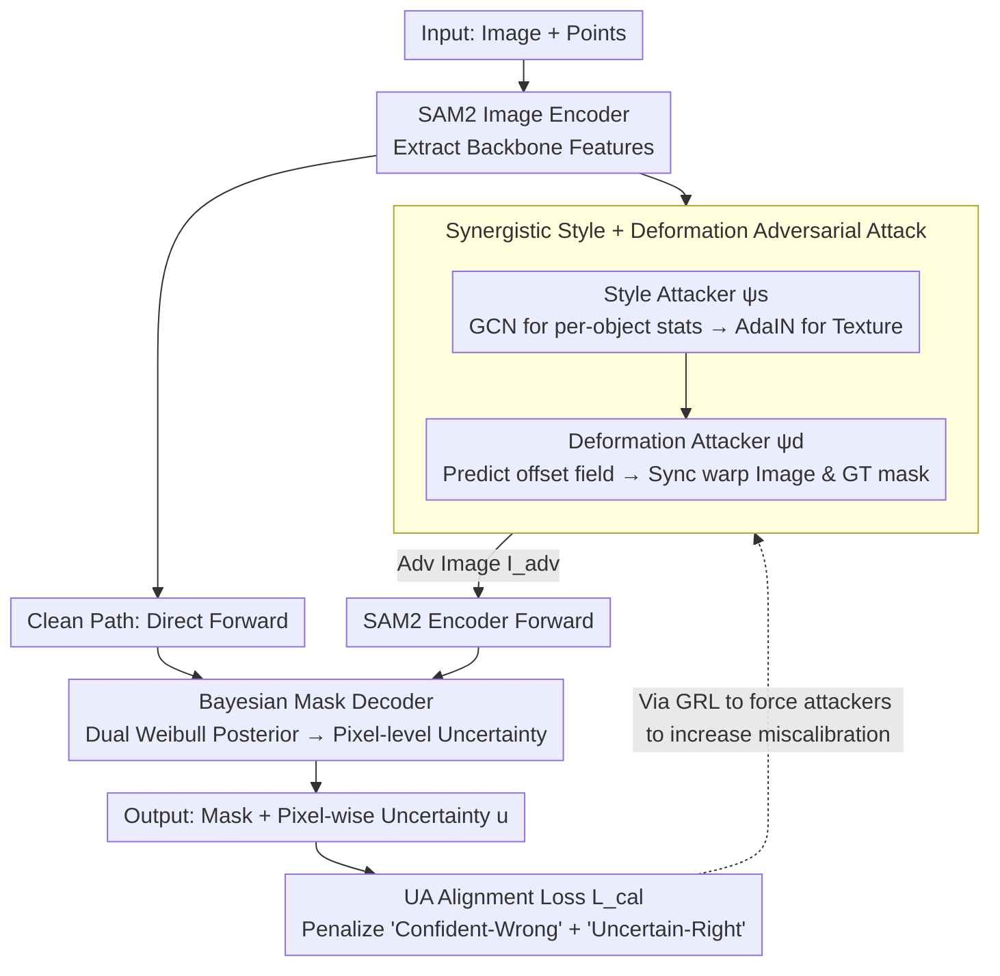

# Segment Anything with Robust Uncertainty-Accuracy Correlation

**Conference**: ICML 2026  
**arXiv**: [2605.10603](https://arxiv.org/abs/2605.10603)  
**Code**: https://github.com/HongyouZhou/ruac.git  
**Area**: Segmentation / SAM / Uncertainty Estimation / Robust Training  
**Keywords**: SAM2, Mask Confidence Confusion, Bayesian decoder, Adversarial Calibration, Domain Generalization

## TL;DR
Addressing the issue that the SAM series only outputs a single mask-level confidence score and suffers from "Mask-level Confidence Confusion" under domain shift, this paper equips SAM2 with a Weibull dual-granularity Bayesian mask decoder for pixel-level epistemic estimation. It incorporates a synergistic style + deformation adversarial perturbation and calibration loss inspired by human vision, ensuring uncertainty remains aligned with errors across 23 zero-shot target domains, achieving an average J&F of 79.87 with significantly more reliable uncertainty maps.

## Background & Motivation

**Background**: The SAM series has propelled promptable segmentation into the foundation model era with strong zero-shot performance. However, performance still collapses in domains such as medical, microscopic, and scientific imaging. Researchers typically resort to domain-specific fine-tuning (Medical SAM) or task-specific adaptation (Video SAM2, Conceptual SAM3).

**Limitations of Prior Work**: The IoU scores output by SAM are mask-level—the entire mask shares one confidence value, and the confidence gap between foreground and background is minimal. Once domain shift causes "certain pixels within the masked area to be incorrect," the model cannot inform the user which pixels are unreliable. The authors refer to this failure mode as Mask-level Confidence Confusion (MCC). Simply adding a Bayesian decoder introduces a new problem: the uncertainty-accuracy correlation learned on the source domain degrades on OOD data (Uncertainty-Accuracy shift, UA shift).

**Key Challenge**: To ensure SAM maintains the "Segment Anything" universality (without needing labeled fine-tuning for every target domain) while ensuring OOD uncertainty always identifies erroneous pixels. Both requirements necessitate "actively simulating OOD scenarios during the training phase on the source domain."

**Goal**: (1) Resolve MCC by providing pixel-level, dual-granularity uncertainty; (2) Resolve UA shift by aligning uncertainty with errors across 23 target domains; (3) Maintain Single Source Domain Generalization (SDG) without introducing additional target domain labels.

**Key Insight**: Drawing from cognitive science, humans recognize objects via shape bias, while neural networks rely more on texture bias (Geirhos et al.). Thus, OOD variations are decomposed into two orthogonal sub-problems: appearance (style/texture) variations and non-rigid deformation (shape) variations, stress-tested using two adversarial attackers.

**Core Idea**: Use synergistic style + deformation attackers to generate the most stressful training samples, combined with a calibration loss that penalizes both "certain & wrong" and "uncertain & correct" pixels, forcing uncertainty to cover true errors even under adversarial perturbations.

## Method

### Overall Architecture
RUAC replaces the deterministic mask decoder of SAM2 with a Bayesian Mask Decoder (UE); simultaneously, two attackers are attached: a Style Adversarial Network $\psi_s$ and a Deformation Adversarial Network $\psi_d$, trained via end-to-end min-max optimization with the segmentation model using a Gradient Reversal Layer (GRL). Each iteration includes both clean and adversarial forward passes: the clean pass maintains in-domain performance, while the adversarial pass pushes the model to the edge of calibration failure and retrains it. At inference, the attackers are discarded, and only the UE is run, making the deployment cost equivalent to adding a lightweight Bayesian head to SAM2.

### Key Designs

**1. Bayesian Mask Decoder (Dual-granularity Weibull posterior): Downscaling mask-level confidence to pixel-level**

SAM outputs mask-level IoU scores where the entire mask shares one confidence value, and the difference between foreground and background confidence is small. When domain shift occurs (MCC), the model cannot specify which pixels are wrong. RUAC replaces the original decoder with a Weibull distribution to model the uncertainty of both image tokens $\mathbf{f}\in\mathbb{R}^{H\times W\times C}$ and mask tokens $\mathbf{m}_k\in\mathbb{R}^C$. A convolutional head predicts spatially varying $(\lambda_f,\kappa_f)$, and a shared MLP predicts per-channel $(\lambda_{m,c},\kappa_{m,c})$. Sampling via reparameterization $w_i = \lambda_i \cdot (-\ln(1-u))^{1/\kappa_i}$, the two reparameterized features produce logits to propagate weight uncertainty to mask probabilities in closed form. At inference, it uses analytic mode (pixel-wise Bernoulli entropy via $\mathbb{E}[w_i]=\lambda_i\Gamma(1+1/\kappa_i)$ and MacKay probit approximation) or Monte Carlo mode. Weibull is chosen for its non-negativity and flexible shape, which is more suitable for token intensity than Gaussian modeling. Dual granularity covers both "boundary local uncertainty" and "object recognition errors."

**2. Synergistic Style + Deformation Adversarial Attack: Online generation of hard samples simulating OOD texture and shape**

Simply adding a Bayesian decoder leads to UA shift. To simulate OOD during source training, the authors decompose OOD variation into orthogonal axes—appearance (texture) and non-rigid deformation (shape)—with dedicated attackers. The Style attacker extracts per-object RGB mean/variance $(\boldsymbol\mu_k,\boldsymbol\sigma_k)$ from masked regions and uses a GCN on the object graph to predict residuals $(\Delta\boldsymbol\mu_k,\Delta\boldsymbol\sigma_k)$, obtaining a stylized image via AdaIN. The Deformation attacker combines backbone features with mask embeddings to predict a per-pixel offset field $\boldsymbol\delta_k$, then uses differentiable grid sampling to warp both image and GT mask. Both share the backbone, run a single forward pass, and update in the "harder" direction via GRL, avoiding PGD inner loops. Unlike $\ell_p$-bounded attacks targeting worst-case error, this decomposition targets texture and shape biases—two robustness axes validated in biological vision literature—ensuring high training efficiency via GRL.

**3. Uncertainty-Accuracy Alignment Calibration Loss: Forcing uncertainty to cover real errors on adversarial samples**

Generating hard samples is insufficient; the system must understand what "calibration failure" means. The calibration loss is defined as $\mathcal{L}_{\text{cal}} = e\cdot\exp(-\text{sg}[u]) + (1-e)\cdot\exp(\text{sg}[u])$, where $e=|\hat{\mathbf{M}}-\mathbf{M}^*|$ is pixel-wise error, $u$ is analytic uncertainty, and $\text{sg}[\cdot]$ denotes stop-gradient. The first term penalizes "confident but wrong" pixels, while the second penalizes "uncertain but right" pixels. Crucially, it does not directly supervise the segmentation network (isolated by stop-gradient); instead, it backpropagates through GRL to update the attacker, forcing it to maximize miscalibration while the segmentation network resists via segmentation and KL losses. This avoids the trap of the model sacrificing accuracy just to "appear calibrated."

### Loss & Training
Main optimization objective: $\min_{\theta_{\text{dec}}}\mathcal{L}_\theta = (\mathcal{L}_{\text{seg}}+\beta\mathcal{L}_{\text{KL}}) + \gamma(\mathcal{L}_{\text{seg}}^{\text{adv}}+\beta\mathcal{L}_{\text{KL}}^{\text{adv}})$, where $\mathcal{L}_{\text{seg}}=\mathcal{L}_{\text{focal}}+\mathcal{L}_{\text{dice}}+\mathcal{L}_{\text{IoU}}$. Attackers implicitly maximize $\mathcal{L}_{\text{seg}}^{\text{adv}}+\beta\mathcal{L}_{\text{KL}}^{\text{adv}}+\lambda\mathcal{L}_{\text{cal}}$. $\gamma$ is increased via a curriculum to avoid collapsing early in training. Training uses only single frames from the MOSE dataset.

## Key Experimental Results

### Main Results
Average J&F across 23 zero-shot target domains (representative columns):

| Method | Avg J&F | TrashCan | LVIS | Cityscapes | Hypersim | IBD | EgoHOS |
|------|---------|----------|------|------------|----------|-----|--------|
| SAM2 | 67.75 | 44.9 | 75.2 | 64.2 | 46.7 | 80.9 | 84.0 |
| SAM2-FT | 79.75 | 72.4 | 75.9 | 65.1 | 54.6 | 88.9 | 86.3 |
| SAM2-FT-LoRA | 79.13 | 71.3 | 75.6 | 61.6 | 54.6 | 88.9 | 83.6 |
| Bayes-SAM2 (UE only) | 79.87 | 74.9 | 75.1 | 55.4 | 57.5 | 90.3 | 90.4 |
| **RUAC (Full)** | **80.81+** | **74.4+** | 74.8 | **64.2** | **61.8** | **90.2** | **91.3** |

(Final row uses Random Noise as a baseline with Bayesian decoder; full data in Paper Tab. 1)

### Ablation Study

| Configuration | Avg J&F | Description |
|------|---------|------|
| SAM2 (No UE) | 67.75 | Baseline |
| Bayes-SAM2 (UE only) | 79.87 | With Bayesian decoder |
| Bayes-SAM2 + Random Noise | 80.81 | Standard augmentation |
| Bayes-SAM2 + PGD | 87.5 (partial)* | $\ell_\infty$ adversarial |
| **RUAC (UE + Style + Deformation + Cal)** | Best in Tab. 1 | Full method |

Pure uncertainty baselines like UR-ERN average 73.40, significantly lower than Bayes-SAM2's 79.87, indicating insufficient adaptation for foundation models.

### Key Findings
- Using UE alone improved average J&F from 67.75 to 79.87, showing that MCC is severely underestimated under domain shift; downscaling confidence to pixel-level solves many issues inherently.
- Adding AUE (synergistic attack) provided the greatest gains in scene/scientific domains with varying geometry and texture (e.g., Hypersim 57.5 → 61.8, Cityscapes 55.4 → 64.2).
- Compared to PGD (worst-case), RUAC's style/deformation maintains high accuracy while achieving better calibration curves, proving the adversarial target should be miscalibration rather than max-loss.
- Training on just the MOSE domain generalizes across 23 diverse domains, suggesting that bio-inspired attacks yield task-agnostic inductive biases for calibration and robustness.

## Highlights & Insights
- Decomposing mask-level confidence into pixel-level and OOD into texture/shape is exceptionally clear; each step addresses a specific failure mode.
- Using GRL instead of PGD inner loops for single-pass adversarial training is key for scaling to foundation models.
- The use of stop-gradient in the calibration loss to penalize the attacker rather than directly training segmentation avoids the "calibrated but bad" trap.
- A PAC-Bayesian perspective connects the method to loss landscape flattening and uncertainty-risk coupling, providing a theoretical anchor for empirical adversarial calibration.

## Limitations & Future Work
- The AUE attack model itself requires training and relies on GCN object graphs, which is less directly applicable to single-object or no-mask prompt scenarios.
- Training only on MOSE emphasizes SDG convenience, but it remains to be seen if gains hold when the source and target are drastically different (e.g., medical volume rendering modes).
- The Weibull assumption is flexible but unimodal; it may collapse to a mean estimate in the face of true multimodal ambiguity.
- Inference defaults to analytic mode; the paper lacks a systematic cost-benefit analysis of MC mode for fine-grained tasks.

## Related Work & Insights
- **vs Bayes-SAM2 / BNDL**: Inherits the Weibull posterior but extends the environment from source domain to adversarial calibration OOD.
- **vs AdvStyle / DG-Font**: Specifically adapted for uncertainty-accuracy alignment rather than just worst-case domain generalization.
- **vs PGD / Madry**: Traditional $\ell_p$ attacks seek max loss; this work seeks max miscalibration—this "semantic adversarial + calibration target" combination is a promising training paradigm.

## Rating
- Novelty: ⭐⭐⭐⭐ The MCC naming + AUE dual attack + UA alignment triad is novel, despite some individual components having precursors.
- Experimental Thoroughness: ⭐⭐⭐⭐⭐ 23 zero-shot target domains + multiple baselines + thorough augmentation comparisons.
- Writing Quality: ⭐⭐⭐⭐ Clear concepts, though notations like $\psi_s/\psi_d/\theta_{\text{dec}}$ require careful reading.
- Value: ⭐⭐⭐⭐⭐ Giving SAM models the ability to "know what they don't know" is critical for safety-critical applications.

## Related Papers

- [\[AAAI 2026\] Segment Anything Across Shots: A Method and Benchmark](../../AAAI2026/segmentation/segment_anything_across_shots_a_method_and_benchmark.md)
- [\[AAAI 2026\] Segment and Matte Anything in a Unified Model (SAMA)](../../AAAI2026/segmentation/segment_and_matte_anything_in_a_unified_model.md)
- [\[AAAI 2026\] SAQ-SAM: Semantically-Aligned Quantization for Segment Anything Model](../../AAAI2026/segmentation/saq-sam_semantically-aligned_quantization_for_segment_anything_model.md)
- [\[ICCV 2025\] OmniSAM: Omnidirectional Segment Anything Model for UDA in Panoramic Semantic Segmentation](../../ICCV2025/segmentation/omnisam_omnidirectional_segment_anything_model_for_uda_in_panoramic_semantic_seg.md)
- [\[AAAI 2026\] SAM-DAQ: Segment Anything Model with Depth-guided Adaptive Queries for RGB-D Video Salient Object Detection](../../AAAI2026/segmentation/sam-daq_segment_anything_model_with_depth-guided_adaptive_queries_for_rgb-d_vide.md)

<!-- RELATED:END -->

<!-- RELATED:START -->

## Related Papers

- [\[AAAI 2026\] Segment Anything Across Shots: A Method and Benchmark](../../AAAI2026/segmentation/segment_anything_across_shots_a_method_and_benchmark.md)
- [\[ICLR 2026\] SAM 3: Segment Anything with Concepts](../../ICLR2026/segmentation/sam_3_segment_anything_with_concepts.md)
- [\[AAAI 2026\] Segment and Matte Anything in a Unified Model (SAMA)](../../AAAI2026/segmentation/segment_and_matte_anything_in_a_unified_model.md)
- [\[AAAI 2026\] SAQ-SAM: Semantically-Aligned Quantization for Segment Anything Model](../../AAAI2026/segmentation/saq-sam_semantically-aligned_quantization_for_segment_anything_model.md)
- [\[ICLR 2026\] Matting Anything 2: Towards Video Matting for Anything](../../ICLR2026/segmentation/matting_anything_2_towards_video_matting_for_anything.md)

<!-- RELATED:END -->
