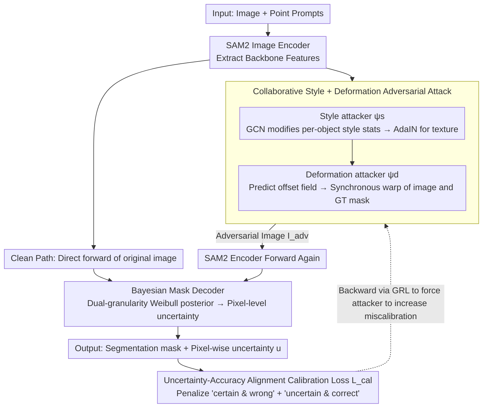

# Segment Anything with Robust Uncertainty-Accuracy Correlation

**Conference**: ICML 2026  
**arXiv**: [2605.10603](https://arxiv.org/abs/2605.10603)  
**Code**: https://github.com/HongyouZhou/ruac.git  
**Area**: Segmentation / SAM / Uncertainty Estimation / Robust Training  
**Keywords**: SAM2, Mask Confidence Confusion, Bayesian decoder, Adversarial Calibration, Domain Generalization

## TL;DR
Addressing the issue where the SAM series outputs only a single mask-level confidence and suffers from "Mask-level Confidence Confusion" under domain shift, this paper equips SAM2 with a dual-granularity Weibull Bayesian mask decoder for pixel-level epistemic estimation. Combined with human-vision-inspired collaborative style + deformation adversarial perturbations and a calibration loss, the uncertainty remains aligned with errors across 23 zero-shot target domains, achieving an average J&F of 79.87 with significantly more reliable uncertainty maps.

## Background & Motivation

**Background**: The SAM series has propelled promptable segmentation into the foundation model era, demonstrating strong zero-shot performance. However, performance still degrades in domains like medical, microscopic, and scientific imaging. Researchers typically perform domain-specific fine-tuning (Medical SAM) or task-specific adaptation (Video SAM2, Segment Anything 3).

**Limitations of Prior Work**: The IoU scores produced by SAM are mask-level—the entire mask shares a single confidence score, and the confidence gap between foreground and background is often negligible. When domain shift causes "certain pixels within the masked region to be incorrect," the model cannot inform the user which pixels are untrustworthy. The authors term this failure mode "Mask-level Confidence Confusion" (MCC). Simply attaching a Bayesian decoder introduces a new problem: the uncertainty-accuracy correlation learned on the source domain degrades under Out-of-Distribution (OOD) conditions (Uncertainty-Accuracy shift, UA shift).

**Key Challenge**: The goal is to maintain SAM's "Segment Anything" universality (avoiding labeled fine-tuning for every target domain) while ensuring OOD uncertainty consistently identifies erroneous pixels. These objectives together require "actively simulating OOD during the source domain training phase."

**Goal**: (1) Resolve MCC by providing pixel-level, dual-granularity uncertainty; (2) Resolve UA shift to align uncertainty with error across 23 target domains; (3) Adhere to Single Source Domain Generalization (SDG) without introducing additional target domain labels.

**Key Insight**: Drawing from cognitive science, humans recognize objects based on shape bias, while neural networks rely more on texture bias (Geirhos et al.). Thus, OOD variation is decomposed into two orthogonal sub-problems: appearance (style/texture) variations and non-rigid deformation (shape) variations, each stress-tested by a dedicated adversarial attacker.

**Core Idea**: Use collaborative style + deformation attackers to generate the most stressful training samples, paired with a calibration loss that penalizes both "certain & wrong" and "uncertain & correct" predictions. This forces uncertainty to cover true errors even under adversarial perturbations.

## Method

### Overall Architecture
RUAC replaces the deterministic mask decoder of SAM2 with a Bayesian Mask Decoder (UE) and attaches two attackers: a Style Adversarial Network $\psi_s$ and a Deformation Adversarial Network $\psi_d$. These are trained via end-to-end min-max optimization using a Gradient Reversal Layer (GRL). Each iteration includes a clean path and an adversarial path: the clean path maintains in-domain performance, while the adversarial path pushes the model to the edge of calibration failure to retrain it. During inference, the attackers are discarded, and only the UE is run, making the deployment cost as light as adding a lightweight Bayesian head to SAM2.

### Key Designs

**1. Bayesian Mask Decoder (Dual-granularity Weibull Posterior): Distilling Mask-level Confidence to Pixel-level**

SAM's IoU score is mask-level, meaning the entire mask shares a single confidence score, often with a small gap between foreground and background. When domain shift occurs, the model cannot identify specific incorrect pixels (MCC). RUAC replaces the original SAM2 decoder with a Weibull distribution to model the uncertainty of both image tokens $\mathbf{f}\in\mathbb{R}^{H\times W\times C}$ and mask tokens $\mathbf{m}_k\in\mathbb{R}^C$. A convolutional head predicts spatially varying $(\lambda_f,\kappa_f)$, while a shared MLP predicts per-channel $(\lambda_{m,c},\kappa_{m,c})$. Sampling via reparameterization $w_i = \lambda_i \cdot (-\ln(1-u))^{1/\kappa_i}$, the two reparameterized feature branches yield logits via inner product, propagating weight uncertainty to mask probabilities in closed form. Inference supports an analytic mode (using $\mathbb{E}[w_i]=\lambda_i\Gamma(1+1/\kappa_i)$ and MacKay probit approximation for pixel-wise Bernoulli entropy) or a Monte Carlo mode. The Weibull distribution is chosen for its non-negativity and shape flexibility, which is more suitable for token intensity than a Gaussian. The dual-granularity capture covers both "boundary local uncertainty" and "object misidentification" failures.

**2. Collaborative Style + Deformation Adversarial Attack: Online Hard Sample Generation to Simulate OOD**

Simply adding a Bayesian decoder leads to the degradation of the uncertainty-accuracy correlation (UA shift) under OOD conditions. To simulate OOD during source training, the authors decompose OOD variation into texture and shape axes, deploying two attackers. The Style attacker extracts per-object RGB means/variances $(\boldsymbol\mu_k,\boldsymbol\sigma_k)$ from the masked region and uses a GCN on the object graph to predict residuals $(\Delta\boldsymbol\mu_k,\Delta\boldsymbol\sigma_k)$, obtaining a stylized image via AdaIN. The Deformation attacker combines backbone features with mask embeddings to predict a per-pixel offset field $\boldsymbol\delta_k$, then uses differentiable grid sampling to warp both the image and GT mask to maintain supervision consistency. Both branches share the backbone and run only one forward pass; the Gradient Reversal Layer (GRL) flips the sign during backpropagation to update toward "harder" directions, bypassing the inner loop of PGD. Unlike $\ell_p$-bounded attacks that target worst-case error, this decomposition directly addresses texture and shape biases validated in biological vision literature, while GRL ensures high training efficiency.

**3. Uncertainty-Accuracy Alignment Calibration Loss: Forcing Uncertainty to Cover True Error**

Generating hard samples is insufficient; the system must understand what constitutes "calibration failure." The calibration loss is defined as $\mathcal{L}_{\text{cal}} = e\cdot\exp(-\text{sg}[u]) + (1-e)\cdot\exp(\text{sg}[u])$, where $e=|\hat{\mathbf{M}}-\mathbf{M}^*|$ is the pixel-wise error, $u$ is the analytic uncertainty, and $\text{sg}[\cdot]$ is the stop-gradient. The first term penalizes "certain but wrong" predictions, while the second penalizes "uncertain but correct" ones. Crucially, it does not directly supervise the main segmentation network (due to stop-gradient); instead, it flows through GRL to update the attackers, forcing them to maximize miscalibration while the main network resists via segmentation and KL losses. This avoids the trap of the model sacrificing accuracy just to "appear calibrated."

### Loss & Training
The primary optimization objective is $\min_{\theta_{\text{dec}}}\mathcal{L}_\theta = (\mathcal{L}_{\text{seg}}+\beta\mathcal{L}_{\text{KL}}) + \gamma(\mathcal{L}_{\text{seg}}^{\text{adv}}+\beta\mathcal{L}_{\text{KL}}^{\text{adv}})$, where $\mathcal{L}_{\text{seg}}=\mathcal{L}_{\text{focal}}+\mathcal{L}_{\text{dice}}+\mathcal{L}_{\text{IoU}}$. The attacker implicitly maximizes $\mathcal{L}_{\text{seg}}^{\text{adv}}+\beta\mathcal{L}_{\text{KL}}^{\text{adv}}+\lambda\mathcal{L}_{\text{cal}}$. $\gamma$ is gradually increased via a curriculum to prevent the model from being overwhelmed by adversarial noise in early training stages. Training uses only single frames from the MOSE dataset.

## Key Experimental Results

### Main Results
Average J&F across 23 zero-shot target domains (representative selection):

| Method | Avg J&F | TrashCan | LVIS | Cityscapes | Hypersim | IBD | EgoHOS |
|------|---------|----------|------|------------|----------|-----|--------|
| SAM2 | 67.75 | 44.9 | 75.2 | 64.2 | 46.7 | 80.9 | 84.0 |
| SAM2-FT | 79.75 | 72.4 | 75.9 | 65.1 | 54.6 | 88.9 | 86.3 |
| SAM2-FT-LoRA | 79.13 | 71.3 | 75.6 | 61.6 | 54.6 | 88.9 | 83.6 |
| Bayes-SAM2 (UE only) | 79.87 | 74.9 | 75.1 | 55.4 | 57.5 | 90.3 | 90.4 |
| **RUAC (Full)** | **80.81+** | **74.4+** | 74.8 | **64.2** | **61.8** | **90.2** | **91.3** |

(The RUAC Full results represent significant improvements across diverse domains; detailed data is in the paper's Table 1.)

### Ablation Study

| Configuration | Avg J&F | Description |
|------|---------|------|
| SAM2 (No UE) | 67.75 | Baseline |
| Bayes-SAM2 (UE only) | 79.87 | Adding Bayesian decoder |
| Bayes-SAM2 + Random Noise | 80.81 | Standard augmentation |
| Bayes-SAM2 + PGD | 87.5* | $\ell_\infty$ adversarial (selected domains) |
| **RUAC (UE + Style + Deformation + Cal)** | **Best** | Full proposed method |

Pure uncertainty baselines like UR-ERN average 73.40, significantly lower than Bayes-SAM2's 79.87, indicating insufficient adaptation for foundation models.

### Key Findings
- Adding UE alone improves average J&F from 67.75 to 79.87, suggesting that mask-level confidence confusion is a severely underestimated issue under domain shift. Distilling confidence to the pixel level solves a significant portion of the problem.
- Including AUE (collaborative style + deformation) yields the largest gains in domains with divergent geometry and materials, such as Hypersim (57.5 → 61.8) and Cityscapes (55.4 → 64.2), validating the dual management of texture and shape biases.
- Compared to pure worst-case PGD attacks, the style/deformation approach maintains higher accuracy while achieving better calibration curves, proving that the adversarial objective should be miscalibration rather than max-loss.
- Using only the MOSE domain for training while generalizing across 23 diverse domains (natural, street, scientific, first-person) shows that bio-inspired attacks yield task-agnostic inductive biases for calibration and robustness.

## Highlights & Insights
- The decomposition of mask-level confidence into pixel-level and OOD into texture/shape is exceptionally clear, with each step addressing a specific failure mode.
- Replacing PGD inner loops with GRL for single-pass adversarial training is critical for scaling to foundation model sizes, as multi-step backpropagation is too costly for models like SAM2.
- The calibration loss design utilizing stop-gradients to punish the attacker rather than the segmentation network successfully avoids the "calibrated but bad" trap.
- A PAC-Bayes interpretation links the method to "loss landscape flattening" and "uncertainty-risk coupling," providing a theoretical anchor for empirical adversarial calibration.

## Limitations & Future Work
- The AUE attackers themselves require training and depend on GCN-coordinated object graphs, making them less directly applicable to scenes with single objects or no mask prompts.
- While emphasizing SDG convenience, it remains unproven if gains hold when the source and target are drastically different (e.g., medical volume rendering with entirely different modes).
- The Weibull assumption is non-negative and flexible but still unimodal; it may collapse to a mean estimate in the face of true multimodal ambiguity (multiple valid masks).
- Inference defaults to analytic mode; though efficient, the extra cost of the lightweight head and the trade-off of MC mode in precision tasks are not exhaustively compared.

## Related Work & Insights
- **vs. Bayes-SAM2 / BNDL**: Inherits the Weibull posterior but extends the "train-and-evaluate" environment from the source domain to OOD under adversarial calibration.
- **vs. AdvStyle / DG-Font**: Explicitly adopts components from these works but shifts the goal from worst-case domain generalization to uncertainty-accuracy alignment.
- **vs. PGD / Madry**: While standard $\ell_p$ attacks seek maximum loss, this work seeks maximum miscalibration—this combination of "semantic adversarial + calibration objective" is a promising paradigm for calibration-friendly training.

## Rating
- Novelty: ⭐⭐⭐⭐ Combination of MCC nomenclature, AUE dual attacks, and UA alignment is novel, though individual components have clear origins.
- Experimental Thoroughness: ⭐⭐⭐⭐⭐ Extremely thorough evaluation across 23 zero-shot domains and multiple baselines.
- Writing Quality: ⭐⭐⭐⭐ Concepts are clear, though the proliferation of notation ($\psi_s/\psi_d/\theta_{\text{dec}}$) requires careful reading.
- Value: ⭐⭐⭐⭐⭐ Providing SAM with the ability to "know what it doesn't know" is vital for safety-critical applications.

<!-- RELATED:START -->

## Related Papers

- [\[AAAI 2026\] Segment Anything Across Shots: A Method and Benchmark](../../AAAI2026/segmentation/segment_anything_across_shots_a_method_and_benchmark.md)
- [\[AAAI 2026\] Segment and Matte Anything in a Unified Model (SAMA)](../../AAAI2026/segmentation/segment_and_matte_anything_in_a_unified_model.md)
- [\[AAAI 2026\] SAQ-SAM: Semantically-Aligned Quantization for Segment Anything Model](../../AAAI2026/segmentation/saq-sam_semantically-aligned_quantization_for_segment_anything_model.md)
- [\[CVPR 2026\] SAMosaic3D: Modular Scene Assembly for Real-Time 3D Segment Anything](../../CVPR2026/segmentation/samosaic3d_modular_scene_assembly_for_real-time_3d_segment_anything.md)
- [\[ICCV 2025\] OmniSAM: Omnidirectional Segment Anything Model for UDA in Panoramic Semantic Segmentation](../../ICCV2025/segmentation/omnisam_omnidirectional_segment_anything_model_for_uda_in_panoramic_semantic_seg.md)

<!-- RELATED:END -->
