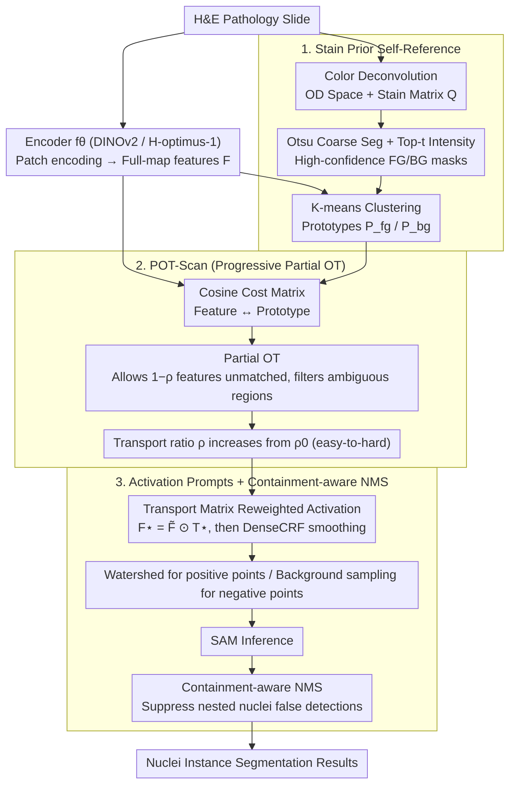

# SPROUT: Supervise Less, See More — Training-free Nuclear Instance Segmentation with Prototype-Guided Prompting

**Conference**: ICML 2026  
**arXiv**: [2511.19953](https://arxiv.org/abs/2511.19953)  
**Code**: https://github.com/Y-Research-SBU/SPROUT  
**Area**: Medical Imaging / Pathology / SAM Prompt Engineering  
**Keywords**: Nuclei Segmentation, SAM Prompting, H&E Staining Prior, Partial Optimal Transport, Training-free

## TL;DR
SPROUT is the first fully training-free, zero-annotation framework for pathological nuclei segmentation. It utilizes H&E staining priors to self-construct high-confidence foreground/background regions on each slide → extracts prototypes → performs feature-prototype soft alignment via Partial Optimal Transport (POT) → outputs positive/negative point prompts for SAM. On benchmarks like MoNuSeg, its AJI is 8.2% higher than training-based methods.

## Background & Motivation

**Background**: Nuclei instance segmentation in pathological H&E slides is the foundation for cancer prognosis/diagnosis. Existing methods are categorized into four levels of supervision: fully supervised (e.g., HoVer-Net, requiring dense matching), semi-supervised, weakly supervised (point/voronoi), and self-supervised. Following the emergence of SAM, SAM-based routes (MedSAM, PromptNucSeg, UN-SAM, etc.) have gained popularity but mostly require fine-tuning or training a prompter.

**Limitations of Prior Work**: (1) Pathological images feature a narrow color spectrum, inconsistent staining, thousands of dense nuclei per patch, weak boundaries, and extremely expensive pixel annotations. (2) SAM's direct zero-shot performance is poor due to the large distribution gap between the pathology domain and SA-1B. (3) Existing SAM-adapter methods still require medical annotations and training. (4) Reference-based training-free methods (Matcher / Bridge / SAT) rely on external reference images, which fail for dense small targets (thousands of nuclei per patch) because it is difficult to find suitable references under high variations in staining, density, and morphology.

**Key Challenge**: To segment nuclei without supervision or training, high-quality SAM prompts are required. High-quality prompts require semantic correspondence between the image and references. However, stable references cannot be found in pathological images, and external backbone (DINOv2 / H-optimus-1) features are not precise enough—traditional reference-based approaches fail to close the loop in pathology.

**Goal**: Fully training-free and zero external references, constructing reliable prompts from the image itself to enable SAM to perform precise nuclei segmentation without any annotations or parameter updates.

**Key Insight**: Moving beyond the "external reference" framework—using biochemical priors of H&E staining (hematoxylin stains nuclei dark blue/purple, eosin stains cytoplasm pink) to perform color deconvolution and self-construct high-confidence foreground/background regions as "self-references." This self-reference utilizes the physical properties of pathological staining, bypassing the instability of external references.

**Core Idea**: Stain prior → self-reference mask → cluster prototypes → feature-prototype alignment via Partial Optimal Transport (POT) → convert to SAM point prompts. The entire pipeline requires no training and no annotations.

## Method

### Overall Architecture

SPROUT aims to solve the problem of "segmenting thousands of nuclei in a pathological slide with zero annotations and zero training." Its core strategy is: since stable external references cannot be found, let each slide serve as its own reference. The pipeline consists of three stages: first, self-construct high-confidence foreground/background regions based on the physical prior of H&E staining and extract prototypes (**stain prior self-reference**); second, use progressive Partial Optimal Transport to stably propagate prototype semantics to global features while filtering out ambiguous features (**POT-Scan**); finally, translate the alignment results into positive/negative point prompts for SAM, execute SAM, and conclude with containment-aware NMS (**activation prompting + containment-aware NMS**). The workflow is: patch encoding (DINOv2 or H-optimus-1) concatenated back to global features $F$ → color deconvolution (OD space + Otsu) to obtain high-confidence foreground/background masks → K-means clustering for prototypes $\mathcal{P}_{fg}, \mathcal{P}_{bg}$ → POT-Scan soft alignment → activation + watershed for point selection → SAM inference → NMS. No parameters are updated throughout the process.

### Key Designs

**1. Stain Prior Self-Reference: Replacing External References with H&E Biochemical Properties**

Reference-based training-free methods collectively fail in pathology because slides vary too much in staining, density, and morphology to find a single reference image. SPROUT's solution returns to H&E staining itself: hematoxylin stains nuclei deep blue/purple, while eosin stains cytoplasm pink. This color difference is physically determined and holds for every slide. First, color deconvolution is performed by transforming the image to Optical Density space $OD = -\log(x/x_0)$, solving for concentrations $S = Q^+ \cdot OD$ using a normalized stain matrix $Q = [Q_H, Q_E]$. Then, Otsu thresholding is used for coarse foreground/background separation, and pixels with the top-$t$ staining intensity in each region are selected as high-confidence masks $\bm M_{fg}, \bm M_{bg}$. Finally, features are clustered only within these reliable regions to obtain prototypes $\mathcal{P}_{fg}, \mathcal{P}_{bg}$. This "self-reference" is more accurate than any external reference because it naturally adapts to the staining variations of each individual slide. Replacing self-reference with external reference images in the ablation study drops AJI by 14.4 points, making it the most significant contribution.

**2. Progressive Partial Optimal Transport Scanning (POT-Scan): Stable Semantic Propagation Without Forced Matching**

Once prototypes are obtained, their semantics must be propagated to all features. However, standard OT forces the transport of all mass—meaning ambiguous or noisy features are matched to a prototype, which pollutes the results. POT-Scan utilizes partial OT: the cost matrix uses cosine distance $C_{ij} = 1 - \tilde F P^\top / (\|\tilde F\|\|P\|)$, allowing $(1-\rho)$ of features to remain unmatched. The objective is formulated as $\min_T \langle T, C\rangle_F + \lambda KL(T^\top \bm 1_N \| \tfrac{\rho}{M} \bm 1_M)$, s.t. $T \bm 1_M \leq \tfrac{1}{N}\bm 1_N$. A slack column is used to transform the partial problem into a standard Sinkhorn problem. Crucially, a progressive approach is used: the transport ratio $\rho$ is gradually increased from a small $\rho_0$, matching easy features first before incorporating difficult ones. This acts as a "soft curriculum learning" to avoid amplifying noise by processing ambiguous regions too early. Ablations show that replacing partial OT with standard OT drops AJI by 7.1 points, and replacing progressive with single OT drops it by another 3.4 points.

**3. Activation Prompting + Containment-aware NMS: Translating Alignment to SAM Prompts**

SAM is sensitive to the number and location of point prompts; thus, the final stage must precisely translate alignment into "one positive point per nucleus." First, features are reweighted using the transport matrix $F^\star = \tilde F \odot T^\star$, smoothed with DenseCRF, binarized with a threshold, and combined with the initial high-confidence mask. Then, a watershed algorithm selects one positive point per connected component. Negative points are uniformly sampled from the dilated background mask. The watershed stopping rule prevents merging different nuclei. Following SAM inference, a containment-aware NMS is applied: candidates with inclusion relationships are subjected to stricter non-maximum suppression, specifically addressing the issue of standard NMS incorrectly deleting nested small nuclei in dense scenarios.

## Key Experimental Results

### Main Results: MoNuSeg and CPM17 (Supervision Level Comparison)

| Method | SAM | Supervision | MoNuSeg AJI↑ | MoNuSeg PQ↑ | CPM17 AJI↑ | CPM17 PQ↑ |
|------|----|----|------|------|------|------|
| U-Net | ✗ | Full | 0.421 | 0.403 | 0.477 | 0.435 |
| HoVer-Net | ✗ | Full | 0.589 | 0.510 | 0.617 | 0.547 |
| TopoSeg | ✗ | Full | 0.604 | 0.522 | 0.625 | 0.561 |
| Voronoi | ✗ | Weak | 0.501 | 0.443 | 0.531 | 0.475 |
| Self-sup baseline | ✗ | Self | 0.452 | 0.385 | 0.495 | 0.432 |
| MedSAM (fine-tuned) | ✓ | Full | 0.595 | 0.517 | 0.618 | 0.554 |
| PromptNucSeg | ✓ | Prompter Training | 0.610 | 0.531 | 0.627 | 0.563 |
| Matcher (Ref-based) | ✓ | None | 0.523 | 0.456 | 0.548 | 0.482 |
| **Ours (SPROUT)** | ✓ | **None** | **0.692** | **0.601** | **0.687** | **0.617** |

Ours outperforms all training-based methods under zero supervision (including fully supervised TopoSeg), achieving an AJI 8.2% higher than PromptNucSeg.

### Hyperparameter Robustness of POT-Scan

| Config | AJI |
|------|------|
| $\rho_0 = 0.1, K = 8$ | 0.687 |
| $\rho_0 = 0.2, K = 8$ | **0.692** |
| $\rho_0 = 0.3, K = 8$ | 0.689 |
| $K = 4$ | 0.673 |
| $K = 16$ | 0.685 |

AJI remains stable between 0.67-0.69 under perturbations of key hyperparameters (initial transport ratio $\rho_0$, number of prototypes $K$).

### Ablation Study

| Config | AJI | Δ |
|------|------|---|
| Full SPROUT | 0.692 | – |
| Replace self-ref with external ref | 0.548 | −0.144 |
| Standard OT instead of Partial OT | 0.621 | −0.071 |
| Single OT instead of Progressive Scan | 0.658 | −0.034 |
| Remove Containment-aware NMS | 0.661 | −0.031 |

The self-reference strategy contributes the most (+14.4 AJI), proving that the staining prior of the image itself is more reliable than external references.

### Key Findings
- **Self-reference > External Reference**: High-confidence masks constructed via staining priors are more accurate because they adapt to the staining variations of each slide.
- **Partial OT is critical**: Standard OT forces complete matching, which amplifies noise; Partial OT allows ambiguous regions to be excluded.
- **Training-free + Zero-label + SOTA**: Overturns the traditional assumption that training or annotation is mandatory.
- **Cross-dataset Robustness**: Consistently leads across four datasets: MoNuSeg, CPM17, TNBC, and PanNuke.

## Highlights & Insights
- **"The image itself is the best reference"**: Solves the fundamental dilemma of reference-based methods in pathology—pathological images vary too much to find an external reference, but each image has internal physical consistency. This can be extended to other medical imaging with strong physical priors (e.g., specific markers in fluorescence microscopy, tracer distribution in PET).
- **Correct "Soft Alignment" with Partial OT**: Previous OT-based feature alignment typically assumed full transport. This paper treats "ignoring uncertain features" as a first-class citizen using partial + progressive OT—a approach generalizable to all noise-sensitive tasks.
- **SOTA via Training-free Design**: Demonstrates that zero labeling and zero training can reach SOTA in a field dependent on labels, providing significant practical value for low-resource scenarios (underserved areas, rare diseases, new staining protocols).
- **Model for SAM Prompt Engineering**: Treats SAM as a universal segmentor while injecting domain knowledge via prompt generation. This decoupled design allows foundation models and domain expertise to focus on their respective strengths.

## Limitations & Future Work
- Dependent on physical properties of H&E staining—other stains (IHC, Masson Trichrome) require rewriting stain decomposition; not directly applicable to non-H&E pathology (e.g., EM, Immunofluorescence).
- SAM inference still incurs computational overhead; thousands of SAM calls in dense nuclei scenarios may be slow.
- Containment-aware NMS is a heuristic and might incorrectly suppress nested structures like nucleoli within nuclei.
- Self-reference may fail on low-quality slides with extreme over-exposure or under-staining; failure cases are not quantified.
- No direct head-to-head comparison with pathological foundation models like H-optimus-1 (used only as a backbone).

## Related Work & Insights
- **vs. Supervised/Weak/Self-supervised Nuclei Seg (HoVer-Net, etc.)**: These require training and labels; SPROUT outperforms them at zero cost.
- **vs. SAM Pathology Fine-tuning (MedSAM, etc.)**: These require medical annotations and training; SPROUT uses generic SAM directly.
- **vs. Reference-based Training-free (Matcher, etc.)**: These require external references, which are unstable in pathology; SPROUT breaks through with self-reference.
- **Insights**: Proposes "Domain Physical Prior → Self-reference → Foundation Model Prompt" as a general paradigm for zero-shot medical imaging; OT + partial alignment is applicable to all "feature-prototype alignment + noise filtering" tasks.

## Rating
- Novelty: ⭐⭐⭐⭐⭐ "Stain prior self-reference + partial OT" is a truly new training-free paradigm.
- Experimental Thoroughness: ⭐⭐⭐⭐⭐ 4 datasets × multi-level supervision baselines × detailed ablations × robustness tests.
- Writing Quality: ⭐⭐⭐⭐ Clear framework; math for POT-Scan is solid; theoretical convergence proof provided in the appendix.
- Value: ⭐⭐⭐⭐⭐ Pathological labels are expensive and highly variable; zero-label SOTA directly lowers the barrier for medical AI deployment.

<!-- RELATED:START -->

## Related Papers

- [\[CVPR 2026\] INSID3: Training-Free In-Context Segmentation with DINOv3](../../CVPR2026/segmentation/insid3_training-free_in-context_segmentation_with_dinov3.md)
- [\[CVPR 2026\] The Power of Prior: Training-Free Open-Vocabulary Semantic Segmentation with LLaVA](../../CVPR2026/segmentation/the_power_of_prior_training-free_open-vocabulary_semantic_segmentation_with_llav.md)
- [\[ECCV 2024\] VISAGE: Video Instance Segmentation with Appearance-Guided Enhancement](../../ECCV2024/segmentation/visage_video_instance_segmentation_with_appearance-guided_enhancement.md)
- [\[CVPR 2026\] PEARL: Geometry Aligns Semantics for Training-Free Open-Vocabulary Semantic Segmentation](../../CVPR2026/segmentation/pearl_geometry_aligns_semantics_for_training-free_open-vocabulary_semantic_segme.md)
- [\[CVPR 2026\] Direct Segmentation without Logits Optimization for Training-Free Open-Vocabulary Semantic Segmentation](../../CVPR2026/segmentation/direct_segmentation_without_logits_optimization_for_training-free_open-vocabular.md)

<!-- RELATED:END -->
