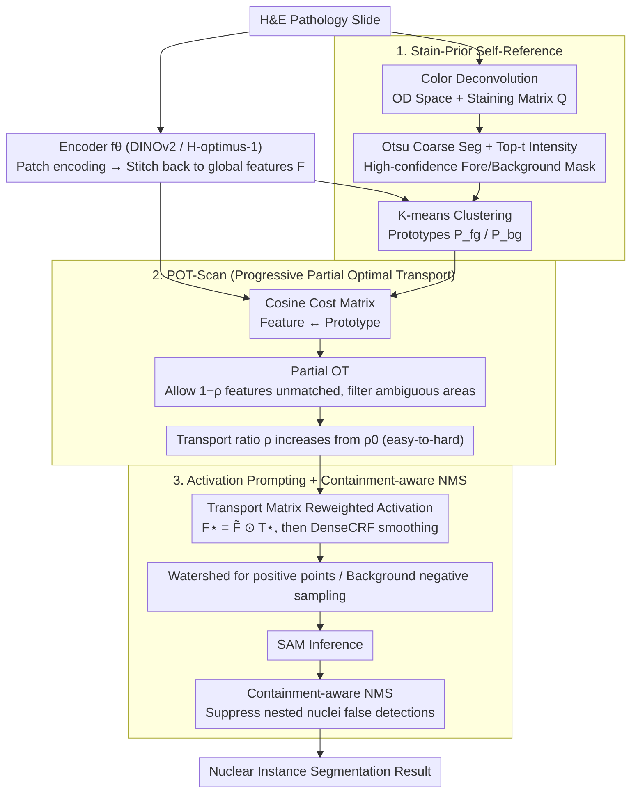

# SPROUT: Supervise Less, See More — Training-free Nuclear Instance Segmentation with Prototype-Guided Prompting

**Conference**: ICML 2026  
**arXiv**: [2511.19953](https://arxiv.org/abs/2511.19953)  
**Code**: https://github.com/Y-Research-SBU/SPROUT  
**Area**: Medical Imaging / Pathology / SAM Prompt Engineering  
**Keywords**: Nuclear Segmentation, SAM Prompt, H&E Stain Prior, Partial Optimal Transport, Training-free

## TL;DR
SPROUT is the first fully training-free, zero-annotation framework for pathological nuclear instance segmentation. It utilizes H&E staining priors to self-construct high-confidence foreground/background regions on each slide → extracts prototypes → performs feature-prototype soft alignment via Partial Optimal Transport (POT) → outputs positive/negative point prompts for SAM. On benchmarks such as MoNuSeg, its AJI is 8.2% higher than training-based methods.

## Background & Motivation

**Background**: Nuclear instance segmentation in pathological H&E slides is the foundation for cancer prognosis and diagnosis. Existing methods are categorized into four levels based on supervision: fully supervised (HoVer-Net, etc., requiring dense annotation), semi-supervised, weakly supervised (point/voronoi), and self-supervised. Since the emergence of SAM, SAM-based routes (MedSAM, PromptNucSeg, UN-SAM, etc.) have risen, though most require fine-tuning or training a prompter.

**Limitations of Prior Work**: (1) Pathological images have narrow color spectra + inconsistent staining + thousands of dense nuclei per patch + weak boundaries + extremely expensive pixel annotation; (2) Direct zero-shot performance of SAM is poor due to the large distribution gap between the pathology domain and SA-1B; (3) Existing SAM-adapter methods still require medical annotation + training; (4) Reference-based training-free methods (Matcher / Bridge / SAT) depend on external reference images, which fail for dense small targets (thousands of nuclei per patch) as few-shot cannot find suitable references under high variation in staining, density, and morphology.

**Key Challenge**: To perform nuclear segmentation without supervision or training, high-quality SAM prompts are required; good prompts require semantic correspondence between image and reference; however, stable references are hard to find in pathology, and external backbone (DINOv2 / H-optimus-1) features are insufficiently precise—traditional reference-based approaches fail to close the loop in pathology.

**Goal**: To be completely training-free + zero external reference, constructing reliable prompts from the image itself, allowing SAM to perform precise nuclear segmentation without any annotation or parameter updates.

**Key Insight**: Stepping out of the "external reference" framework—using the biochemical prior of H&E staining (hematoxylin stains nuclei deep blue/purple, eosin stains cytoplasm pink) to perform color deconvolution, self-constructing high-confidence foreground/background regions as "self-references." This self-reference utilizes the physical properties of pathological staining, bypassing the instability of external references.

**Core Idea**: stain prior → self-reference mask → cluster prototypes → Partial Optimal Transport (POT) for feature-prototype alignment → conversion to SAM point prompts. The entire pipeline involves no training and no annotation.

## Method

### Overall Architecture

SPROUT aims to solve "segmenting thousands of nuclei in a pathological slide with zero annotation and zero training." Its **Mechanism** is: since stable external references cannot be found in pathology images, let each slide serve as its own reference. The pipeline is divided into three stages: first, using physical priors of H&E staining to self-construct high-confidence foreground/background regions and extract prototypes (**Stain-Prior Self-Reference**); then, using progressive Partial Optimal Transport to stably propagate prototype semantics to global features while filtering out ambiguous features (**POT-Scan**); finally, translating alignment results into positive/negative point prompts for SAM, running SAM, and concluding with containment-aware NMS (**Activation Prompting + Containment-aware NMS**). Specifically: patch encoding (DINOv2 or H-optimus-1) and stitching back to global features $F$ → color deconvolution (OD space + Otsu) to obtain high-confidence foreground/background masks → K-means clustering for prototypes $\mathcal{P}_{fg}, \mathcal{P}_{bg}$ → POT-Scan soft alignment → activation + watershed for point selection → SAM inference → NMS. No parameters are updated, and no annotations are needed throughout the process.

### Key Designs

**1. Stain-Prior Self-Reference: Replacing external references with biochemical properties of H&E**

Reference-based training-free methods collectively fail in pathology because slides vary too much in staining, density, and morphology to find a single image that serves as a universal reference. SPROUT’s solution returns to H&E staining itself—hematoxylin stains nuclei deep blue/purple and eosin stains cytoplasm pink. This color difference is physically determined and holds for every slide. Thus, color deconvolution is first performed: transforming the image into Optical Density space $OD = -\log(x/x_0)$, solving for concentration maps $S = Q^+ \cdot OD$ using a normalized staining matrix $Q = [Q_H, Q_E]$, then coarsely segmenting fore/background using Otsu thresholds. High-confidence masks $\bm M_{fg}, \bm M_{bg}$ are obtained by taking top-$t$ staining intensity pixels. Finally, prototypes $\mathcal{P}_{fg}, \mathcal{P}_{bg}$ are clustered only within these reliable regions. This self-constructed "self-reference" is more accurate than any external reference because it naturally adapts to the staining variance of each slide. Replacing self-reference with an external reference image drops the AJI by 14.4 points, making this the most significant contribution.

**2. Partial Optimal Transport Scan (POT-Scan): Stable propagation of prototype semantics without forcing noisy features**

Once prototypes are obtained, their semantics must be propagated to all features. However, standard OT forces all mass to be transported—even ambiguous or noisy features are hard-matched to a prototype, polluting the result. POT-Scan instead uses partial OT: the cost matrix uses cosine distance $C_{ij} = 1 - \tilde F P^\top / (\|\tilde F\|\|P\|)$, allowing $1-\rho$ of the features to remain unmatched. The objective is $\min_T \langle T, C\rangle_F + \lambda KL(T^\top \bm 1_N \| \tfrac{\rho}{M} \bm 1_M)$, s.t. $T \bm 1_M \leq \tfrac{1}{N}\bm 1_N$, solved by converting the partial problem into standard Sinkhorn via an additional slack column. More importantly, the progressive step gradually increases the transport ratio $\rho$ from a small $\rho_0$. This "soft curriculum learning" matches easy features first and gradually incorporates difficult ones, avoiding the amplification of noise in ambiguous areas. Ablations show standard OT instead of partial drops AJI by 7.1 points, and single OT instead of progressive drops it further by 3.4 points, proving both "ignoring uncertain features" and "easy-to-hard" are essential.

**3. Activation Prompting + Containment-aware NMS: Translating alignment to SAM point prompts**

SAM is sensitive to the number and location of point prompts; thus, the final stage must precisely translate alignment results into "one positive point per nucleus." First, feature activation is reweighted using the transport matrix $F^\star = \tilde F \odot T^\star$. After DenseCRF smoothing and threshold binarization, this is combined with the initial high-confidence mask. Watershed is then used to extract one positive point per connected component; negative points are uniformly sampled from the dilated background mask. The watershed stop rule is "stop when multiple compact regions begin to merge" to prevent merging distinct nuclei. After SAM inference, a containment-aware NMS is applied: candidates with inclusion relationships are subject to stricter non-maximum suppression, specifically addressing the issue of standard NMS erroneously deleting nested small nuclei in dense scenarios.

## Key Experimental Results

### Main Results: MoNuSeg and CPM17 (Comparison across supervision levels)

| Method | SAM | Supervision | MoNuSeg AJI↑ | MoNuSeg PQ↑ | CPM17 AJI↑ | CPM17 PQ↑ |
|------|----|----|------|------|------|------|
| U-Net | ✗ | Full | 0.421 | 0.403 | 0.477 | 0.435 |
| HoVer-Net | ✗ | Full | 0.589 | 0.510 | 0.617 | 0.547 |
| TopoSeg | ✗ | Full | 0.604 | 0.522 | 0.625 | 0.561 |
| Voronoi Weakly Supp. | ✗ | Weak | 0.501 | 0.443 | 0.531 | 0.475 |
| Self-supervised baseline | ✗ | Self | 0.452 | 0.385 | 0.495 | 0.432 |
| MedSAM (fine-tuned) | ✓ | Full | 0.595 | 0.517 | 0.618 | 0.554 |
| PromptNucSeg | ✓ | Prompter Train | 0.610 | 0.531 | 0.627 | 0.563 |
| Matcher (Ref-based training-free)| ✓ | None | 0.523 | 0.456 | 0.548 | 0.482 |
| **SPROUT (Ours)** | ✓ | **None** | **0.692** | **0.601** | **0.687** | **0.617** |

SPROUT outperforms all training-based methods (including fully supervised TopoSeg) without any supervision or training, achieving an AJI 8.2% higher than PromptNucSeg.

### Robustness of POT-Scan Hyperparameters

| Configuration | AJI |
|------|------|
| $\rho_0 = 0.1, K = 8$ | 0.687 |
| $\rho_0 = 0.2, K = 8$ | **0.692** |
| $\rho_0 = 0.3, K = 8$ | 0.689 |
| $K = 4$ | 0.673 |
| $K = 16$ | 0.685 |

AJI remains stable between 0.67-0.69 under perturbations of key hyperparameters (initial transport ratio $\rho_0$, number of prototypes $K$).

### Ablation Study

| Configuration | AJI | Δ |
|------|------|---|
| Full SPROUT | 0.692 | – |
| Replace self-reference with external ref | 0.548 | −0.144 |
| Replace partial OT with standard OT | 0.621 | −0.071 |
| Replace progressive scan with single OT | 0.658 | −0.034 |
| Remove containment-aware NMS | 0.661 | −0.031 |

The self-reference strategy contributes the most (+14.4 AJI), proving the core innovation that "image staining priors are more reliable than external references."

### Key Findings
- **Self-reference > External reference**: Self-constructed masks based on staining priors are more accurate because they adapt to the staining variation of each individual slide.
- **Partial OT is a crucial technology**: Standard OT amplifies noise by forcing full matching; partial OT allows ambiguous regions to stay out.
- **Training-free + Zero-annotation + SOTA**: Overturns the traditional assumption that "training/annotation is mandatory."
- **Robustness across datasets**: Consistent leadership across four datasets: MoNuSeg, CPM17, TNBC, and PanNuke.

## Highlights & Insights
- **"The image itself is the best reference" Insight**: Solves the fundamental dilemma of reference-based methods in pathology—athology images vary too much to find external references, but each image’s own staining is physically consistent; this approach can be extended to other medical imaging with strong physical priors (e.g., specific markers in fluorescence microscopy, tracer distribution in PET).
- **Correctly implementing "soft alignment" with Partial OT**: Previous OT-based feature alignments defaulted to full transport. This paper implements partial + progressive transport, treating "ignoring uncertain features" as a first-class citizen—a generalized approach for noise-sensitive tasks.
- **Fully training-free SOTA**: In a field where medical imaging heavily relies on annotation, this paper proves that zero-annotation and zero-training can achieve SOTA, offering immense practical value for low-resource scenarios (underserved regions, rare diseases, new staining protocols).
- **A paradigm for SAM prompt engineering**: Treating SAM as a general segmentor and injecting domain knowledge into prompt generation—this decoupling allows foundational models and domain expertise to focus on their respective strengths.

## Limitations & Future Work
- Reliance on H&E physical properties—requires rewriting stain decomposition for other stains (IHC, Masson’s Trichrome, etc.) and is not directly applicable to non-H&E pathology (e.g., EM, Immunofluorescence).
- SAM inference itself still incurs computational overhead; thousands of SAM calls in dense nuclear scenarios can be slow.
- Containment-aware NMS is seasonal/heuristic and may erroneously suppress nested structures (e.g., nucleoli within nuclei).
- Self-reference strategies may fail on extremely poor quality slides (overexposed/understained); failure cases were not quantified.
- No direct head-to-head comparison with pathology foundation models like H-optimus-1 (though used as a backbone).

## Related Work & Insights
- **vs. Supervised/Weak/Self-supervised nuclear segmentation (HoVer-Net, Voronoi, etc.)**: Those require training and annotation; SPROUT outperforms them at zero cost.
- **vs. SAM pathology fine-tuning (MedSAM, PromptNucSeg)**: Those require medical annotation and training; SPROUT uses general SAM directly.
- **vs. Reference-based training-free (Matcher, Bridge, SAT)**: Those require external references, which are unstable in pathology; SPROUT breaks through with self-reference.
- **Inspiration**: Using "domain physical prior → self-reference → foundational model prompt" as a universal paradigm for zero-shot medical imaging; OT + partial soft alignment is suitable for any "feature-prototype alignment + noise filtering" task.

## Rating
- Novelty: ⭐⭐⭐⭐⭐ "Stain-prior self-reference + partial OT" is a truly new training-free paradigm.
- Experimental Thoroughness: ⭐⭐⭐⭐⭐ 4 datasets × multiple supervision level baselines × detailed ablation × hyperparameter robustness.
- Writing Quality: ⭐⭐⭐⭐ Clear framework; solid mathematical derivation for POT-Scan; provides theoretical guarantees (POT convergence proof in appendix).
- Value: ⭐⭐⭐⭐⭐ Pathological annotation is extremely expensive and variable; zero-annotation SOTA directly lowers the barrier for medical AI deployment.

<!-- RELATED:START -->

## Related Papers

- [\[CVPR 2026\] INSID3: Training-Free In-Context Segmentation with DINOv3](../../CVPR2026/segmentation/insid3_training-free_in-context_segmentation_with_dinov3.md)
- [\[CVPR 2026\] The Power of Prior: Training-Free Open-Vocabulary Semantic Segmentation with LLaVA](../../CVPR2026/segmentation/the_power_of_prior_training-free_open-vocabulary_semantic_segmentation_with_llav.md)
- [\[CVPR 2026\] B³-Seg: Camera-Free, Training-Free 3DGS Segmentation via Analytic EIG and Beta-Bernoulli Bayesian Updates](../../CVPR2026/segmentation/b3-seg_camera-free_training-free_3dgs_segmentation_via_analytic_eig_and_beta-ber.md)
- [\[ECCV 2024\] VISAGE: Video Instance Segmentation with Appearance-Guided Enhancement](../../ECCV2024/segmentation/visage_video_instance_segmentation_with_appearance-guided_enhancement.md)
- [\[CVPR 2026\] PEARL: Geometry Aligns Semantics for Training-Free Open-Vocabulary Semantic Segmentation](../../CVPR2026/segmentation/pearl_geometry_aligns_semantics_for_training-free_open-vocabulary_semantic_segme.md)

<!-- RELATED:END -->
