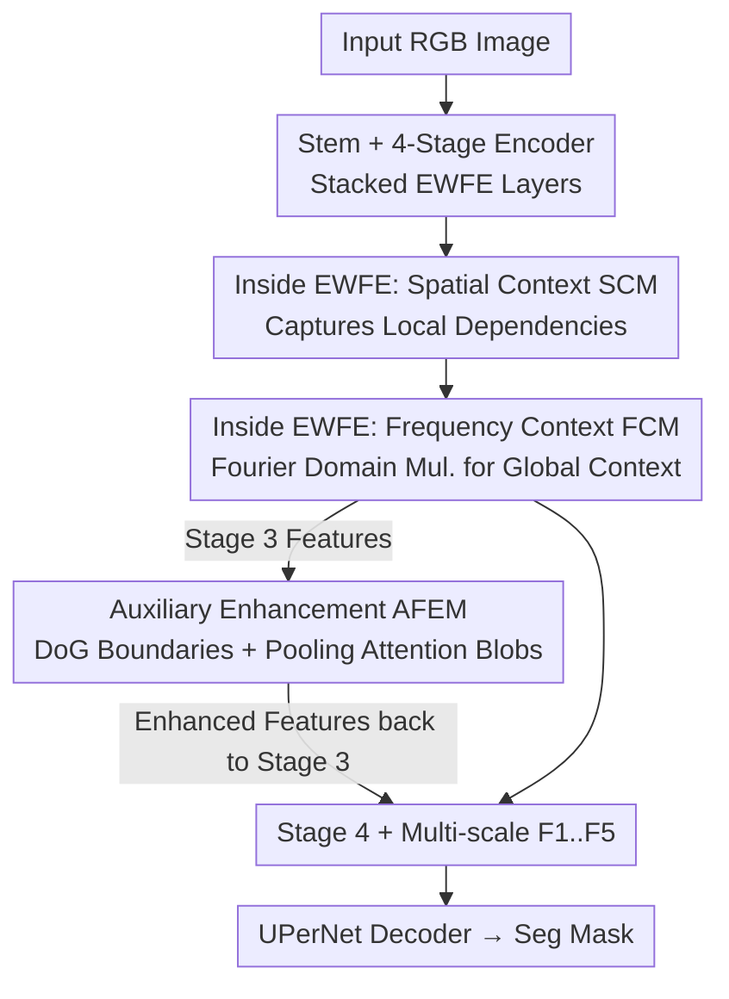

# Towards Effective Waste Segmentation for Automated Waste Recycling in Cluttered Background

**Conference**: ICML 2026  
**arXiv**: [2606.13587](https://arxiv.org/abs/2606.13587)  
**Code**: Available (Code / Webpage links provided in paper)  
**Area**: Semantic Segmentation / Frequency Domain Enhancement / Automated Waste Recycling  
**Keywords**: Waste Segmentation, Frequency Domain Context, Difference of Gaussians, Boundary Enhancement, Lightweight Segmentation

## TL;DR
To address the challenges of "cluttered backgrounds + translucent/deformable waste + heavy existing backbones" in automated waste recycling, this paper proposes EWSegNet: a lightweight segmentation network that utilizes **spatial domain modules for local structures and frequency domain modules for global context** through cascaded complementarity. It further incorporates an Auxiliary Feature Enhancement Module (AFEM) using **Difference of Gaussians (DoG) + Pooling Attention** to strengthen boundaries and blobs, achieving SOTA-level accuracy with fewer parameters and lower latency.

## Background & Motivation
**Background**: Rapid urbanization and population growth have led to an explosion in waste production (expected to reach 3 billion tons annually by 2050). Automated Waste Recycling (AWR) aims to use deep learning to separate recyclables from solid waste, avoiding human contact with sharp or unsanitary items. Existing datasets like ZeroWaste and SpectralWaste have advanced this field.

**Limitations of Prior Work**: Current top-performing waste segmentation methods (e.g., FANet, COSNet) **rely on heavy backbones**, which are unsuitable for real-time, low-power AWR systems. Furthermore, most are derived from **spatial domain sharpening convolutions** (Laplacian, unsharp masking, high-boost), which only capture small neighborhood contexts. Expanding the receptive field for global relationships requires larger kernels, causing calculation volume and parameters to explode. Performance also degrades significantly in **cluttered scenes** where translucent, multi-scale, and deformable objects are stacked.

**Key Challenge**: Capturing global context vs. the high cost of large-kernel spatial convolutions. Spatial domain filtering is only efficient for small kernels; modeling global relationships increases model weight, conflicting with AWR efficiency requirements.

**Goal**: To build a network that is **efficient yet accurate in cluttered scenes**, specifically: (1) modeling global context more economically; (2) strengthening boundaries and semantic regions of translucent objects without significantly increasing weight.

**Key Insight**: Leveraging the signal processing fact that **convolution in the spatial domain is equivalent to pointwise multiplication in the frequency domain** ($(f\star h)(x)\Leftrightarrow(H\cdot F)(\mu)$). Instead of expensive global spatial convolutions, global context is modeled via multiplication in the frequency domain. Similarly, the high-pass DoG kernel for boundary enhancement can be designed in the frequency domain as $H(u)=Ae^{-u^2/2\sigma_1^2}-Be^{-u^2/2\sigma_2^2}$ where $A\ge B, \sigma_1>\sigma_2$.

**Core Idea**: **Capture local structures in the spatial domain and global context in the frequency domain** through cascaded complementarity. Additionally, use a frequency-domain DoG and pooling attention module (AFEM) to resolve boundary blurring and blob loss in cluttered scenes.

## Method

### Overall Architecture
EWSegNet takes an RGB image and outputs a segmentation mask via an **Encoder + Auxiliary Feature Enhancement Module (AFEM) + Segmentation Decoder**. The encoder consists of four stages with progressive downsampling. Each stage stacks several **Efficient Waste Feature Extraction (EWFE) layers**, producing multi-scale features $F_1, F_2, F_3, F_4$. A key design choice is extracting features from the third stage to pass through AFEM for boundary/blob enhancement, with the result added back to the third stage before feeding into the fourth. This injects a specific prompt to "focus on translucent object boundaries" mid-encoder. Finally, all multi-scale features plus the AFEM enhanced feature $F_5$ are sent to a UPerNet decoder.

Each EWFE layer contains three sequential components: **Spatial Context Module (SCM)** (Local) → **Frequency Context Module (FCM)** (Global) → MLP. The pipeline is as follows:

### Key Designs

**1. Spatial Context Module (SCM): Grouped Conv + Dual Branch Weighting**

To capture fine local structures of translucent and deformable waste, SCM uses a $5\times5$ grouped convolution to project input $X\in\mathbb{R}^{C\times H\times W}$ to $\hat{X}\in\mathbb{R}^{3C\times H\times W}$, which is then split along the channel dimension into $X_1, X_2, X_3$. $X_2$ and $X_3$ act as "weight generators": global average pooling along the channel dimension of $X_2$ followed by a sigmoid gives spatial weights for $X_1$ (resulting in $\bar{X}$); global average pooling across the spatial dimensions of $X_3$ followed by softmax gives channel weights for $X_1$ (resulting in $\bar{\bar{X}}$).

$$\bar{X}=X_1\cdot\sigma(CMean(X_2)),\quad \bar{\bar{X}}=X_1\cdot\rho(SMean(X_3)),\quad X'=Conv_{1\times1}(concat(\bar{X},\bar{\bar{X}}))$$

This **spatial + channel dual-branch excitation** identifies salient local structures with lightweight operators (grouped convolution + mean statistics) instead of large kernels.

**2. Frequency Context Module (FCM): Pointwise Multiplication in Fourier Domain**

FCM is the core of the efficiency strategy. Instead of spatial convolutions, input $Z$ is split via $1\times1$ convolution into $Z_1, Z_2$, transformed via FFT to the frequency domain, and **multiplied pointwise** to get $\bar{Z}$, then transformed back via IFFT to get $Z'$. Because "frequency multiplication $\equiv$ spatial convolution," this effectively learns a **data-dependent global kernel** for a fraction of the cost, avoiding the quadratic parameter growth of large spatial kernels.

**3. Auxiliary Feature Enhancement Module (AFEM): DoG for Boundaries and Pooling Attention for Blobs**

AFEM targets blurred boundaries and lost semantic blobs in clutter. The **Boundary Enhancement (BE)** branch applies FFT to Stage 3 features $Y$, multiplies them by two Gaussian functions with different $\sigma_1, \sigma_2$, and computes the difference in the spatial domain to extract high-frequency information $H_f$ (frequency-domain DoG). This is weighted by channel attention and added back. The **Blob Augmentation (BA)** branch uses $1\times1$ convolutions for $Q, K, V$, where $Q$ is average-pooled and $K$ is max-pooled in $n\times n$ neighborhoods to aggregate information before performing self-attention.

## Key Experimental Results

Evaluated on three challenging datasets: **ZeroWaste-f** (4 classes, translucent/cluttered), **ZeroWaste-aug** (TACO-augmented for class balance), and **SpectralWaste** (6 classes, including thin tape/filaments).

### Main Results

ZeroWaste-f (Efficiency vs. Accuracy tradeoff, FLOPs at $512\times512$):

| Method | Enc. Params(M) ↓ | GFLOPs ↓ | Latency(ms) ↓ | mIoU(%) ↑ | Pix.Acc(%) ↑ |
|------|------|------|------|------|------|
| FANet | 36.0 | 30.3 | 74.5 | 54.89 | 91.41 |
| FocalNet-B | 88.7 | 80.6 | – | 54.26 | 91.28 |
| COSNet | 27.3 | 24.4 | 73.6 | **56.67** | **91.91** |
| **Ours (EWSegNet)** | **23.3** | **20.5** | **64.8** | 56.44 | 91.75 |

EWSegNet matches COSNet accuracy (56.44 vs 56.67) while reducing parameters from 27.3M to 23.3M, latency from 73.6ms to 64.8ms, and GFLOPs from 24.4 to 20.5—**achieving equivalent precision on a lighter budget**. Specifically, Metal class IoU increased by 5.44% over COSNet.

ZeroWaste-aug and SpectralWaste:

| Dataset | Method | mIoU(%) ↑ | Remark |
|------|------|------|------|
| ZeroWaste-aug | LWCHNet | 63.16 | Previous Best |
| ZeroWaste-aug | **Ours** | **74.10** | Gain: +10.8% |
| SpectralWaste | COSNet | 69.96 | Prev. SOTA |
| SpectralWaste | **Ours** | **71.03** | More Efficient |

### Ablation Study (ZeroWaste-f)

| Config | FCM | SCM | AFEM | mIoU(%) | Pix.Acc(%) |
|------|------|------|------|------|------|
| Baseline | - | - | - | 47.32 | 90.77 |
| +SCM | - | ✓ | - | 51.63 | 90.89 |
| +FCM | ✓ | - | - | 53.05 | 91.54 |
| +FCM+SCM | ✓ | ✓ | - | 54.11 | 91.72 |
| **EWSegNet** | ✓ | ✓ | ✓ | **56.44** | 91.75 |

### Key Findings
- **FCM (Frequency Global Context) yields the largest individual gain**: Improved mIoU from 47.32 to 53.05 (+5.73%), proving that frequency domain multiplication is both efficient and accurate for global context.
- **SCM and FCM are complementary**: Adding SCM to the FCM baseline provides a further +1.06% gain, validating the dual-domain approach.
- **AFEM adds +2.33%**: Visualizations confirm BE sharpens contours and BA strengthens semantic blobs, particularly for translucent items.
- **Hyperparameter Sensitivity**: Increasing the initial learning rate to 1e-4 further boosts mIoU to 57.14%.

## Highlights & Insights
- **Effective application of "Frequency Multiplication ≡ Spatial Convolution"**: Replacing expensive large kernels/attention with FFT and pointwise multiplication enables an efficient, data-dependent global receptive field—a strategy transferable to any dense prediction task under compute constraints.
- **Ingenious Boundary Enhancement**: Traditional DoG uses fixed spatial kernels; frequency-domain DoG allows for flexible high/low-pass design and reuses existing Fourier infrastructure from FCM.
- **Mid-Encoder Feature Injection**: Injecting AFEM between stages 3 and 4 rather than as a post-processor "prompts" the deep encoder to focus on translucent contours early on.
- **Pragmatic Efficiency**: Focusing on "equivalent accuracy at lower cost" rather than just point-chasing makes this highly relevant for AWR industrial deployment.

## Limitations & Future Work
- **mIoU Ceiling**: On ZeroWaste-f, EWSegNet (56.44) still slightly trails COSNet (56.67). The selling point is efficiency rather than a new accuracy record.
- **Category Specificity**: In SpectralWaste, COSNet still outperforms EWSegNet in thin categories like Video Tape and Trash Bags, suggesting frequency context may have limitations for extremely slender structures.
- **FFT Hardware Gains**: While FLOPs are lower, the wall-clock speed of FFT/IFFT depends on hardware-specific optimization; the paper only provides latency for a single GPU type.
- **Hyperparameter Robustness**: Substantial ablation on $n\times n$ and $\sigma$ values across different datasets is still needed.

## Related Work & Insights
- **vs. COSNet / FANet**: These SOTA methods use spatial sharpening but lack strong global context and are compute-heavy. EWSegNet provides a lighter alternative with superior global modeling.
- **vs. Large Models (FocalNet-B)**: EWSegNet's 23.3M parameters outperform FocalNet's 88.7M, reinforcing that simply increasing backbone size is not the solution for cluttered waste segmentation.
- **vs. LWCHNet (Lightweight Transformer)**: The +10.8% gain over LWCHNet on ZeroWaste-aug suggests that the spatial-frequency cascade is more effective for this domain than pure lightweight Transformer architectures.

## Rating
- Novelty: ⭐⭐⭐⭐ (Creative combination of frequency-domain global context and DoG).
- Experimental Thoroughness: ⭐⭐⭐⭐ (Strong cross-dataset validation and ablation, though missing some failure analyses).
- Writing Quality: ⭐⭐⭐⭐ (Clear motivation and mathematical derivation).
- Value: ⭐⭐⭐⭐ (Highly practical for real-time AWR engineering).

<!-- RELATED:START -->

## Related Papers

- [\[ICML 2026\] What Makes Synthetic Data Effective in Image Segmentation](what_makes_synthetic_data_effective_in_image_segmentation.md)
- [\[AAAI 2026\] A²LC: Active and Automated Label Correction for Semantic Segmentation](../../AAAI2026/segmentation/a2lc_active_and_automated_label_correction_for_semantic_segm.md)
- [\[CVPR 2025\] Effective SAM Combination for Open-Vocabulary Semantic Segmentation](../../CVPR2025/segmentation/effective_sam_combination_for_open-vocabulary_semantic_segmentation.md)
- [\[AAAI 2026\] Otter: Mitigating Background Distractions of Wide-Angle Few-Shot Action Recognition with Enhanced RWKV](../../AAAI2026/segmentation/otter_mitigating_background_distractions_of_wide-angle_few-shot_action_recogniti.md)
- [\[NeurIPS 2025\] Unveiling the Spatial-Temporal Effective Receptive Fields of Spiking Neural Networks](../../NeurIPS2025/segmentation/unveiling_the_spatial-temporal_effective_receptive_fields_of_spiking_neural_netw.md)

<!-- RELATED:END -->
