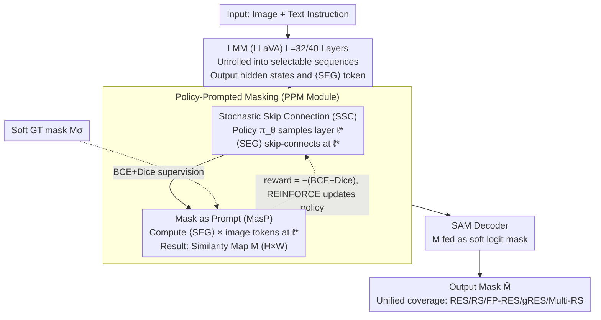

# UGround: Towards Unified Visual Grounding with Unrolled Transformers

**Conference**: ICML 2026  
**arXiv**: [2510.03853](https://arxiv.org/abs/2510.03853)  
**Code**: https://github.com/rui-qian/UGround (Available)  
**Area**: Segmentation / Multimodal VLM / Visual Grounding  
**Keywords**: Visual Grounding, Reasoning Segmentation, Similarity Map, Reinforcement Learning Layer Selection, SAM

## TL;DR
UGround flips the LMM-based visual grounding paradigm from "using the $\langle\text{SEG}\rangle$ token of the last layer as a prompt" to "using the similarity maps of dynamically selected intermediate layers as prompts." Through a reinforcement learning strategy (SSC), the $\langle\text{SEG}\rangle$ token slides through all transformer layers, treating the similarity map simultaneously as a soft logit mask for SAM and a backward supervision signal. This approach unifies five visual grounding tasks—RES, RS, FP-RES, gRES, and Multi-RS—within a single framework for the first time, achieving +9.0% cIoU on ReasonSeg test and +12.1% N-acc on gRefCOCO val.

## Background & Motivation

**Background**: Visual grounding is evolving from explicit Referring Expression Segmentation (RES) to implicit Reasoning Segmentation (RS), from single-target to multi-target (gRES, Multi-RS), and from purely positive queries to the rejection of false premises (FP-RES). Existing SOTA models like LISA, SESAME, GLaMM, GSVA, and PixelLM can only cover 2-3 of these attributes individually; no method satisfies all five simultaneously.

**Limitations of Prior Work**: (1) **Fixed Final Layer**—LMMs possess 32-40 transformer layers, yet existing methods exclusively feed the $\langle\text{SEG}\rangle$ embedding from the final layer into SAM. Similar to a "telephone game," accumulated errors are dumped into the last layer. (2) **$\langle\text{SEG}\rangle$ as a Prompt Lacks Spatial Cues**—The $\langle\text{SEG}\rangle$ token is a text placeholder. It essentially maps text embeddings implicitly to visual space through an MLP, lacking coordinates or mask shapes, forcing SAM to "guess."

**Key Challenge**: Intermediate layers of LMMs actually contain more discriminative semantics (experiments show cIoU for layers 10-40 is higher than the last layer), but traditional paradigms give SAM no chance to observe these intermediate representations. Furthermore, the similarity map between the $\langle\text{SEG}\rangle$ token and image tokens is natively an $H \times W$ "soft mask," carrying more explicit spatial information than the $\langle\text{SEG}\rangle$ embedding itself.

**Goal**: (i) Process five tasks (RES + RS + FP-RES + gRES + Multi-RS) within a unified architecture; (ii) Address the dual defects of "fixed final layer" and "lack of spatial cues in $\langle\text{SEG}\rangle$"; (iii) Enable SAM to "cheat" by pre-obtaining semantic cues from intermediate layers.

**Key Insight**: Treat the hierarchical structure as unrolled transformers, making every layer a potential input port for SAM; utilize similarity maps as "bi-directional masks" that can both prompt SAM and provide backward supervision.

**Core Idea**: Replace "fixed final layer + $\langle\text{SEG}\rangle$ prompt" with "policy-prompted masking = RL layer selection + similarity map prompt," reframing visual grounding as a differentiable segmentation pipeline with skip connections.

## Method

### Overall Architecture
Input indices $\mathbf{x}_{img}$ are processed by $L=32$ or $40$ transformer layers of an LMM (LLaVA) to obtain hidden states $\mathcal{H}^{(\ell)}$ for each layer, where position $t^*$ is the $\langle\text{SEG}\rangle$ token. The core module, Policy-Prompted Masking (PPM), performs two actions during each forward pass $\mathcal{T}_t$: (1) **SSC** samples a layer $\ell^*$ from a policy distribution $\pi_\theta(\ell|\mathcal{H}_{t^*})$, allowing $\langle\text{SEG}\rangle$ to skip-connect directly to SAM at layer $\ell^*$; (2) **MasP** calculates the similarity map $\mathcal{M} \in [0,1]^{H \times W}$ between $\langle\text{SEG}\rangle$ and all image tokens at layer $\ell^*$. $\mathcal{M}$ is fed into the SAM decoder $\mathcal{G}_\mathcal{V}^{dec}(\mathbf{f}, \bm{h}_{seg}, \mathcal{M})$ as a soft logit mask to generate the final mask $\hat{\mathbf{M}}$. Throughout this process, $\mathcal{M}$ assumes three roles: prompt (input to SAM), constraint (supervised by BCE+Dice), and signal (reward for REINFORCE).

### Key Designs

**1. Stochastic Skip Connection (SSC): Letting each $\langle\text{SEG}\rangle$ choose "where to jump out to SAM"**

Traditional paradigms use the $\langle\text{SEG}\rangle$ embedding from the fixed final layer, accumulating errors like a game of telephone across 32-40 layers. Experiments prove cIoU from layers 10-40 is almost always higher than the final layer. SSC models the exit layer as a learnable policy distribution $\pi_\theta(\ell|\mathcal{H}_{t^*}) = \frac{\exp(s_\ell)}{\sum_j \exp(s_j)}$, where scores $s_\ell = \bm{h}_{t^*}^{(\ell)} \cdot \mathbf{w}_\ell$ use layer-specific weights $\mathbf{w}_\ell$. During training, $\ell^*$ is sampled from $\pi_\theta$ to allow exploration, with reward $r = -(\mathcal{L}_{bce}(\mathcal{M}, M_\sigma) + \mathcal{L}_{dice}(\mathcal{M}, M_\sigma))$ using a smoothed soft GT $M_\sigma$. An EMA baseline $b_t = \alpha b_{t-1} + (1-\alpha)r$ reduces variance for the REINFORCE loss $\mathcal{L}_{policy} = -(r - b_t) \log \pi_\theta(\ell^*|\mathcal{H}_{t^*})$. This structure functions as a skip connection over $L - \ell^*$ layers in a single pass and equates to Monte Carlo uncertainty estimation across multiple passes, mitigating error accumulation and enhancing robustness via ensembling.

**2. Mask as Prompt (MasP): Feeding similarity maps to SAM as soft logit masks**

The $\langle\text{SEG}\rangle$ token is essentially a text placeholder mapped implicitly to vision via an MLP; it lacks spatial structure. Conversely, the similarity map between $\langle\text{SEG}\rangle$ and image tokens is an $H \times W$ map with explicit spatial information. In selected layer $\ell^*$, MasP calculates $\mathcal{S}_i^{(\ell^*)} = (\bm{h}_{z_i}^{(\ell^*)})^\top \bm{h}_{t^*}^{(\ell^*)}$ for each image token, interpolates them to $H \times W$ on a 2D grid to obtain $\mathcal{M}$, and calls a modified SAM: $\hat{\mathbf{M}} = \mathcal{G}_\mathcal{V}^{dec}(\mathbf{f}, \bm{h}_{seg}, \mathcal{M})$. $\mathcal{M}$ is continuously differentiable, allowing gradients to backpropagate through SAM while being explicitly supervised by $\mathcal{L}_\mathcal{M} = \lambda_{bce} \mathcal{L}_{bce}(\mathcal{M}, M_\sigma) + \lambda_{dice} \mathcal{L}_{dice}(\mathcal{M}, M_\sigma)$. Empirically, even without training, feeding raw similarity maps to SAM yields 17% cIoU, indicating that LMMs inherently encode spatial distributions; MasP simply amplifies this latent capability.

**3. Unified Architecture: Single model support for RES / RS / FP-RES / gRES / Multi-RS**

Previously, no method addressed all five attributes—LISA covered RES+RS, GSVA reached gRES but lacked Multi-RS support, and PixelLM supported Multi-RS but not false premise rejection. UGround leverages the flexibility of PPM to unify them: each target in multi-target scenarios uses a $\langle\text{SEG}\rangle$ token with independent layer sampling; in false premise scenarios, low response across similarity maps allows for rejection; in reasoning scenarios, the richer semantics of intermediate layers facilitate implicit descriptions. It is the first framework to achieve 5/5 coverage.

### Loss & Training
The total loss is a weighted sum of four components: $\mathcal{L} = \lambda_{txt} \mathcal{L}_{txt} + \lambda_{mask} \mathcal{L}_{mask} + \lambda_\mathcal{M} \mathcal{L}_\mathcal{M} + \lambda_{policy} \mathcal{L}_{policy}$. $\mathcal{L}_{txt}$ is standard text generation loss, $\mathcal{L}_{mask}$ supervises the SAM mask output (BCE+Dice), $\mathcal{L}_\mathcal{M}$ supervises the similarity map against soft GT, and $\mathcal{L}_{policy}$ is the REINFORCE policy gradient. The base model is LLaVA1.5-7B/13B with SAM for decoding, fine-tuned on 239 samples from ReasonSeg train.

## Key Experimental Results

### Main Results

ReasonSeg Test Set (Reasoning Segmentation):

| Method | val gIoU | val cIoU | test gIoU | test cIoU |
| :--- | :--- | :--- | :--- | :--- |
| LISA-7B-LLaVA1.5 (ft) | 61.3 | 62.9 | 55.6 | 56.9 |
| READ-7B-LLaVA1.5 (ft) | 59.8 | 67.6 | 58.5 | 58.6 |
| LISA++-7B-LLaVA1.5 (ft) | 64.2 | 68.1 | 57.0 | 59.5 |
| RSVP-GPT | 64.7 | 63.1 | 60.3 | 60.0 |
| **UGround-7B-LLaVA1.5 (ft)** | **66.1** | **72.1** | **63.6** | **65.4** |
| LISA-13B-LLaVA1.5 (ft) | 65.0 | 72.9 | 61.3 | 62.2 |
| **UGround-13B-LLaVA1.5 (ft)** | **67.9** | **74.9** | **65.0** | **65.5** |

UGround-7B improves by **+17 cIoU** over the LISA-7B baseline (48.4 cIoU on test) and **+6.8 cIoU** over READ-7B. The claimed "+9% cIoU" refers to improvements over stronger baselines like RSVP-GPT.

### Ablation Study

| Configuration | ReasonSeg test cIoU | Description |
| :--- | :--- | :--- |
| Fixed Last Layer + $\langle\text{SEG}\rangle$ Prompt (LISA paradigm) | ~48.4 | Baseline |
| Dynamic Layer + $\langle\text{SEG}\rangle$ Prompt | Improved intermediate cIoU | SSC contribution |
| Fixed Last Layer + Similarity Map Prompt | 35.0 (`SESAME`) → 30.7 (+4.3%) | MasP contribution |
| **Complete UGround (PPM = SSC + MasP)** | **65.4** | Full Model |

Analysis of similarity maps (Table 2): Raw, un-trained similarity maps as SAM prompts yield 17% cIoU. Converting them directly to binary masks yields 35.0% (surpassing the 30.7% from trained SESAME).

### Key Findings
- **Intermediate Layers > Last Layer**: Predicted cIoU for all layers between 10-40 exceeds the fixed last-layer strategy (Fig 2a). Intermediate layers converge starting at layer 19, whereas the last layer requires layer 28, suggesting dynamic selection improves both performance caps and convergence speed.
- **Intrinsic Spatial Semantics**: Un-trained SAM's reasonable output from similarity prompts proves LMM internal structures already encode spatial cues—traditional methods simply ignored them.
- **FP-RES Performance**: N-acc on gRefCOCO improved by **+12.1%**. The ability to reject false premises is significantly bolstered by the uncertainty estimation provided by layer ensembling via policy sampling.

## Highlights & Insights
- **Elegant "Unrolled Transformer" Framing**: Viewing a stacked transformer as a sequence of optional skip paths makes 39 intermediate representations available as prompt sources. This "white-box" perspective is transferable to any downstream task requiring intermediate information.
- **Tri-purpose Similarity Map**: $\mathcal{M}$ serves as a prompt for SAM, a supervision target, and a reward signal for RL. This multiplexing is computationally efficient.
- **REINFORCE for Intermediate Selection**: Modeling the exit layer as a discrete policy gradient provides a clean implementation paradigm for differentiable discrete layer selection in VLMs.
- **Engineering Value of Unification**: Full 5-attribute coverage implies that task-specific models are no longer required for deployment, establishing a universal grounding backend.

## Limitations & Future Work
- **Training Overhead**: Sampling from $L=32/40$ layers plus the high variance of REINFORCE may require multiple forward passes for stability; training time costs were not fully detailed.
- **Resolution Constraints**: Computing similarity between $\langle\text{SEG}\rangle$ and image tokens is limited by LMM input resolution; interpolation on $H \times W$ grids might cause distortion for small objects.
- **Policy Variance**: The EMA baseline for REINFORCE might still be improved with a critic network.
- **Generalization**: Validated only on LLaVA1.5; compatibility with newer LMMs (e.g., Qwen-VL, InternVL) remains unexplored.
- **Inference Strategy**: While layer ensembling helps during training, it is unclear if inference benefits from Monte Carlo averaging or uses a single sampled path.

## Related Work & Insights
- **vs. LISA / SESAME / READ**: These use a fixed final layer + $\langle\text{SEG}\rangle$ prompt. UGround upgrades the paradigm to dynamic layers + similarity map prompts.
- **vs. GSVA / PixelLM**: Those cover 4 attributes each; UGround is the first to cover 5/5.
- **vs. HyperSeg / OMG-LLaVA**: HyperSeg is versatility-oriented; UGround is attribute-oriented. The two are orthogonal and combinable.
- **Insight**: (a) The "intermediate layer stronger than last layer" observation likely holds for many LMM tasks; (b) Using attention/similarity maps as prompts, rather than hidden states, could generalize to detection, tracking, and open-vocab segmentation.

## Rating
- **Novelty**: ⭐⭐⭐⭐⭐ The unrolled transformer + policy-prompted masking is a fresh perspective; 5-attribute coverage is a first.
- **Experimental Thoroughness**: ⭐⭐⭐⭐ Full coverage of ReasonSeg/RefCOCO/gRefCOCO with detailed ablations, though comparisons of single-path vs. MC-averaging are missing.
- **Writing Quality**: ⭐⭐⭐⭐ The "telephone game" analogy and visualizations (Fig 1/2/5) are excellent; policy gradient formulas are slightly dense.
- **Value**: ⭐⭐⭐⭐⭐ Offers SOTA results and open-source code; the "intermediate layer + similarity map" paradigm has long-term potential.

<!-- RELATED:START -->

## Related Papers

- [\[ICCV 2025\] ReferDINO: Referring Video Object Segmentation with Visual Grounding Foundations](../../ICCV2025/segmentation/referdino_referring_video_object_segmentation_with_visual_grounding_foundations.md)
- [\[CVPR 2025\] DA-VPT: Semantic-Guided Visual Prompt Tuning for Vision Transformers](../../CVPR2025/segmentation/da-vpt_semantic-guided_visual_prompt_tuning_for_vision_transformers.md)
- [\[AAAI 2026\] EAGLE: Episodic Appearance- and Geometry-Aware Memory for Unified 2D-3D Visual Query Localization](../../AAAI2026/segmentation/eagle_episodic_appearance-_and_geometry-aware_memory_for_unified_2d-3d_visual_qu.md)
- [\[CVPR 2026\] RealVLG-R1: A Large-Scale Real-World Visual-Language Grounding Benchmark for Robotic Perception and Manipulation](../../CVPR2026/segmentation/realvlg-r1_a_large-scale_real-world_visual-language_grounding_benchmark_for_robo.md)
- [\[NeurIPS 2025\] UniPixel: Unified Object Referring and Segmentation for Pixel-Level Visual Reasoning](../../NeurIPS2025/segmentation/unipixel_unified_object_referring_and_segmentation_for_pixel-level_visual_reason.md)

<!-- RELATED:END -->
