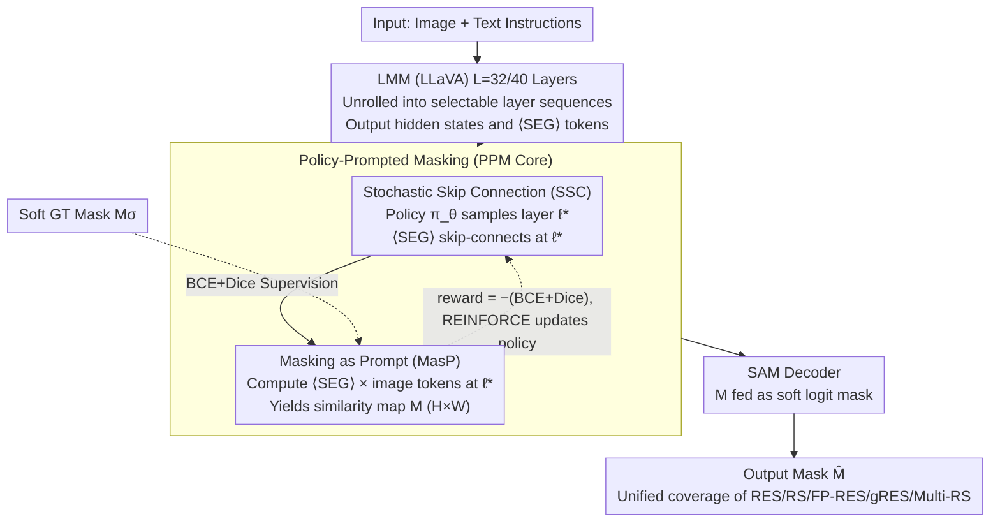

# UGround: Towards Unified Visual Grounding with Unrolled Transformers

**Conference**: ICML 2026  
**arXiv**: [2510.03853](https://arxiv.org/abs/2510.03853)  
**Code**: https://github.com/rui-qian/UGround (Available)  
**Area**: Segmentation / Multimodal VLM / Visual Grounding  
**Keywords**: Visual Grounding, Reasoning Segmentation, Similarity Maps, RL Layer Selection, SAM  

## TL;DR
UGround shifts the LMM-based visual grounding paradigm from "using the last layer's $\langle\text{SEG}\rangle$ token as a prompt" to "using dynamically selected intermediate layer similarity maps as prompts." Through the reinforcement learning strategy SSC, the $\langle\text{SEG}\rangle$ token traverses all transformer layers, utilizing similarity maps as both soft logit masks for SAM and backward supervision signals. It is the first framework to unify five visual grounding tasks (RES, RS, FP-RES, gRES, and Multi-RS) within a single architecture, achieving +9.0% cIoU on ReasonSeg test and +12.1% N-acc on gRefCOCO val.

## Background & Motivation

**Background**: Visual grounding is evolving from explicit referring expression segmentation (RES) to implicit reasoning segmentation (RS), single-target to multi-target (gRES, Multi-RS), and purely positive queries to rejecting false premises (FP-RES). Existing SOTAs like LISA, SESAME, GLaMM, GSVA, and PixelLM only cover 2-3 of these attributes individually, with no single method satisfying all five.

**Limitations of Prior Work**: (1) **Fixed Final Layer**: LMMs have 32-40 transformer layers, yet all methods only feed the last layer's $\langle\text{SEG}\rangle$ embedding to SAM. This acts like a "telephone game," accumulating errors toward the final layer. (2) **Lack of Spatial Cues in $\langle\text{SEG}\rangle$**: The $\langle\text{SEG}\rangle$ token is a text placeholder; it essentially maps text embeddings implicitly to the visual space via an MLP without explicit coordinates or mask shapes, forcing SAM to "guess."

**Key Challenge**: Intermediate layers of LMMs actually contain more discriminative semantics (experiments show layers 10-40 often outperform the last layer in cIoU), but traditional paradigms deny SAM access to these intermediate representations. Furthermore, the similarity map between the $\langle\text{SEG}\rangle$ token and image tokens is inherently an $H \times W$ "soft mask," carrying more explicit spatial information than the token embedding itself.

**Goal**: (i) Process RES + RS + FP-RES + gRES + Multi-RS tasks simultaneously within a unified architecture; (ii) Address the flaws of the "fixed final layer" and the "lack of spatial cues"; (iii) Allow SAM to "cheat" by accessing intermediate semantic cues early.

**Key Insight**: Treat the hierarchical structure as unrolled transformers, making every layer a potential input port for SAM. Use similarity maps as "bidirectional masks" that both prompt SAM and provide backward supervision.

**Core Idea**: Replace "fixed last layer + $\langle\text{SEG}\rangle$ prompt" with "policy-prompted masking = RL layer selection + similarity map as prompt," reframing visual grounding as a differentiable segmentation pipeline with skip connections.

## Method

### Overall Architecture
Input images $\mathbf{x}_{img}$ are processed by $L=32$ or $40$ transformer layers of an LMM (LLaVA) to obtain hidden states $\mathcal{H}^{(\ell)}$ for each layer, where the $t^*$-th position is the $\langle\text{SEG}\rangle$ token. The core module, Policy-Prompted Masking (PPM), performs two actions during each forward pass $\mathcal{T}_t$: (1) **SSC** samples a layer $\ell^*$ from a policy distribution $\pi_\theta(\ell|\mathcal{H}_{t^*})$ to create a skip connection from $\langle\text{SEG}\rangle$ at layer $\ell^*$ directly to SAM; (2) **MasP** calculates the similarity map $\mathcal{M}\in[0,1]^{H\times W}$ between $\langle\text{SEG}\rangle$ and all image tokens at layer $\ell^*$. $\mathcal{M}$ is fed as a soft logit mask into the SAM decoder $\mathcal{G}_\mathcal{V}^{dec}(\mathbf{f}, \bm{h}_{seg}, \mathcal{M})$ to generate the final mask $\hat{\mathbf{M}}$. Throughout this process, $\mathcal{M}$ serves three roles: a prompt (fed to SAM), a constraint (supervised by BCE+Dice), and a signal (serving as the reward for REINFORCE).

### Key Designs

**1. Stochastic Skip Connection (SSC): Letting each $\langle\text{SEG}\rangle$ choose "where to jump out to SAM"**

Traditional paradigms fix the last layer's $\langle\text{SEG}\rangle$ embedding for SAM, accumulating errors across 32-40 layers. SSC models "which layer to connect" as a learnable policy distribution $\pi_\theta(\ell|\mathcal{H}_{t^*})=\frac{\exp(s_\ell)}{\sum_j\exp(s_j)}$, where the score $s_\ell=\bm{h}_{t^*}^{(\ell)}\cdot\mathbf{w}_\ell$ utilizes layer-specific weights $\mathbf{w}_\ell$. During training, $\ell^*\sim\pi_\theta$ is sampled to allow exploration, with reward $r=-(\mathcal{L}_{bce}(\mathcal{M}, M_\sigma)+\mathcal{L}_{dice}(\mathcal{M}, M_\sigma))$ using an EMA baseline $b_t$ for variance reduction. The REINFORCE loss is defined as $\mathcal{L}_{policy}=-(r-b_t)\log\pi_\theta(\ell^*|\mathcal{H}_{t^*})$. This structure functions as a dynamic skip connection over $L-\ell^*$ layers, acting like a path-wise dropout that equivalent to Monte Carlo uncertainty estimation—mitigating error accumulation while enhancing robustness through ensembling.

**2. Masking as Prompt (MasP): Feeding the similarity map directly to SAM as a soft logit mask**

$\langle\text{SEG}\rangle$ is implicitly mapped to visual space via an MLP, lacking explicit spatial structure. MasP explicitly utilizes the spatial semantics by calculating $\mathcal{S}_i^{(\ell^*)}=(\bm{h}_{z_i}^{(\ell^*)})^\top\bm{h}_{t^*}^{(\ell^*)}$ for each image token at layer $\ell^*$. These are arranged into a 2D grid and interpolated to $H\times W$ to form $\mathcal{M}$, which is then passed to the modified SAM $\hat{\mathbf{M}}=\mathcal{G}_\mathcal{V}^{dec}(\mathbf{f}, \bm{h}_{seg}, \mathcal{M})$. Since $\mathcal{M}$ is differentiable, gradients flow back through SAM and are further constrained by explicit supervision $\mathcal{L}_\mathcal{M}=\lambda_{bce}\mathcal{L}_{bce}(\mathcal{M}, M_\sigma)+\lambda_{dice}\mathcal{L}_{dice}(\mathcal{M}, M_\sigma)$. Empirically, even without training, feeding the raw similarity map as a prompt to SAM yields 17% cIoU, proving LMMs implicitly encode spatial distributions that MasP amplifies.

**3. Unified Attribute Architecture: Supporting RES, RS, FP-RES, gRES, and Multi-RS in one model**

UGround is the first to cover all five attributes simultaneously. In multi-target scenarios, each target is assigned a $\langle\text{SEG}\rangle$ token that independently samples its layer $\ell^*$. In false-premise scenarios, if similarity maps across all layers show low response, the model can reject the grounding. The intermediate layers' superior reasoning capability handles implicit descriptions more effectively.

### Loss & Training
The total loss is a weighted sum: $\mathcal{L}=\lambda_{txt}\mathcal{L}_{txt}+\lambda_{mask}\mathcal{L}_{mask}+\lambda_\mathcal{M}\mathcal{L}_\mathcal{M}+\lambda_{policy}\mathcal{L}_{policy}$. $\mathcal{L}_{txt}$ is standard text generation loss, $\mathcal{L}_{mask}$ is the SAM output supervision (BCE+Dice), $\mathcal{L}_\mathcal{M}$ supervises the similarity map against soft GT, and $\mathcal{L}_{policy}$ is the REINFORCE gradient. The base models are LLaVA1.5-7B/13B with SAM for decoding, fine-tuned on ReasonSeg train (239 samples).

## Key Experimental Results

### Main Results

ReasonSeg Test Set (Reasoning Segmentation):

| Method | val gIoU | val cIoU | test gIoU | test cIoU |
|------|----------|----------|-----------|-----------|
| LISA-7B-LLaVA1.5 (ft) | 61.3 | 62.9 | 55.6 | 56.9 |
| READ-7B-LLaVA1.5 (ft) | 59.8 | 67.6 | 58.5 | 58.6 |
| LISA++-7B-LLaVA1.5 (ft) | 64.2 | 68.1 | 57.0 | 59.5 |
| RSVP-GPT | 64.7 | 63.1 | 60.3 | 60.0 |
| **UGround-7B-LLaVA1.5 (ft)** | **66.1** | **72.1** | **63.6** | **65.4** |
| LISA-13B-LLaVA1.5 (ft) | 65.0 | 72.9 | 61.3 | 62.2 |
| **UGround-13B-LLaVA1.5 (ft)** | **67.9** | **74.9** | **65.0** | **65.5** |

Compared to LISA-7B (48.4 cIoU on test), UGround improves by **+17 cIoU**. Compared to the fine-tuned READ-7B (58.6), it improves by **+6.8 cIoU**.

### Ablation Study

| Configuration | ReasonSeg test cIoU | Description |
|------|---------------------|------|
| Fixed last layer + $\langle\text{SEG}\rangle$ prompt (LISA paradigm) | ~48.4 | Baseline |
| Dynamic layer + $\langle\text{SEG}\rangle$ prompt | Improved cIoU (layers 10-40 > last layer) | SSC contribution |
| Fixed last layer + Similarity map prompt | 30.7 (`SESAME`) $\rightarrow$ 35.0 (+4.3%) | MasP effect |
| Full UGround (PPM = SSC + MasP) | 65.4 | Final model |

Notably, converting the similarity map directly to a binary mask reaches 35.0% cIoU, surpassing the trained SESAME's 30.7%.

### Key Findings
- **Intermediate layers outperform the final layer**: cIoU for layers 10-40 is consistently higher than the fixed last layer (Fig 2a). Convergence starts at layer 19 for intermediate layers versus layer 28 for the last layer.
- **Similarity maps possess spatial semantics**: Un-tuned SAM produces reasonable outputs using only similarity map prompts, proving LMM internal structures already encode spatial cues.
- **Improved FP-RES performance**: N-acc increased by +12.1% on gRefCOCO. The ability to reject false premises stems from the layer ensemble uncertainty estimation provided by stochastic sampling.

## Highlights & Insights
- **"Unrolled Transformer" is an elegant framing**: Treating a fixed stack as a sequence of selectable paths allows SAM to access all 39 intermediate representations, which were previously hidden.
- **Triple-role reuse of similarity maps**: $\mathcal{M}$ serves as a prompt, a supervision target, and a reward signal simultaneously, maximizing computational efficiency.
- **RL for Layer Selection**: Modeling "where to skip" as a discrete action via policy gradients provides a clean implementation for differentiable layer selection in LMMs.
- **Engineering Value of Unification**: Full 5-attribute coverage means task-specific models are no longer needed for deployment.

## Limitations & Future Work
- Training overhead: Sampling from $L=32/40$ layers and the high variance of REINFORCE might require multiple forward passes for stability.
- Resolution constraints: Similarity calculations between $\langle\text{SEG}\rangle$ and image tokens are limited by SAM's input resolution; $H\times W$ grid interpolation may distort small objects.
- REINFORCE baseline: The use of EMA for the baseline indicates potential room for improvement using a critic network.
- Inference Strategy: While layer ensembling helps training, it is unclear if the benefit persists during single-path inference without MC averaging.

## Related Work & Insights
- **vs LISA / SESAME / READ**: These use fixed last layers; UGround introduces dynamic layers and similarity map prompts, marking a paradigm shift.
- **vs GSVA / PixelLM**: Both cover 4 attributes; UGround reaches 5/5.
- **vs HyperSeg / OMG-LLaVA**: HyperSeg is versatility-oriented (across modalities); UGround is attribute-oriented (across task types within grounding). They are orthogonal and can be combined.
- **Insight**: (a) The "intermediate over final layer" phenomenon likely holds for many LMM downstream tasks; (b) Using attention/similarity maps as prompts rather than hidden states is a transferable strategy for detection and tracking.

## Rating
- Novelty: ⭐⭐⭐⭐⭐ "Unrolled transformers" and PPM are fresh perspectives; first 5-attribute unification.
- Experimental Thoroughness: ⭐⭐⭐⭐ Coverage of three benchmarks is excellent, though MC averaging analysis in inference is missing.
- Writing Quality: ⭐⭐⭐⭐ Strong analogies (e.g., "telephone game") and visualizations, though RL math is dense.
- Value: ⭐⭐⭐⭐⭐ Provides SOTA results and open-source code; defines a new prompt paradigm.

<!-- RELATED:START -->

## Related Papers

- [\[ICCV 2025\] ReferDINO: Referring Video Object Segmentation with Visual Grounding Foundations](../../ICCV2025/segmentation/referdino_referring_video_object_segmentation_with_visual_grounding_foundations.md)
- [\[CVPR 2025\] DA-VPT: Semantic-Guided Visual Prompt Tuning for Vision Transformers](../../CVPR2025/segmentation/da-vpt_semantic-guided_visual_prompt_tuning_for_vision_transformers.md)
- [\[CVPR 2026\] RealVLG-R1: A Large-Scale Real-World Visual-Language Grounding Benchmark for Robotic Perception and Manipulation](../../CVPR2026/segmentation/realvlg-r1_a_large-scale_real-world_visual-language_grounding_benchmark_for_robo.md)
- [\[AAAI 2026\] EAGLE: Episodic Appearance- and Geometry-Aware Memory for Unified 2D-3D Visual Query Localization](../../AAAI2026/segmentation/eagle_episodic_appearance-_and_geometry-aware_memory_for_unified_2d-3d_visual_qu.md)
- [\[NeurIPS 2025\] UniPixel: Unified Object Referring and Segmentation for Pixel-Level Visual Reasoning](../../NeurIPS2025/segmentation/unipixel_unified_object_referring_and_segmentation_for_pixel-level_visual_reason.md)

<!-- RELATED:END -->
