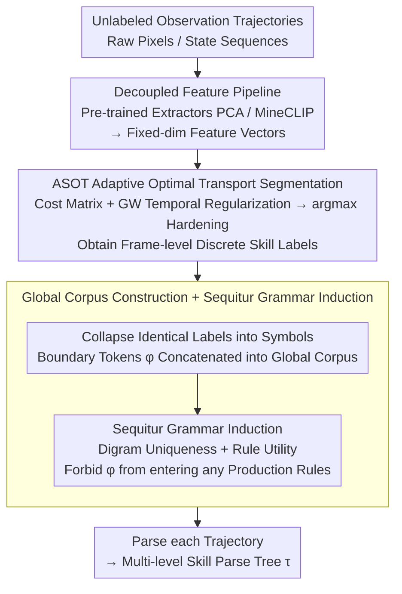

# Unsupervised Hierarchical Skill Discovery

**Conference**: ICML 2026  
**arXiv**: [2601.23156](https://arxiv.org/abs/2601.23156)  
**Code**: https://github.com/dmhHarvey/hisd  
**Area**: Reinforcement Learning  
**Keywords**: Skill Discovery, Hierarchical Structure, Unsupervised Learning, Grammar Induction, Minecraft

## TL;DR
HiSD starts from unlabeled observation trajectories—performing skill segmentation via optimal transport and then discovering multi-level skill hierarchies using Sequitur grammar induction, without requiring action labels or reward signals.

## Background & Motivation

**Background**: Human planning is inherently hierarchical, reasoning through goals and subtasks. The reinforcement learning community has also found that hierarchical decomposition significantly improves learning efficiency and policy reuse in high-dimensional environments (e.g., Minecraft). However, manually defined hierarchies (e.g., HTN) require substantial human effort and domain knowledge.

**Limitations of Prior Work**: Existing skill discovery methods rely heavily on action labels, reward signals, or online interaction. Methods like CompILE and OMPN require known skill sequences and complete state-action trajectories rather than learning from observations alone. These methods typically produce flat segmentations rather than deep compositional hierarchies.

**Key Challenge**: Skill discovery and hierarchy learning are typically coupled, but if observation features are used as the sole input, there is no action/reward information to guide the discovery process.

**Goal**: Design a fully unsupervised framework—extracting reusable multi-level skill hierarchies from observation data only, capable of handling high-dimensional real-world environments.

**Key Insight**: Decouple skill discovery into two stages—(1) Skill segmentation: using optimal transport to find visually consistent behavioral units; (2) Hierarchy induction: using Sequitur grammar induction to discover reusable subroutines.

**Core Idea**: Through a two-stage pipeline of optimal transport + grammar induction, HiSD discovers a skill system that can both segment semantic units and organize them into hierarchical structures from pure observation trajectories in an unsupervised manner.

## Method

### Overall Architecture

HiSD aims to solve "discovering reusable multi-level skills based only on unlabeled observation trajectories, without action labels or rewards." It decomposes the problem into two stages: first segmenting trajectories into semantically consistent skill units, and then compressing these units into reusable hierarchies. Specifically, it involves four steps: (1) Input raw observation trajectories and feature vectors; (2) Use ASOT (Adaptive Soft Optimal Transport) for frame-level skill segmentation to obtain discrete skill label sequences; (3) Concatenate multiple trajectories into a global corpus and use Sequitur grammar induction to discover reusable mid-level subroutines; (4) Generate final hierarchical parse trees.

### Key Designs

**1. Adaptive Soft Optimal Transport (ASOT): Discretizing continuous observation sequences into semantically consistent skill units**

The difficulty in cutting "behavioral units" from pure observation trajectories lies in the absence of action/reward signals while ensuring temporal coherence. ASOT constructs a cost matrix $C_{tk}$ to measure the visual difference between observation $X_t$ and the $k$-th skill prototype, minimizing the weighted objective $\langle C,\Gamma\rangle + \alpha\mathcal{R}_{\text{temp}}(\Gamma) + \lambda D_{\text{KL}}(\Gamma^\top\mathbf{1}_n \| q)$ to find the optimal assignment $\Gamma^*$, which is then hardened into discrete labels $z_t = \arg\max_k \Gamma^*_{tk}$. The key is the temporal regularization term $\mathcal{R}_{\text{temp}}$: it uses Gromov-Wasserstein distance to constrain temporal consistency between neighboring frames, directly controlling the minimum segment length through a radius parameter $r$—penalizing adjacent frames within $nr$ steps being assigned to different skills, thus automatically producing coherent skill segments instead of frequent jittering as seen in pure clustering.

**2. Global Corpus Construction + Sequitur Grammar Induction: Automatically discovering reusable mid-level subroutines and hierarchies across trajectories**

After segmentation, the result is just a flat sequence of labels. The next step is to find which segments are reused across different trajectories and organize them into layers. The approach first collapses adjacent identical labels into a single symbol, then concatenates all trajectories into a global corpus $\mathcal{S}_{\text{corp}} = S^{(1)} \oplus \phi \oplus S^{(2)} \oplus \cdots$ using a boundary token $\phi$. The Sequitur algorithm is then run, maintaining two invariants—digram uniqueness and rule utility—while explicitly forbidding $\phi$ from appearing in any production rules to prevent incorrect cross-trajectory stitching. Sequitur was chosen for its linear time complexity and natural support for recursive structures and arbitrary depth, allowing the simultaneous learning of multi-level and cross-trajectory reusable subroutines without pre-specifying depth or segment counts.

**3. Decoupled Feature Pipeline: Extensible to any observation type by swapping feature extractors**

Since both ASOT and Sequitur only consume fixed-dimension feature vectors, the choice of "which feature to use" is decoupled from the core algorithm. A pre-trained feature extractor (e.g., PCA, CLIP) is used before ASOT to map raw pixels into a fixed-dimension feature space. Because of this decoupling, the same HiSD framework can handle fully observable environments (Craftax+PCA) and partially observable real environments (Minecraft+MineCLIP) without changing a single line of the core algorithm.

## Key Experimental Results

### Main Results

Segmentation performance on Craftax Wood-Stone Random and Stone Pickaxe Static tasks:

| Task | Method | mIoU Full | F1 Full | Description |
|------|------|-----------|---------|------|
| WS Random | HiSD | 58% (±16) | 74% (±11) | No Action/Reward |
| WS Random | CompILE | 74% (±4) | 94% (±3) | w/ Action + Seg Count |
| WS Random | OMPN | 72% (±11) | 91% (±9) | w/ Action + Depth |
| Stone Pickaxe Static | HiSD | 65% (±17) | 82% (±13) | Unsupervised |
| Stone Pickaxe Static | CompILE | 40% (±18) | 67% (±20) | Supervised but unstable |
| Stone Pickaxe Static | OMPN | 26% (±4) | 56% (±4) | Supervised but fails |

### Ablation Study

Hierarchical quality metrics on the Minecraft 44-skill dataset:

| Configuration | Unique Trees | Avg Depth | Avg Size | Mean Branching |
|------|--------------|-----------|----------|-----------------|
| HiSD (Full) | 12 | 3.2 | 47 | 2.8 |
| OMPN (Supervised) | 156 | 2.1 | 51 | 3.9 |
| CompILE (flat) | 500 | 1.0 | 44 | 5.2 |
| Ground Truth Grammar | 1 | 3.5 | 48 | 2.7 |

### Key Findings
- In Stone Pickaxe Static, CompILE/OMPN F1 dropped from 94% to 56-67%, while HiSD remained stable (82%) as it does not rely on actions or order.
- Hierarchical Reusability—HiSD discovered 12 unique trees, nearing the Ground Truth of 1; OMPN found 156, and CompILE found 500.
- Depth Matching—HiSD's average depth of 3.2 (GT 3.5) significantly outperformed OMPN (2.1) and CompILE (1.0).
- Downstream RL Acceleration—HiSD hierarchies accelerated training by 1.5-2.3x compared to flat policies.

## Highlights & Insights
- **True Unsupervised Paradigm**: Uses only observation features, completely eliminating dependency on action labels, rewards, or online interaction.
- **Two-stage Decoupled Design**: Separates segmentation from hierarchy induction, simplifying the problem and making the segmentation algorithm plug-and-play.
- **Elegance of Grammar Induction**: The two invariants of Sequitur naturally induce sparse, reusable hierarchies.
- **Cross-trajectory Generalization**: Boundary token constraints ensure discovered subroutines represent genuine patterns across trajectories.

## Limitations & Future Work
- Feature Dependency—Performance relies heavily on feature quality (e.g., PCA/MineCLIP).
- Sensitivity to Skill Count $K$—Underestimation leads to the merging of distinct skills.
- Scalability on Long Sequences—The computational and memory costs of Sequitur on extremely long sequences (>10k frames) are not fully discussed.
- Improvements: Integration with clustering or deep generative models to automatically estimate $K$; online/streaming versions of Sequitur; explicit constraints on grammar sparsity and hierarchy quality.

## Related Work & Insights
- **vs CompILE**: CompILE requires action supervision and known segment counts; HiSD is fully unsupervised.
- **vs OMPN**: OMPN requires actions + known depth; HiSD only requires observations + skill count $K$.
- **vs Pure Clustering (DEC, VQ-VAE)**: Lacks temporal constraints leading to frequent jittering; HiSD uses Gromov-Wasserstein to enforce temporal smoothness.

## Rating
- Novelty: ⭐⭐⭐⭐⭐ First to integrate fully unsupervised skill discovery with deep grammar induction.
- Experimental Thoroughness: ⭐⭐⭐⭐ Craftax + Minecraft environments + multiple metrics + downstream RL validation.
- Writing Quality: ⭐⭐⭐⭐⭐ Clear logic and intuitive flowcharts.
- Value: ⭐⭐⭐⭐ Significant insights for learning from unlabeled demonstrations, hierarchical RL, and video understanding.

<!-- RELATED:START -->

## Related Papers

- [\[ICCV 2025\] Open-World Skill Discovery from Unsegmented Demonstration Videos](../../ICCV2025/segmentation/open-world_skill_discovery_from_unsegmented_demonstration_videos.md)
- [\[ICCV 2025\] Ensemble Foreground Management for Unsupervised Object Discovery](../../ICCV2025/segmentation/ensemble_foreground_management_for_unsupervised_object_discovery.md)
- [\[ICML 2026\] Geometry-Preserving Unsupervised Alignment for Heterogeneous Foundation Models](geometry-preserving_unsupervised_alignment_for_heterogeneous_foundation_models.md)
- [\[ECCV 2024\] Part2Object: Hierarchical Unsupervised 3D Instance Segmentation](../../ECCV2024/segmentation/part2object_hierarchical_unsupervised_3d_instance_segmentation.md)
- [\[CVPR 2025\] Hierarchical Compact Clustering Attention (COCA) for Unsupervised Object-Centric Learning](../../CVPR2025/segmentation/hierarchical_compact_clustering_attention_coca_for_unsupervised_object-centric_l.md)

<!-- RELATED:END -->
