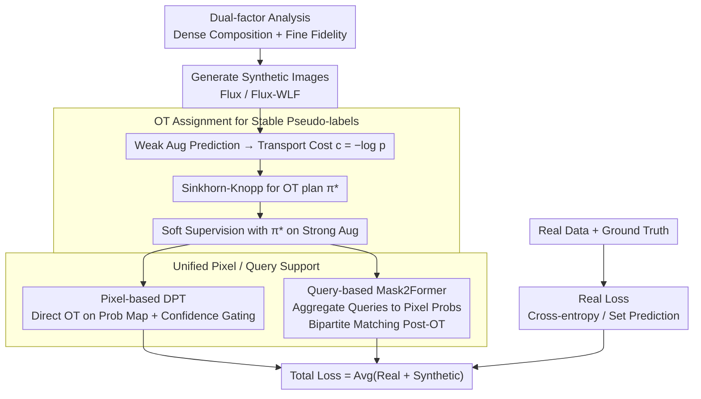

# What Makes Synthetic Data Effective in Image Segmentation

**Conference**: ICML2026  
**arXiv**: [2605.19289](https://arxiv.org/abs/2605.19289)  
**Code**: https://github.com/zhang0jhon/SENSE  
**Area**: Semantic Segmentation / Synthetic Data  
**Keywords**: Semantic Segmentation, Synthetic Data, Diffusion Models, Optimal Transport, Pseudo-labeling  

## TL;DR
This paper systematically analyzes two key factors that make synthetic images effective for semantic segmentation: dense composition and fine instance fidelity. It proposes SENSE, which leverages Optimal Transport (OT) to stabilize pseudo-label assignment for synthetic images, achieving consistent improvements for DPT and Mask2Former on Cityscapes, COCO, and ADE20K.

## Background & Motivation
**Background**: Diffusion models and flow matching models can generate high-quality images, leading to the widespread use of synthetic data in tasks like classification, detection, segmentation, and robotics. Semantic segmentation particularly relies on pixel-level annotations; since real annotations are costly and long-tail categories are difficult to collect, augmenting training sets with generative models is a natural direction.

**Limitations of Prior Work**: Many previous works have proven that "synthetic data is useful," but few answer "what kind of synthetic data is useful." If the focus is solely on aesthetic quality, models might fail to learn multi-object co-occurrence and boundary details of real scenarios. Directly using input masks from conditional models like ControlNet as labels can lead to local semantic misalignment between generated images and condition masks, causing pseudo-label noise.

**Key Challenge**: Segmentation requires both global semantic context and local pixel boundaries. If synthetic data only contains single objects or sparse scenes, models struggle with the complex layouts of real street scenes or indoor environments. Without sufficient instance edges, textures, and high-frequency details, models cannot learn precise boundaries. Even with high image quality, label assignment must adapt to generation stochasticity rather than blindly trusting the original conditions.

**Goal**: The authors first identify key factors for synthetic data effectiveness through controlled experiments, then design a model-agnostic framework, SENSE, which incorporates high-quality synthetic images into fixed real datasets and mitigates pseudo-label inconsistency via OT assignment.

**Key Insight**: The problem is decoupled into "whether the image itself is suitable for segmentation" and "whether the supervisory signal is reliable." The former is analyzed via comparative experiments with sparse/dense scenes and coarse/fine instances; the latter is addressed via entropy-regularized Optimal Transport, treating pixel-to-class assignment as a global optimization problem rather than independent pixel-wise hard assignment.

**Core Idea**: Effective synthetic data for segmentation should possess both dense composition and fine instance fidelity. SENSE transforms imperfect synthetic images into stable, scalable semi-supervised signals using OT.

## Method
The pipeline of SENSE is clear: first determine what kind of synthetic images to generate, then decide how to produce reliable supervision for them. The authors found that generative models like Flux/Flux-WLF produce images with multiple objects, rich spatial relationships, and sharp boundaries. During training, real images use ground truth, while synthetic images generate soft class probabilities via the current segmentation model, which are then reassigned via OT for stable pseudo-labeling.

### Overall Architecture
The input consists of labeled real data $\mathcal{D}_R=\{(x_i,y_i)\}$ and unlabeled synthetic images $\mathcal{D}_S=\{\tilde{x}_i\}$. SENSE trains real and synthetic samples simultaneously within a mini-batch: real samples use standard cross-entropy or Mask2Former set prediction loss; synthetic samples undergo weak augmentation to obtain predicted probabilities, forming a transport cost from pixels to classes. An entropy-regularized OT plan is solved via Sinkhorn-Knopp and used as soft supervision for strong augmentations. This process supports both pixel-based models (e.g., DPT) and query-based models (e.g., Mask2Former).

### Key Designs
**1. Dual-factor Analysis: Turning "Useful Data" into Measurable Targets**
**Design Motivation**: Most previous works only show "synthetic data works" without explaining "which data works." To move beyond empirical prompt tuning, the authors conducted controlled experiments. The first factor is **Scene Composition Complexity**: they constructed sparse composition (few subjects, sparse background) and dense composition (multi-object, rich spatial relations), using the average instance count detected by GroundingDINO as a proxy for density. The second factor is **Instance Fidelity**: keeping composition statistics similar, they compared coarse fidelity (Flux) with fine fidelity (Flux-WLF, retaining high-frequency details), measured by GLCM Score and Compression Ratio. Findings show both factors contribute independently to segmentation performance.

**2. OT Assignment: Stabilizing Unreliable Pseudo-labels via Global Optimal Transport**
Even with high image quality, supervision can be noisy due to semantic shifts between images and condition masks. Standard pseudo-labeling (argmax) can also solidify hallucinations (confirmation bias). SENSE models label assignment as Optimal Transport: for each pixel $(h,w)$ and class $j$, the cost is $c_{ij}(h,w)=-\log p_\theta(j\mid \tilde{x}_i(h,w))$. Flattening pixels into an $n\times k$ matrix, it solves $\min_{\pi}\langle \pi,c\rangle+\beta H(\pi)$. Uniform marginal priors are used to implicitly re-weight and mitigate long-tail bias. The problem is solved efficiently via Sinkhorn-Knopp iterations $\pi^*=\mathrm{diag}(u)\,K\,\mathrm{diag}(v)$, where $K=\exp(-c/\beta)$. The resulting $\pi^*$ serves as soft labels.

**3. Unified Support for Pixel-based and Query-based Segmenters: Extending OT to Set Prediction**
Most OT-based semi-supervised methods apply only to dense pixel classifiers. SENSE generalizes this by projecting query-based models (like Mask2Former) back to the pixel space. For Mask2Former, class-mask pairs are aggregated into per-pixel probabilities: $p_\theta(j\mid \tilde{x}_i(h,w))=\sum_q s_q(j)\,m_q(h,w)$. After computing $\pi^*$ in pixel space, corrected class-mask targets are mapped back to queries via bipartite matching. This allows the same synthetic strategy to support diverse architectures without adding inference overhead.

### Loss & Training
For pixel-based segmenters, synthetic loss is the cross-entropy with OT-based soft labels and confidence gating. For query-based segmenters, synthetic loss includes classification and mask terms; the Dice loss weight for synthetic data is set to 0 to prevent gradient distortion from small erroneous regions, keeping only BCE-like mask supervision. Training uses AdamW, mixed precision, and EMA. Cityscapes/ADE20K batches use 8 real + 8 synthetic samples; COCO uses 16 + 16. OT regularization $\beta=0.05$, and pseudo-label thresholds $\gamma, \delta$ are 0.95.

## Key Experimental Results

### Main Results

| Dataset | Metric | Ours | Prev. SOTA / Real Baseline | Gain |
|--------|------|------|----------|------|
| Cityscapes, DPT DINOv2-S | mIoU s.s. | 80.65 | 78.11 (Real only) | +2.54 |
| Cityscapes, Mask2Former DINOv3-L | mIoU m.s. | 84.88 | 83.29 (Real only) | +1.59 |
| COCO, DPT DINOv2-S | mIoU m.s. | 64.96 | 63.40 (Real only) | +1.56 |
| ADE20K, Mask2Former DINOv3-L | mIoU s.s. | 59.09 | 57.45 (Real only) | +1.64 |
| ADE20K scalable synthetic methods | mIoU m.s. | 60.81 | SegGen 58.7 | +2.11 |
| ADE20K Swin-L fair comparison | mIoU | 58.27 | JoDiffusion 57.46 / SDS 57.23 | +0.81 / +1.04 |

### Ablation Study

| Configuration | Metric | Description |
|------|---------|------|
| Dense vs Sparse composition, Flux | 66.56 vs 61.81 mIoU | Dense scenes (avg instances 22.21 vs 11.48) are significantly better. |
| Fine vs Coarse fidelity | 68.17 vs 66.56 mIoU | High-freq boundaries and texture带来 independently +1.61. |
| Synthetic scale on Cityscapes | 79.80 → 81.27 mIoU | Scaling from 1× to 6× synthetic data shows diminishing returns but continuous gains. |
| w/o OT vs OT, Cityscapes | 79.50 → 80.65 mIoU | OT assignment provides +1.15 mIoU. |
| w/o OT vs OT, COCO / ADE20K | 62.74→63.30 / 49.62→50.23 | Consistent gains from OT across three datasets. |
| Synthetic Quality Ladder | 78.98 → 79.49 → 79.80 | Validates dual-factor conclusions within the SENSE framework. |

### Key Findings
- Global semantic density is critical. Flux dense split (22.21 avg instances) significantly outperforms the sparse split (11.48 avg instances).
- Local instance fidelity remains effective even when composition is controlled. Flux-WLF (fine fidelity) improves mIoU by 1.61 over Flux, showing the value of sharp boundaries.
- Improvements are architecture-agnostic: gains are observed across DPT, Mask2Former, DINOv2/v3, without inference overhead.
- SENSE exceeds methods using 20×/50× synthetic data (like FreeMask/SegGen) using only 2× data, highlighting the importance of data quality and label assignment over raw volume.

## Highlights & Insights
- The paper identifies "what data works" before proposing a framework, making it more grounded than empirical pipelines. Both dense composition and fine fidelity are quantifiable metrics.
- OT assignment bridges the gap between synthetic image generation and supervision. It acknowledges potential misalignments and uses global constraints to provide smoother, noise-robust supervision.
- Practical extension to query-based models. Many semi-supervised methods are limited to pixel classifiers; SENSE adapts Mask2Former by projecting query outputs back into pixel space for OT.
- Scaling results suggest quality and semantic density are more important than scale; low-quality data may increase training costs without providing rich spatial structures.

## Limitations & Future Work
- Generation costs are not fully discussed. Flux models yield high quality but require significant compute to generate 2× synthetic data for large datasets like COCO/ADE20K.
- Evaluation is primarily on closed-set semantic segmentation. In open-vocabulary or instance segmentation, the impact of composition/fidelity and the design of OT class marginals may differ.
- Synthetic images are still limited by MLLM prompts and generative model distributions, which may introduce biases in co-occurrence or regional scenes.
- Uniform OT marginals help with long-tail issues but might over-smooth when real class distributions are extremely imbalanced. Future work could estimate more accurate class priors.

## Related Work & Insights
- **vs DatasetDM / DiffuMask**: These focus on generating images and perception labels but have limited category coverage and scalability. SENSE emphasizes large-scale synthesis and robust assignment.
- **vs FreeMask / SegGen**: SENSE achieves higher ADE20K mIoU with much less synthetic data, proving that data selection and supervisory quality are the primary bottlenecks.
- **vs SLA / OTAMatch**: These OT-based semi-supervised methods target pixel-wise architectures; SENSE extends this to query-based segmentation (Mask2Former).
- **Inspiration**: For other dense prediction tasks (depth, normals), one could first diagnose task-relevant synthetic attributes and then use global assignment to reduce generation-label mismatch.

## Rating
- Novelty: ⭐⭐⭐⭐ "Synthetic data + Semi-supervised segmentation" is known, but the dual-factor analysis and query-based OT extension are well-integrated.
- Experimental Thoroughness: ⭐⭐⭐⭐⭐ Covers three major datasets, multiple architectures, various backbones, and scaling/OT ablations.
- Writing Quality: ⭐⭐⭐⭐ Clear logic and rich data; some generation details are deferred to the appendix.
- Value: ⭐⭐⭐⭐⭐ Provides a direct guide for augmenting segmentation sets with diffusion models: prioritize complex scenes and instance details, then use robust label assignment.

<!-- RELATED:START -->

## Related Papers

- [\[ICLR 2026\] S3OD: Towards Generalizable Salient Object Detection with Synthetic Data](../../ICLR2026/segmentation/s3od_towards_generalizable_salient_object_detection_with_synthetic_data.md)
- [\[ICML 2026\] Towards Effective Waste Segmentation for Automated Waste Recycling in Cluttered Background](towards_effective_waste_segmentation_for_automated_waste_recycling_in_cluttered_.md)
- [\[CVPR 2026\] Synthetic Object Compositions for Scalable and Accurate Learning in Detection, Segmentation, and Grounding](../../CVPR2026/segmentation/synthetic_object_compositions_for_scalable_and_accurate_learning_in_detection_se.md)
- [\[ICCV 2025\] LEGION: Learning to Ground and Explain for Synthetic Image Detection](../../ICCV2025/segmentation/legion_learning_to_ground_and_explain_for_synthetic_image_detection.md)
- [\[CVPR 2026\] A Mixed Diet Makes DINO An Omnivorous Vision Encoder](../../CVPR2026/segmentation/a_mixed_diet_makes_dino_an_omnivorous_vision_encoder.md)

<!-- RELATED:END -->
