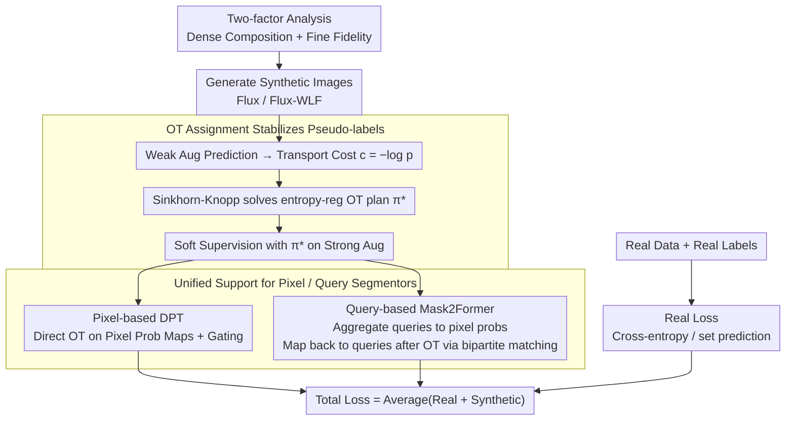

# What Makes Synthetic Data Effective in Image Segmentation

**Conference**: ICML2026  
**arXiv**: [2605.19289](https://arxiv.org/abs/2605.19289)  
**Code**: https://github.com/zhang0jhon/SENSE  
**Area**: Semantic Segmentation / Synthetic Data  
**Keywords**: Semantic Segmentation, Synthetic Data, Diffusion Models, Optimal Transport, Pseudo-labeling  

## TL;DR
This paper systematically analyzes two key factors for the effectiveness of synthetic images in semantic segmentation: dense scene composition and fine instance fidelity. It proposes SENSE, which utilizes Optimal Transport (OT) to stabilize pseudo-label assignment for synthetic images, achieving consistent improvements for DPT and Mask2Former on Cityscapes, COCO, and ADE20K.

## Background & Motivation
**Background**: Diffusion models and flow matching generative models can now synthesize high-quality images. Consequently, synthetic data is widely used in tasks like classification, detection, segmentation, and robotics. Semantic segmentation particularly relies on pixel-level annotations; since real annotations are costly and long-tail categories are difficult to collect, augmenting training sets with generative models is a natural direction.

**Limitations of Prior Work**: Many previous works prove that "synthetic data is useful," but few answer "what kind of synthetic data is useful." If the focus is solely on aesthetic quality, models may fail to learn multi-object co-occurrence and boundary details found in real scenes. If input masks from conditional models like ControlNet are directly used as labels, local semantic misalignment between generated images and conditions can lead to pseudo-label noise.

**Key Challenge**: Segmentation tasks require both global semantic context and local pixel boundaries. Synthetic data with only single objects or sparse scenes is insufficient for training models to handle complex layouts in real street and indoor scenarios. If instance edges, textures, and high-frequency details are lacking, models struggle to learn precise boundaries. Even with high image quality, label assignment must adapt to generation randomness rather than rigidly trusting the original conditions.

**Goal**: The authors first identify key factors of synthetic data effectiveness through controlled experiments, then design a model-agnostic SENSE framework that incorporates high-quality synthetic images into fixed real datasets and mitigates pseudo-label inconsistency via OT assignment.

**Key Insight**: The problem is decomposed into whether the images are suitable for segmentation and whether the label supervision is reliable. The former is analyzed via comparative experiments on sparse/dense scenes and coarse/fine instances; the latter is addressed through entropy-regularized optimal transport, treating pixel-to-category assignment as a global optimization problem rather than independent pixel-wise hard assignment.

**Core Idea**: Effective synthetic data for segmentation must simultaneously possess dense scene composition and fine instance fidelity. SENSE converts imperfect synthetic images into stable, scalable semi-supervised segmentation signals using OT.

## Method
The mechanism of SENSE is straightforward: first determine what kind of synthetic images to generate, then decide how to produce reliable supervision for them. The authors find that generative models like Flux/Flux-WLF can produce images with multiple objects, rich spatial relationships, and better boundary details; thus, they are used to generate synthetic samples for Cityscapes, COCO, and ADE20K. During training, real images use ground truth labels, while synthetic images utilize soft class probabilities predicted by the current model, which are then globally redistributed via OT to form more stable pseudo-labels.

### Overall Architecture
Input includes labeled real data $\mathcal{D}_R=\{(x_i,y_i)\}$ and unlabeled synthetic images $\mathcal{D}_S=\{\tilde{x}_i\}$. SENSE trains real and synthetic samples simultaneously within a mini-batch: real samples use standard cross-entropy or Mask2Former set prediction loss; synthetic samples undergo weak augmentation to obtain prediction probabilities used to construct a transport cost from pixels to categories. An entropy-regularized OT plan is solved via Sinkhorn-Knopp and used as soft supervision on strong augmentations. This workflow supports both pixel-based models (DPT) and query-based models (Mask2Former).

### Key Designs
**1. Two-factor Analysis: Quantifying "What Kind of Synthetic Data is Useful"**
Most prior work only proves that synthetic data works without identifying the beneficial attributes. To address this, the authors conducted controlled experiments to decompose effectiveness into two quantifiable factors. First is scene composition complexity: they constructed sparse composition (few subjects, sparse background) and dense composition (multi-object co-occurrence, rich spatial relations) splits by controlling prompts and models, using the average instance count detected by GroundingDINO as a proxy for global semantic density. Second is instance fidelity: while keeping composition statistics similar, they constructed coarse fidelity (Flux, where high-frequency textures are occasionally smoothed) and fine fidelity (Flux-WLF, which explicitly preserves sharp edges) splits, using GLCM Score and Compression Ratio to approximate local high-frequency information. To eliminate annotator bias, all synthetic images were labeled by a teacher trained only on real data. The conclusion is that dense composition and fine fidelity independently contribute to segmentation performance, turning synthetic data design into an engineering task with measurable targets.

**2. OT Assignment: Stabilizing Unreliable Pseudo-labels via Global Optimal Transport**
Even with high image quality, label supervision may remain unreliable. In conditional generation (e.g., ControlNet), local semantic misalignments occur (e.g., sidewalk regions drawn as road), making it unsafe to use conditional masks as ground truth. Standard pseudo-labeling, which independently takes the maximum probability for each pixel, often solidifies local hallucinations into incorrect supervision (confirmation bias). SENSE instead models label assignment as optimal transport: for each pixel $(h,w)$ of a synthetic image to category $j$, it constructs a cost $c_{ij}(h,w)=-\log p_\theta(j\mid \tilde{x}_i(h,w))$, solving the entropy-regularized problem $\min_{\pi}\langle \pi,c\rangle+\beta H(\pi)$ on the flattened $n\times k$ matrix. Rather than empirical margins, it uses uniform marginal priors as an implicit reweighting to mitigate long-tail bias in the synthetic distribution. This convex problem is efficiently solved via Sinkhorn-Knopp iterations to obtain $\pi^*=\mathrm{diag}(u)\,K\,\mathrm{diag}(v)$ where $K=\exp(-c/\beta)$. During training, $\pi^*$ is calculated on weak augmentations and serves as a soft label for strong augmentations, combined with confidence gating. This ensures assignment meets global category quality constraints, providing smoother, more robust supervision for noisy synthetic images.

**3. Unified Support for Pixel-based and Query-based Segmentors: Extending OT to Set Prediction**
Existing OT-based semi-supervised methods mostly apply to dense pixel classifiers. Modern segmentors (e.g., Mask2Former) use query set prediction, which has a different structure. SENSE generalizes by recognizing that query models still define a dense pixel semantic decision surface. Thus, queries can be projected back to pixel space for global assignment. For pixel-based models like DPT, the OT plan is directly calculated on pixel probability maps with a confidence threshold $\gamma=0.95$. For query-based models like Mask2Former, class-mask pairs from queries are aggregated as $p_\theta(j\mid \tilde{x}_i(h,w))=\sum_q s_q(j)\,m_q(h,w)$. After obtaining $\pi^*$ in pixel space, the revised class-mask targets are mapped back to queries via bipartite matching. This allows a single synthetic data strategy to adapt to both paradigms without increasing inference overhead.

### Loss & Training
The synthetic loss for pixel-based segmentors is a soft-label cross-entropy with confidence gating, while the real loss is standard pixel-wise cross-entropy. The total loss is their average. For query-based segmentors, the synthetic loss includes classification and mask terms; for stability, the Dice loss weight for synthetic data is set to 0, retaining only BCE-like mask supervision to prevent distorted query gradients from small incorrect regions. Training utilizes AdamW, mixed precision, EMA, and weak/strong augmentation. Batch sizes are 8 real + 8 synthetic for Cityscapes/ADE20K and 16 + 16 for COCO. Parameters include $\beta=0.05$ and confidence thresholds $\gamma, \delta = 0.95$.

## Key Experimental Results

### Main Results
| Dataset | Metric | Ours | Prev. / Real Only Baseline | Gain |
|--------|------|------|----------|------|
| Cityscapes, DPT DINOv2-S | mIoU s.s. | 80.65 | 78.11 real only | +2.54 |
| Cityscapes, Mask2Former DINOv3-L | mIoU m.s. | 84.88 | 83.29 real only | +1.59 |
| COCO, DPT DINOv2-S | mIoU m.s. | 64.96 | 63.40 real only | +1.56 |
| ADE20K, Mask2Former DINOv3-L | mIoU s.s. | 59.09 | 57.45 real only | +1.64 |
| ADE20K scalable synthetic methods | mIoU m.s. | 60.81 | SegGen 58.7 | +2.11 |
| ADE20K Swin-L fair comparison | mIoU | 58.27 | JoDiffusion 57.46 / SDS 57.23 | +0.81 / +1.04 |

### Ablation Study
| Configuration | Key Metric | Description |
|------|---------|------|
| Dense vs Sparse composition, Flux | Cityscapes 66.56 vs 61.81 mIoU | Instance count increased from 11.48 to 22.21; dense scenes are significantly more beneficial. |
| Fine vs Coarse fidelity | Cityscapes 68.17 vs 66.56 mIoU | With similar instance counts, high-frequency boundaries and texture fidelity bring an additional +1.61. |
| Synthetic scale on Cityscapes | 79.80 → 81.27 mIoU | Increasing synthetic data from 1× to 6× shows continuous improvement with diminishing returns. |
| w/o OT vs OT, Cityscapes | 79.50 → 80.65 mIoU | OT assignment provides a gain of +1.15 mIoU. |
| w/o OT vs OT, COCO / ADE20K | 62.74→63.30 / 49.62→50.23 | OT provides stable gains across all three datasets. |
| Synthetic Quality Ladder | 78.98 → 79.49 → 79.80 | Moving from sparse low-fidelity to dense high-fidelity validates the two-factor conclusions within the SENSE framework. |

### Key Findings
- Global semantic density is critical. Flux dense split (22.21 instances, 66.56 mIoU) significantly outperformed the sparse split (11.48 instances, 61.81 mIoU).
- Local instance fidelity remains effective after controlling for scene composition. Flux-WLF fine fidelity data improved mIoU from 66.56 to 68.17, showing independent contributions from boundaries and textures.
- SENSE gains are not hardware or architecture-specific: improvements are seen across DPT, Mask2Former, DINOv2-S/B, and DINOv3-L without inference overhead.
- Compared to FreeMask and SegGen, SENSE outperforms methods using 20×/50× synthetic data with only 2× volume, illustrating that "data quality + label assignment" is more important than blind scaling.

## Highlights & Insights
- The approach of answering "what data is useful" before proposing a framework is more solid than simply stacking a pipeline. Both dense composition and fine fidelity can be quantified to guide future generation and prompt strategies.
- OT assignment is the most critical technical bridge. It acknowledges the misalignment between synthetic images and conditions/pseudo-labels, replacing local max-probability with global constraints for smoother supervision.
- The extension of SENSE to query-based models is practical. While many semi-supervised methods are limited to pixel classifiers, this work enables compatibility with advanced architectures like Mask2Former.
- Scale ablations show performance can continue to grow with data volume, but the two-factor analysis suggests quantity alone is insufficient. Low-quality or low-density data may increase training costs without providing the structural variety the model needs.

## Limitations & Future Work
- Generation costs are not fully discussed. While Flux/Flux-WLF produce high quality, generating 2× synthetic data for COCO or ADE20K requires substantial compute; deployment requires balancing generation and annotation budgets.
- The evaluation primarily focuses on closed-set semantic segmentation. For open-vocabulary, panoptic, or instance segmentation, the roles of composition and fidelity may differ, requiring redesigned OT constraints.
- Synthetic images are determined by MLLM prompts and generative model distributions, which may introduce implicit biases. Over-generation of certain co-occurrences or regional scenes could affect model fairness and robustness.
- Using uniform margins in OT helps mitigate long-tail effects but might over-smooth when real category distributions are highly imbalanced. Future work could estimate category priors closer to the real dataset.

## Related Work & Insights
- **vs DatasetDM / DiffuMask**: These focus on generating images and perception annotations but have limited category coverage and scalability; SENSE emphasizes large-scale synthesis and robust assignment.
- **vs FreeMask / SegGen**: While these use massive synthetic data volumes, SENSE achieves higher ADE20K mIoU with less data, indicating that data selection and supervision quality are the real bottlenecks.
- **vs SLA / OTAMatch**: These OT semi-supervised methods are mainly for pixel-wise architectures; SENSE generalizes OT to query-based models like Mask2Former.
- **Insight**: For other dense prediction tasks (e.g., depth estimation, normal estimation), one could first diagnose task-relevant attributes of synthetic data and then use global assignment to reduce generation-label mismatches.

## Rating
- Novelty: ⭐⭐⭐⭐ Combining synthetic data with semi-supervised segmentation isn't new, but the two-factor analysis and query-based OT extension are well-integrated.
- Experimental Thoroughness: ⭐⭐⭐⭐⭐ Covers Cityscapes, COCO, ADE20K, multiple backbones, and extensive ablations on scale and OT.
- Writing Quality: ⭐⭐⭐⭐ Clear narrative with sufficient data; some generative model and appendix details require careful reading for full synthesis.
- Value: ⭐⭐⭐⭐⭐ Provides direct guidance for augmenting segmentation datasets with diffusion models: prioritize complex scenes and instance details, and utilize robust label assignment.

<!-- RELATED:START -->

## Related Papers

- [\[ICCV 2025\] LEGION: Learning to Ground and Explain for Synthetic Image Detection](../../ICCV2025/segmentation/legion_learning_to_ground_and_explain_for_synthetic_image_detection.md)
- [\[CVPR 2026\] Synthetic Object Compositions for Scalable and Accurate Learning in Detection, Segmentation, and Grounding](../../CVPR2026/segmentation/synthetic_object_compositions_for_scalable_and_accurate_learning_in_detection_se.md)
- [\[CVPR 2026\] A Mixed Diet Makes DINO An Omnivorous Vision Encoder](../../CVPR2026/segmentation/a_mixed_diet_makes_dino_an_omnivorous_vision_encoder.md)
- [\[ICCV 2025\] Learn2Synth: Learning Optimal Data Synthesis Using Hypergradients for Brain Image Segmentation](../../ICCV2025/segmentation/learn2synth_learning_optimal_data_synthesis_using_hypergradients_for_brain_image.md)
- [\[CVPR 2026\] MatchMask: Mask-Centric Generative Data Augmentation for Label-Scarce Semantic Segmentation](../../CVPR2026/segmentation/matchmask_mask-centric_generative_data_augmentation_for_label-scarce_semantic_se.md)

<!-- RELATED:END -->
