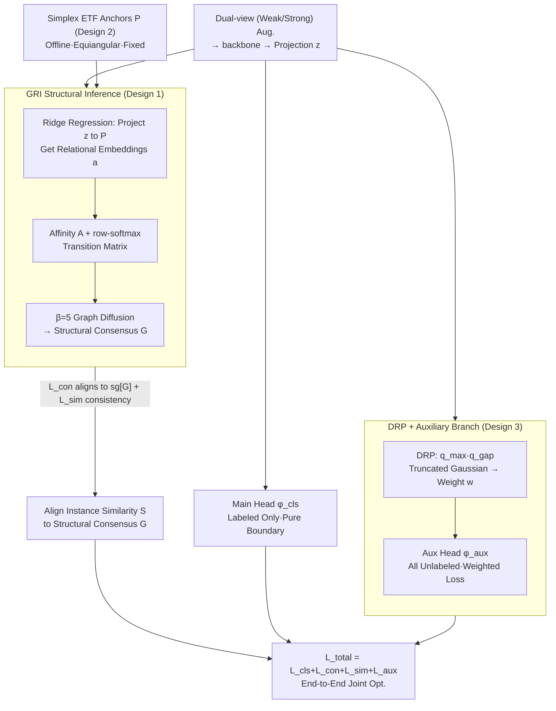

# Beyond Distribution Estimation: Simplex Anchored Structural Inference Towards Universal Semi-Supervised Learning

**Conference**: ICML 2026  
**arXiv**: [2605.07557](https://arxiv.org/abs/2605.07557)  
**Code**: https://github.com/Yaxin-ML/SAGE  
**Area**: Semi-Supervised Learning / Representation Learning  
**Keywords**: Universal Semi-Supervised Learning, Equiangular Tight Frame, Structural Inference, Pseudo-label Reliability

## TL;DR
Ours proposes SAGE, which replaces "estimating unlabeled data distributions" with "structural inference in the representation space." By combining simplex ETF geometric anchors, high-order graph propagation, and distribution-agnostic reliability weighting, SAGE achieves an average accuracy improvement of 8.52% under the UniSSL setting with extreme label scarcity and arbitrary unlabeled distributions.

## Background & Motivation
**Background**: Mainstream semi-supervised learning (SSL) follows the "FixMatch-style" paradigm—assigning high-confidence pseudo-labels to unlabeled samples followed by consistency regularization. Later, LTSSL extended this to long-tailed scenarios, and ReaLTSSL further allowed for distribution mismatch between labeled and unlabeled data.

**Limitations of Prior Work**: Methods like FreeMatch and SoftMatch **assume the unlabeled data follows a uniform distribution** by default, forcing pseudo-labels toward uniformity via distribution alignment or entropy maximization, which leads to massive false positives under real-world arbitrary distributions. "Dynamic distribution estimation" methods like CPG and SimPro fail to estimate accurately in extreme label-scarce regimes (e.g., 4 or even 1 label per class). Once pseudo-labels collapse, they trigger representation collapse (where class clusters overlap in t-SNE and silhouette coefficients plummet).

**Key Challenge**: Existing methods treat the "pseudo-label → representation" signal chain as the primary axis. However, pseudo-labels themselves are unreliable, especially under long-tail or arbitrary distributions; the more one attempts to "align the distribution," the more biased the model becomes. Through diagnostic experiments, the authors found that **relationships between samples are much more reliable than the pseudo-labels themselves**—during training, the proportion of incorrect pseudo-labels corrected back to their true categories by "neighbor relationships" rises steadily and stabilizes at a high level.

**Goal**: Under the UniSSL setting with extreme label scarcity and completely unknown unlabeled distributions, the goal is to bypass the deadlock of "estimating distribution before generating pseudo-labels" so the model can learn discriminative representations without knowing $\gamma_u$.

**Key Insight**: Shift the focus from "distribution estimation" to "representation-level structural inference." Establish a "structural consensus" as a supervisory signal using high-order relationships between samples, paired with a set of fixed geometric anchors to force maximum equiangular separation between different classes in the representation space.

**Core Idea**: Use a Simplex Equiangular Tight Frame (ETF) as a coordinate system for ridge regression to obtain relational embeddings → perform $\beta$-step graph diffusion on the relational graph to obtain a "structural consensus matrix" → use this matrix instead of pseudo-labels to align instance-wise similarities.

## Method

### Overall Architecture
SAGE adds three modules to the dual-view (weak/strong augmentation) SSL framework of FixMatch: (1) **GRI (Graph-state Relational Inference)**—projects the features $\mathbf{z}_i$ onto fixed simplex ETF anchors $\mathbf{P}$ to obtain relational embeddings $\mathbf{a}_i$, constructs an affinity matrix $\mathbf{A}$ via inner products of $\mathbf{a}_i$, and applies $\beta$-step Markov propagation to get the structural consensus $\mathbf{G}=\hat{\mathbf{P}}^\beta$ as "soft supervision" for instance-wise similarity $\mathbf{S}$; (2) **Simplex ETF Anchor Generation**—offline construction of $K=d+1$ zero-mean, unit-norm, pairwise equiangular fixed vectors as a class-agnostic coordinate system; (3) **DRP (Distribution-agnostic Reliability Prioritization) + Auxiliary Branch**—uses max-confidence and top-2 margin statistics combined with EMA to weight pseudo-labels, isolating this flow to an auxiliary head $\phi_{aux}$ while the main head $\phi_{cls}$ only sees labeled data to ensure a pure decision boundary. The final objective $\mathcal{L}_{total}=\mathcal{L}_{cls}+\mathcal{L}_{con}+\mathcal{L}_{sim}+\mathcal{L}_{aux}$ is optimized end-to-end.

### Key Designs

**1. Graph-state Relational Inference (GRI): Replacing Unreliable Pseudo-labels with High-order Relationships**

The deadlock in UniSSL lies in the "pseudo-label → representation" main chain. GRI shifts the supervisory signal to relationships. Each sample's projection $\mathbf{z}_i$ yields a closed-form relational embedding $\mathbf{a}_i=(\mathbf{z}_i\mathbf{P}^\top)(\mathbf{P}\mathbf{P}^\top+\lambda\mathbf{I})^{-1}$ via ridge regression $\min_{\mathbf{a}_i}\|\mathbf{z}_i-\mathbf{a}_i\mathbf{P}\|_2^2+\lambda\|\mathbf{a}_i\|_2^2$. The affinity matrix $\mathbf{A}_{ij}=\langle\mathbf{a}_i, \mathbf{a}_j\rangle$ is normalized via row-softmax to $\hat{\mathbf{P}}$, and $\beta=5$ diffusion steps yield the structural consensus $\mathbf{G}=\hat{\mathbf{P}}^\beta$.

The contrastive loss $\mathcal{L}_{con}=\text{BCE}(\mathbf{S}, \text{sg}[\mathbf{G}])$ aligns the current instance similarity $\mathbf{S}_{ij}=\sigma(\langle\mathbf{z}_i, \mathbf{z}_j\rangle)$ to $\mathbf{G}$, supplemented by $\mathcal{L}_{sim}$ for cross-view consistency. High-order propagation is used because multi-step diffusion aggregates scattered local relationships into a stable global consensus, providing better robustness to noise. Stop-gradient prevents structural signals from being contaminated by their own gradients.

**2. Simplex Equiangular Tight Frame Geometric Anchors: Resisting Collapse with Class-Agnostic Coordinates**

Under long-tail distributions, learnable prototypes are pulled toward majority classes, causing clusters to overlap. SAGE uses fixed anchors generated once offline to force maximum equiangular separation. The anchors are constructed using QR decomposition of a random Gaussian matrix to get orthogonal $\mathbf{Q}$. Using the $d$ non-zero eigenvectors $\mathbf{V}$ of the centering matrix $\mathbf{O}=\mathbf{I}_K-\frac{1}{K}\mathbf{1}_K\mathbf{1}_K^\top$, the anchor matrix $\mathbf{P}=\sqrt{\frac{K}{K-1}}\mathbf{V}\mathbf{Q}^\top$ is formed. It satisfies $\mathbf{P}^\top\mathbf{1}_K=\mathbf{0}$, unit norm rows, and $\mathbf{p}_i^\top\mathbf{p}_j=-\frac{1}{K-1}$, which is the maximum equiangular spacing for $K$ vectors in $\mathbb{R}^d$.

These fixed anchors provide geometric invariance independent of sample counts, decoupling representation learning from distribution priors. Since they serve as the coordinate system for GRI's ridge regression, "equiangularity" naturally transfers to the relational embedding space.

**3. Distribution-agnostic Reliability Prioritization (DRP) + Auxiliary Branch: Selecting Reliable Labels and Isolating Errors**

Without knowing the unlabeled distribution $\gamma_u$, DRP scores reliability using two distribution-agnostic statistics: $q_{max}=\max(\mathbf{q}_w)$ (absolute certainty) and $q_{gap}=q_w^{(1)}-q_w^{(2)}$ (relative discriminability). EMA means $\mu_\kappa$ and variances $\sigma_\kappa^2$ are maintained to weight samples via a truncated Gaussian kernel $\mathcal{W}(q_\kappa;\mu_\kappa,\sigma_\kappa)=\exp(-\frac{[\min(0,q_\kappa-\mu_\kappa)]^2}{2\sigma_\kappa^2})$. The final weight is $w=\mathcal{W}_{max}\cdot\mathcal{W}_{gap}$.

These metrics do not rely on class distribution assumptions. Architecturally, an auxiliary head $\phi_{aux}$ processes all unlabeled data, while the main head $\phi_{cls}$ only takes labeled samples, restricting pseudo-label gradients to $\phi_{aux}$ to prevent noise from polluting the primary decision boundary.

### Loss & Training
$\mathcal{L}_{total}=\mathcal{L}_{cls}+\mathcal{L}_{con}+\mathcal{L}_{sim}+\mathcal{L}_{aux}$. Backbone: WRN-28-2. Optimizer: SGD + 0.9 momentum + 5e-4 weight decay. Cosine LR decay from 0.03 for $2^{18}$ steps. $\lambda=0.1, \beta=5$ (fixed). Batch size: 64 labeled, $7\times64$ unlabeled. Hardware: Single RTX 4090.

## Key Experimental Results

### Main Results
Compared against 9 baselines across CIFAR-10/100, SVHN, STL-10, and Food-101 under Uniform, Long-tailed, and Arbitrary unlabeled distributions.

| Dataset / Setting | Metric | SAGE | Strongest Baseline | Gain |
|-------------------|--------|------|--------------------|------|
| CIFAR-10 Avg (9 settings) | Acc% | - | CGMatch 58.38 / CPG series | Avg **+8.52 pp** |
| CIFAR-10, $N=40, \gamma_u=150$, Arbitrary | Acc% | - | FreeMatch 45.38 / CGMatch 49.92 | Significant lead |
| SVHN $(N_{max},M_{max},\gamma_l,\gamma_u)=(4,4996,1,150)$ | Silhouette↑ | High | FreeMatch / CPG (Low) | Better separation |

Observations: (i) FreeMatch-style SSL degrades to ~50% under long-tailed/arbitrary settings. (ii) SimPro collapses in extreme label-scarce regimes ($N=40$), with accuracy near 16% (random), proving distribution estimation fails without sufficient supervision. (iii) SAGE consistently leads across all settings.

### Ablation Study
Based on the paper's results (refer to text for visual values):

| Configuration | Key Observation | Explanation |
|---------------|-----------------|-------------|
| Full SAGE | High Acc + High Silhouette | Complete model |
| w/o GRI | Performance drops to baseline | Loss of high-order relationship supervision |
| w/o Simplex ETF Anchors | Class overlap in long-tail | Geometric anchors are key to anti-collapse |
| w/o DRP + Aux Branch | Acc decreases | Noise leakage into main head |
| Pseudo-label correction rate | Monotonic increase to high level | Confirms "relationships > pseudo-labels" |

### Key Findings
- The observation "**inter-sample relationships are more reliable than pseudo-labels**" holds across all settings and serves as the foundation.
- Simplex ETF anchors significantly improve the silhouette coefficient, indicating that representation collapse in long-tail scenarios is caused by a lack of geometric priors, not just pseudo-label noise.
- Decoupling $\phi_{cls}$ and $\phi_{aux}$ is a low-cost design that effectively restricts noise gradients.
- The method is insensitive to $\lambda$ and $\beta$. $\beta=5$ is an optimal diffusion step—too few steps limit propagation, too many lead to a trivial steady-state distribution.

## Highlights & Insights
- **Paradigm Shift**: Shifting from "estimate distribution → generate pseudo-labels → learn representation" to "build geometric anchors → infer relationship graph → learn representation → back-infer pseudo-labels." Reversing the signal chain makes stable geometric structure the primary axis.
- **ETF Anchors + Relational Embedding**: Using ridge regression to interpret $\mathbf{a}_i$ as "coordinates in a geometric coordinate system" is elegant. It ensures an analytical solution without extra parameters and naturally transfers "equiangularity" to the relational space.
- **Distribution-agnostic Statistics**: The combination of $q_{max}$ and $q_{gap}$ avoids any assumptions about class distribution, making it a truly "protocol-independent" reliability measure.

## Limitations & Future Work
- When the number of classes $C$ is large, simplex ETF requires embedding dimension $d \geq C-1$, which may constrain small models or projection heads.
- High graph propagation steps $\beta$ increase computation by $|\mathbf{B}|^2$ in large batches; scaling to ImageNet might require mini-batch propagation or sampling approximations.
- The geometric anchors are fixed; exploring "task-dependent adaptive anchor generation" (e.g., via prompt-learning for multimodal SSL) is a potential future direction.

## Related Work & Insights
- **vs FreeMatch / SoftMatch**: While they rely on dynamic confidence thresholds, SAGE replaces confidence-based selection with geometric and structural supervision, offering better robustness to unknown distributions.
- **vs CPG / SimPro**: These methods explicitly/implicitly estimate unlabeled distributions and fail in extreme label-scarce regimes; SAGE bypasses estimation entirely.
- **vs Neural Collapse / DR-DSN**: Those works use ETF as a target for classifier weights; SAGE uses it as a "relational coordinate system" and "contrastive anchor," applying it earlier in the pipeline to resist noise.
- **Insight**: In any task where pseudo-labels are unreliable (Open-set SSL, learning with noisy labels, long-tail detection), the strategy of finding a more robust signal source (structure, geometry, relationships) as the dominant supervisor is highly effective.

## Rating
- Novelty: ⭐⭐⭐⭐⭐ The paradigm shift from distribution estimation to structural inference is a genuinely new perspective in ReaLTSSL literature.
- Experimental Thoroughness: ⭐⭐⭐⭐ Five datasets + various imbalance ratios + 9 baselines; missing ImageNet-scale validation.
- Writing Quality: ⭐⭐⭐⭐ Logical progression from diagnostic experiments to the final method; formulas are somewhat dense.
- Value: ⭐⭐⭐⭐ Addresses the realistic UniSSL setting with an average +8.52 pp improvement, offering direct value for real-world SSL applications.

<!-- RELATED:START -->

## Related Papers

- [\[ICML 2026\] Understanding Self-Supervised Learning via Latent Distribution Matching](understanding_self-supervised_learning_via_latent_distribution_matching.md)
- [\[ICLR 2026\] In Context Semi-Supervised Learning](../../ICLR2026/self_supervised/in_context_semi-supervised_learning.md)
- [\[ICML 2026\] InfoAtlas: A Foundation Model for Zero-Shot Statistical Dependence Estimation](infoatlas_a_foundation_model_for_zero-shot_statistical_dependence_estimate.md)
- [\[ICLR 2026\] FedOpenMatch: Towards Semi-Supervised Federated Learning in Open-Set Environments](../../ICLR2026/self_supervised/fedopenmatch_towards_semi-supervised_federated_learning_in_open-set_environments.md)
- [\[AAAI 2026\] Explanation-Preserving Augmentation for Semi-Supervised Graph Representation Learning](../../AAAI2026/self_supervised/explanation-preserving_augmentation_for_semi-supervised_graph_representation_lea.md)

<!-- RELATED:END -->
