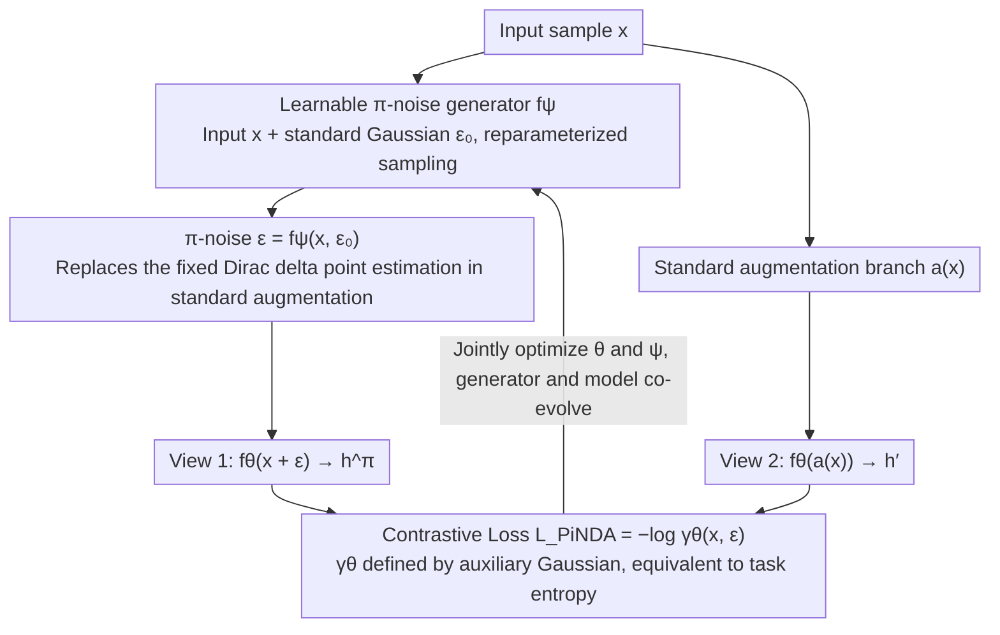

# Data Augmentation of Contrastive Learning is Estimating Positive-incentive Noise

**Conference**: ICML 2026  
**arXiv**: [2408.09929](https://arxiv.org/abs/2408.09929)  
**Code**: https://github.com/hyzhang98/PiNDA  
**Area**: Self-supervised / Contrastive Learning / Noise Learning  
**Keywords**: Positive-incentive Noise, Data Augmentation, Task Entropy, Learnable Noise Generator, Information Theory

## TL;DR
The authors prove that "predefined data augmentation (rotation/cropping/flipping)" in contrastive learning is equivalent to a point estimation of Positive-incentive Noise (π-noise). They then upgrade π-noise from "point estimation" to a learnable distribution by training a π-noise generator (PiNDA) to add learnable noise as augmentation. This leads to consistent gains for SimCLR / BYOL / SimSiam / MoCo / DINO in vision and is naturally compatible with non-visual data without manual augmentation, such as HAR / Reuters / Epsilon.

## Background & Motivation
**Background**: Self-supervised contrastive learning (SimCLR / MoCo / BYOL / DINO / CLIP) has become the mainstream for representation learning. Its core mechanism involves using InfoNCE to pull positive pairs (two augmentations of the same image) closer while pushing negatives apart. In vision, a set of strong augmentations (random cropping, color jittering, blur, grayscale, etc.) refined by over 100 papers is used. The SimCLR paper explicitly states that augmentation is the "most critical lever" for performance.

**Limitations of Prior Work**: (1) Visual augmentations rely heavily on manual design and fail or become extremely unstable when applied to graphs (random edge/node dropping) or pure vector data (HAR, text features); (2) Attempts like DACL / MODALS / SimCL try adding "random noise" to vectors, but noise hyperparameters depend on manual tuning or policy search without theoretical guidance; (3) CLAE uses adversarial perturbations to maximize loss, which is a heuristic "reverse utilization." The field lacks a unified theoretical framework for "what kind of noise is beneficial for contrastive learning."

**Key Challenge**: Contrastive learning requires "semantics-invariant" perturbations, but semantic invariance itself is unmeasurable. It is impossible to enumerate all perturbations or formalize "what makes a perturbation good," leading to a fallback on manual heuristics.

**Goal**: (1) Provide an information-theoretic explanation for "data augmentation" in contrastive learning; (2) Integrate the π-noise framework; (3) Design a learnable augmentation generator compatible with all data modalities.

**Key Insight**: The authors note that the π-noise framework defines "task-beneficial noise" $\mathcal{E}$ as noise satisfying $\text{MI}(\mathcal{T}, \mathcal{E}) > 0$. Since contrastive loss itself is a measure of "task difficulty," by mapping the contrastive loss to the definition of "task entropy $H(\mathcal{T})$" in π-noise, data augmentation can be reformulated as "a certain estimation of $\mathcal{E}$."

**Core Idea**: Define an auxiliary Gaussian distribution $p(\alpha|x) = \mathcal{N}(0, \gamma_{\theta^*}(x)^{-1})$, where $\gamma_{\theta^*}(x) = \exp(-\ell(x; \theta^*))$ is the exponentiated contrastive loss, making $H(\mathcal{T})$ correspond directly to the loss. They then prove that predefined augmentations are equivalent to treating the noise distribution $p(\varepsilon|x)$ as a Dirac delta (point estimation). Finally, they replace this point estimation with a learnable π-noise generator, resulting in PiNDA.

## Method

### Overall Architecture
PiNDA consists of two networks: (1) A contrastive model $f_\theta$ (e.g., ResNet-18 or any SimCLR/BYOL backbone), and (2) a π-noise generator $f_\psi$—generating $\varepsilon$ from standard Gaussian $\epsilon$ using the reparameterization trick $\varepsilon = f_\psi(x, \epsilon)$. During training, for each sample $x$: (a) sample $\varepsilon$ from $f_\psi$ as augmentation and calculate $h^\pi = f_\theta(x + \varepsilon)$, (b) use another standard augmentation $a(\cdot)$ to get $h' = f_\theta(a(x))$, (c) use $(h^\pi, h')$ as a positive pair to calculate the InfoNCE-style $\mathcal{L}_{\text{PiNDA}}$, updating both $\theta$ and $\psi$. PiNDA is fully compatible with existing augmentations: if a standard set $\mathcal{A}$ exists, PiNDA can be a candidate for random sampling; without $\mathcal{A}$, it degrades to "original image vs. noise-augmented image."

### Key Designs
1. **Auxiliary Gaussian Distribution → Converting Contrastive Loss to "Task Entropy"**:
    - **Function**: Provides a formal probabilistic value for "how hard the contrastive task is" and integrates it into the information-theoretic calculation of π-noise.
    - **Mechanism**: For each sample, an auxiliary variable $\alpha | x \sim \mathcal{N}(0, \gamma_{\theta^*}(x)^{-1})$ is defined, where $\gamma_{\theta^*}(x) = \ell_{\text{pos}} / (\ell_{\text{pos}} + \ell_{\text{neg}}) = \exp(-\ell(x; \theta^*))$. Smaller loss $\to$ larger $\gamma$ $\to$ smaller variance $1/\gamma$ $\to$ lower Gaussian entropy $\to$ simpler task. Task entropy $H(\mathcal{T}) = \mathbb{E}_{x \sim p(x)} H(\mathcal{N}(0, \gamma_{\theta^*}(x)^{-1}))$, with a lower bound of $H(\mathcal{N}(0, 1))$ (since $\gamma \in [0, 1]$).
    - **Design Motivation**: The original π-noise framework uses $p(y|x)$ to calculate $H(\mathcal{T})$, which is unavailable in unsupervised settings. Using contrastive loss instead makes the framework applicable to self-supervised learning. The Gaussian choice is simple and analytical, and any monotonic mapping $\kappa$ would yield similar theoretical results.

2. **Proving "Predefined Augmentation = π-noise Point Estimation"**:
    - **Function**: Provides the theoretical bridge explaining why standard SimCLR is essentially performing π-noise optimization, incorporating previous work into the framework.
    - **Mechanism**: In the Monte Carlo estimation of conditional entropy $H(\mathcal{T}|\mathcal{E})$, if $p(\varepsilon|x) = \delta_{\varepsilon_0}(\varepsilon)$ (Dirac delta, meaning a fixed predefined augmentation $\varepsilon_0$), the simplification yields $-H(\mathcal{T}|\mathcal{E}) \approx \frac{1}{n}\sum_x \log \gamma_\theta(x, \varepsilon_0) - \frac{1}{2}$. This is equivalent to maximizing $\sum \log \gamma_\theta = -\mathcal{L}_{\text{InfoNCE}}$. Thus, "maximizing $\text{MI}(\mathcal{T}, \mathcal{E})$" under point estimation degrades to "minimizing InfoNCE."
    - **Design Motivation**: This is the most crucial theoretical conclusion—it reveals that SimCLR has been implicitly performing π-noise estimation using the coarsest point estimation, which naturally limits expressivity. This provides a clear path for improvement by extending to learnable distributions.

3. **Learnable π-noise Generator + Reparameterized Training**:
    - **Function**: Upgrades the Dirac delta to a learnable distribution $p_\psi(\varepsilon | x)$, allowing the network to discover "what noise is most beneficial for the current contrastive task."
    - **Mechanism**: $f_\psi$ takes $x$ and standard Gaussian $\epsilon$ as inputs and outputs parameterized noise $\varepsilon = f_\psi(x, \epsilon)$. In experiments, the authors used a Gaussian with mean=0 and learned variance $\Sigma$ (also tested non-zero mean and uniform). Gradients are backpropagated to $\psi$ via the reparameterization trick. The Monte Carlo estimated PiNDA loss $\mathcal{L}_{\text{PiNDA}} = -\frac{1}{n}\sum_x \mathbb{E}_{\epsilon} \log \gamma_\theta(x, \varepsilon)$ shares the same form as InfoNCE, but with learnable $\varepsilon$.
    - **Design Motivation**: To let the generator and contrastive model co-evolve: as the model becomes challenged, the generator learns more difficult $\varepsilon$; as the model strengthens, the generator becomes more refined. Visualization in STL-10 (Figure 1) shows learned $\Sigma$ exhibiting "style transfer" textures, indicating the generator spontaneously learns perturbations similar to traditional visual augmentations.

### Loss & Training
$\mathcal{L}_{\text{PiNDA}} = -\frac{1}{n}\sum_x \mathbb{E}_{\epsilon \sim p(\epsilon)} \log \frac{\ell_{\text{pos}}(x, \varepsilon; \theta)}{\ell_{\text{pos}}(x, \varepsilon; \theta) + \ell_{\text{neg}}(x, \varepsilon; \theta)}$. Algorithm 1 describes the single PiNDA augmentation scenario, while Algorithm 2 describes mixing PiNDA with standard SimCLR augmentations (PiNDA acts as a candidate in $\mathcal{A}$, backpropagating gradients to $\psi$ only when sampled). For non-visual data, a 3-layer MLP is used; for vision, ResNet-18/50 are used.

## Key Experimental Results

### Main Results
Representations are evaluated using kNN and Softmax Regression (SR) on 4 non-visual and 5 visual datasets.

| Dataset | Method | kNN Acc | SR Acc |
|--------|------|---------|--------|
| HAR (Sensors) | Random Noise | 77.76 | 77.62 |
| HAR | SimCL | 61.12 | 63.92 |
| HAR | **PiNDA (μ=0)** | 77.14 | **86.20** |
| HAR | CLAE (Adversarial) | 85.71 | 90.80 |
| HAR | **PiNDA + CLAE** | **86.34** | **91.10** |
| Reuters | Random Noise | 82.84 | 77.30 |
| Reuters | SimCL | 64.20 | 73.63 |
| Reuters | **PiNDA (μ≠0)** | **86.37** | 82.50 |
| Epsilon | SimCL | 50.90 | 59.49 |
| Epsilon | **PiNDA (μ=0)** | **53.20** | **61.53** |
| MSLR-WEB30K | SimCL | 64.21 | 47.13 |
| MSLR-WEB30K | **PiNDA (μ=0)** | **69.62** | 49.55 |
| MSLR-WEB30K | PiNDA + CLAE | 68.66 | 52.18 |

PiNDA outperforms SimCL (random noise baseline) and Random Noise on all 4 non-visual datasets. On HAR, SR Acc increases from 77.62 to 86.20 (+8.6); on Reuters, kNN increases from 82.84 to 86.37 (+3.5); on MSLR, kNN increases from 64.21 to 69.62 (+5.4). Combined with CLAE, performance further improves in most cases, proving PiNDA is orthogonal to other augmentations.

### Ablation Study

| Configuration | CIFAR-10 / 100 | Description |
|------|----------------|------|
| Full PiNDA (μ=0, learn Σ) | Gain | Main configuration, only learning variance |
| PiNDA (μ≠0, learn μ and Σ) | Similar | Learning mean offers more distinct visualization |
| PiNDA (uniform) | Weak Gain | Performance is relatively insensitive to noise distribution |
| Random Noise (Fixed) | No Gain / Drop | SimCL baseline, verifies "learnability" is key |
| Without PiNDA (Pure SimCLR) | Baseline | Base performance |

### Key Findings
- PiNDA provides the largest contribution on non-visual data (due to lack of manual augmentations), with gains of +8.6 on HAR and +5.4 on MSLR. On visual data (CIFAR / STL-10), gains are smaller but consistently positive, as standard visual augmentations are already close to the "optimal point estimate" of π-noise.
- Visualizing learned $\Sigma$ on STL-10 shows "style transfer" style color masks. The augmented images look like variations in color and style, implying the generator learns perturbation patterns close to manual vision augmentations.
- $\mu = 0$ (learning $\Sigma$ only) and $\mu \neq 0$ (learning mean and variance) have similar performance, though the former is more visually intuitive. Uniform distributions also yield gains, suggesting that "learnability" is more important than the specific distribution choice.
- PiNDA is almost always complementary to CLAE (adversarial augmentation). While CLAE is a "heuristic π-noise" (maximizing loss), PiNDA is a "principled π-noise," making them mutually beneficial.

## Highlights & Insights
- **Elegant Theoretical Bridge**: The reduction "predefined augmentation = π-noise point estimation" provides an information-theoretic explanation for most SimCLR/BYOL literature and naturally points toward "upgrading to distributions." This dual-track "theory-engineering" approach is highly commendable.
- **Auxiliary Gaussian Design**: Using $\gamma_{\theta^*}^{-1}$ as variance links contrastive loss to entropy naturally. This "transforming loss into probability density parameters" trick can be generalized to any scenario where loss measures task difficulty (e.g., RL value, distillation gaps).
- **Modality Agnostic**: $f_\psi$ does not assume input data shape; it works on vectors, images, and theoretically graphs. This is a major selling point given that graph and time-series contrastive augmentations are often unstable.
- **Orthogonality**: Designing PiNDA as a "candidate in $\mathcal{A}$" rather than a replacement makes it easy to embed into existing training pipelines with almost zero migration cost.

## Limitations & Future Work
- The authors acknowledge smaller improvements on vision data because manual augmentations are already near-optimal π-noise. The real value is non-visual data, though non-visual backbones were limited to 3-layer MLPs without testing GNNs/Transformers for graph or sequence data.
- $f_\psi$ operates on the pixel space; for high-resolution images, the parameter count for independent variances explodes (e.g., $\approx 150K$ for ImageNet). The paper lacks a discussion on $f_\psi$ architectural design for efficiency.
- Training cost increases: each step requires an extra $f_\psi$ pass, reparameterization, and joint backpropagation. Specific training time/throughput comparisons are missing.
- The assumption that $\gamma_{\theta^*}$ uses the optimal $\theta^*$ is idealized; in practice, the current $\theta$ is used. If $\theta$ is poor in early training, the resulting noise may be ineffective, and stability analysis for early training is missing.

## Related Work & Insights
- **vs. SimCL / DACL / MODALS (Heuristic noise/mixup)**: These treat noise as hyperparameters or use policy search, whereas PiNDA learns via gradients. PiNDA's win on HAR/MSLR validates "gradient learning > policy search" for augmentations.
- **vs. CLAE (Adversarial augmentation)**: CLAE uses a loss maximization heuristic ("reverse π-noise"). PiNDA learns perturbations that "just enough" reduce task difficulty, complementing CLAE.
- **vs. SimCLR / BYOL (Manual augmentation)**: Ours proves they are special cases (Dirac delta point estimation). PiNDA excels in non-visual modalities where manual rules are missing.
- **vs. VPN / PiNI (Supervised π-noise)**: Shares the framework; while VPN/PiNI use labels for $H(\mathcal{T})$, PiNDA uses contrastive loss, making the π-noise framework applicable to unsupervised scenarios.

## Rating
- **Novelty**: ⭐⭐⭐⭐ The induction of "predefined augmentation = π-noise point estimation" is a clear and original theory. Learnable augmentation ideas exist, but this is the first principled framework.
- **Experimental Thoroughness**: ⭐⭐⭐ Covers 10 datasets across modalities with visualizations, but backbones are simple (MLP/ResNet-18) and cost/stability analyses are absent.
- **Writing Quality**: ⭐⭐⭐⭐ Logical theoretical derivation (Eq. 6 $\to$ 17) and intuitive visualizations. Some formula formatting is slightly dense.
- **Value**: ⭐⭐⭐⭐ Provides a principled framework for CL augmentation. High practical value for non-visual self-supervised learning and a significant extension of the π-noise framework.

<!-- RELATED:START -->

## Related Papers

- [\[NeurIPS 2025\] Hybrid Autoencoders for Tabular Data: Leveraging Model-Based Augmentation in Low-Label Settings](../../NeurIPS2025/self_supervised/hybrid_autoencoders_for_tabular_data_leveraging_model-based_augmentation_in_low-.md)
- [\[CVPR 2026\] Temporal Imbalance of Positive and Negative Supervision in Class-Incremental Learning](../../CVPR2026/self_supervised/temporal_imbalance_of_positive_and_negative_supervision_in_class-incremental_lea.md)
- [\[ICML 2026\] Statistical Consistency and Generalization of Contrastive Representation Learning](statistical_consistency_and_generalization_of_contrastive_representation_learnin.md)
- [\[ICML 2026\] Towards One-for-All Anomaly Detection for Tabular Data](towards_one-for-all_anomaly_detection_for_tabular_data.md)
- [\[AAAI 2026\] Explanation-Preserving Augmentation for Semi-Supervised Graph Representation Learning](../../AAAI2026/self_supervised/explanation-preserving_augmentation_for_semi-supervised_graph_representation_lea.md)

<!-- RELATED:END -->
