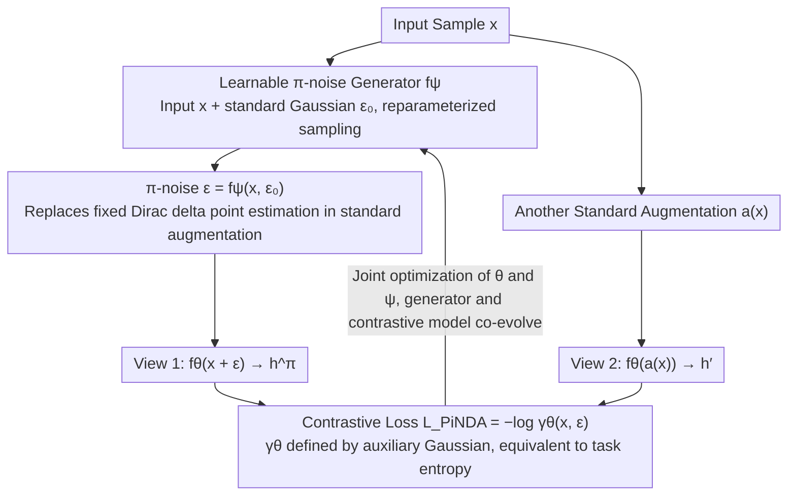

# Data Augmentation of Contrastive Learning is Estimating Positive-incentive Noise

**Conference**: ICML 2026  
**arXiv**: [2408.09929](https://arxiv.org/abs/2408.09929)  
**Code**: https://github.com/hyzhang98/PiNDA  
**Area**: Self-supervised / Contrastive Learning / Noise Learning  
**Keywords**: Positive-incentive Noise, Data Augmentation, Task Entropy, Learnable Noise Generator, Information Theory

## TL;DR
The authors prove that "predefined data augmentation (rotation/cropping/flipping)" in contrastive learning is equivalent to a point estimation of Positive-incentive Noise ($\pi$-noise). They then upgrade $\pi$-noise from a "point estimation" to a learnable distribution, training a $\pi$-noise generator (PiNDA) to add learnable noise to original images as augmentation. This leads to stable performance gains for SimCLR / BYOL / SimSiam / MoCo / DINO in vision and naturally adapts to non-visual data without manual augmentation, such as HAR / Reuters / Epsilon.

## Background & Motivation
**Background**: Self-supervised contrastive learning (SimCLR / MoCo / BYOL / DINO / CLIP) is a mainstream paradigm for representation learning. Its core mechanism involves pulling positive pairs (two augmentations of the same image) closer while pushing negatives apart using InfoNCE. In vision, a set of strong augmentations (random cropping, color jittering, blur, grayscale, etc.) has been refined through 100+ papers, and the SimCLR paper explicitly states that augmentation is the "most critical lever" for performance.

**Limitations of Prior Work**: (1) Visual augmentations rely heavily on manual design and fail or become unstable when transferred to graphs (random edge/node dropping) or vector data (HAR, text features); (2) Methods like DACL / MODALS / SimCL attempt to add "random noise" as augmentation on vectors, but noise hyperparameters rely on manual tuning or policy search without theoretical guidance; (3) CLAE uses adversarial perturbations to maximize loss, which is a heuristic "reverse utilization." The field lacks a unified theoretical framework for "what kind of noise is beneficial for contrastive learning."

**Key Challenge**: Contrastive learning requires augmentations that maintain "semantic invariance," but semantic invariance itself is unmeasurable. It is impossible to enumerate all possible perturbations or formalize "what constitutes a good perturbation," forcing a retreat to manual/heuristic methods.

**Goal**: (1) Provide an information-theoretic explanation for "data augmentation" in contrastive learning; (2) Graft the $\pi$-noise framework onto it; (3) Design a learnable augmentation generator compatible with all data modalities.

**Key Insight**: The authors note that the $\pi$-noise framework defines "task-beneficial noise" $\mathcal{E}$ as noise satisfying $\text{MI}(\mathcal{T}, \mathcal{E}) > 0$; meanwhile, the contrastive loss inherently serves as a "task difficulty metric." If the contrastive loss can be grafted onto the definition of "task entropy $H(\mathcal{T})$" in the $\pi$-noise framework, data augmentation can be reformulated as "a certain estimation of $\mathcal{E}$."

**Core Idea**: Define an auxiliary Gaussian distribution $p(\alpha|x) = \mathcal{N}(0, \gamma_{\theta^*}(x)^{-1})$, where $\gamma_{\theta^*}(x) = \exp(-\ell(x; \theta^*))$ is the exponentiated contrastive loss, making $H(\mathcal{T})$ correspond one-to-one with the contrastive loss. Then, prove that predefined augmentation is equivalent to treating the noise distribution $p(\varepsilon|x)$ as a Dirac delta (i.e., point estimation). Finally, replace the point estimation with a learnable $\pi$-noise generator to obtain PiNDA.

## Method

### Overall Architecture
PiNDA consists of two networks: (1) a contrastive model $f_\theta$ (e.g., ResNet-18, any SimCLR/BYOL backbone), and (2) a $\pi$-noise generator $f_\psi$ — which uses the reparameterization trick $\varepsilon = f_\psi(x, \epsilon)$ to generate $\varepsilon$ from a standard Gaussian $\epsilon$. During training, for each sample $x$: (a) $\varepsilon$ is sampled from $f_\psi$ as augmentation to calculate $h^\pi = f_\theta(x + \varepsilon)$; (b) another standard augmentation $a(\cdot)$ yields $h' = f_\theta(a(x))$; (c) $(h^\pi, h')$ are used as a positive pair to calculate the InfoNCE-style $\mathcal{L}_{\text{PiNDA}}$, updating both $\theta$ and $\psi$ simultaneously. PiNDA is fully compatible with existing augmentations: if a standard $\mathcal{A}$ exists, PiNDA can be treated as a candidate for random sampling within $\mathcal{A}$; without $\mathcal{A}$, it simplifies to "original vs. noise-augmented."

### Key Designs
1. **Auxiliary Gaussian Distribution $\rightarrow$ Converting Contrastive Loss to "Task Entropy"**:
    - **Function**: Provides a formal probabilistic quantity for "how difficult the contrastive task is," integrating it into the information-theoretic calculations of the $\pi$-noise framework.
    - **Mechanism**: For each sample, an auxiliary variable $\alpha | x \sim \mathcal{N}(0, \gamma_{\theta^*}(x)^{-1})$ is defined, where $\gamma_{\theta^*}(x) = \ell_{\text{pos}} / (\ell_{\text{pos}} + \ell_{\text{neg}}) = \exp(-\ell(x; \theta^*))$. Smaller loss $\rightarrow$ larger $\gamma$ $\rightarrow$ smaller variance $1/\gamma$ $\rightarrow$ smaller Gaussian entropy $\rightarrow$ simpler task. Task entropy $H(\mathcal{T}) = \mathbb{E}_{x \sim p(x)} H(\mathcal{N}(0, \gamma_{\theta^*}(x)^{-1}))$, lower-bounded by $H(\mathcal{N}(0, 1))$ (since $\gamma \in [0, 1]$).
    - **Design Motivation**: The original $\pi$-noise framework uses $p(y|x)$ to calculate $H(\mathcal{T})$, which is unavailable in unsupervised settings. Using contrastive loss instead makes the framework applicable to self-supervised learning. The Gaussian choice is simple and analytical; any monotonic mapping $\kappa$ would suffice without affecting theoretical results.

2. **Proof that "Predefined Augmentation = $\pi$-noise Point Estimation"**:
    - **Function**: Provides a theoretical bridge explaining why standard SimCLR is actually doing $\pi$-noise optimization, incorporating prior work into this framework.
    - **Mechanism**: In the Monte Carlo estimation of conditional entropy $H(\mathcal{T}|\mathcal{E})$, if $p(\varepsilon|x) = \delta_{\varepsilon_0}(\varepsilon)$ (Dirac delta, i.e., a fixed predefined augmentation $\varepsilon_0$), it simplifies to $-H(\mathcal{T}|\mathcal{E}) \approx \frac{1}{n}\sum_x \log \gamma_\theta(x, \varepsilon_0) - \frac{1}{2}$. This is equivalent to maximizing $\sum \log \gamma_\theta = -\mathcal{L}_{\text{InfoNCE}}$ — meaning "maximizing $\text{MI}( \mathcal{T}, \mathcal{E})$" degrades to "minimizing InfoNCE" under point estimation.
    - **Design Motivation**: This is the most crucial theoretical conclusion of the paper — it reveals that SimCLR has implicitly been performing $\pi$-noise estimation all along, but using Dirac delta, the coarsest point estimation, which limits expressivity. This provides a natural direction for improvement by extending to learnable distributions.

3. **Learnable $\pi$-noise Generator + Reparameterization Training**:
    - **Function**: Upgrades the Dirac delta to a learnable distribution $p_\psi(\varepsilon | x)$, allowing the network to discover "which noise is most beneficial for the current contrastive task."
    - **Mechanism**: $f_\psi$ takes $x$ and standard Gaussian $\epsilon$ as input and outputs parameterized noise $\varepsilon = f_\psi(x, \epsilon)$. Gradient backpropagation to $\psi$ is enabled via the reparameterization trick. The Monte Carlo estimated PiNDA loss $\mathcal{L}_{\text{PiNDA}} = -\frac{1}{n}\sum_x \mathbb{E}_{\epsilon} \log \gamma_\theta(x, \varepsilon)$ shares the same form as InfoNCE, but $\varepsilon$ is learnable. Both networks $\theta, \psi$ are optimized jointly and end-to-end.
    - **Design Motivation**: Allows the generator and contrastive model to co-evolve: as the model becomes more difficult, the generator learns more challenging $\varepsilon$; as the model strengthens, the generator becomes more refined. Visualization in Figure 1 shows the learned $\Sigma$ on STL-10 exhibits "style transfer-like" textures, indicating that the generator spontaneously learns perturbations similar to traditional vision augmentations.

### Loss & Training
$\mathcal{L}_{\text{PiNDA}} = -\frac{1}{n}\sum_x \mathbb{E}_{\epsilon \sim p(\epsilon)} \log \frac{\ell_{\text{pos}}(x, \varepsilon; \theta)}{\ell_{\text{pos}}(x, \varepsilon; \theta) + \ell_{\text{neg}}(x, \varepsilon; \theta)}$. Algorithm 1 describes the standalone PiNDA augmentation scenario, while Algorithm 2 describes mixing with SimCLR standard augmentations (PiNDA as a candidate in $\mathcal{A}$). For non-visual data, the backbone is a 3-layer MLP (hidden 1024, embed 256); for vision, ResNet-18 / ResNet-50 are used.

## Key Experimental Results

### Main Results
Evaluation of representation quality on 4 non-visual and 5 visual datasets using kNN and Softmax Regression (SR).

| Dataset | Method | kNN Acc | SR Acc |
|---------|--------|---------|--------|
| HAR (Sensor) | Random Noise | 77.76 | 77.62 |
| HAR | SimCL | 61.12 | 63.92 |
| HAR | **PiNDA (μ=0)** | 77.14 | **86.20** |
| HAR | CLAE (Adversarial) | 85.71 | 90.80 |
| HAR | **PiNDA + CLAE** | **86.34** | **91.10** |
| Reuters | Random Noise | 82.84 | 77.30 |
| Reuters | SimCL | 64.20 | 73.63 |
| Reuters | **PiNDA (μ≠0)** | **86.37** | 82.50 |
| Epsilon | SimCL | 50.90 | 59.49 |
| Epsilon | **PiNDA (μ=0)** | **53.20** | **61.53** |
| MSLR-WEB30K | SimCL | 64.21 | 47.13 |
| MSLR-WEB30K | **PiNDA (μ=0)** | **69.62** | 49.55 |
| MSLR-WEB30K | PiNDA + CLAE | 68.66 | 52.18 |

Ours (PiNDA) consistently outperforms SimCL (random noise baseline) and Random Noise across all 4 non-visual datasets. On HAR, SR Acc improved from 77.62 $\rightarrow$ 86.20 (+8.6); on Reuters, kNN improved from 82.84 $\rightarrow$ 86.37 (+3.5); on MSLR, kNN improved from 64.21 $\rightarrow$ 69.62 (+5.4). Stacking with CLAE further improved results in most cases, proving PiNDA is orthogonal to other augmentations.

### Ablation Study

| Configuration | CIFAR-10 / 100 | Description |
|---------------|----------------|-------------|
| Full PiNDA (μ=0, learn Σ) | Gain | Main config, learns variance only |
| PiNDA (μ≠0, learn μ and Σ) | Similar | Learning mean brings clearer visualization |
| PiNDA (uniform) | Weak Gain | Choice of noise distribution is less sensitive |
| Random Noise (Fixed) | No Gain / Loss | SimCL baseline, verifies "learnability" is key |
| Without PiNDA (SimCLR) | Baseline | Base |

### Key Findings
- PiNDA provides the largest contribution on non-visual data (due to lack of manual augmentation), with +8.6 on HAR and +5.4 on MSLR. On visual data, the contribution is smaller but consistently positive (CIFAR / STL-10), as strong manual vision augmentations are already close to the "optimal point estimate" of $\pi$-noise.
- Visualization of learned $\Sigma$ on STL-10 shows color masks in a "style transfer" style; adding these to original images results in variations in color and style, indicating the generator spontaneously learns perturbation patterns similar to visual augmentations.
- Performance is similar for $\mu = 0$ (learned $\Sigma$ only) and $\mu \neq 0$ (learned both), but the former is more visually intuitive. Uniform distributions also yield gains, implying that "learnability" itself is more critical than the specific distribution choice.
- Stacking with CLAE (adversarial augmentation) almost always yields further gains, as CLAE is "heuristic $\pi$-noise" (maximize loss) while PiNDA is "principled $\pi$-noise," making them complementary.

## Highlights & Insights
- **Elegant Theoretical Bridge**: The reduction "predefined augmentation = $\pi$-noise Dirac delta point estimation" provides an information-theoretic explanation for the entire SimCLR/BYOL literature and naturally points toward "upgrading to distributions."
- **Auxiliary Gaussian Design**: Using $\gamma_{\theta^*}^{-1}$ as variance links contrastive loss with entropy naturally. This trick of "turning loss into probability density parameters" can be generalized to any scenario measuring task difficulty with loss (e.g., RL values, teacher-student gaps in distillation).
- **Modality Agnostic**: $f_\psi$ does not assume input data shape, making it applicable to vectors, images, and theoretically graphs. This is a practical selling point given that augmentations for graph and time series contrastive learning are often unstable.
- **Orthogonality**: Designing PiNDA as a "candidate for $\mathcal{A}$" makes it extremely easy to embed into existing training pipelines with nearly zero migration cost.

## Limitations & Future Work
- The performance gain on vision data is relatively small because manual augmentations are already close to "optimal $\pi$-noise"; the real value lies in non-visual data, though the paper only uses 3-layer MLPs for these backbones and lacks validation on GNNs or Transformers for graph/text data.
- $f_\psi$ operates on the original pixel space to learn variance, which leads to parameter explosion on high-resolution images (e.g., ImageNet 224x224x3 $\approx$ 150K independent variances). The paper lacks discussion on the parameterized design of $f_\psi$ for such cases.
- Increased training cost: Each step requires an extra pass through $f_\psi$ + reparameterization + joint backpropagation; training time/throughput comparisons are missing.
- The assumption that "$\gamma_{\theta^*}$ is defined by optimal $\theta^*$" is idealized; in practice, the current $\theta$ is used. Early in training, noisy $\gamma_\theta$ might cause $f_\psi$ to learn invalid noise.
- The choice of auxiliary Gaussian for the "task entropy" definition was specific; systematic comparisons of different choices were not performed.

## Related Work & Insights
- **vs SimCL / DACL / MODALS (Heuristic noise/mixup)**: These treat noise as a hyperparameter or use policy search; PiNDA learns it directly via gradients. PiNDA outperforms them on HAR/MSLR, validating that "gradient learning > policy search" for augmentation.
- **vs CLAE (Adversarial augmentation)**: CLAE uses loss maximization heuristics (the "hardest" perturbation); PiNDA learns perturbations that "just enough" reduce task difficulty. They are complementary and stackable.
- **vs SimCLR / BYOL (Manual augmentation)**: Ours proves they are special cases (Dirac delta). Small gains in vision suggest manual augmentations are near-optimal, but PiNDA creates a significant gap in non-visual modalities.
- **vs VPN / PiNI ($\pi$-noise in supervised settings)**: Same framework; PiNI/VPN use labels for $H(\mathcal{T})$, while PiNDA uses contrastive loss, making it more widely applicable (unsupervised).

## Rating
- Novelty: ⭐⭐⭐⭐ The induction that "predefined augmentation = $\pi$-noise point estimation" is a clear and original theory. Learnable augmentation ideas exist, but this is the first principled framework.
- Experimental Thoroughness: ⭐⭐⭐ Multiple datasets and baselines with visualizations, but backbones are simple (3-layer MLP / ResNet-18); lack of training cost and stability analysis.
- Writing Quality: ⭐⭐⭐⭐ Theoretical derivations are clear and rigorous; visualizations are intuitive. Some formula typesetting is slightly cluttered.
- Value: ⭐⭐⭐⭐ Provides a principled framework for contrastive data augmentation; high practical value for non-visual modalities (vector/tabular/time-series).

<!-- RELATED:START -->

## Related Papers

- [\[CVPR 2026\] Global-Graph Guided and Local-Graph Weighted Contrastive Learning for Unified Clustering on Incomplete and Noise Multi-View Data](../../CVPR2026/self_supervised/global-graph_guided_and_local-graph_weighted_contrastive_learning_for_unified_cl.md)
- [\[NeurIPS 2025\] Hybrid Autoencoders for Tabular Data: Leveraging Model-Based Augmentation in Low-Label Settings](../../NeurIPS2025/self_supervised/hybrid_autoencoders_for_tabular_data_leveraging_model-based_augmentation_in_low-.md)
- [\[ICML 2026\] Statistical Consistency and Generalization of Contrastive Representation Learning](statistical_consistency_and_generalization_of_contrastive_representation_learnin.md)
- [\[CVPR 2026\] Temporal Imbalance of Positive and Negative Supervision in Class-Incremental Learning](../../CVPR2026/self_supervised/temporal_imbalance_of_positive_and_negative_supervision_in_class-incremental_lea.md)
- [\[ICML 2026\] Inconsistency-Aware Minimization: Improving Generalization with Unlabeled Data](inconsistency-aware_minimization_improving_generalization_with_unlabeled_data.md)

<!-- RELATED:END -->
