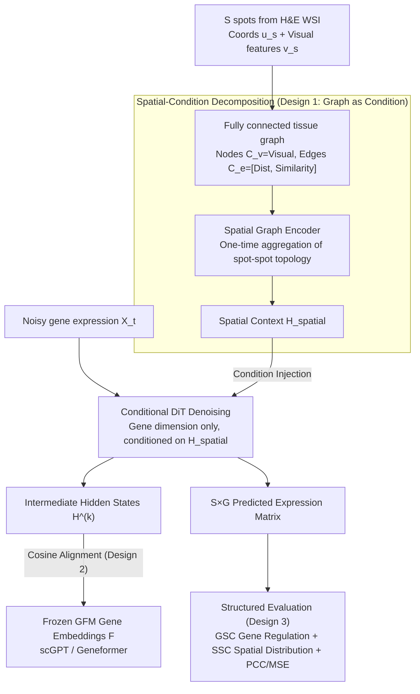

# FLAG: Foundation Model Representation with Latent Diffusion Alignment via Graph for Spatial Gene Expression Prediction

**Conference**: ICML 2026  
**arXiv**: [2605.18055](https://arxiv.org/abs/2605.18055)  
**Code**: https://github.com/darkflash03/FLAG  
**Area**: Medical Imaging / Spatial Transcriptomics / Diffusion Models  
**Keywords**: Spatial Transcriptomics, Pathological H&E, Latent Diffusion, Graph Encoder, Gene Foundation Model Alignment

## TL;DR
FLAG reformulates the prediction of spatial gene expression from H&E pathology images as a structured distribution generation problem. It employs a fixed spatial graph encoder to compress tissue topology into conditional vectors, uses a DiT for denoising in the gene dimension, and injects gene-gene regulatory priors through intermediate layer alignment with Gene Foundation Models (GFMs). This approach elevates Gene Structural Correlation (GSC) and Spatial Structural Correlation (SSC) to new heights while maintaining competitive PCC/MSE performance.

## Background & Motivation

**Background**: Spatial Transcriptomics (ST) sequencing is expensive and has low throughput, whereas H&E whole-slide images (WSI) are readily available in clinical settings. Predicting gene expression for each spot from H&E images has thus become a prominent research direction. Prevailing methods treat this as a gene-wise scalar regression task: HisToGene, BLEEP, and TRIPLEX directly minimize MSE, while Stem and STFlow use diffusion or flow-matching to generate along the gene dimension.

**Limitations of Prior Work**: All these methods rely on point-wise metrics like PCC or MSE for evaluation, completely ignoring two types of structural properties crucial for downstream pathway analysis and tissue domain identification: gene-gene regulatory networks and gene-spatial distributions (Moran's I). Consequently, while point-wise metrics appear satisfactory, the generated expression maps lack coherent internal structures—appearing either oversmoothed or lacking synergy between genes.

**Key Challenge**: There is a fundamental conflict between modeling the task as "independent scalar regression" and the goal of "recovering a complete multivariate distribution." The mapping from tissue to expression is inherently a one-to-many stochastic mapping, and regression averages out this variance. A natural fix would be graph-diffusion, treating spots as nodes and correlations as edges for joint diffusion. However, the authors empirically discovered a fatal **Gene Dimension Curse**: as the number of genes $G$ increases from 50 to 800, the PCC of joint node-edge diffusion collapses from $>0.8$ to nearly 0, failing far faster than node-only diffusion.

**Goal**: (1) Explain why joint diffusion inevitably collapses under high-dimensional gene settings; (2) Design a generative framework that respects spot-spot topology and gene-gene regulation while scaling to 200/800 genes; (3) Propose evaluation metrics that reflect biological structure rather than just point-wise accuracy.

**Key Insight**: The authors observe that as $G$ increases, empirical estimates of correlations between spots concentrate rapidly around population values. This causes the "node-edge consistency manifold" $\{(\mathbf{X}, \mathbf{A}) : \mathbf{A} = \mathrm{corr}(\mathbf{X})\}$ to become extremely thin. Fitting the score field on this manifold requires near-singular gradient magnitudes, exceeding the capacity of finite-width networks. Thus, the problem lies not in the network architecture but in the modeling choice of treating high-dimensional correlation matrices as diffusion targets.

**Core Idea**: Instead of treating the graph as a generation target, use it as a spatial encoder. A graph encoder with fixed topology compresses spot-spot relationships into a spatial context $\mathbf{H}_{\text{spatial}}$, allowing the DiT to focus solely on denoising in the gene dimension. Furthermore, representation alignment with pretrained GFM gene embeddings is used to transfer gene-gene priors from massive external single-cell datasets.

## Method

### Overall Architecture
Input: $S$ spots from an H&E WSI, where each spot has 2D coordinates $u_s$, visual features $v_s$ extracted from a pathology foundation model, and a target gene expression vector $x_s \in \mathbb{R}^G$. The pipeline consists of two relatively independent branches:

- **Left Branch (Deterministic, One-time Encoding)**: Constructs a fully connected graph of all spots. Node conditions $\mathbf{C}_v$ are visual features, and edge conditions $\mathbf{C}_e = [d_{ij}, s_{ij}]$ concatenate physical distance and visual similarity. The graph encoder outputs a spatial context vector for each spot: $\mathbf{H}_{\text{spatial}} = \mathrm{GraphEncoder}(\mathbf{C}_v, \mathbf{C}_e)$.
- **Right Branch (Generative, Iterative Denoising)**: Performs DiT diffusion in the gene dimension conditioned on $\mathbf{H}_{\text{spatial}}$: $\hat{\epsilon} = \epsilon_\theta(\mathbf{X}_t \mid \mathbf{H}_{\text{spatial}}, t)$. Hidden states $\mathbf{H}^{(k)} \in \mathbb{R}^{B \times G \times d_h}$ are extracted from specific DiT blocks and aligned with per-gene embeddings $\mathbf{F} \in \mathbb{R}^{G \times d_e}$ pre-extracted from Geneformer or scGPT via cosine similarity.

After denoising, the $S \times G$ predicted expression matrix is used to calculate PCC/MSE as well as GSC/SSC.

### Key Designs

**1. From Joint Node-Edge Diffusion to Spatial-Condition Decomposition: Graph as a Condition Signal**

The most intuitive fix is graph-diffusion—diffusing spots as nodes and correlations as edges together. The authors initially tested this motivating scheme: diffusing nodes $\mathbf{X}$ and latent edges $\mathbf{A} = \mathrm{corr}(\mathbf{X})$ simultaneously, using Edge-Modulated Attention to modulate attention scores via structural gating and bias, plus a consistency loss $\mathcal{L}_{\text{cons}} = \mathbb{E}_t\|\hat{\mathbf{A}}_0 - \mathrm{Corr}(\hat{\mathbf{X}}_0)\|_1$. At $G=50$, using Oracle edges significantly boosted PCC, proving functional topology has value.

However, formal analysis yields a lower bound $\mathcal{L}^*_{\text{joint}}(G) - \mathcal{L}^*_{\text{node}} \ge \Omega(G)$, indicating an unavoidable optimization penalty that scales linearly with the number of genes—the root of the Gene Dimension Curse. FLAG's strategy is to reverse the graph's role: instead of a generation target, it serves as a spatial encoder. The fixed topology aggregates spot-spot relationships into spatial context $\mathbf{H}_{\text{spatial}}$. This decomposes the high-dimensional joint distribution into $p(\mathbf{X} \mid \mathbf{H}_{\text{spatial}})$, where spatial structure is absorbed by the graph encoder, and the diffusion model focuses on the gene-gene distribution, preserving spatial regularization while avoiding the curvature explosion of correlation matrices.

**2. Gene Foundation Model Representation Alignment: Injecting External Single-cell Priors**

ST slide data is limited in volume and gene coverage, making it difficult to accurately estimate gene-gene covariance from a few thousand spots. FLAG compensates by leveraging GFMs like scGPT or Geneformer, trained on tens of millions of single-cell entries. Per-gene embeddings $\mathbf{F}$ are extracted offline and frozen. During training, hidden states $\mathbf{H}^{(k)}$ from intermediate DiT blocks are mapped to the GFM embedding space via a lightweight MLP, using negative cosine similarity as the alignment loss: $\mathcal{L}_{\text{align}} = -\langle\mathrm{MLP}(\mathbf{H}^{(k)}), \mathbf{F}\rangle / (\|\cdot\|\|\cdot\| + \epsilon)$. 

Aligning at intermediate layers rather than concatenating at the input is deliberate: input-side injection restricts denoising degrees of freedom, whereas intermediate alignment acts as a "soft constraint," maintaining generative capacity while infusing pathway and regulatory priors.

**3. Structured Evaluation Metrics GSC / SSC: Biological Structure as a First-Order Objective**

Past ST papers focused solely on point-wise metrics like PCC/MSE, leading to a common pathology where gene-wise numbers look good, but the expression maps are blurred—gene synergy patterns are disrupted and spatial distributions are smoothed. FLAG explicitly quantifies "structural fidelity" via two metrics: GSC compares the gene-dimension correlation matrices of predicted and ground-truth values to measure the integrity of gene-gene regulation; SSC uses the Moran's I of each gene to measure if spatial autocorrelation is preserved, directly corresponding to tissue domain clustering and marker discovery.

### Loss & Training
- **Primary Loss**: Standard $\epsilon$-prediction score matching $\mathcal{L}_{\text{score}}$.
- **Auxiliary Loss**: GFM cosine alignment $\mathcal{L}_{\text{align}}$ with a small weight $\lambda_{\text{align}}$ ($10^{-1} \sim 10^0$).
- **Data**: HER2ST, KIDNEY, and PRAD cohorts from HEST-1k, split 7:2:1 at the slide level; Top-200 High-Mean & High-Variance Genes (HMHVG) are selected.
- **Hardware**: Single NVIDIA H800.

## Key Experimental Results

### Main Results
Evaluation of Top-200 HMHVG on HEST-1k datasets (mean ± std at slide level):

| Dataset | Metric | Prev. SOTA (Generative) | Prev. SOTA (Discriminative) | FLAG | Gain |
| :--- | :--- | :--- | :--- | :--- | :--- |
| HER2ST | PCC ↑ | STFlow 0.706 | TRIPLEX 0.691 | 0.684 | Comparable to strongest baselines |
| HER2ST | GSC ↑ | Stem 0.832 | TRIPLEX 0.559 | **0.893** | Structural correlation +6 pt |
| HER2ST | SSC ↑ | Stem 0.381 | TRIPLEX 0.071 | **0.639** | Moran's I consistency +26 pt |
| KIDNEY | PCC ↑ | STFlow 0.315 | TRIPLEX 0.374 | **0.392** | Outperforms discriminative SOTA |
| KIDNEY | GSC ↑ | Stem 0.845 | BLEEP 0.533 | **0.871** | Optimal regulatory structure |
| PRAD | SSC ↑ | STFlow 0.564 | TRIPLEX 0.634 | **0.751** | Most faithful spatial distribution |

Key findings: FLAG's point-wise accuracy (PCC/MSE) is competitive with the strongest baselines, but its GSC and SSC significantly outperform others across almost all datasets, proving that structural fidelity is the primary dimension of improvement.

### Ablation Study
Decomposing components on HER2ST:

| Configuration | PCC ↑ | MSE ↓ | GSC ↑ | SSC ↑ | Description |
| :--- | :--- | :--- | :--- | :--- | :--- |
| Full FLAG | 0.684 | 0.734 | 0.893 | 0.639 | Complete model |
| w/o GFM Alignment | 0.668 | 0.794 | 0.871 | 0.589 | Removing biological priors drops PCC/SSC |
| w/o Spatial Graph | 0.630 | 0.850 | 0.903 | 0.340 | Removing graph encoder nearly halves SSC |
| w/o Diffusion (Supervised) | 0.675 | 0.786 | 0.322 | 0.569 | Replacing diffusion with regression causes GSC collapse |

### Key Findings
- **Diffusion is Key to Counteracting Oversmoothing**: Replacing the diffusion backbone with supervised regression causes GSC to plummet from 0.89 to 0.32. This provides direct evidence that generative modeling preserves gene regulatory structures that PCC fails to capture.
- **Graph and GFM are Orthogonal Priors**: The graph primarily governs SSC (spatial), while the GFM governs GSC (gene). Removing either leads to drops in different directions, indicating clean factor decomposition.
- **Gene Dimension Curse Empirical Evidence**: As $G$ increases, the PCC of joint node-edge diffusion drops near 0, whereas FLAG maintains significantly higher PCC at $G=800$, demonstrating a qualitative leap in robustness to dimensionality.
- **Downstream Task Performance**: On HER2ST, the Top-50 DEG overlap reaches 0.500, and tissue domain clustering achieves ARI 0.845 / NMI 0.914, significantly outperforming all baselines (e.g., STFlow ARI 0.600).

## Highlights & Insights
- The methodological comparison between "graph as a target vs graph as a condition" and the $\Omega(G)$ lower bound proof provides a rigorous theoretical foundation often missing in this field.
- The use of GFM intermediate layer alignment effectively translates the "using frozen encoders as judges for diffusion" trend from computer vision (e.g., REPA/SVG) into the biological domain.
- The introduction of GSC and SSC effectively redefines the evaluation language for the WSI-to-ST subfield; if adopted, it will likely reshuffle current SOTA rankings.

## Limitations & Future Work
- **Generalization**: Evaluation was confined to HEST-1k cohorts with intra-tissue splits; zero-shot cross-tissue generalization remains an open question.
- **Efficiency**: The iterative nature of diffusion models entails high inference costs; future work should explore distillation or consistency models for clinical deployment.
- **Contextual Embeddings**: GFM embeddings are currently offline and per-gene; replacing them with context-aware cell-gene joint embeddings could model tissue-specific variations better.
- **Scalability**: While FLAG handles $G=800$ well, whether it can scale to the whole transcriptome (~20K genes) and remain immune to the Gene Dimension Curse is yet to be proven.

## Related Work & Insights
- **Comparison with Stem**: Stem performs gene-gene attention within spots but ignores spot-spot relationships. FLAG's use of a graph encoder for spatial structure leads to a significant lead in SSC.
- **Comparison with STFlow**: STFlow uses a graph attention backbone for global generation, which tends to result in "over-correlation" between spots. FLAG's decoupled approach results in spatial distributions that more closely match the ground truth.
- **Comparison with TRIPLEX**: TRIPLEX is a strong discriminative baseline for PCC, but its GSC is low (0.56) due to oversmoothing. FLAG demonstrates that generative models with structural priors possess a fundamental advantage in preserving biological fidelity.

## Rating
- **Novelty**: ⭐⭐⭐⭐⭐ Systematizing "graph as condition + GFM alignment" for WSI-to-ST and introducing the Gene Dimension Curse concept.
- **Experimental Thoroughness**: ⭐⭐⭐⭐ Comprehensive datasets and ablations, though lacking cross-tissue validation.
- **Writing Quality**: ⭐⭐⭐⭐⭐ Clear narrative from failed initial attempts to revised design—an exemplary academic presentation.
- **Value**: ⭐⭐⭐⭐⭐ Advances both methods and evaluation standards; has the potential to reshape the computational pathology community.

<!-- RELATED:START -->

## Related Papers

- [\[ICML 2026\] Learning Graph Foundation Models on Riemannian Graph-of-Graphs](learning_graph_foundation_models_on_riemannian_graph-of-graphs.md)
- [\[ICLR 2026\] Representation Alignment for Diffusion Transformers without External Components](../../ICLR2026/self_supervised/representation_alignment_for_diffusion_transformers_without_external_components.md)
- [\[ICLR 2026\] Regularized Latent Dynamics Prediction is a Strong Baseline for Behavioral Foundation Models](../../ICLR2026/self_supervised/regularized_latent_dynamics_prediction_is_a_strong_baseline_for_behavioral_found.md)
- [\[ICML 2026\] NumLeak: Public Numeric Benchmarks as Latent Labels in Foundation Models](numleak_public_numeric_benchmarks_as_latent_labels_in_foundation_models.md)
- [\[ICML 2026\] How 'Neural' is a Neural Foundation Model?](how_neural_is_a_neural_foundation_model.md)

<!-- RELATED:END -->
## Related Papers

- [\[ICML 2026\] Learning Graph Foundation Models on Riemannian Graph-of-Graphs](learning_graph_foundation_models_on_riemannian_graph-of-graphs.md)
- [\[ICLR 2026\] Regularized Latent Dynamics Prediction is a Strong Baseline for Behavioral Foundation Models](../../ICLR2026/self_supervised/regularized_latent_dynamics_prediction_is_a_strong_baseline_for_behavioral_found.md)
- [\[ICML 2026\] NumLeak: Public Numeric Benchmarks as Latent Labels in Foundation Models](numleak_public_numeric_benchmarks_as_latent_labels_in_foundation_models.md)
- [\[ICML 2026\] How 'Neural' is a Neural Foundation Model?](how_neural_is_a_neural_foundation_model.md)
- [\[ICML 2025\] Griffin: Towards a Graph-Centric Relational Database Foundation Model](../../ICML2025/self_supervised/griffin_towards_a_graph-centric_relational_database_foundation_model.md)

<!-- RELATED:END -->
