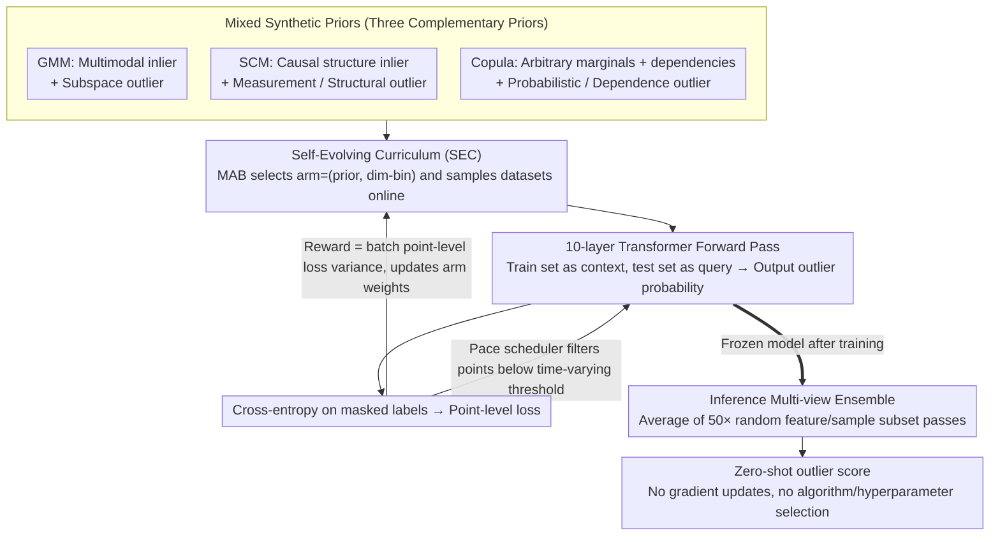

# From Zero to Hero: Advancing Zero-Shot Foundation Models for Tabular Outlier Detection

**Conference**: ICML 2026  
**arXiv**: [2602.03018](https://arxiv.org/abs/2602.03018)  
**Code**: https://github.com/psorus/Outformer  
**Area**: Tabular Foundation Models / Outlier Detection / In-Context Learning  
**Keywords**: Zero-Shot Outlier Detection, Prior-Fitted Networks, Synthetic Prior Mixture, Self-Evolving Curriculum, Multi-Armed Bandit

## TL;DR
This paper proposes OutFormer, a tabular Prior-Fitted Network (PFN) pretrained on a mixture of three synthetic priors (GMM, SCM, and Copula) and stabilized through a Multi-Armed Bandit-based Self-Evolving Curriculum. It achieves zero-shot tabular outlier detection by processing training data in-context and generating labels in a single forward pass. OutFormer achieves SOTA rankings across ADBench and two new benchmarks containing 1500+ datasets, while maintaining inference latency comparable to shallow models.

## Background & Motivation

**Background**: Tabular outlier detection (OD) has long been hindered by "model and hyperparameter selection" issues. Real-world outliers rarely have labels. Shallow methods (kNN/LOF/IForest) require extensive hyperparameter tuning, while deep methods (DeepSVDD/ICL/DDPM) require model training for every new table. The Prior-Fitted Network (PFN) approach, exemplified by TabPFN, demonstrated that a Transformer pretrained on large-scale synthetic data can predict via a single forward pass by using the training set as the context, bypassing training and tuning. This approach was first applied to OD by FoMo-OD (Shen et al. 2025).

**Limitations of Prior Work**: Although FoMo-OD ranked second on ADBench, it faces several issues: (1) it uses only GMM priors, failing to model non-Gaussian marginal distributions, causal structures, and long-tail dependencies found in real tables; (2) attempting to incorporate richer priors resulted in worse performance than GMM-only models (Table 5: 0.898 for mixed-prior vs. 0.920 for GMM-only on ADBench), due to significant gradient scale disparities across different priors suppressing GMM signals; (3) ADBench comprises only 57 tables, lacking statistical significance.

**Key Challenge**: To make PFNs truly effective for OD, one must: (a) construct diverse synthetic priors covering real-world data generation mechanisms; and (b) design a training curriculum that does not require manual difficulty sequencing to ensure the model learns across all priors. Simple prior stacking leads to performance degradation due to competition between task gradients.

**Goal**: Construct a mixture of synthetic priors covering multiple inlier/outlier archetypes and design a curriculum that requires no human-defined difficulty order, enabling the model to achieve SOTA across ADBench/OddBench/OvRBench (1500+ datasets) while maintaining inference latency at the level of shallow methods.

**Key Insight**: The authors identify this as a "non-stationary multi-task learning" problem. Combinations of (prior, dimensionality) act as "arms" in a bandit, with difficulties evolving dynamically during training. This naturally fits a Multi-Armed Bandit (MAB) framework. By selecting a reward that distinguishes between "too hard," "too easy," and "learnable," the model can autonomously select the most valuable tasks.

**Core Idea**: A three-part solution: (1) Mixed Priors: GMM (multimodal) + SCM (causal) + Copula (arbitrary marginals + dependencies), with matched outlier archetypes for each; (2) Self-Evolving Curriculum (SEC): Using MAB to treat each (prior, dim-bin) as an arm, with batch point-level loss variance as the reward to avoid "entirely wrong/right/uncertain" batches; (3) Inference Ensemble: Averaging multiple forward passes over sampled context dimensions and samples to bypass context length limits.

## Method

### Overall Architecture
OutFormer is a 10-layer Transformer (512 hidden, 8 heads, 45.1M params). During training: at each step, the MAB selects a task category $c=(\text{prior}, \text{dim-bin})$ based on current weights and samples a synthetic dataset $(\mathcal{D}_{\text{train}}, \mathcal{D}_{\text{test}})$ online. Each dataset contains inliers and outliers with binary labels. The model treats $\mathcal{D}_{\text{train}}$ as context and $\mathcal{D}_{\text{test}}$ as query, outputting outlier probabilities via cross-attention. The loss is the cross-entropy on masked labels. Point-level losses are fed back to the MAB as rewards to update arm weights. A pace scheduler assists by backpropagating only points below a dynamic threshold. During inference, the model is frozen. For a new table, all training samples (default inliers) are context, and test samples are queries. The final outlier score is the average of 50 ensemble passes with random feature/sample subsets.

### Key Designs

**1. Mixed Synthetic Priors (GMM + SCM + Copula): Covering Three Tabular Generation Mechanisms**

OutFormer expands priors to three complementary types. GMM models multimodal inliers and creates contextual subspace outliers by inflating variance along subspaces. SCM uses an MLP with random edges as a causal graph, sampling inliers via topological order $X_j = f_j(X_{Pa(X_j;G)}, \epsilon_j)$; it includes "measurement outliers" (large variance $\epsilon_j \sim \mathcal{N}(0,s)$) and "structural outliers" (edge weight zeroing or reversal). Copula uses Sklar's theorem $F(x_1, \dots, x_d) = C(F_1(x_1), \dots, F_d(x_d))$ to decouple marginals (sampled from Gaussian, Beta, Exp, Power-law, etc.) and dependencies (Gaussian/Vine copulas), with "probabilistic" outliers (pushing $u_j$ to boundaries) and "dependence" outliers (permuting dimensions). Cross-testing shows significant performance drops when training on one prior and testing on another (e.g., 0.76 AUROC), proving their complementarity.

**2. Self-Evolving Curriculum (SEC) via Multi-Armed Bandit**

Naive mixed-prior training dropped ADBench performance from 0.920 to 0.898 because large-gradient priors overwhelmed GMM signals. SEC treats each (prior, dim-bin) as an arm. The reward is the variance of point-level centered cross-entropy in a batch: $r(c) = \frac{1}{n_c} \sum (l_i - \text{mean}(l))^2$. This reward is maximized when a batch contains a mix of "high-confidence correct" and "high-confidence incorrect" predictions, and minimized when all probabilities are 0.5 (maximum uncertainty). This allows the model to ignore unlearnable noise and focus on "learnable" signals, improving performance across GMM, Mixed, and ADBench benchmarks.

**3. Multi-view Ensemble at Inference**

To bypass the Transformer's quadratic complexity regarding context length (exceeding limits when $n > 5K, d > 100$), OutFormer performs 50 forward passes per test sample. Each pass uses random in-context inlier subsampling and feature bagging. This ensemble reduces variance, handles large tables, and improves accuracy without the need to retrain base learners.

### Loss & Training
The pretraining objective is binary cross-entropy on synthetic queries: $\mathcal{L} = \mathbb{E}_{(\mathbf{x}, y, \mathcal{D}_{\text{train}}) \sim p(\mathcal{D})} [-\log q_\theta(y \mid \mathbf{x}, \mathcal{D}_{\text{train}})]$. SEC schedules data sampling, and a pace scheduler filters difficult points. Training utilized 4 A6000 GPUs, processing 1.5M synthetic datasets (up to 5K context inliers and 10K queries each). Inference is performed with a frozen model and 50 ensemble iterations.

## Key Experimental Results

### Main Results (ADBench, 57 datasets)

| Model | Avg. Rank ↓ | ELO ↑ | Winrate ↑ | rAUC ↑ | $C_\Delta$ ↓ | vs OutFormer p-val. |
| :--- | :--- | :--- | :--- | :--- | :--- | :--- |
| DTE-NP (Prev. SOTA) | 5.12 | 1043 | 0.61 | 0.939 | 0.39 | 0.06 |
| kNN | 5.05 | 1001 | 0.61 | 0.938 | 0.36 | 0.06 |
| LOF | 6.04 | 961 | 0.53 | 0.913 | 0.43 | 0.00 |
| IForest | 8.46 | 794 | 0.32 | 0.879 | 0.52 | 0.00 |
| DDPM | 7.12 | 943 | 0.43 | 0.904 | 0.48 | 0.00 |
| DeepSVDD | 9.81 | 788 | 0.20 | 0.796 | 0.63 | 0.00 |
| TabPFN-OD | 4.74 | 1227 | 0.65 | 0.945 | 0.34 | 0.12 |
| FoMo-OD (Prev. FM) | 6.00 | 1084 | 0.54 | 0.928 | 0.41 | 0.01 |
| **Ours (OutFormer)** | **4.02** | **1235** | **0.71** | **0.956** | **0.32** | – |

Across the combined 1500+ datasets (ADBench+OddBench+OvRBench), OutFormer consistently secures the top Avg. Rank (~5.0). AUPRC results show statistically significant superiority ($p \le 0.00$) against all baselines.

### Ablation Study (SEC × Prior Combinations, Table 5)

| Configuration | GMM only (test) | Mixed (test) | ADBench (real) | Note |
| :--- | :--- | :--- | :--- | :--- |
| GMM-only train | 0.941 | 0.935 | 0.920 | Original FoMo-OD |
| Mixed (w/o SEC) | 0.873 | 0.937 | 0.898 | Naive mix; drops on ADBench |
| Mixed (w/ SEC) | **0.930** | **0.968** | **0.926** | Full OutFormer |

SEC restores GMM performance (0.930 vs 0.873) while simultaneously boosting Mixed and ADBench scores, proving SEC enables synergy between multiple priors.

### Key Findings
- **Complementarity**: Performance drops significantly when testing on a prior different from the training prior (up to 25 AUROC points). This confirms that real-world tables contain various generation mechanisms (multimodal, causal, long-tail).
- **SEC Impact**: Naive mixed-prior training shows higher loss for GMM compared to GMM-only training, indicating that larger gradient priors monopolize the optimizer. SEC reweights tasks by learnability, restoring fitting capability for GMM-like outliers in real data.
- **Inference Delay**: OutFormer’s latency is comparable to shallow methods and 1-2 orders of magnitude faster than deep methods (DDPM/DeepSVDD) that require per-table training.

## Highlights & Insights
- **Prior Recipe**: The combination of GMM, SCM, and Copula covers major tabular generation mechanisms and can serve as a "standard recipe" for future tabular PFNs.
- **MAB as Curriculum**: Using batch-loss variance as a reward effectively distinguishes between inherent data uncertainty and model-learnable uncertainty, a design potentially applicable to other multi-prior PFN/GFN training scenarios.
- **Paradigm Shift**: Zero-shot performance at shallow model speeds allows for "plug-and-play" OD APIs, eliminating the need for per-dataset AutoML.

## Limitations & Future Work
- **Context Limits**: Large tables (>100 features or >10K inliers) require ensemble fragments. While effective, this ignores global correlations in very high-dimensional data (e.g., $d > 500$).
- **Manual Priors**: The choice of GMM/SCM/Copula is empirical. If real data follows distributions outside these (e.g., time-series or specific text embeddings), the model may underperform.
- **Calibration**: Since training uses binary labels, the model does not provide calibrated outlier scores or fine-grained anomaly categorization.

## Related Work & Insights
- **vs FoMo-OD**: OutFormer evolves the prototype by expanding from 1 to 3 priors + 5 outlier types and introducing SEC to solve gradient interference, increasing ADBench ELO from 1084 to 1235.
- **vs TabPFN**: While TabPFN is for supervised classification, OutFormer is purpose-built for OD. Even an adapted TabPFN-OD baseline is outperformed by OutFormer.
- **vs Unsupervised Model Selection**: Instead of using meta-learning to select a model (surrogate learning), OutFormer internalizes "model selection" through scale-driven in-context learning.

## Rating
- **Novelty**: ⭐⭐⭐⭐ The specific combination of Mixed Priors and MAB curriculum is original, though individual components are known.
- **Experimental Thoroughness**: ⭐⭐⭐⭐⭐ Largest-scale comparison in recent OD literature (1500+ datasets, 11 baselines, multiple metrics).
- **Writing Quality**: ⭐⭐⭐⭐ Clear presentation of components, though some critical ablations are relegated to the appendix.
- **Value**: ⭐⭐⭐⭐⭐ Provides an open-source, plug-and-play OD model that effectively addresses the model selection problem in industry.

<!-- RELATED:START -->

## Related Papers

- [\[ICML 2026\] InfoAtlas: A Foundation Model for Zero-Shot Statistical Dependence Estimation](infoatlas_a_foundation_model_for_zero-shot_statistical_dependence_estimate.md)
- [\[ICML 2026\] Zero-Flow Encoders](zero-flow_encoders.md)
- [\[ICML 2026\] Towards One-for-All Anomaly Detection for Tabular Data](towards_one-for-all_anomaly_detection_for_tabular_data.md)
- [\[ICML 2026\] LimiX-2M: Mitigating Low-Rank Collapse and Attention Bottlenecks in Tabular Foundation Models](limix-2m_mitigating_low-rank_collapse_and_attention_bottlenecks_in_tabular_found.md)
- [\[AAAI 2026\] Robust Tabular Foundation Models](../../AAAI2026/self_supervised/robust_tabular_foundation_models.md)

<!-- RELATED:END -->
